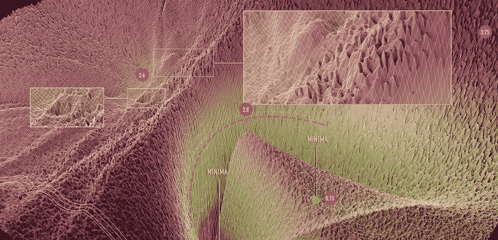
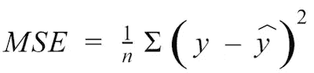
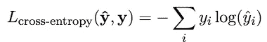
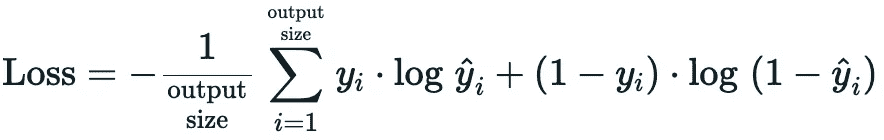

# 使用深度学习教程的 NLP:理解损失函数

> 原文：<https://pub.towardsai.net/nlp-using-deep-learning-tutorials-understand-loss-function-2aaf73ec6c2b?source=collection_archive---------2----------------------->

## [自然语言处理](https://towardsai.net/p/category/nlp)



版权所有 Timur Garipov 等人的 NeurIPS 2018 年论文，ARXIV 1802.10026，losslandscape.com

> *这篇文章是我正在撰写的系列文章的一部分，在这里我将尝试解决在 NLP 中使用深度学习的主题。首先，我正在写一篇关于使用感知器进行文本分类的例子的文章，但我认为最好先复习一些基础知识，如激活和损失函数。*

损失函数也称为目标函数，是基于标记数据的监督机器学习算法的主要组成部分之一。损失函数指导训练算法以正确的方式更新参数。在一个非常简单的定义中，损失函数将真实值 **(y)** 和预测值 **(ŷ)** 作为输入，并给出实数值的分数。该值表示预测与事实的接近程度。该值越高，模型的预测越差，反之亦然。

在这篇文章中，我提出了三个最常用的损失函数。

# 1.均方误差损失函数

均方误差损失函数，也称为 MSE，最常用于具有连续目标(y)值和预测(ŷ)值的回归问题。MSE 是目标值和预测值之差的平方的平均值。MSE 还有其他替代方法，如平均绝对误差(MAE)或均方根误差(r MSE)，但所有这些函数都是基于计算目标和预测(输出)之间的实值距离。

MSE 的数学公式:



以及一个使用 Pytorch 实现的示例:

```
import torch
import torch.nn as nn

*# Mean Squared Error Loss* mse_loss = nn.MSELoss()
outputs = torch.randn(3, 5, requires_grad=True)
targets = torch.randn(3, 5)
loss = mse_loss(outputs, targets)
print(**f'Mean Squared Erro loss :** {loss}**'**)# Output 
# Mean Squared Erro loss : 3.128143787384033
```

# 2.分类交叉熵损失函数

类别交叉熵损失函数通常用于多类分类，其输出(ŷ)是目标类的概率。目标真值(y)是代表真实多项式分布的 n 个元素的向量。这需要(y)值的两个性质:所有元素之和等于 1，所有元素都是正的。如果一个类是正确的，则(y)向量是一个热点向量。预测输出(ŷ)与(y)具有相同的属性。

交叉熵损失的数学公式为:



为了更好地使用交叉熵损失，您需要理解三个数学方面:

*   一个数字的大小是有限度的。为了避免这种情况，您可以在输出和/或输入中添加一个“定标函数”。(例如:sk learn . preprocessing . standard scaler)
*   如果 softmax 公式中使用的指数函数的输入是负数，则结果是一个指数小数，如果是正数，则结果是一个指数大数。
*   而对数函数是指数函数的反函数，也就是说 log(exp(x))等于 x。

因此，为了使用交叉熵损失获得优化的概率分布，在网络的训练阶段，您需要避免使用 softmax 函数。然后，当模型定型时，您可以使用 softmax 函数来获得预测概率。

最后，这是一个使用 Pytorch 实现交叉熵损失的示例:

```
import torch
import torch.nn as nn

*# Cross-entropy Loss* ce_loss = nn.CrossEntropyLoss()
outputs = torch.randn(3, 5, requires_grad=True)
targets = torch.tensor([1, 0, 3], dtype=torch.int64)
loss = ce_loss(outputs, targets)
print(**f'Cross Entropy Loss :** {loss}**'**)# OutPut :
# Cross Entropy Loss : 1.7309303283691406
```

在这个例子中，我们假设每个输入都有一个特定的类。这就是为什么 targets 向量有三个整数元素，代表每个输入的正确类的索引。

# 3.二元交叉熵损失函数

二元交叉熵损失函数用于涉及区分两个类别的分类问题，称为二元分类。

数学公式是:



下面是一个使用 Pytorch 的实现示例:

```
import torch
import torch.nn as nn

*# Binary Cross-Entropy Loss* bce_loss = nn.BCELoss()
sigmoid = nn.Sigmoid()
probabilities = sigmoid(torch.randn(4, 1, requires_grad=True))
targets = torch.tensor([1, 0, 1, 0], dtype=torch.float32).view(4, 1)
loss = bce_loss(probabilities, targets)
print(**f'This is probabilities :** {probabilities}**'**)
print(**f'bce loss :** {loss}**'**)# Output 
# This is probabilities : tensor([[0.8276],
#        [0.4056],
#        [0.4190],
#        [0.5984]], grad_fn=<SigmoidBackward>)
# bce loss : 0.6229268312454224
```

在下面的例子中，我们使用激活函数 sigmoid 创建了一个二元概率输出向量“probabilities”。接下来，我们实例化 0 和 1 的目标向量，它们代表两个目标类的索引。最后，我们使用概率和目标这两个变量，使用二元交叉熵函数来计算损失值。

# 结论

在这篇文章中，我提出了三个损失函数。注意，Pytorch 在它的 nn 包中实现了更多的损失函数，你可以在这个链接中找到。[https://pytorch.org/docs/stable/nn.html#loss-functions](https://pytorch.org/docs/stable/nn.html#loss-functions)
每个损失函数都是针对某些情况推荐的。然而，如果可能的话，你必须毫不犹豫地在不同的情况下尝试其他的损失函数。

**推荐人:**

1.  《用 Pytorch 进行自然语言处理》一书([https://www . Amazon . fr/Natural-Language-Processing-py torch-Applications/DP/1491978236](https://www.amazon.fr/Natural-Language-Processing-Pytorch-Applications/dp/1491978236))