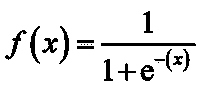
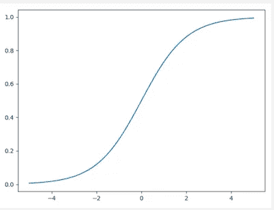
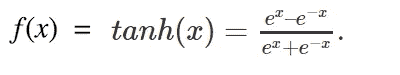
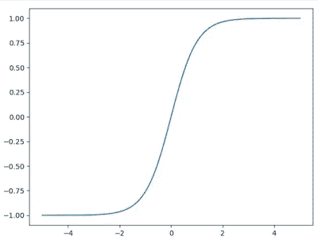
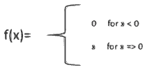
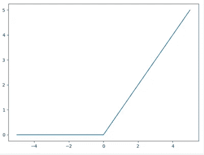
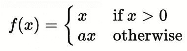
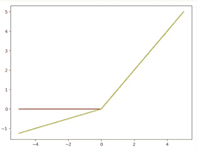
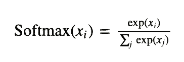
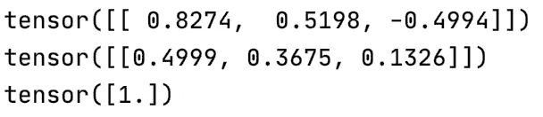

# 使用深度学习教程的 NLP:了解激活功能

> 原文：<https://pub.towardsai.net/nlp-using-deep-learning-tutorials-understand-the-activation-function-8f62613e32d2?source=collection_archive---------1----------------------->

## [深度学习](https://towardsai.net/p/category/machine-learning/deep-learning)，[自然语言处理](https://towardsai.net/p/category/nlp)


来自 https://unsplash.com[的免费图片](https://unsplash.com)

本文是我正在撰写的系列文章的第一篇，在这里我将尝试解决在 NLP 中使用深度学习的主题。首先，我正在写一篇关于使用感知器进行文本分类的例子的文章，但我认为最好先复习一些基础知识，如激活和损失函数。

在神经网络中引入激活函数来捕捉数据中的复杂关系。通常在网络的末端添加非线性函数，以将数据从复杂格式转换为简单格式，这使其易于根据模型的主要目的进行解释。

有许多类型的激活功能。Pytorch 库有 20 多个预定义的([https://py torch . org/docs/stable/nn . html # non-linear-activations-weighted-sum-nonlinear it](https://pytorch.org/docs/stable/nn.html#non-linear-activations-weighted-sum-nonlinearity))。

在下一节中，我将展示 NLP 中五个最常用的激活函数。

# 乙状结肠的

sigmoid 是最早使用的激活函数之一。这是一个可微分的函数，可以将任何实数值转换为 0 到 1 之间的数值。它的数学表达式是:



我们可以用 Pytorch 轻松实现它，如下所示:



```
import torch
import matplotlib.pyplot as plt

x = torch.range(-5., 5., 0.1)

*# Sigmoid* y = torch.sigmoid(x)
plt.plot(x.numpy(), y.numpy())
plt.show()
```

如图所示，对于大多数输入，sigmoid 函数很快收敛到其最大值和最小值。这可能导致两种现象，即消失梯度问题和爆炸梯度问题。因此，这个函数很少用在神经网络的中间。sigmoid 用作网络的输出，将结果解释为概率。

# 双曲正切

Tanh 和 sigmoid 在视觉上看起来是一样的，但是，数学公式是不同的。Tanh 将任何实数值转换为-1 和 1 之间的值。Tanh 可以表示如下:


或者



Tanh 可以使用 Pytorch 实现，如下所示:



```
import torch
import matplotlib.pyplot as plt

x = torch.range(-5., 5., 0.1)

*# tanh* y = torch.tanh(x)
plt.plot(x.numpy(), y.numpy())
plt.show()
```

通过更深入的分析，我们还可以将 Tanh 视为 Sigmoid 的线性变换。因此，这两个激活函数也有相同的消失和爆炸梯度的问题。

# 整流线性单位

Relu 是迄今为止所有激活函数中最重要的。它被用于最近的许多深度学习工作和创新中。然而，这非常简单:



ReLu 可以使用 Pytorch 实现，如下所示:



```
import torch
import matplotlib.pyplot as plt

x = torch.range(-5., 5., 0.1)

*# ReLU* y = torch.relu(x)
plt.plot(x.numpy(), y.numpy())
plt.show()
```

如下图所示，ReLU 将负值削波为零。这种效果对于解决渐变消失问题非常有用，但是如果某些输出变为零，并且永远不会达到正值，那么这种效果本身也会成为一个问题。这就是所谓的垂死的 ReLU 问题

# 参数 ReLU

PReLU 是 ReLU 的推广，纠正了垂死的 ReLU 问题。该函数的数学公式为:



请注意，a 是一个学习参数。同样，如果 a 等于零，我们回到 ReLU 的使用。



```
import torch
import matplotlib.pyplot as plt

x = torch.range(-5., 5., 0.1)

*# PReLU* prelu = torch.nn.PReLU(num_parameters=1)
y = prelu(x)
plt.plot(torch.detach(x).numpy(), torch.detach(y).numpy())
plt.show()
```

# **SoftMax**

像 sigmoid 函数一样，SoftMax 激活函数将每个输出转换为 0 到 1 之间的实数值。它还将每一个除以所有输出的总和，从而得到一个离散的概率分布。

softmax 的数学公式为:



并且可以使用 PyTorch 实现，如下所示:

```
import torchimport torch.nn as nn

*# softmax*
softmax = nn.Softmax(dim=1)
x_input = torch.randn(1, 3)
y_input = softmax(x_input)
print(x_input)
print(y_input)
print(torch.sum(y_input, dim=1))
```



SoftMax 激活函数对于分类任务的解释非常有用，因为输出被认为是概率。

# 结论

在本文中，我展示了五个激活函数:Sigmoid、Tanh、ReLU、PReLU 和 Softmax。还有许多其他的，我希望在我的下一篇文章中介绍。然而，对于如何为每个模型或神经网络选择使用哪个函数，并没有指导:这是一个实验之母。所以，简单地使用别人过去用过的方法。

**参考文献:**

1.  《用 Pytorch 进行自然语言处理》一书([https://www . Amazon . fr/Natural-Language-Processing-py torch-Applications/DP/1491978236](https://www.amazon.fr/Natural-Language-Processing-Pytorch-Applications/dp/1491978236))