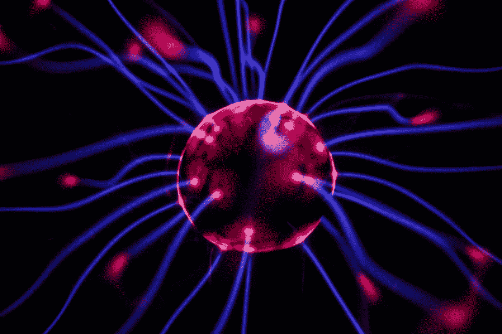
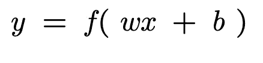
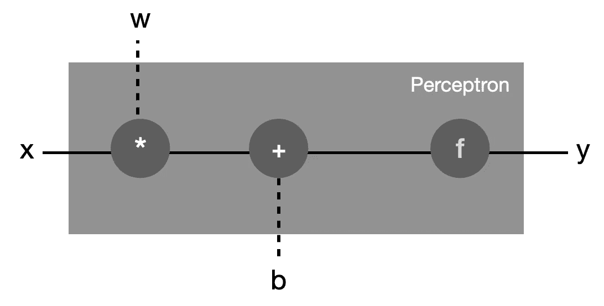

# 使用深度学习教程的 NLP:理解“感知机”

> 原文：<https://pub.towardsai.net/nlp-using-deep-learning-tutorials-understand-the-perceptron-f2f20b324e63?source=collection_archive---------3----------------------->

## [深度学习](https://towardsai.net/p/category/machine-learning/deep-learning)，[自然语言处理](https://towardsai.net/p/category/nlp)

来自 https://unsplash.com[的免费图片](https://unsplash.com)

> *这篇文章是我正在撰写的系列文章的一部分，在这里我将尝试解决在 NLP 中使用深度学习的主题。首先，我正在写一篇关于使用感知器进行文本分类的例子的文章，但我认为最好先复习一些基础知识，如激活和损失函数。*

感知器是最简单的神经网络，也是最古老的网络之一。它最类似于生物神经元，因为它有输入和输出，“信号”从输入流向输出。感知器的计算图可以用下面的数学公式表示:

***同:***

*   *x 是输入*
*   *y 是输出*
*   *w 是一组权重参数*
*   *b 是一个偏差参数。*
*   f 是激活函数

注意(w)和(b)是从数据中学习的，并且激活函数是根据目标输出和网络目的来定义的。

然而，一个神经网络可以有一个以上的输入，在这种情况下，我们可以使用向量来推广感知器:(x)和(w)将是向量，并且(x)和(w)的乘积被替换为点积。所以，公式保持不变。

为了更好地理解感知器的概念，我们还可以通过以下模式来展示它:

一个感知器模式说明了计算图形

最后，这是一个使用 Pytorch 实现的感知器:

线性表达式“wx + b”，也称为“仿射变换”，在第 12 行使用模块 torch.nn 的“linear”类实现，该类处理权重和偏差参数。此外，我们使用“torch.sigmoid”(非线性)作为激活函数“f”。

# 结论:

在本文中，我介绍了最古老的神经网络架构，即感知器。它很容易理解和实现，但与复杂的其他体系结构相比，它可以以良好的性能解决许多任务。这是我们将在我的系列文章“使用深度学习的 NLP”的下一篇文章中看到的，在这篇文章中，我将介绍一个使用感知神经网络的文本情感分类器。

**参考文献:**

1.  《用 Pytorch 进行自然语言处理》一书([https://www . Amazon . fr/Natural-Language-Processing-py torch-Applications/DP/1491978236](https://www.amazon.fr/Natural-Language-Processing-Pytorch-Applications/dp/1491978236))