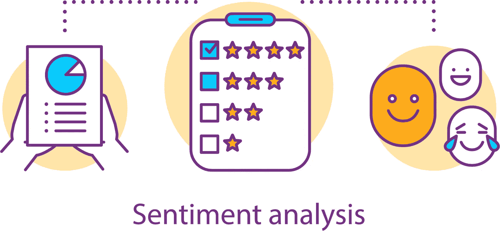
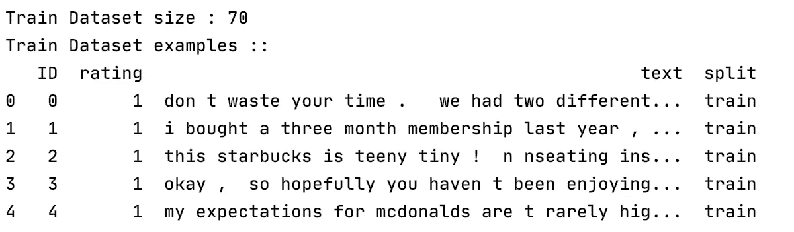
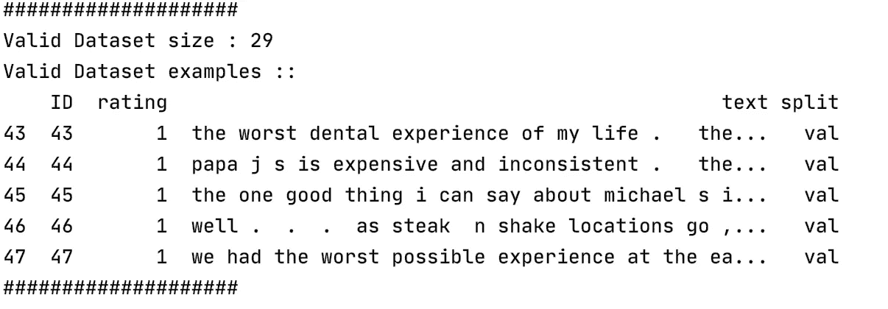
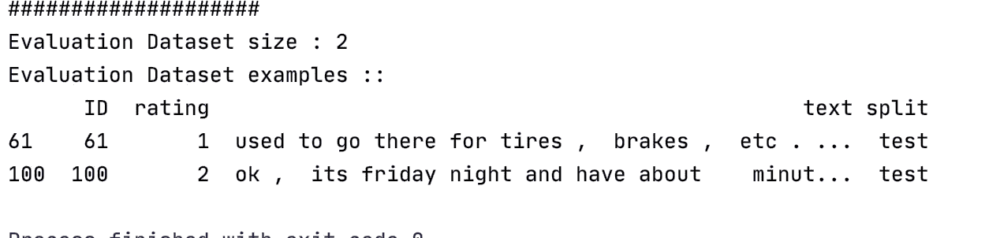

# 使用深度学习教程的 NLP:基于感知器的情感分类器(第 1/4 部分)

> 原文：<https://pub.towardsai.net/nlp-using-deepleaning-tutorials-a-sentiment-classifier-based-on-perceptron-part-1-4-712eefe20899?source=collection_archive---------0----------------------->

## [自然语言处理](https://towardsai.net/p/category/nlp)



这张图片上传自[来源](https://www.ntaskmanager.com/wp-content/uploads/2020/01/Sentiment-Analysis.png)

自然语言处理是最复杂的机器学习领域之一，基本上是由于语言的复杂性和模糊性。然而，它也是最成功的领域之一，我们每天都在使用许多真实的应用程序，如搜索引擎、翻译工具等等。

有时最复杂的任务可以用最简单的技术解决。在这篇文章中，我将尝试探索这种说法。因此，我将基于最简单的神经网络“感知器”提出一个完整的情感分析解决方案，使用真实世界的任务和数据集:对 Yelp 上的餐馆评论进行正面或负面分类。

为此，我将本文分为以下四个部分:

1.  **Yelp 数据集评论(当前文章关注这部分)**
2.  词汇和矢量器
3.  训练程序
4.  评估和推理

# 第一部分:Yelp 数据集评论

2015 年，Yelp 组织了一场机器学习竞赛，要求参与者根据餐馆的评论预测餐馆的评级。这将我们带回到了 5 个类别(从 1、2、3、4 和 5 星级)的多分类问题。之后，张、赵和乐存[2]通过将 1 星和 2 星转换为“负面”情绪，将 3 星、4 星和 5 星转换为“正面”情绪，将该问题简化为二元情绪分类这项工作的结果是一个新的标记数据集。每行对应一对餐馆评论的自然文本和代表星级的情绪“正面”或“负面”。这个数据集然后被分成两组:560，000 行的训练集和 38，000 行的测试集。

数据集可以从这个链接下载:[https://www.yelp.com/dataset](https://www.yelp.com/dataset)

***在本文中，我们将只使用训练集作为数据集来说明如何根据需要将它分成多个数据集。***

我们将数据集分成三部分:70%用于训练，20%用于验证，10%用于测试。这些百分比是最常用的，但可以根据数据集进行更改。但是，训练永远是最大的一块。总而言之，训练分区显然是用于导出模型参数的。验证分区用于在每个时期之后在超参数中进行选择，而测试用于最终评估和报告。

这种数据集分割适用于大型数据集。在相反的情况下，当数据集很小时，我们可以使用 K-fold 交叉验证(** *这是我希望在我未来的一篇文章中涉及的另一个主题* **)。

以下代码通过添加具有三个可能值的新标记列来拆分初始数据集“raw _ train . CSV”:“train”、“val”和“test”。新数据集被导出到新的 CSV 文件“raw_split.csv”中:

这段代码还对每一行进行了基本的清理处理，将文本转换为小写，在标点符号前后添加空格，并删除所有不是标点符号或字母的符号。

之后，我们创建 ReviewDataSet 类来通过训练步骤操作数据集。该类从 Pytorch 抽象迭代器“Dataset”继承而来，并重新定义了 __getitem__()和 __len__()方法。这使得各种 Pytorch 实用程序能够正确地处理我们的数据集，比如将在下一部分中讨论的“数据加载器”。

ReviewDataSet 类的内容是:

请注意，类 ReviewDataset 使用名为 ReviewVectorizer 的类，负责将评论文本转换为神经网络工作所需的矢量数字。这个类将在下一部分详细介绍。

最后，为了理解数据集，这里是每个子集内容的一些示例，您可以使用以下代码来显示:

```
dataset_review = ReviewDataset.load_dataset_and_make_vectorize(review_csv=**'./data/raw_split.csv'**)

print(**"Train Dataset size :"**, dataset_review.train_size)
print(**"Train Dataset examples ::"**)
print(dataset_review.train_df.head())
```

*   **训练数据集:**



*   **有效数据集:**



*   **测试或评估数据集:**



# 结论:

在这一部分中，我们回顾了我们将用于训练和评估基于感知的情感分类器的数据集。下一部分涉及矢量化过程。

**参考文献:**

1.  《用 Pytorch 进行自然语言处理》一书([https://www . Amazon . fr/Natural-Language-Processing-py torch-Applications/DP/1491978236](https://www.amazon.fr/Natural-Language-Processing-Pytorch-Applications/dp/1491978236))
2.  张、项、赵军波、杨乐存。"用于文本分类的字符级卷积网络." *arXiv 预印本 arXiv:1509.01626* (2015)。