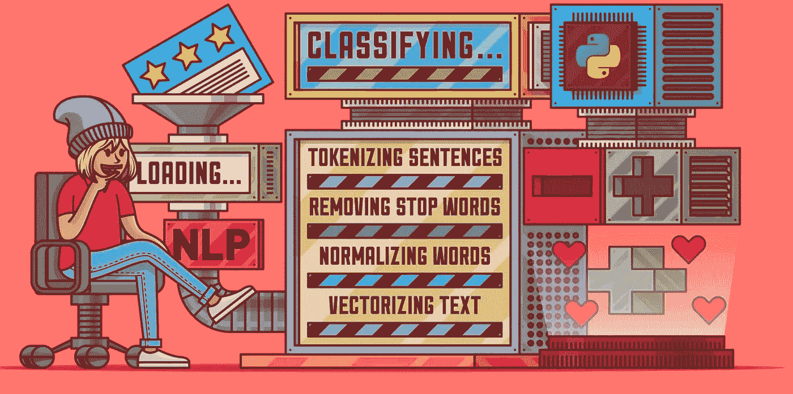

# 使用深度学习教程的 NLP:基于感知器的情感分类器(第 4/4 部分)

> 原文：<https://pub.towardsai.net/nlp-using-deepleaning-tutorials-a-sentiment-classifier-based-on-perceptron-part-4-4-1022ed17d17d?source=collection_archive---------2----------------------->



该图像上传自[来源](https://files.realpython.com/media/Use-Sentiment-Analysis-With-Python-to-Classify-Reviews_Watermarked.e73ba441d870.jpg)

自然语言处理是机器学习中最复杂的领域之一，基本上是由于语言的复杂性和模糊性。然而，它也是最成功的领域之一，有许多我们每天都在使用的真实应用，像搜索引擎、翻译工具等等。

有时最复杂的任务可以用最简单的技术解决。在这篇文章中，我将尝试探索这种说法。所以，我将基于最简单的神经网络“感知器”提出一个完整的情感分析解决方案，使用一个真实世界的任务和数据集:对 Yelp 上的餐厅评论进行正面或负面分类。

为此，我将本文分为以下四个部分:

1.  Yelp 数据集评论([链接](/nlp-using-deepleaning-tutorials-a-sentiment-classifier-based-on-perceptron-part-1-4-712eefe20899)
2.  词汇和矢量器([链接](/nlp-using-deepleaning-tutorials-a-sentiment-classifier-based-on-perceptron-part-2-4-f9b90b3a06bd))
3.  训练套路( [环节](/nlp-using-deepleaning-tutorials-a-sentiment-classifier-based-on-perceptron-part-3-4-88fd202dba2c))
4.  **评估与推理(当前文章关注这部分)**

> **提前感谢大家的支持。如果你决定注册成为灵媒会员，这里是我的订阅页面**:[https://abdelkader-rhouati.medium.com/membership](https://abdelkader-rhouati.medium.com/membership)

# 第四部分:**评估和推断**

在训练例程之后，我们在上一篇文章中解释了，接下来的步骤是在测试数据集上评估模型，并使用它来推断新数据。

## 测试数据的评估

机器学习的评估是一个很大的研究领域。对于像我这样的情感分类器模型，许多测量和方法都是可能的。这个题目在这篇文章里解释的很好:[链接](https://www.jeremyjordan.me/evaluating-a-machine-learning-model/)。在这个例子中，为了简单起见，我们将只根据模型的准确性来评估它。

评估的代码与训练例程中的验证步骤完全相同，但使用了“test”数据集而不是“val”:dataset . set _ split(“test”)。

我们还使用代码:classifier.eval()将模型置于“eval”模式。在这种模式下，在对测试数据集进行预测的过程中，不会更新模型权重。因此，我们可以使用测试准确性作为模型性能的精确度量。

在测试数据集上评估模型

我们得到以下测试精度:

```
Test Loss: 0.5374936538511884
Test Acc: 0.930599256292907
```

## 使用新的审查数据进行推断

评估模型的另一种方法是对新的综述数据进行推断。

推理评估基于定性判断。我们使用该模型在非常小的数据点(一般少于 10 个)上预测情绪，并逐一评估其性能。

以下示例是推理测试结果的示例，它说明了模型的良好准确性。

```
this is a pretty awesome book -> positive
```

## 保存和加载模型

保存和加载模型的可能性允许使用模型预测，而不需要每次都重新进行训练，这需要几个小时甚至几天。这一特性使得在真实情况下部署机器学习模型成为可能。接下来的两节给出了一个保存和加载模型的简单方法。但是，还有更多设置选项和参数，例如，保存一个检查点，您可以在其中恢复模型训练。更多细节，可以参考[这里](https://pytorch.org/tutorials/beginner/saving_loading_models.html)的文档。

**保存模型:**

```
torch.save(classifier.state_dict(), "./saved_model/classifier")
```

**加载模型:**

```
model = ReviewClassifier(num_features=len(vectorizer.review_vocab))
model.load_state_dict(torch.load("./saved_model/classifier"))
model.eval()
```

## 所有项目的代码

最后，您可以在我的 git 存储库中找到“使用感知器的情感分类模型”项目的所有代码:

[](https://github.com/arhouati/NLP_with_Pytorch/tree/master/Chapter-3/3.8_ClassfyingSentiment) [## NLP _ with _ py torch/Chapter-3/3.8 _ master arhouati 的分类检测/NLP_with_Pytorch

### 这个库包含了 Delip Rao 和…所著的《用 PyTorch 进行自然语言处理》一书的所有实例

github.com](https://github.com/arhouati/NLP_with_Pytorch/tree/master/Chapter-3/3.8_ClassfyingSentiment) 

# 结论

在这一系列文章中，我介绍了监督神经网络的一些基本原理和概念。我选择使用评论情感分类的案例研究，并使用最基本的神经网络“感知”。任何其他神经网络都遵循相同的阶段和步骤。

作为简历，我们在 4 篇文章中谈到:

*   最简单的神经网络模型感知器的概念
*   机器学习的一些主要概念如激活函数和损失函数。
*   Yelp 数据集的详细回顾，作为学习和实验 NLP 机器学习模型的良好数据集
*   将单词转换成数字向量，这是在自然语言上实现神经网络所必需的。
*   历元上的训练例程和使用一批数据集
*   最后，如何评估一个模型

# 参考资料:

**1。《用 Pytorch 进行自然语言处理》一书(**[**https://www . Amazon . fr/Natural-Language-Processing-py torch-Applications/DP/1491978236**](https://www.amazon.fr/Natural-Language-Processing-Pytorch-Applications/dp/1491978236)**)**

**2。保存和加载模型(**[**)https://py torch . org/tutorials/初学者/saving _ Loading _ Models . html**](https://pytorch.org/tutorials/beginner/saving_loading_models.html)**)**

**3。一个机器学习模型的评测(**[**)https://www . Jeremy Jordan . me/evaluating-a-machine-learning-model/**](https://www.jeremyjordan.me/evaluating-a-machine-learning-model/)**)**