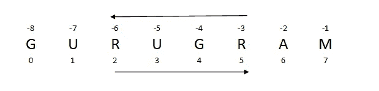
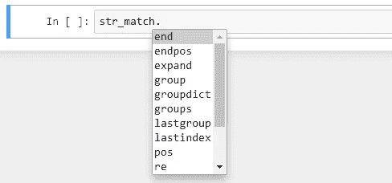
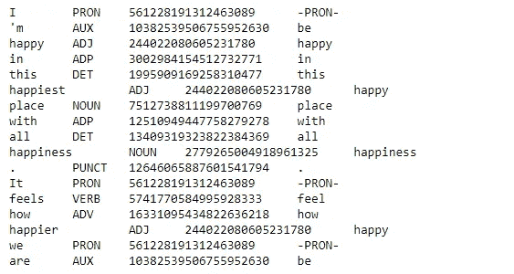
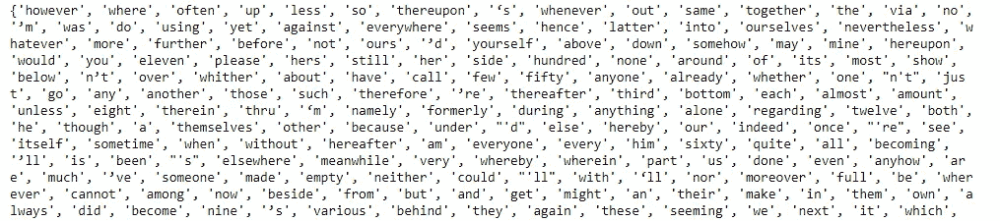

# NLP——使用 Python 从零到英雄

> 原文：<https://pub.towardsai.net/nlp-zero-to-hero-with-python-2df6fcebff6e?source=collection_archive---------0----------------------->

## [自然语言处理](https://towardsai.net/p/category/nlp)

## 学习自然语言处理基本概念的手册


[真诚媒体](https://unsplash.com/@sincerelymedia?utm_source=medium&utm_medium=referral)在 [Unsplash](https://unsplash.com?utm_source=medium&utm_medium=referral) 上拍摄的照片

# **涵盖的主题:**

**第 1 节** : NLP 简介，Spacy 和 NLTK 的安装指南

**第 2 节**:关于文本的基本思想，正则表达式

**第三节**:标记化和词干化

**第 4 节**:词汇满足和停用词

**第五节:**词性和命名实体识别(NER)

关于这些我们一步一步来说。

[](https://medium.com/towards-artificial-intelligence/python-data-structures-data-types-and-objects-244d0a86c3cf) [## Python 数据结构数据类型和对象

### python 中类对象的便捷概念

medium.com](https://medium.com/towards-artificial-intelligence/python-data-structures-data-types-and-objects-244d0a86c3cf) 

# ***第一节:***

## ***关于 NLP 的介绍***

自然语言处理属于人工智能领域。所有的计算机都擅长用数字数据做处理，这节课就是处理文本数据来分析这个世界上不同的语言。

在本文中，我们将使用 Spacy 和 NLTK 之类的库对 python 语言处理进行形态学研究。

如果我们考虑原始文本数据，人眼可以分析一些点。但是，如果我们试图在编程中使用 Python 建立一种机制，从文本数据中分析和提取最大限度的信息。

让我们考虑一下，我们将使用 jupyter 笔记本进行所有的语言处理和分析。Jupyter 来自 anaconda 发行版。

## ***安装指南***

首先，从这个[链接](https://www.anaconda.com/products/individual)安装 anaconda 发行版。安装之后，anaconda 会在您的环境中安装 Spacy 和 NLTK 库。

为了安装空间[，连杆](https://anaconda.org/conda-forge/spacy)在这里。

为了安装 NLTK [链接](https://anaconda.org/anaconda/nltk)在这里。

下载 spacy 的英语语言库是

```
python -m spacy download en   #en stands for english
```

# ***第二节:***

## ***基本概念***

我们都知道两个文件中的数据是相同的。我们将学习如何使用 python 来读取这些文件，因为要进行语言处理。我们需要一些文本数据。

从带有变量的基本字符串开始。让我们看看如何打印一个普通的字符串。

```
print('Amit')#output: Amit 
```

举个例子:

弦的名字是 GURUGRAM，我所在城市的名字。当我们需要选择特定范围的字母表时，我们使用切片法和索引法。当我们从左到右时，索引从 0 开始，当我们希望字母表从右到左时，那么它从负(-1)开始，而不是从零开始。



作者创作的照片

使用 python

```
#first insert the string to a variablestring = GURUGRAM#get first alphabet with index
print(string[0])#output: G #printing multiple alphabets
print(string[2], string[5])#output: RR#for getting alphabet with negative indexing
print(string[-4])#output: G
```

现在用切片得到角色

```
print(string[0:2])#output: GUprint(string[1:4])#output: URU
```

让我们做一些基本的句子。一个用星号清理句子的例子。让

我碰到一个函数叫 is strip()函数。该函数删除开头和结尾的字符，但不能删除中间的字符。如果我们不指定一个删除字符，那么它将默认删除空格。

```
#A sentence and the removing character from the sentence
sentence = "****Hello World! I am Amit Chauhan****"
removing_character = "*"#using strip function to remove star(*)
sentence.strip(removing_character)#output: 'Hello World! I am Amit Chauhan'
```

我们看到上面的输出，星号被从句子中删除。所以，去除字符是基本的事情，但对于准确性来说不可靠。

和 strip 函数一样，我也碰到了一个不同的操作，就是 join 操作。

示例:

```
str1 = "Happy"
str2 = "Home"" Good ".join([str1, str2])#output: 'Happy Good Home'
```

## ***正则表达式***

正则表达式有时称为关系表达式或正则表达式，用于字符或字符串匹配，在许多情况下，查找和替换字符或字符串。

让我们看看如何在正则表达式中处理字符串和模式。首先，我们将看到如何在实际中导入正则表达式。

```
# to use a regular expression, we need to import re
import re
```

如何对简单字符串使用“re”

示例:

让我们有一个句子，其中我们必须找到字符串和字符串上的一些操作。

```
sentence = "My computer gives a very good performance in a very short time."
string = "very"
```

如何在句子中搜索字符串

```
str_match = re.search(string, sentence)
str_match#output:
<re.Match object; span=(20, 24), match='very'>
```

我们也可以在这根弦上做一些运算。要检查所有操作，请编写 str_match。然后按 tab 键。它将显示所有操作。



字符串上的所有操作。作者照片

```
str_match.span()#output:
(20, 24)
```

这里显示了第一个字符串“very”的跨度，20 表示它从句子中的第 20 个索引开始，到第 24 个索引结束。如果我们想找到一个出现多次的单词，我们可以使用 findall 操作。

```
find_all = re.findall("very", sentence)
find_all#output: ['very', 'very']
```

上面的操作只是查找在一个字符串中多次出现的打印字符串。但是如果我们想知道单词在句子中的跨度，这样我们就可以知道单词在句子中的位置，我们使用一种迭代方法 finditer 操作。

```
for word in re.finditer("very", sentence):
    print(word.span())#output:(20, 24)
(47, 51)
```

一些正则表达式是(a-z)，(A-Z)，(0–9)，(\- \。), (@, #, $, %).这些表达式用于查找文本中的模式，并在必要时删除干净的数据。当我们可以使用量词来知道我们期望多少个表达式时。

# ***第三节:***

## ***标记化***

当一个句子分解成小的单个单词时，这些单词被称为标记，这个过程被称为标记化。

前缀、中缀、后缀和例外中的句子分解。对于标记化，我们将使用 spacy 库。

```
#import library
import spacy#Loading spacy english library
load_en = spacy.load('en_core_web_sm')#take an example of string
example_string = "I'm going to meet\ M.S. Dhoni."#load string to library 
words = load_en(example_string)#getting tokens pieces with for loop
for tokens in words:
    print(tokens.text)#output:"
I
'm
going
to
meet
M.S.
Dhoni
.
"
```

我们可以从索引和切片中获得令牌。

```
str1 = load_en(u"This laptop belongs to Amit Chauhan")#getting tokens with index
str1[1]#output: laptop#getting tokens with slicing
str1[2:6]#output: belongs to Amit Chauhan
```

## ***词干***

词干化是一个将单词还原到其本义的过程。

词干分析器的类型

1.  波特·斯特梅尔
2.  雪球斯特梅尔

Spacy 不包括词干分析器，所以我们将使用 NLTK 库进行词干分析。

*波特梗器*开发于 1980 年。它被用来把一个词简化成它的词干或词根。

```
#import nltk library
import nltk#import porter stemmer from nltk
from nltk.stem.porter import PorterStemmer
pot_stem = PorterStemmer()#random words to test porter stemmer
words = ['happy', 'happier', 'happiest', 'happiness', 'breathing', 'fairly']for word in words:
    print(word + '----->' + pot_stem.stem(word))#output:happy----->happi
happier----->happier
happiest----->happiest
happiness----->happi
breathing----->breath
fairly----->fairli
```

正如我们在上面看到的，单词被减少到它的词干，但是有一点值得注意，porter 词干分析器并没有给出很多好的结果。所以，这就是为什么雪球茎干被用于一个更改进的方法。

```
from nltk.stem.snowball import SnowballStemmer
snow_stem = SnowballStemmer(language='english')for word in words:
    print(word + '----->' + snow_stem.stem(word))#output:happy----->happi
happier----->happier
happiest----->happiest
happiness----->happi
breathing----->breath
fairly----->fair
```

# ***第四节:***

## ***词汇化***

词干化比词干化更好，能发现单词以外的信息，还能确定单词周围的词类。这就是为什么 spacy 有词汇化，而不是词干化。所以我们要用 spacy 做引理化。

```
#import library
import spacy#Loading spacy english library
load_en = spacy.load('en_core_web_sm')#take an example of string
example_string = load_en(u"I'm happy in this happiest place with all happiness. It feels how happier we are")for lem_word in example_string:
    print(lem_word.text, '\t', lem_word.pos_, '\t', lem_word.lemma, '\t', lem_word.lemma_)
```



词汇化过程中的词汇描述。作者照片

在上述词汇化代码中，给出所有信息的词的描述。输出中每个单词和数字的词性是英语语言库中的特定词条。我们可以观察到，最快乐的人比快乐的人更快乐的人比快乐的人产生更好的结果。

## ***停止字***

停用词用于过滤一些经常重复且没有给出文本信息的词。在 Spacy 中，有一个内置的停用词列表。

```
#import library
import spacy#Loading spacy english library
load_en = spacy.load('en_core_web_sm')print(load_en.Defaults.stop_words)
```



一些默认的停用词。作者照片

# ***第五节:***

## ***【词性】***

词性是一个获取有关文本和词的信息作为表征的过程，或者我们可以说是词的语法信息。深度信息对于自然语言处理非常重要。有两种类型的标签。对于名词、动词*使用粗标签*，对于复数名词、过去式类型，我们使用*细粒度标签*。

```
#import library
import spacy#Loading spacy english library
load_en = spacy.load('en_core_web_sm')str1 = load_en(u"This laptop belongs to Amit Chauhan")
```

检查具有索引位置的标记。

```
print(str1[1])#output: laptop
```

如何调用这个令牌的各种操作

```
#pos_ tag operation 
print(str1[1].pos_)#output: NOUN#to know fine grained information
print(str1[1].tag_)#output: NN
```

所以*粗标签*是名词，*细粒*标签是 NN，所以说这个名词是单数。让我们来了解一下空间的重要性。

```
pos_count = str1.count_by(spacy.attrs.POS)
pos_count#output: {90: 1, 92: 1, 100: 1, 85: 1, 96: 2}
```

哦！你对这些数字是什么感到困惑，我来为你解惑。

我们来看看这个数字 90 是什么意思。

```
str1.vocab[90].text#output: DET
```

DET 的意思是 90 这个数字属于限定词，值 1 属于它，是这个 DET 在一个句子中重复一次。

***【命名实体识别】(NER)***

命名实体识别对于识别和给予文本一个标签实体是非常有用的，无论它是原始形式还是非结构化形式。有时读者不知道文本的实体类型，所以 NER 帮助他们标记并赋予文本意义。

我们将用空间来做 NER 的例子。

```
#import library
import spacy#Loading spacy english library
load_en = spacy.load('en_core_web_sm')#lets label the entity in the text filefile = load_en(u" I am living in India, Studying in IIT")
doc = fileif doc.ents:
    for ner in doc.ents:
        print(ner.text + ' - '+ ner.label_ + ' - ' + 
               str(spacy.explain(ner.label_)))else:
    print(No Entity Found)#output:India - GPE - Countries, cities, states
```

在上面的代码中，我们看到文本分析与 NER 和发现印度作为一个国家的名称或州名。所以我们可以分析，标注是用实体标注完成的。

## ***结论:***

这些概念对学习者来说非常好，可以得到一个自然语言处理的思路。

我希望你喜欢这篇文章。通过我的 [LinkedIn](https://www.linkedin.com/in/data-scientist-95040a1ab/) 和 [twitter](https://twitter.com/amitprius) 联系我。

# 推荐文章

1.[Python 最有用的 15 种 NumPy 方法](/15-most-usable-numpy-methods-with-python-4d20eb93e149?sk=911d2bebf042b148be8f366b907af158)
2。 [NumPy:图像上的线性代数](/numpy-linear-algebra-on-images-ed3180978cdb?source=friends_link&sk=d9afa4a1206971f9b1f64862f6291ac0)3。[Python 中的异常处理概念](/exception-handling-concepts-in-python-4d5116decac3?source=friends_link&sk=a0ed49d9fdeaa67925eac34ecb55ea30)
4。[熊猫:处理分类数据](/pandas-dealing-with-categorical-data-7547305582ff?source=friends_link&sk=11c6809f6623dd4f6dd74d43727297cf)
5。[超参数:机器学习中的 RandomSeachCV 和 GridSearchCV](/hyper-parameters-randomseachcv-and-gridsearchcv-in-machine-learning-b7d091cf56f4?source=friends_link&sk=cab337083fb09601114a6e466ec59689)
6。[用 Python](https://medium.com/towards-artificial-intelligence/fully-explained-linear-regression-with-python-fe2b313f32f3?source=friends_link&sk=53c91a2a51347ec2d93f8222c0e06402)
7 全面讲解了线性回归。[用 Python](https://medium.com/towards-artificial-intelligence/fully-explained-logistic-regression-with-python-f4a16413ddcd?source=friends_link&sk=528181f15a44e48ea38fdd9579241a78)
充分解释了 Logistic 回归 8。[数据分发使用 Numpy 与 Python](/data-distribution-using-numpy-with-python-3b64aae6f9d6?source=friends_link&sk=809e75802cbd25ddceb5f0f6496c9803)
9。 [40 种 Python 中最疯狂可用的方法](https://medium.com/pythoneers/40-most-insanely-usable-methods-in-python-a983c78f5bfd?sk=07df9058ea3e8c2fce4318a73cd8fce9)
10。[Python 中最常用的 20 种熊猫快捷方式](https://medium.com/pythoneers/20-most-usable-pandas-shortcut-methods-in-python-c9bc065ce11e?sk=1faf673d0cdfb46234975cbdeed12beb)