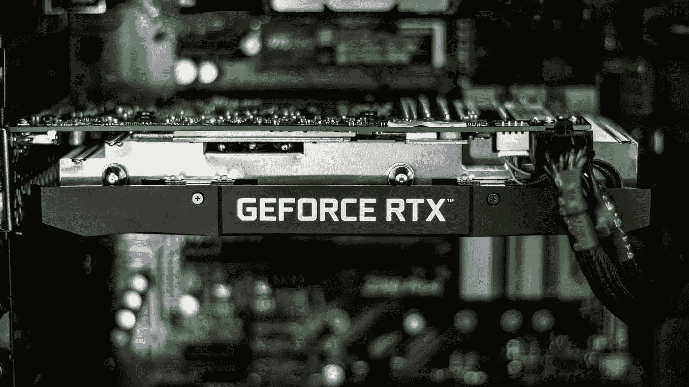
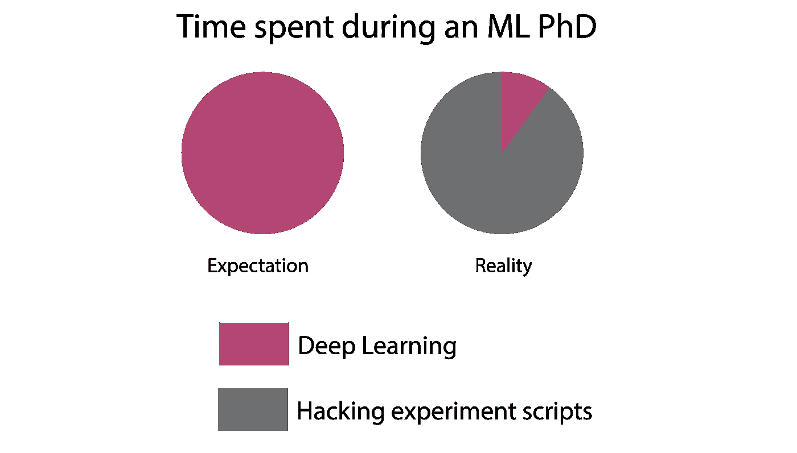
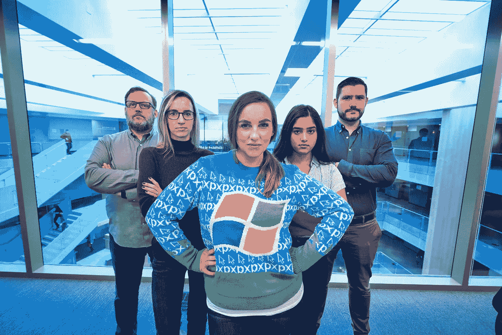
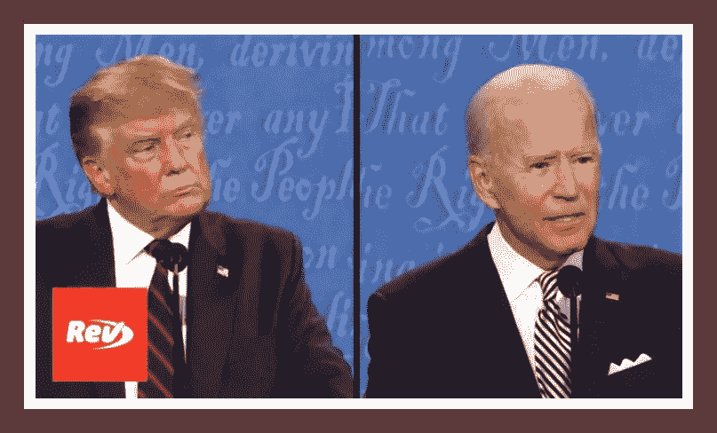
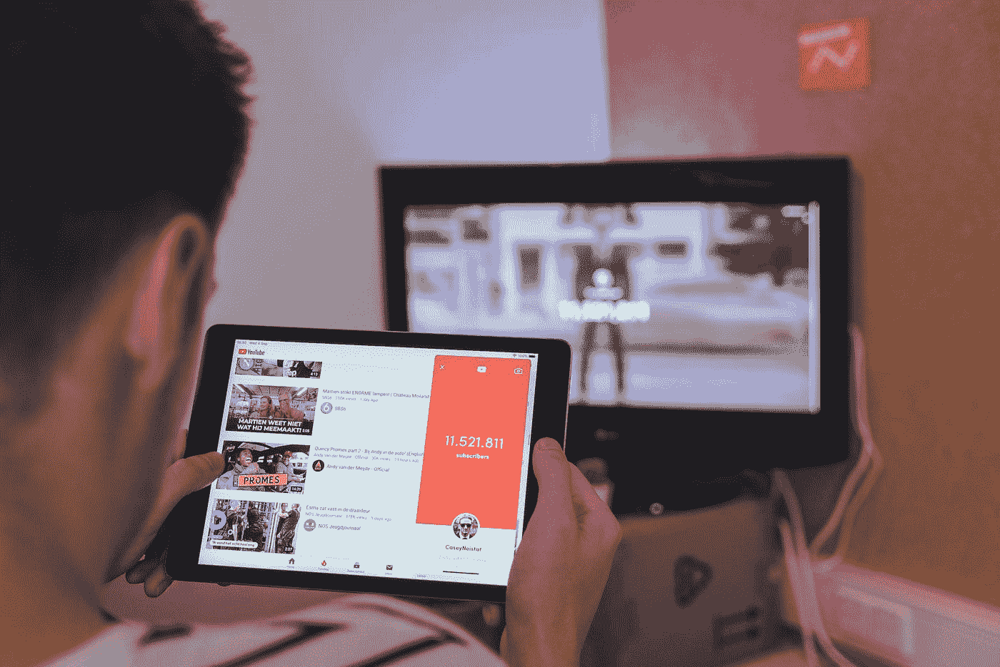
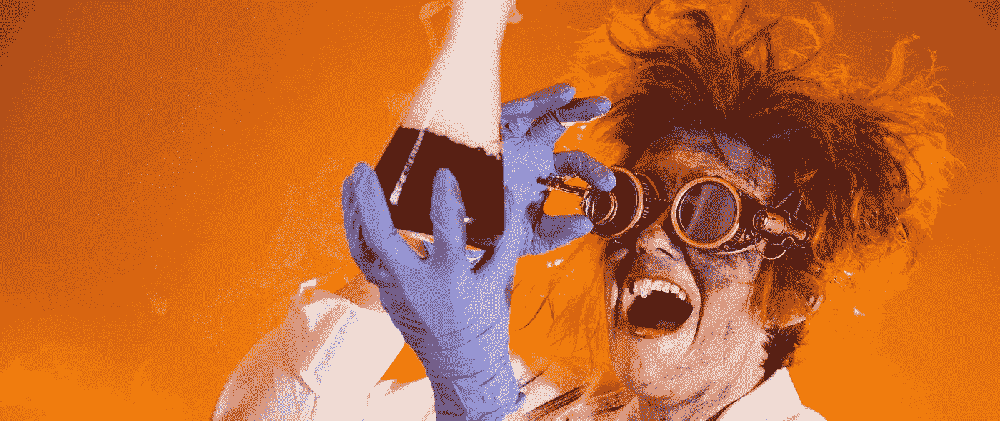
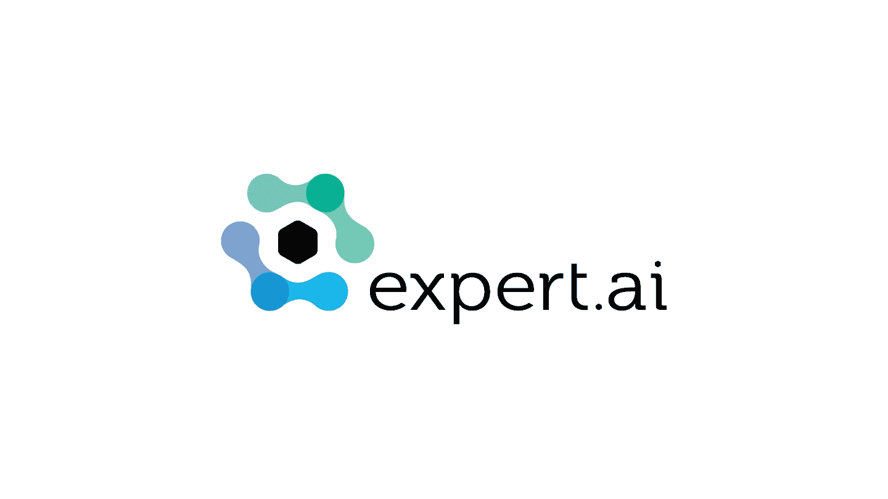

# NLP——从零到英雄，使用 Python 等等！

> 原文：<https://pub.towardsai.net/nlp-zero-to-hero-with-python-and-more-6f5968e96f1c?source=collection_archive---------1----------------------->

## [新闻](https://towardsai.net/p/category/news)，[快讯](https://towardsai.net/p/category/newsletter)

## 人工智能世界有什么新的东西，一个令人兴奋的(并且可以免费访问的)自然语言 API，以及我们每月的编辑精选

***如果你阅读这封邮件有困难，请在*** [***网络浏览器***](https://mktg.best/49f3q) ***上查看。***

H appy 周二，向着艾家！在这一期的时事通讯中，我们为你准备了许多好东西。首先，我们已经在我们的 [**机器学习数据集**](https://towardsai.net/p/machine-learning/best-datasets-for-machine-learning-and-data-science-d80e9f030279) 中心包含了一些非常酷且可以免费访问的数据集——来看看吧！

## 介绍 expert.ai [自然语言 API](https://mktg.best/3ldoc)

立即将语言智能添加到您的应用程序中！Expert.ai 自然语言 API 提供深入的语言理解，无需任何 IT 基础设施或安装，并根据您的需求进行扩展，因此您现在就可以开始开发智能应用程序！→ [**免费使用 API！**](https://mktg.best/3ldoc)

人工智能领域最大的会议 NeurIPS 目前正在进行中，有超过 2 万人注册。如果您尚未注册并希望访问他们的产品，请访问 NeurIPS 网站的这个 [**公共访问版本**](https://mktg.best/tbb0l) 。

如果你对 [**深度学习**](https://mld.ai/mldcmu) 感兴趣，我们推荐你看看这个 [**现象级教程**](https://mktg.best/5l8mv) ，作者是大卫·杜文瑙德、济科·科特和马特·约翰逊**，**，它使用了 NeurIPS 上展示的许多工具，如安德森加速、微分方程、神经网络、凸优化、[**【Jax**](https://mktg.best/l7-0i)、自动微分等。

接下来，我们推荐你看看这篇名为“ [**的文章，我们读到了迫使蒂姆尼特·格布鲁离开谷歌的论文。《麻省理工科技评论》的凯伦·郝(Karen Hao)在文章中写道**](https://mktg.best/811fr) ”,这篇文章非常有见地地概述了谷歌大脑(Google Brain)的联合首席伦理人工智能研究员蒂姆蒂特·格布鲁(Timtit Gebru)离职的原因。

对于那些对 [**自然语言处理**](https://towardsai.net/p/nlp/natural-language-processing-nlp-with-python-tutorial-for-beginners-1f54e610a1a0) 感兴趣的人来说，卡耐基梅隆大学教授 Graham Neubig 刚刚发表了关于多语言自然语言处理的**23 堂课，其中包括 Pat Littell 和 Orhan Firat 的两场客座讲座。视频播放列表可以在 [**Youtube**](https://mktg.best/560rx) 上免费访问。**

**最后但并非最不重要的是，来自 [**ML@CMU**](https://mktg.best/machine-learning-blog) 的 Paul Liang 和 Misha Khodak 发表了一篇帖子，其中包含了 CMU[**提交给 NeurIPS 2020**](https://mktg.best/2-kzg) 的所有内容，有许多好东西，从论文到代码，等等。**

**现在进入月度精选！我们根据读者、粉丝和某篇文章的浏览量来挑选这些文章。我们希望你和我们一样喜欢阅读它们。此外，我们开始做一些新的东西！我们将选出我们的十大表现文章，我们的编辑将选择一到两篇表现不突出，但由于其质量而入选本月的文章。**

**如果可以，请将我们的 [**订阅链接**](https://towardsai.net/subscribe) 分享给你的朋友、同事、熟人。我们承诺不会向他们的收件箱发送垃圾邮件。如果您对我们的简讯有任何反馈，请随时给我们发送 [**电子邮件**](mailto:pub@towardsai.net) 。**

# **📚编辑选择每月精选文章↓📚**

****

## **[NLP —零到英雄与 Python](https://mktg.best/u615m) 作者 [Amit Chauhan](https://medium.com/u/502d63083812?source=post_page-----6f5968e96f1c--------------------------------)**

**自然语言处理属于人工智能领域。所有的计算机都擅长用数字数据做处理，这节课处理文本数据来分析这个世界上不同的语言。在这篇文章中，我们将使用 Spacy 和 NLTK 等库对 python 语言处理进行形态学研究。**

****[**阅读更多**](https://mktg.best/u615m)****

************

## ******[机器学习、数据科学和深度学习的最佳笔记本电脑](https://towardsai.net/p/news/best-laptops-for-machine-learning-deep-learning-data-science-ml-f55602197593)由[走向 AI 团队](https://medium.com/u/aea8a19ea239?source=post_page-----6f5968e96f1c--------------------------------)******

******在过去的一年里，我们考察了 2000 多台笔记本电脑[ [8](https://www.amazon.com/s?k=rtx+64gb+laptop&ref=nb_sb_noss_2) ]，并挑选了我们认为最适合机器学习、数据科学和深度学习的各种预算的笔记本电脑——面向未来的人工智能设备！机器学习者、深度学习实践者和数据科学家一直在寻找他们以性能为导向的设备的优势。这就是为什么我们查看了 2000 多台笔记本电脑，为您带来我们认为最适合您的 [**机器学习**](https://mld.ai/mldcmu) 、深度学习和数据科学项目的笔记本电脑。******

******[**阅读更多**](https://towardsai.net/p/news/best-laptops-for-machine-learning-deep-learning-data-science-ml-f55602197593)******

************

## ******[我们希望在研究生院拥有的深度学习工具](https://towardsai.net/p/artificial-intelligence/the-deep-learning-tool-we-wish-we-had-in-grad-school)作者 [Angela Jiang](https://medium.com/u/76955f7d0007?source=post_page-----6f5968e96f1c--------------------------------) 和 [Liam Li](https://medium.com/u/ec8ce5487f11?source=post_page-----6f5968e96f1c--------------------------------)******

******机器学习博士生处于一个独特的位置:他们经常需要运行大规模的实验来进行最先进的研究，但他们没有工业 ML 工程师可以依赖的平台团队的支持。因此，博士生浪费了无数时间来编写样板代码、临时脚本和拼凑基础设施，而不是做研究。作为以前的博士生，我们讲述了我们应对这些挑战的亲身经历，并解释了像 [**Determined**](https://mktg.best/determinedost) 这样的开源工具是如何减轻读研的痛苦的。******

******[**阅读更多**](https://towardsai.net/p/artificial-intelligence/the-deep-learning-tool-we-wish-we-had-in-grad-school)******

************

## ******[Benjamin Obi Tayo 博士的数据科学能力时间表](https://mktg.best/op0z3)******

******对于任何有兴趣进入数据科学领域的人来说，要问的一个最重要的问题是: ***获得数据科学能力需要多长时间？*** 本文将讨论数据科学能力的典型时间表。获得数据科学能力所需的时间取决于能力水平。在第二部分中，我们将讨论数据科学的三个层次。在第三部分的**中，我们将根据兴趣水平讨论获得数据科学能力所需的时间。一个简短的总结完成了这篇文章…********

******[**阅读更多**](https://mktg.best/op0z3)******

************

## ******[使用 Python 和 Twint 从推文中获得有价值的见解和可视化效果](https://mktg.best/w72vf)作者:[朱](https://medium.com/u/7d83c09fb5d4?source=post_page-----6f5968e96f1c--------------------------------)******

******最近我迷上了一部日本电视节目。我发现自己无法停止在 Twitter、Instagram 和一个名为豆瓣的中国应用程序上查看关于该节目的更新和讨论。在此期间，我偶然在[看到了一篇关于 Python 库](https://nealcaren.org/lessons/twint/) [Twint](https://github.com/twintproject/twint) 的介绍文章，这在收集 twitter 数据方面非常方便。虽然每周等待新一集的到来是一种折磨，但我决定利用等待的时间探索 Twint，并从 Twitter 上获得一些关于该剧的见解。******

********[**阅读更多**](https://mktg.best/w72vf)********

************

## ******[我在人工智能初创公司](https://mktg.best/3m3wo)的 2 年里学到的 7 件事******

******我记得我得到第一份数据科学工作的那一天。在那之前，我主要是通过在线课程学习，并从事作品集项目 。在打包好工作后回家的路上，我冲向空中，为自己的成就拍拍自己的背。作为一名新生进入数据科学领域并不容易，但绝对是一项成就。 从那以后已经过去了几年。随着我在职业生涯中面临更大的挑战，我在这里反思我的经验，更重要的是，分享我在过去两年多的时间里作为一名人工智能初创公司的机器学习工程师所学到的知识。******

********[**阅读更多**](https://mktg.best/3m3wo)********

************

## ******[分析总统辩论](https://mktg.best/l78c0)作者[劳伦斯·阿拉索·克鲁博](https://medium.com/u/f03883fbae56?source=post_page-----6f5968e96f1c--------------------------------)******

********探索情感、关键短语提取和推理……**2020 年是“地狱般的一年”，我们现在大约是第十一个月。又到了美国人去投票的时候了。如果你活得够久，你就会认识到这些模式……对立的政治派别相互遮蔽，丑闻和泄密可能会爆发，缺点被放大，批评家制造新闻，承诺被“相当令人信服地”兑现，双方都极力宣扬“民族和团结”意识……******

******[**阅读更多**](https://mktg.best/l78c0)******

************

## ******这个人工智能可以给你的黑色白色照片上色，呈现出真实的照片效果！路易·布沙尔******

******DeOldify 是一种彩色化和恢复旧黑白图像甚至电影胶片的技术。它是由一个人 Jason Antic 开发并更新的。这是现在最先进的黑白图像彩色化方法，一切都是开源的，但是我们一会儿会回到这个话题。首先，让我们看看他是如何做到的。它使用一种新型的 GAN 训练方法，称为 NoGAN，他开发了自己的解决主要问题时出现的训练使用正常的对抗性网络架构组成…******

********[**阅读更多**](https://mktg.best/i0sf2)********

************

## ******[无经验如何获得数据科学工作](https://mktg.best/mw-14)作者[乔治·皮皮斯](https://medium.com/u/e57dfcb92bb0?source=post_page-----6f5968e96f1c--------------------------------)******

******让我们假设您是一名刚刚从大学毕业的候选人，拥有数学、计算机科学、工程或其他相关领域的理学学士/理学硕士学位，并且您希望开始数据科学家的职业生涯。成绩和大学学位表明你的理论背景和学习新事物的能力。然而，在现实世界中，事情与大学不同，不一定更困难，而且不知何故，招聘经理希望更多地了解你，尤其是你的工作方式…******

********[**阅读更多**](https://mktg.best/mw-14)********

************

## ******[11 个免费学习 Python 编程的 Youtube 频道](https://mktg.best/8ddy9)作者 [Jair Ribeiro](https://medium.com/u/159cf1feb0b7?source=post_page-----6f5968e96f1c--------------------------------)******

******如果你正在寻找最好的 Youtube 频道来钻研 Python 编程并向最好的人学习，你有一个伟大的名单，上面有 21 位(我的幸运数字)了不起的程序员，他们分享的技巧和秘密将帮助你成为大师！******

********[**阅读更多**](https://mktg.best/8ddy9)********

************

## ******亲爱的招聘经理，请停止使用带回家的作业！作者[玛丽·斯蒂芬·利奥](https://medium.com/u/954c0bee6530?source=post_page-----6f5968e96f1c--------------------------------)******

******数据科学和数据分析是 2021 年市场上最热门的工作。这个领域如此受欢迎，工作描述如此宽泛，以至于大多数职位空缺都会收到数百甚至数千份申请，因为大多数男性知道，即使他们没有达到 100%的要求，他们也可以申请一个职位。出于某种原因…******

********[**阅读更多**](https://mktg.best/83le2)********

************

## ******[10 个值得了解的改变游戏规则的人工智能突破](https://mktg.best/ftvz6)作者[尼舒·贾恩](https://medium.com/u/1985b61817c3?source=post_page-----6f5968e96f1c--------------------------------)******

******从我的 AI 之旅开始，我就发现了几个很有前途的想法和概念**无与伦比的潜力**；令人兴奋的研发片段**；和突破，推动了这一领域的发展，在其辉煌的历史上留下了自己的印记。此外，在过去的几年里，指向“*天网-终结者*”场景的人数呈指数增长…********

********[**阅读更多**](https://mktg.best/ftvz6)********

************

********🙏感谢您成为** [**订阅者**](https://towardsai.net/subscribe) **与** [**同向艾**](https://towardsai.net/) **！🙏********

*****跟着 AI 走↓*****