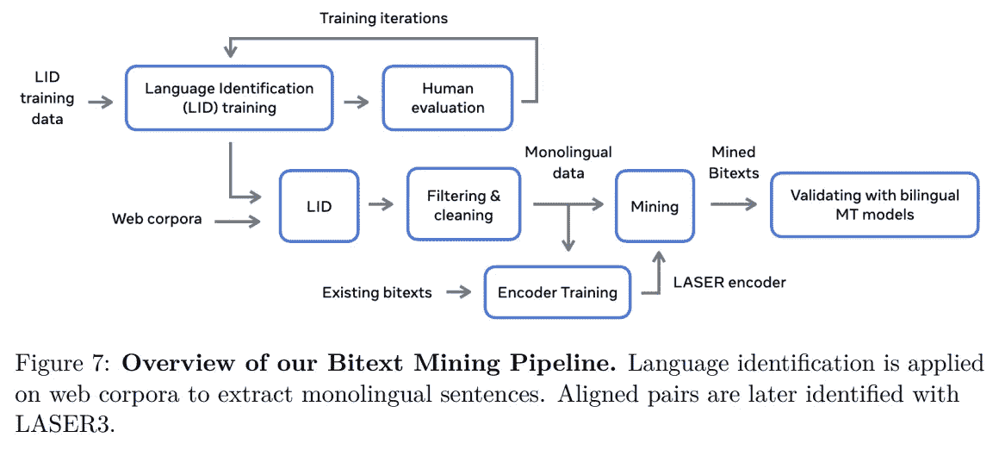
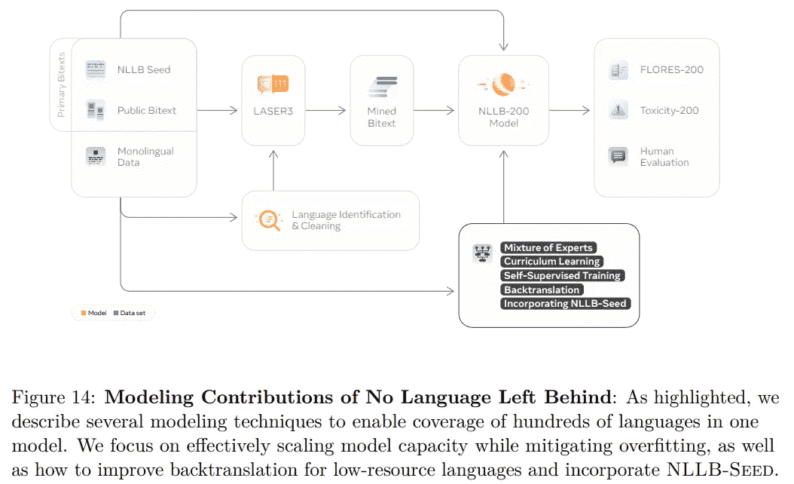
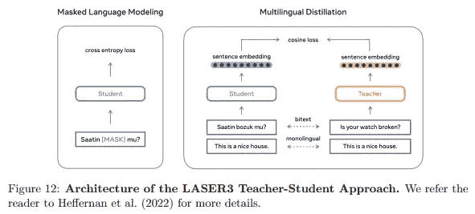
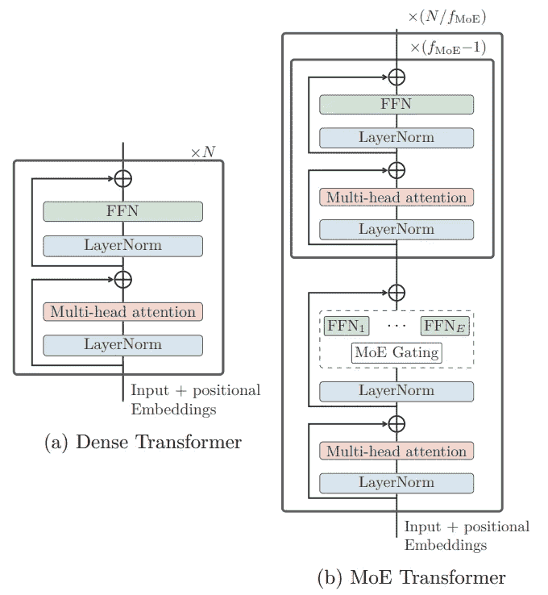

# 没有语言落后

> 原文：<https://pub.towardsai.net/no-language-left-behind-2d05ab39f9b3?source=collection_archive---------2----------------------->

## 用一个模型翻译 200 种语言—元人工智能

> 最初发表于 [louisbouchard.ai](https://www.louisbouchard.ai/no-language-left-behind/) ，前两天在[我的博客](https://www.louisbouchard.ai/no-language-left-behind/)上读到的！

## 观看视频

GPT 3 和其他语言模型真的很酷。它们可以用来理解文本片段、总结它们、录制视频、创建文本到语音的应用程序等等，但它们都有一个共同的大问题:它们只能在英语中很好地工作。这种语言障碍伤害了数十亿愿意与他人分享和交流却不能的人。

再说一次，人工智能也可以用于此。Meta AI 的最新模型名为“不让一种语言掉队”，它做到了这一点:以最先进的质量翻译 200 种不同的语言。你可以把它看作是谷歌翻译的一个更广泛、更强大的版本。

事实上，一个模型可以处理 200 种语言。多不可思议啊。
我们发现，严格意义上的英语很难有好的结果，而 Meta 正在用同一种模式处理 200 种不同的语言，以及一些最复杂和代表性较低的语言，甚至连谷歌翻译都难以应对。显然，这对脸书、Instagram 和他们所有的应用程序来说是一件大事，但对研究社区来说也是如此，因为他们开源了代码、模型、使用的数据集和训练程序。一家大公司提出的推进多语言研究的超级酷的倡议。

通常，使用人工智能模型翻译文本需要大量成对的文本数据，如法语-英语翻译，以便模型了解两种语言如何相互关联，以及如何从一种语言转换到另一种语言，反之亦然。这意味着该模型需要看到几乎每一个可能的句子和文本，才能在现实世界中得到良好的结果和推广:这对于大多数较小的语言来说是完全不可能的，对于大多数语言来说又极其昂贵和复杂。我们通常训练这样的模型来执行从一种语言到另一种语言的单向翻译，而不是一次在 200 种语言之间进行翻译，每次我们想要添加一种新语言时都需要一个新的模型。

那么 Meta 是如何将一个模型扩展到数百种语言的呢？

图片来自[论文](https://research.facebook.com/publications/no-language-left-behind)。

首先，他们建立了一个合适的数据集。Meta 创建了一个能够自动检测语言的初始模型，他们称之为他们的语言识别系统。然后，它使用另一种基于 Transformers 的语言模型来为所有废弃的数据寻找句子对。这两个模型仅用于构建我们需要训练最终语言翻译模型 NLLB200 的 200 个成对语言数据集。

图片来自[论文](https://research.facebook.com/publications/no-language-left-behind)。

现在有趣的部分来了:多语言翻译模型。当然，它是基于转换器的编码器-解码器架构。这意味着 Meta 的新模型非常类似于 GPT-3，获取一个文本句子，对其进行编码以便解码，并产生一个新的文本句子，理想情况下是我们发送给它的翻译版本。

图片来自[报](https://research.facebook.com/publications/no-language-left-behind)。

新的是他们对模型进行了修改，以扩展到如此多的不同语言，而不是局限于一种语言。第一个修改是添加一个变量来标识输入的源语言，这个变量取自我们刚刚讨论过的语言检测器。这将有助于编码器更好地处理当前输入语言。然后，我们对解码器做同样的事情，让它翻译成哪种语言。请注意，这种有条件的编码方案与 CLIP 非常相似，CLIP 对图像和文本的编码方式类似。在这里，在理想的条件下，不管是什么语言，它都会以相似的方式编码一个句子。

他们使用稀疏门控的专家混合模型来实现跨语言迁移和干扰之间的更优权衡，并提高低资源语言的性能。稀疏选通的专家混合基本上是常规模型，但是每次输入仅激活模型参数的子集，而不是每次都涉及大多数(如果不是全部的话)参数。您可以很容易地看到这是这个应用程序的完美模型。专家的混合只是在编码器和解码器的变压器架构中添加的额外步骤，用 N 个前馈网络取代前馈网络子层，每个前馈网络都有输入和输出投影，变压器模型在训练期间自动学习每种语言使用哪个子网。

图片来自[报](https://research.facebook.com/publications/no-language-left-behind)。

他们还对架构本身做了一些小调整。尽管如此，专家模型和源语言编码的混合使用无疑是这种新模型区别于 GPT-3 等单语模型的最重要的变化。如果你对该架构的所有内部细节感兴趣，我强烈邀请你阅读他们令人惊叹的详细论文。

我希望你喜欢这篇文章，请让我知道你是自己实现这个模型还是在下面的评论中为多语言研究做出贡献。我也将借此机会邀请你在我们的不和谐社区中分享你的创作或你所做的任何涉及 AI 的事情。

感谢您的阅读，我们下次再见，带着另一篇令人惊叹的论文！

## 参考

梅塔的视频:【https://www.youtube.com/watch?v=uCxSPPiwrNE
研究论文:[https://Research . Facebook . com/publications/no-language-left-behind](https://research.facebook.com/publications/no-language-left-behind)
代码:[https://github.com/facebookresearch/fairseq/tree/nllb](https://github.com/facebookresearch/fairseq/tree/nllb)
我的简讯(一个新的 AI 应用每周向您的电子邮件解释！):[https://www.louisbouchard.ai/newsletter/](https://www.louisbouchard.ai/newsletter/)