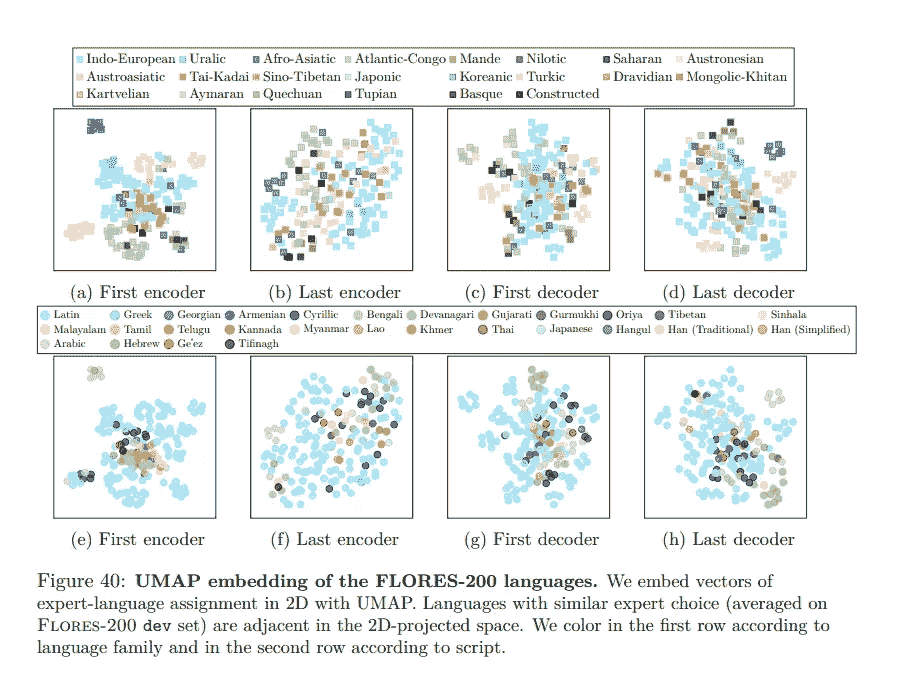

# 没有语言落后

> 原文：<https://pub.towardsai.net/no-language-left-behind-579afea29e52?source=collection_archive---------2----------------------->

## Meta 的新模型能够翻译 200 种不同的语言，使互联网更容易访问

图片来自[阿玛多·洛雷罗](https://unsplash.com/@amadorloureiro)在 [Unsplash](https://unsplash.com/)

# **简介**

> 我的语言的极限意味着我的世界的极限。
> 
> [**路德维希·维特斯坦根**](https://en.wikipedia.org/wiki/Ludwig_Wittgenstein)

我一直很喜欢维特根斯坦的这句话，它真正解释了语言在我们生活中的重要性。没有合适的词语，我们无法表达自己，也许随着语言强大能力的发展，人类认知革命永远不会发生。因此，我们不会在这里写和读这些文字。文明诞生后，文字不再出现。此外，在反乌托邦小说《一九八四年》中，奥威尔想象政府使用“新话”作为一种审查形式，同时也是限制人们思想的一种方式。

我想举几个例子来说明语言和翻译的重要性。其中最有趣的是圣经的错误翻译如何导致米开朗基罗相信摩西有角。第二次世界大战期间，一个更悲惨的错误导致盟军轰炸了蒙内卡西诺修道院:一份截获的德国电报称，修道院里有一名“住持”，美国人将其翻译为“营”的简称。或者是从日语翻译过来的错误影响了美国人使用原子弹的决定。翻译过去和现在都是一种政治武器，在古代，人们习惯于用多种语言起草国际条约，并试图在每个版本中加入对自己有利的不同条款。

由于语言如此重要，它一直是人工智能中一个活跃的研究领域。新的[语言模型](https://www.techtarget.com/searchenterpriseai/definition/language-modeling)如 [GPT3](https://openai.com/blog/openai-api/) 预示着一场革命和丰富的新工具。它们可以用于总结文本、创建字幕、录制视频以及创建文本到语音的应用程序。然而，所有这些可能性仅限于说英语。“不让一种语言掉队”是为那些被掉队的人准备的，处理 200 种语言。

这个图像代表了米开朗基罗的摩西雕塑，注意这个小角是翻译错误的结果。图片来自[维基百科](https://en.wikipedia.org/wiki/Moses_(Michelangelo))。

# **从科幻到现实的翻译**

图片来自 [Unsplash](https://unsplash.com/) 的 [Waldemar Brandt](https://unsplash.com/@waldemarbrandt67w)

在[银河系漫游指南](https://en.wikipedia.org/wiki/The_Hitchhiker%27s_Guide_to_the_Galaxy)中，道格拉斯·亚当斯描述了巴别塔鱼，一种可以插入耳朵的小鱼，可以让人理解宇宙中的每一种语言。事实上，通用翻译曾经被认为是科幻领域的一部分。

当第二次世界大战引发冷战时，解读俄罗斯的信息被认为是一项优先任务。多亏了图灵破解恩尼格玛密码的工作，盟军尝到了电脑的威力。不幸的是，到了 20 世纪 60 年代，他们意识到我们的语言学和计算机知识仍然有限。机器翻译在 20 世纪 90 年代初再次起飞，当时[统计机器学习](https://en.wikipedia.org/wiki/Statistical_learning_theory)展示了不错的结果。只有随着神经网络的出现，复杂的翻译才成为可能，大型语言模型的出现预示着一场新的革命。

经典的[神经机器翻译](https://machinelearningmastery.com/introduction-neural-machine-translation/)系统依赖于由一对句子(一种语言的句子和另一种语言的翻译)组成的大型数据集。一般来说，这些大型语料库是由人类收集和标注的。虽然对于接受机构资助的不同的广泛使用的语言(例如，英语、德语和法语)有大量的语料库可用，但是许多其他语言被忽略了。

# **元新模型，构建数据集的聪明方法**

图片来自原纸:[此处](https://scontent-cdg2-1.xx.fbcdn.net/v/t39.8562-6/292295068_402295381932691_8903854229220968087_n.pdf?_nc_cat=102&ccb=1-7&_nc_sid=ad8a9d&_nc_ohc=y1oUXcKwodoAX9ryoVN&_nc_ht=scontent-cdg2-1.xx&oh=00_AT-vySAq_HRM_ALkBMgySu_qxJOwwXvXaX6WPeWB1hL0cw&oe=62D07B53)

经典系统很难概括，为较小的语言收集如此多的例子既困难又昂贵。此外，经典语言被训练成从一种语言翻译成另一种语言，而不是处理这么多种语言。Meta 解决了数据集问题，使用初始数据集自动检测语言(在论文中称为语言识别系统)。另一个基于 [transformer](https://blogs.nvidia.com/blog/2022/03/25/what-is-a-transformer-model/) 的模型用于为识别的数据寻找句子对。通过这种方式，他们为最终模型构建了范例数据集

图片来自原纸:[此处](https://scontent-cdg2-1.xx.fbcdn.net/v/t39.8562-6/292295068_402295381932691_8903854229220968087_n.pdf?_nc_cat=102&ccb=1-7&_nc_sid=ad8a9d&_nc_ohc=y1oUXcKwodoAX9ryoVN&_nc_ht=scontent-cdg2-1.xx&oh=00_AT-vySAq_HRM_ALkBMgySu_qxJOwwXvXaX6WPeWB1hL0cw&oe=62D07B53)

最终的模型叫做 NLLB200(没有语言掉队 200)。最终的模型实际上是一个基于转换器的模型，由一个编码器和一个解码器组成(像许多其他语言模型一样)。具体来说，输入序列被提供给编码器，并且模型的这一部分正在学习句子内容的表示。编码器提供这种表示来指导解码器翻译句子。该模型使用翻译来验证它能够正确翻译。

图片来自原纸:[此处](https://scontent-cdg2-1.xx.fbcdn.net/v/t39.8562-6/292295068_402295381932691_8903854229220968087_n.pdf?_nc_cat=102&ccb=1-7&_nc_sid=ad8a9d&_nc_ohc=y1oUXcKwodoAX9ryoVN&_nc_ht=scontent-cdg2-1.xx&oh=00_AT-vySAq_HRM_ALkBMgySu_qxJOwwXvXaX6WPeWB1hL0cw&oe=62D07B53)

该模型也有其他技巧来改善翻译，因为[稀疏门控的专家混合](https://arxiv.org/abs/1701.06538)，但本质上该模型与其他已经发布的模型相似，而数据集组装是核心思想。

# **为什么优先考虑低资源语言社区？**

图片来自原纸:[此处](https://scontent-cdg2-1.xx.fbcdn.net/v/t39.8562-6/292295068_402295381932691_8903854229220968087_n.pdf?_nc_cat=102&ccb=1-7&_nc_sid=ad8a9d&_nc_ohc=y1oUXcKwodoAX9ryoVN&_nc_ht=scontent-cdg2-1.xx&oh=00_AT-vySAq_HRM_ALkBMgySu_qxJOwwXvXaX6WPeWB1hL0cw&oe=62D07B53)

研究表明，大约只有 25%的互联网用户说英语，而 65%的互联网网站是英文网站。这种惊人的差异导致许多重要的资源(教育、工作或机构)并不是每个人都可以获得的，整个群体在网络上是沉默的。具体而言，对低资源社区缺乏关注导致贫困社区进一步边缘化。

此外，在过去的几十年里，我们已经看到了本土语言和文化的衰落，这是由文化(缺乏书籍，语言媒体)和经济原因造成的。现有自动翻译的覆盖范围和质量忽略了这些语言，加大了谁可以访问某些资源和谁不能访问的差距。

这项工作的第一步是了解数百种语言的高质量翻译的影响。事实上，作者采访了 44 名低资源语言使用者。这样做的目的是直接强调道德和社会考虑。他们在论文中写道:

> 总的来说，我们的招聘工作使我们找到了 44 名来自不同背景、母语为低资源语言的人，年龄从 23 岁到 58 岁不等。共有 36 种语言，分布如下:5 种语言主要在北美使用，8 种在南美使用，4 种在欧洲使用，12 种在非洲使用，7 种在亚洲使用。

然而，正如该文件所指出的，其局限性是:

> 尽管我们的样本在种族、教育和地点方面具有广泛性，但我们的大多数参与者都是生活在美国和欧洲的移民，其中大约三分之一(n = 17)是技术工人

此外，研究致力于检测语料库中的有毒项目并过滤它们。

# **结论**

不是每个人都会说英语(无论是在互联网内部还是外部),这一点应该在设计语言模型时加以考虑。语言的重要性超出了研究者的兴趣，语言也是文化、社会和信仰的表达。

翻译对于信息、知识和思想的传播是必要的。此外，翻译的质量有重大的社会和经济损失。事实上，糟糕的翻译是对太多社区有害的障碍。NLLB200 只是缩小这一差距的第一步。

# **资源**

这里是本文参考的一些资源和其他有用的资源。

*   [的官方研究论文](https://scontent-cdg2-1.xx.fbcdn.net/v/t39.8562-6/292295068_402295381932691_8903854229220968087_n.pdf?_nc_cat=102&ccb=1-7&_nc_sid=ad8a9d&_nc_ohc=y1oUXcKwodoAX9ryoVN&_nc_ht=scontent-cdg2-1.xx&oh=00_AT-vySAq_HRM_ALkBMgySu_qxJOwwXvXaX6WPeWB1hL0cw&oe=62D07B53)，你可以参考更多的技术细节(它长达 190 页，太长了，无法在这篇短文中包含所有细节)。
*   Meta 的博文:[这里](https://about.fb.com/news/2022/07/new-meta-ai-model-translates-200-languages-making-technology-more-accessible/)和[这里](https://ai.facebook.com/blog/teaching-ai-to-translate-100s-of-spoken-and-written-languages-in-real-time/)
*   [官方视频](https://www.youtube.com/watch?v=uCxSPPiwrNE&ab_channel=MetaAI)展示模型
*   [代码](https://github.com/facebookresearch/fairseq/tree/nllb)(检查一下总是好的！)

# 如果你觉得有趣:

你可以寻找我的其他文章，你也可以 [**订阅**](https://salvatore-raieli.medium.com/subscribe) 在我发表文章时得到通知，你也可以在**[**LinkedIn**](https://www.linkedin.com/in/salvatore-raieli/)**上连接或联系我。感谢您的支持！****

**这里是我的 Github 资源库的链接，我计划在那里收集代码，以及许多与机器学习、人工智能等相关的资源。**

** [## GitHub - SalvatoreRa/tutorial:关于机器学习、人工智能、数据科学的教程…

### 关于机器学习、人工智能、数据科学的教程，包括数学解释和可重复使用的代码(python…

github.com](https://github.com/SalvatoreRa/tutorial)**