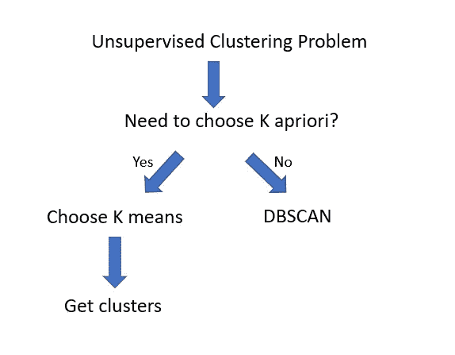

# 没有 ML 算法备忘单，请

> 原文：<https://pub.towardsai.net/no-ml-algorithms-cheat-sheet-please-29edc180f472?source=collection_archive---------5----------------------->

## [机器学习](https://towardsai.net/p/category/machine-learning)，[观点](https://towardsai.net/p/category/opinion)

图片来源:【https://unsplash.com/ 

## 什么是备忘单？

维基百科将备忘单定义为用于[快速参考的一组简明笔记。](https://en.wikipedia.org/wiki/Cheat_sheet)现在这里需要强调的词是**‘快速参考’。**

在编程中，备忘单是可以的，因为没有人能记住编程语言的所有语法。尤其是当编程语言不断发展时(如 Python ),或者当程序员发现自己在不同的编程语言之间转换时。

像备忘单这样的快速参考帮助程序员节省时间并专注于更大的问题。

## **数据科学家，你急什么？**

图片来源: [Pinterest](https://www.pinterest.com/pin/788411478487724965/)

机器学习算法的学习和实现永远不应该是百米冲刺。每个机器学习实现都应该经过深思熟虑，仔细考虑，然后实现。数据科学解决方案需要时间，这是一项探索性和实验性的工作。

遵循一些备忘单会让你缺乏实验性，你无法探索所有的选择。 ***【直入问题】*** 的态度可能会帮助你赢得一些 Kaggle 比赛，但在现实生活中的机器学习用例中不会带你走太远。

好了，现在让我们进入问题的关键…

# **为什么 ML 算法备忘单是个坏主意？**

## **数据和假设**

即使在一个公司内部，一个部门的业务问题也因人而异。在个案的基础上，数据的多样性和复杂性是如此之大，没有一个单一的方法可以规定。但是 ML 备忘单正是这样做的。

例如，如果数据< 1k, choose algorithm X: Else If data > 1k，选择算法 Y

说到假设，每个机器学习算法都要考虑大量的假设。从关于数据生成过程的假设到关于模型的假设。这些假设根本没有被详细研究或评估。

## **小抄让你走上一条没有掉头或弯路的道路**

图片来源:Pixabay

就像编程中的硬编码一样，ML 算法的备忘单限制了您的选择。他们把你放在一条你快乐地穿行的道路上，一旦你意识到你正在走的道路是错误的，往往为时已晚！

## **没有创新的机会**

如果你按照小抄去做，你并没有在走一条人迹罕至的路。不用说，创新是通过走更少人走过的路来实现的。备忘单并没有告诉你将从一个领域学到的知识应用到另一个领域。这里没有迁移学习。它也没有告诉你尝试一些集成技术或者尝试一些不同算法技术的融合。一个人或多或少像一匹戴着眼罩的马。

我们(数据科学家)站在巨人的肩膀上。无论是勒让德的 OLS，还是杰弗里·辛顿的各种深度学习技术，没有一个是根据小抄发明的。

## **小抄让你做决定*【机器化】***

嗯，编写机器学习算法并不意味着你变成了机器本身！！备忘单通常会让你的决策在每个阶段都变得二进制。

例如

瞧，你有你的集群..还是你？

天真的数据科学家或有抱负的数据科学家只会对他/她得到的集群感到满意，然后继续前进。

但是这里有一个问题…

k 均值算法的一个缺陷是，它几乎可以聚类任何东西。因为我们现在有了集群，这并不意味着我们已经完成了任何事情！这只是一场[惨胜](http://varianceexplained.org/r/kmeans-free-lunch/)。我强烈建议读者阅读这篇由大卫·罗宾逊撰写的关于 k 方法弊端的精彩博客。

因此，人们可以清楚地看到，虽然备忘单将数据科学家引向了 K 均值算法的道路，但当需要进一步探索时，它给出了任务完成的错误感觉。

## **没有免费的午餐理论——棺材上的最后一颗钉子**

也许“没有免费的午餐理论”是 ML 小抄的最后一颗钉子。没有免费的午餐理论认为

> “没有一种模式能最好地解决所有问题。一个问题的伟大模型的假设可能不适用于另一个问题”。

如果没有一个模型或算法对每个问题都是最好的，那么有一个 ML 算法备忘单真的有意义吗？

图片来源: [Giphy](https://giphy.com/explore/nope)

所以，请不要使用 ML 算法备忘单。尝试有机地达成一个解决方案。让你的大脑凭直觉把点点滴滴联系起来！

欢迎您的评论和意见。

你可以联系我

[领英](http://www.linkedin.com/in/venkat-raman-Analytics)

[推特](https://twitter.com/venksaiyan)