# 没有训练数据？没问题！对救援的监管不力！

> 原文：<https://pub.towardsai.net/no-training-data-no-problem-weak-supervision-to-the-rescue-bd38b475a412?source=collection_archive---------0----------------------->

## 使用领域知识生成大型带标签的数据集，具有最先进的 NLP 弱监督。

在机器学习模型中利用来自主题专家的丰富领域知识！作者使用的图片来自 Nikita Golubev 创建的科学家图标— [Flaticon](https://www.flaticon.com/free-icons/scientist) ，Freepik 创建的人物图标— [Flaticon](https://www.flaticon.com/free-icons/people) ，Freepik 创建的十字架图标— [Flaticon](https://www.flaticon.com/free-icons/cross) ，img flip[创建的 Drake Meme](http://imgflip.com)。

# 🚧当代机器学习的挑战

在现实世界应用中开发现代机器学习(ML)模型的主要瓶颈之一是需要大量人工标记的训练数据。例如， [ImageNet 数据集](https://image-net.org/index.php)由超过 1400 万张各种现实世界物体的手动标记图像组成。[迁移学习](https://en.wikipedia.org/wiki/Transfer_learning#:~:text=Transfer%20learning%20(TL)%20is%20a,when%20trying%20to%20recognize%20trucks.)的出现极大地缓解了这一要求，但我们仍然需要数百个(如果不是数千个)带标签的例子来微调最新的艺术(SOTA)语言模型，如 BERT。

不幸的是，获得这种手动注释通常是耗时且费力的，容易出现人为错误和偏差，并且很难根据不断变化的条件保持更新[ [扳手纸](https://arxiv.org/abs/1707.02968) ]。

那么我们能做些什么来改善这种情况呢？进入弱监管！大多数组织在布尔查询、启发式规则或传统上在 ML 模型中不被使用的部落知识方面具有巨大的领域知识深度。

最近的弱监督(WS)框架可以减少手动标记的工作，同时通过利用各种较弱的、通常是程序性的监督来源来释放领域主题专家(SME)的大量知识。

> 在爱德曼，这导致了爱德曼研究信任的历史中的最佳领域知识与最先进的 NLP ML 模型的有力结合。

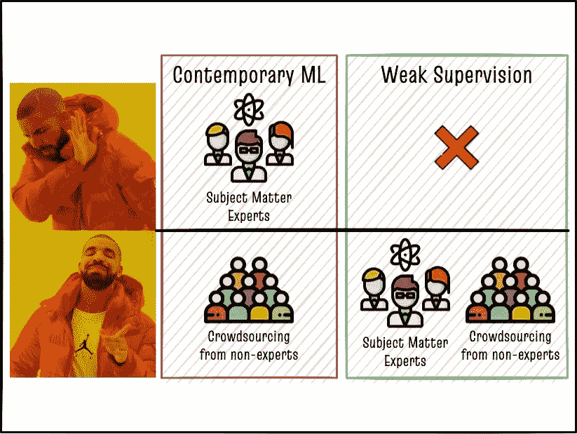

在机器学习模型中利用来自主题专家的丰富领域知识！作者使用的图片来自 Nikita Golubev 创建的科学家图标— [Flaticon](https://www.flaticon.com/free-icons/scientist) ，Freepik 创建的人物图标— [Flaticon](https://www.flaticon.com/free-icons/people) ，Freepik 创建的十字架图标— [Flaticon](https://www.flaticon.com/free-icons/cross) ，img flip[创建的 Drake Meme](http://imgflip.com)。

这篇文章将介绍在弱监管领域的一些最新进展，爱德曼 DxI 的数据科学团队为解决我们的 NLP 问题而感到兴奋不已！

# 💡监管不力

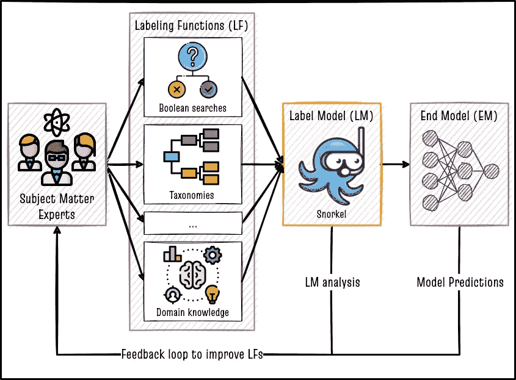

弱监管概述。作者使用的图片来自 Nikita Golubev 创建的科学家图标— [Flaticon](https://www.flaticon.com/free-icons/scientist) ，平面图标创建的布尔图标— [Flaticon](https://www.flaticon.com/free-icons/boolean) ，surang 创建的层次图标— [Flaticon](https://www.flaticon.com/free-icons/hierarchy) ，Freepik 创建的知识图标— [Flaticon](https://www.flaticon.com/free-icons/knowledge) 。

数据编程是使用标签模型结合[启发式标签功能](https://arxiv.org/abs/1605.07723)编程创建标签数据集的名称。弱监督使用由标签模型创建的标签数据集来训练下游终端模型，该下游终端模型在标签模型的输出之外进行概括。对数据集实施弱监管有三个步骤，如[浮潜论文](http://arxiv.org/abs/1711.10160)中所述。

1.  **编写标签函数(LFs):** 标签函数是任何 Python 函数，它可以将一行数据作为输入，并使用一些规则输出该行的标签。例如，如果我们的任务是“垃圾邮件检测”，可以构建一个标记函数，如下面的代码片段所示。每个标记功能独立运行，以标记每一行数据。在二元分类问题的情况下，标签或者是 0(没有标签)或者是 1(有标签)或者是-1(信息不足，所以不加标签)。
2.  **将弱标签与标签模型(LM)相结合:**如果我们有`m`行数据和`n`个 LFs，那么运行所有 LFs 将产生总共`m X n`个标签。我们需要聚集`n`个独立 LFs 的输出，这样每一行只有一个标签。多数投票标签模型是将多个 LFs 聚合为每行一个标签的最简单方法。尽管如此，通过了解整个`m`行中各种 LFs 之间的协议和分歧，仍有更好的方法进行汇总。我们在一些花哨的数学的帮助下做到这一点，它不需要任何地面事实数据[ [数据编程纸](http://arxiv.org/abs/1605.07723) ][ [金属纸](http://arxiv.org/abs/1810.02840) ][ [飞行乌贼纸](http://arxiv.org/abs/2002.11955) ]！
3.  **训练下游端模型(EM):** 标签模型的输出被用作训练数据，以微调诸如 BERT 的下游模型，从而推广到 LM 的标签之外。由于 LFs 是编程标记源，我们可以在整个未标记语料库上运行步骤 1 和 2 来生成许多标签。步骤 3 中训练的模型可以受益于步骤 1 和 2 中创建的更广泛的训练数据集。

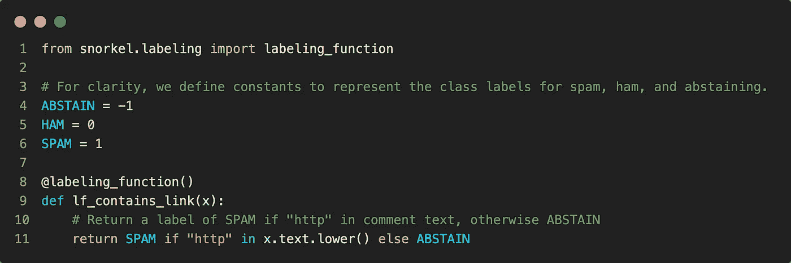

来自[官方通气管文件](https://www.snorkel.org/use-cases/01-spam-tutorial)的标签功能示例。图片作者。

[scupk](https://github.com/snorkel-team/snorkel)是事实上的 Python 库，使用数据编程范式从弱监督开始。它提供了易于使用的 API 来实现和评估步骤 1 和 2。我们可以使用高级的 ML APIs 比如 [Huggingface 的变形金刚](https://huggingface.co/)或者 [Sklearn](https://scikit-learn.org/stable/) 来实现步骤 3。

在某些方法中，我们可以将步骤 2 和 3 合并成一个步骤。然而，在我们的实验和文献 T23 扳手论文 T24 中发表的那些实验中，两阶段方法似乎优于一阶段方法，因为它们允许我们选择任何 LM 和 em 组合，直到我们获得最佳性能。因此，我们仅限于两阶段的方法。

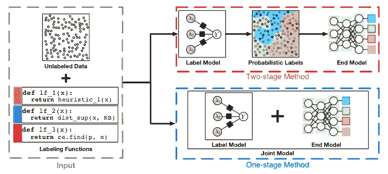

监管不力的类型。图片来自 [arxiv 论文](https://arxiv.org/abs/2109.11377)。

# 🧰监管框架薄弱

在弱监管基准[ [扳手论文](https://arxiv.org/abs/2109.11377) ][ [Github](https://github.com/jieyuz2/wrench) ]中，作者对各种弱监管框架进行了基准测试，并与全监管黄金基准进行了比较，如下图所示。

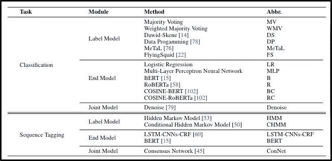

扳手论文的作者测试了各种弱监管框架——图片来自 [arxiv 论文](https://arxiv.org/abs/2109.11377)。

对于 NLP 任务，余弦 RoBERTa (RC)始终优于其他终端模型(EM)，包括 vanilla RoBERTa (R)，因此我们可以在两阶段方法中安全地选择 RC 作为我们的终端模型！另一方面，没有一个单一标签模型(LM)框架始终表现出色，这表明我们必须在我们的数据集上试验不同的 LM，以选择最佳的一个。下面简单讨论一下这些方法。

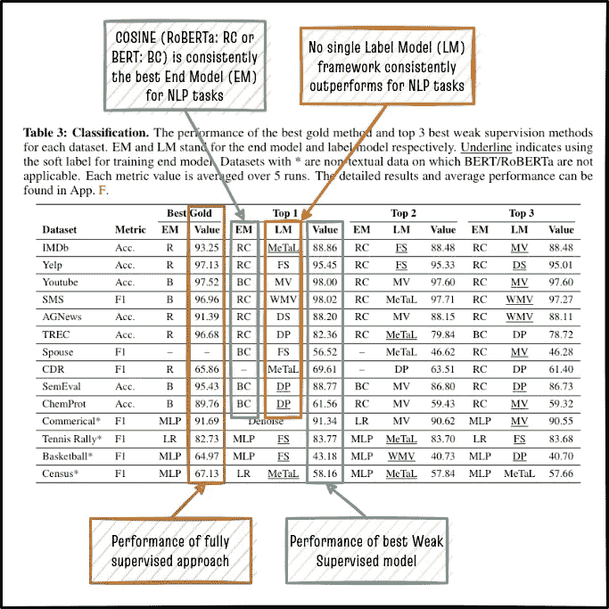

扳手论文中几个数据集的最佳弱监管框架总结？图片来自 [arxiv 论文](https://arxiv.org/abs/2109.11377)，由作者标注

## **余弦(RC，BC)【**[**论文**](https://aclanthology.org/2021.naacl-main.84/)**】**[**Github**](https://github.com/yueyu1030/COSINE)**】**[**扳手实现**](https://github.com/jieyuz2/wrench)

**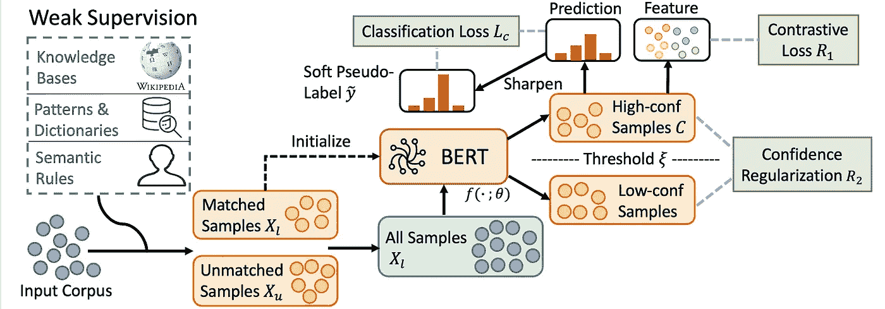**

**余弦模型架构。图片来自 [ACL 论文](https://aclanthology.org/2021.naacl-main.84/)。**

**余弦是用于微调预训练语言模型的对比自训练的缩写，是近年来弱监督领域最有前途的发展之一。余弦算法有五个步骤。**

1.  ****初始化:**我们使用来自标签模型的弱标签，在初始化步骤中使用交叉熵损失来微调诸如 BERT 的语言模型。然后，我们将这个微调的 BERT 模型在整个数据集上的概率预测作为软伪标签。我们使用软伪标签，使用复合损失迭代地继续 BERT 模型的微调，如下式所示。**
2.  ****样本重新加权:**每个样本然后基于其预测概率被重新加权，使得具有高预测概率的样本具有高权重，而具有低预测概率的样本具有相应的低权重。**
3.  ****高置信度样本的分类损失:**我们使用高于预定义权重阈值ξ的样本来计算基于 [Kullback-Leibler 散度](https://en.wikipedia.org/wiki/Kullback%E2%80%93Leibler_divergence)的加权分类损失，因为我们使用的是软伪标签。**
4.  ****高置信度样本的对比损失:**我们使用上一步中的相同样本来计算对比损失，使得具有相似伪标签的样本靠近在一起。相反，具有不同伪标签的样本在向量空间中被推开。阳性和阴性样本之间的差值是一个超参数。**
5.  ****所有样本上的置信度正则化:**上述整个方法仅在我们的置信度(预测概率)是正确的并且错误标记的样本具有低置信度时才有效。因此，最终损失是基于置信度的正则化器，其阻止错误标记的样本获得过高的置信度(过置信度)。可以调整超参数λ来调整正则化强度。**

**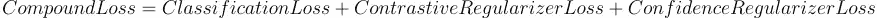**

**余弦复合损失函数。图片作者。**

**作为这些步骤的结果，余弦方法对于弱标签中的噪声是鲁棒的。在我们的内部基准测试中，这是性能最好的方法之一，尤其是如果您有一个小的带标签的数据集来执行初始化步骤。[扳手报告](https://github.com/jieyuz2/wrench)中的实现简单易用。**

## **通气管[ [数据编程(DP)纸](http://arxiv.org/abs/1605.07723) ][ [金属纸](http://arxiv.org/abs/1810.02840) ][ [Github](https://github.com/snorkel-team/snorkel) ]**

**通气管是所有弱监督标签模型方法之母！创造了“数据编程”一词的斯坦福大学研究人员也发明了潜泳。浮潜的前提很简单:给定一组启发式标记函数(LFs)，将来自这些函数中每一个的弱标签组合成每个样本的单个标签[ [Youtube 视频](https://www.youtube.com/watch?v=RUPbYvzSrg0) ]。通气管提供了一个易于使用的框架来聚合多个嘈杂、重叠、微弱的 LFs。**

**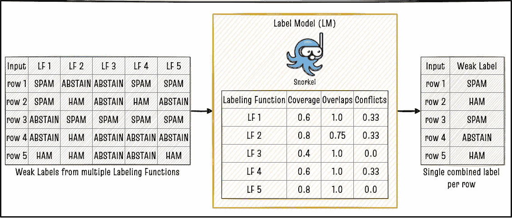**

**使用通气管将每行多个 LFs 合并为每行一个弱标签。作者图片**

**组合多个弱标签的一种方法是使用多数投票(MV ),事实上，在扳手论文的基准测试结果中，MV 确实显示为少数数据集的最佳 LM。然而，LFs 可能是相关的，导致 MV 模型中的特定信号过多。相反，浮潜实现了一个更复杂的 LM，使用一些简洁的数学矩阵逆魔法来组合单个 LFs 的输出，如下图所示，并在本[演示](https://www.datacouncil.ai/hubfs/DataEngConf/Data%20Council/Slides%20SF%2019/Accelerating%20Machine%20Learning%20with%20Training%20Data%20Management.pdf)和[ [金属纸](http://arxiv.org/abs/1810.02840)中进行了详细描述。**

**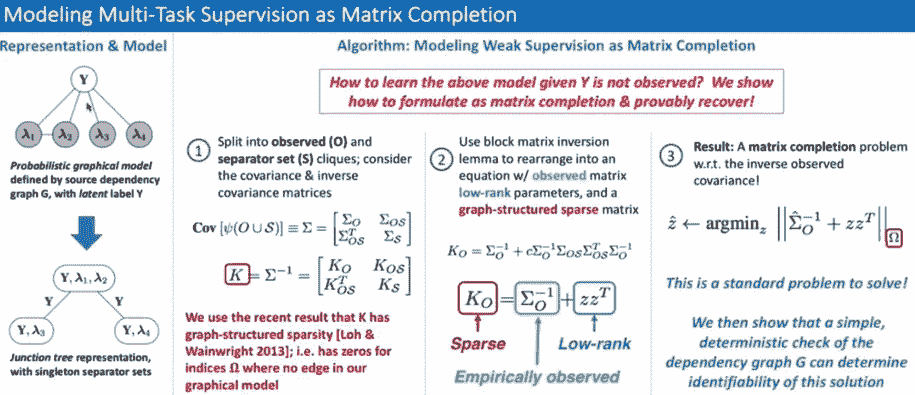**

**浮潜背后的数学。图片来自[海报](https://ajratner.github.io/assets/papers/MTS_AAAI_2019_poster_portrait.pdf)和 [Youtube 视频](https://www.youtube.com/watch?v=RUPbYvzSrg0)。**

**通气管文档提供了优秀的代码示例，帮助您开始使用通气管[ [链接](https://www.snorkel.org/use-cases/) ]构建 LFs 和 LM。**

## **启发式 LF 选择**

**在我们的实验中，通气管易于使用，但根据通气管标签训练的末端模型(EM)的准确性可能会因 LFs 的质量而有很大差异。因此，我们实现了一个启发式的 LF 选择过程，它只使用 LF Zoo 中的一个 LF 子集，在一个小的手工标记的验证集上具有最好的准确性。**

**启发式 LF 选择的迭代性质是特别可取的，因为它允许我们从很少数量的 LF 开始工作，并随着时间的推移添加或改进它们。通过分析哪些逻辑框架在每次迭代中表现不佳，我们可以确定逻辑框架中的差距，为下一轮逻辑框架的创建或更新提供信息。该分析还可能暴露我们对问题领域理解的差距！**

**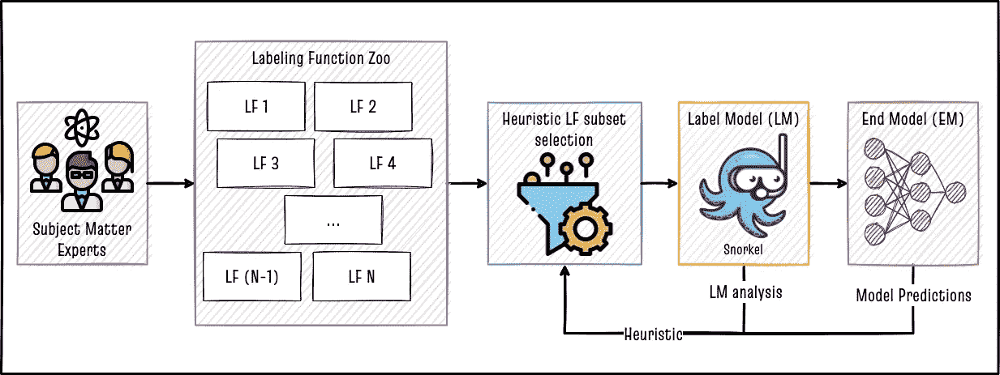**

**我们在爱德曼实施的启发式 LF 选择。作者使用的图片来自 Nikita Golubev—[flat icon](https://www.flaticon.com/free-icons/scientist)创建的科学家图标和 Freepik — [Flaticon](https://www.flaticon.com/free-icons/filter) 创建的过滤器图标。**

# **🏗️结论和未来工作**

**在这篇文章中，我介绍了弱监督的概念，以及我们如何使用它将主题专家的领域知识编码到机器学习模型中。我还讨论了最终模型的余弦和标签模型的通气管。在两步弱监督方法中结合这两个框架可以实现与完全监督 ML 模型相媲美的准确性，而无需收集大量手动标记的训练数据集！爱德曼 DxI 的严格内部实验证实了这些结果，并且是数据科学团队的核心关注领域。**

**在这篇文章中，我主要关注扳手、余弦和浮潜论文。弱监管领域有几种更有趣的方法，看起来很有前途。Edelman DxI 团队计划在未来关注的一些问题包括:**

1.  **想降低贴标成本？GPT-3 可以帮助[ [纸](http://arxiv.org/abs/2108.13487) ][ [Github](https://github.com/rafaelsandroni/gpt3-data-labeling)**
2.  **x 级:监督极弱的文本分类[ [论文](https://arxiv.org/abs/2010.12794v1) ][ [Github](https://github.com/ZihanWangKi/XClass) ]**
3.  **OptimSeed:无监督误差估计的弱监督文本分类的种子词选择:[ [论文](https://arxiv.org/abs/2104.09765v1) ][ [Github](https://github.com/YipingNUS/OptimSeed) ]**
4.  **ASTRA:弱监督下的自我训练[ [论文](http://arxiv.org/abs/2104.05514) ][ [Github](https://github.com/microsoft/ASTRA) ]**
5.  **SPEAR:带有子集选择的半监督数据编程[ [论文](http://arxiv.org/abs/2008.09887) ][ [Github](https://github.com/decile-team/spear) ]**

**感谢阅读！**

**这个帖子是 2022 年 5 月 19 日 Quantum Black 在新加坡组织的一次 Meetup 的话题。幻灯片的链接在这里:[链接](https://www.slideshare.net/StephenLeo7/weak-supervisionpdf)。视频记录在下面**