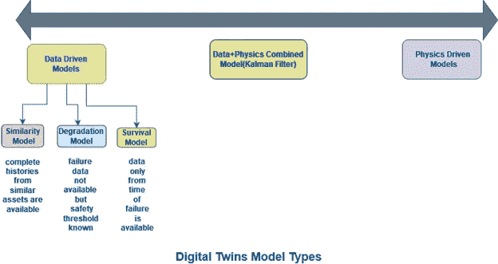
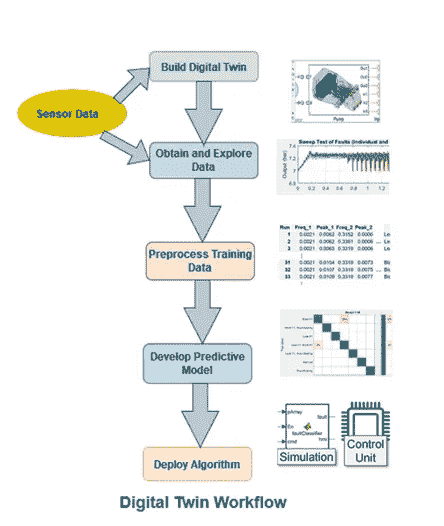

# 难怪数字双胞胎正在改变世界。让我们了解下面是什么？

> 原文：<https://pub.towardsai.net/no-wonder-digital-twin-is-changing-the-world-lets-understand-what-lies-beneath-959a8fda2c04?source=collection_archive---------1----------------------->

## [IoT](https://towardsai.net/p/category/iot)

## **什么是数字孪生？**

> 数字双胞胎是一个对象、产品或系统、服务、流程甚至人的虚拟副本，它与其物理副本连接或配对，并使用实时数据及其更新进行模拟，应用机器学习算法和推理来预测问题，从而帮助决策。这个数字复制品可以是单个物体，也可以是整个系统，甚至是系统的系统。

换句话说，数字双胞胎是使用真实世界数据创建模拟的计算机程序，这些模拟可以预测产品或流程的表现。这些程序与物联网(工业 4.0)、人工智能、机器学习和分析很好地集成在一起，以提高输出。

来源——来自 Pixabay.com 的 Spirit111 图片

## **数字孪生——两个术语一起创造**

> 1.实际*运营中的实物资产*
> 
> 2.以及其最新/最新的虚拟或数字表示

在操作中的资产的虚拟表示方面，数字双胞胎包括关于资产的相关历史数据，捕捉当前数据，并基于此评估资产的状况以预测未来行为，更重要的是，细化控制或优化操作。

这里需要注意的重要一点是

> 数字双 can 模型:
> 
> 一个组件
> 
> 组件系统
> 
> 系统的系统

这些模型反映了运营资产的当前环境、年龄和配置，通常包括将资产数据直接输入调整算法。

## **数字双胞胎证明有用的一些领域**

来源—作者提供的图片

数字双胞胎在各种应用中使用，其中一些是异常检测、资产管理、车队管理等。为不同的应用实现多个数字孪生是可能的，它们可以一起部署到系统拓扑中。数字双胞胎可以在智能资产、边缘或 IT/OT 层上执行，具体取决于应用所需的响应时间。

举例来说，可以根据资产的剩余使用寿命估计(RUL)来优化维护计划，或者优化当前的资产运营，使用模拟来创建未来的“假设”情景，等等。

一旦数字孪生可用并且是最新的，它可以以任何数量的方式用于预测未来行为、改进控制或优化资产的操作。一些例子包括模拟实际资产上不存在的传感器，模拟未来场景以改进当前和未来的操作，或者使用数字孪生通过发送实时输入来提取当前操作状态。

## **前述应用领域内的数码相机使用**

**1。** **运营优化**

作为实时数据副本的相关参数和变量用于触发无数的假设模拟，以评估当前系统的准备情况和必要调整。这种方法优化了系统操作，降低了风险，降低了成本，提高了系统效率。

**2。异常检测**

数字孪生模型与真实资产并行运行，并立即标记操作行为中偏离预期(模拟)行为的异常，以避免灾难性损害。

**1。** **预见性维护**

数字孪生模型用于工业自动化和机械应用中，以确定剩余使用寿命和维修或更换设备的最合适时间。

**2。** **故障隔离**

异常通常会触发一系列模拟来隔离故障并确定根本原因，以便系统可以采取适当的措施，或者恢复到正确的状态，或者由工程师进行修复。

## **使用数字双胞胎的好处**

1.  **资产历史**

数字孪生捕捉真实资产的历史。由于每次数字孪生模型代表实际资产的当前状态，即它保持周期性更新，因此随着时间的推移，在不同时间间隔捕获的过去状态成为资产的历史。这些历史数据和状态用于了解资产在故障和不同条件下的表现以及对系统效率的影响。

**2。维护策略**

使用数字双胞胎监控整个系统的能力在规划操作事件和改进维护策略方面带来了额外的优势。让我们设想一种情况，在这种情况下，整个系统中的一项资产预计很快就会发生故障。使用数字双胞胎，人们可以评估这将如何影响整个系统的效率，以及它的成本？

基于这种分析，人们可以:

1.订购替换件并在次优状态下运行资产，直到获得新零件。

1.  支付高额运费并立即获得部件，以便尽快安排维修。

**3。** **模拟未来情景**

了解资产的历史，digital twins 也有助于未来规划，因为它们可以模拟数百种未来情景，以了解不同因素或不同操作条件如何影响性能。该方法基本上有助于管理资产和优化操作，方法是提前通知维护人员预期的故障，以便可以相应地计划未来的维修和更换。

## 数字孪生模型是如何工作的？

资产的最新表示是通过构建一个模型来创建的，该模型会根据来自资产的传入数据(如从传感器传输的数据和当前操作条件)进行更新。然后，数字孪生模型表示资产的当前状态。

这些传感器测量值和操作条件从实际资产发送到模型。该模型获取这些读数并输出资产的当前状态。

关于建模什么以及随后如何建模的决定取决于系统知识和应用需求。

## 建模方法

来源—作者提供的图片

建模方法分为两种类型:基于物理的方法(例如，机械建模)和数据驱动的方法(例如，深度学习)。

假设通过估计资产的剩余使用寿命(RUL)来优化维护计划是我们的用例。

对资产数据类型的了解将决定使用哪种模型。

## 数据驱动的模型

如果相似机器的完整历史可用，则使用相似模型。

如果只有失败时的数据可用，则使用生存模型。

如果故障数据不可用，但安全阈值已知，退化模型可用于估计 RUL。

现在假设我们的用例是模拟未来的场景，并监控整个系统在这些场景下的行为。那么可以使用基于物理的模型。**物理模型**可以通过连接机械和液压组件(如果存在)来创建，模型被输入来自资产的数据，并且其参数被估计并利用该输入数据来改进，以保持模型是最新的。这有助于注入不同类型的故障，并模拟资产在不同故障条件下的行为。

## 建模方法:数据和物理相结合—卡尔曼滤波器

类似地，第三种类型的模型是卡尔曼滤波器，其也可以用作数字孪生，并且可以将资产的退化建模为状态之一，并且周期性地刷新该状态以表示资产的当前状况。

## 应用中的数字孪生工作流

来源——图片改编自图 1。[的预测性维护工作流程 https://in . mathworks . com/company/newslettes/articles/predictive-maintenance-using-a-digital-twin . html](https://in.mathworks.com/company/newsletters/articles/predictive-maintenance-using-a-digital-twin.html)

这提供了几个优点

1.通过预防故障来减少设备停机时间，因为故障可以提前预测。

2.通过识别故障并了解哪些零件需要维修或更换来进行库存管理。

3.整个系统管理、假设模拟和操作计划，通过监控模拟未来场景的系统并进行比较，以提高系统的整体效率和增强操作计划。

**结论—**

数字双胞胎正在成为一项热门技术，特别是在制造业和工业物联网领域。根据不同的使用情况，可以根据需要定制数字替身。每一个数字双胞胎在一定程度上都是独一无二的代表。创建实际物理资产的数字化副本并测量该模型如何响应和对不同输入做出反应的能力是推动采用和适应数字孪生技术的根本性突破。

感谢阅读！！！

**参考文献—**

1.[https://in . mathworks . com/company/newslettes/articles/predictive-maintenance-using-a-digital-twin . html](https://in.mathworks.com/company/newsletters/articles/predictive-maintenance-using-a-digital-twin.html)

2.[https://www.ibm.com/topics/what-is-a-digital-twin](https://www.ibm.com/topics/what-is-a-digital-twin)

你可以在媒体上跟踪我

LinkedIn: [Supriya Ghosh](https://www.linkedin.com/in/supriya-ghosh)

还有推特: [@isupriyaghosh](https://twitter.com/isupriyaghosh)