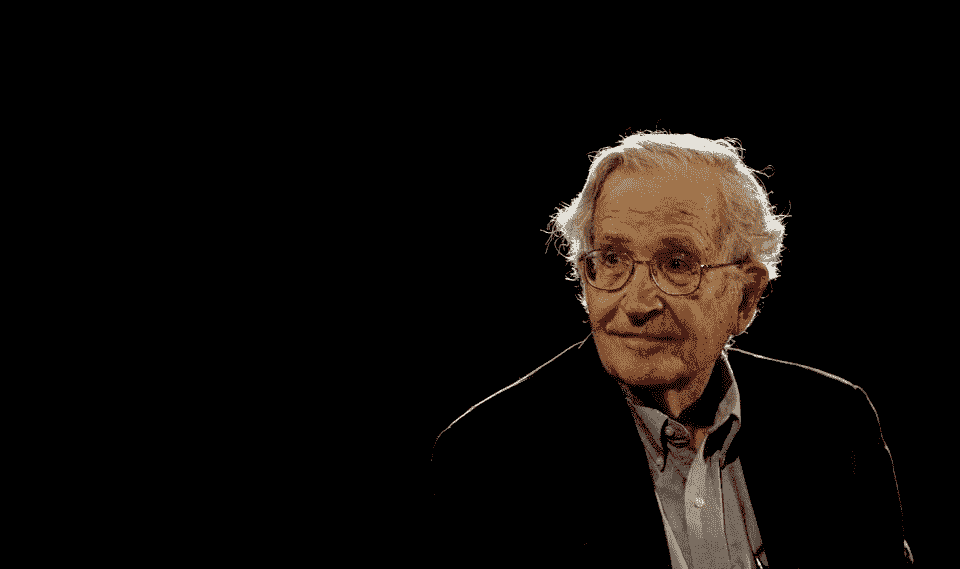

# 诺姆·乔姆斯基已经在考虑人工智能了，你站在哪一边？

> 原文：<https://pub.towardsai.net/noam-chomsky-has-weighed-in-on-a-i-where-do-you-stand-f478d1b0e0ea?source=collection_archive---------0----------------------->

## 人工智能上的诺姆·乔姆斯基| [走向人工智能](https://pub.towardsai.net)

斯特林格墨西哥/路透社

有一个核心的人工智能问题。我们能创造认知吗？有没有一条路可以让我们的机器拥有真正的理解？我们最大的人工智能努力仍然是存储曼尼金斯。他们创造了一个栩栩如生的幻觉，但在茫然的凝视背后没有生命。我们有看起来像思想的技术，但实际上不是。我们走在正确的道路上吗？如果没有，路径是什么？

去年 5 月，诺姆·乔姆斯基在麻省理工学院的一次研讨会上谈到了这个问题。这是对人工智能当前方向的高度批评。这是《T2》《大西洋月刊》的一篇很棒的文章。公平地说，这是谷歌研究总监彼得·诺威格的[反驳。](http://norvig.com/chomsky.html)

人工智能和认知之路有两个基本的思想流派。

**统计大数据** —这种方法利用一些密集的数学来筛选大量数据，以识别复杂的模式。它可以看着一张图片说，它更有可能是一只猫，而不是一条金鱼。结合云基础设施和大量电脑，你可以使用 Siri，脸书可以在那张海滩照片中认出你的朋友。[这是如何工作的简单总结](http://danlovy.com/ai-essays/ai-made-really-really-simple/)。

**基于生物的** —这种方法认为，所有基于地球的智能，从蠕虫到人类，都具有某些可以理解和机器实现的组织和结构特征。这只能通过观察地球大脑是如何连接的来理解。这种理解将导致认知的机械再造。让我们用生物学和神经科学来破解这个密码。

相反的论点看起来像这样。

# 统计大数据

我们的人工智能受到启发，工作起来很像大自然。它是一组平行排列在网络中的节点(神经元),每个节点处理更大整体的小方面。

没错，它还不是认知的模型，但这还为时过早。给技术成长和成熟的时间。它为认知的突现行为提供了最佳路径。我们正在做十年前似乎不可能的事情。观察下一个十年将会发生什么。

# 基于生物的

无论如何，当前的商业神经网络技术没有对认知进行建模。它没有、不能也不会。虽然受到自然神经网络的启发，但它们的工作方式与自然界中的大脑(包括我们的大脑)完全不同。通往认知的道路在于构建这些网络，使其更像真正的大脑一样工作。有一个无法跨越的鸿沟。

我们被数学欺骗愚弄了，正在识别小猫照片的谷歌服务器不知道小猫是什么，而且永远也不会知道。大自然为认知提供了优秀的、功能齐全的模型。让我们回归自然，做更多的科学研究，找出答案。

***你站在哪一边？***