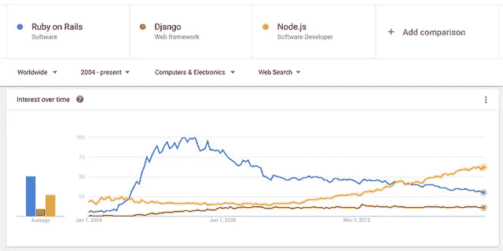
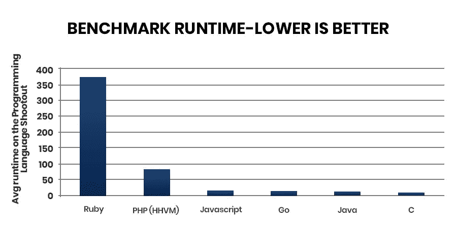
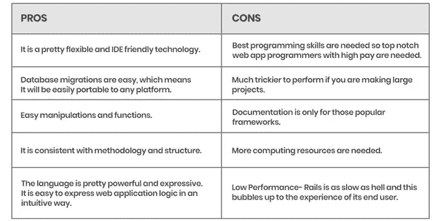
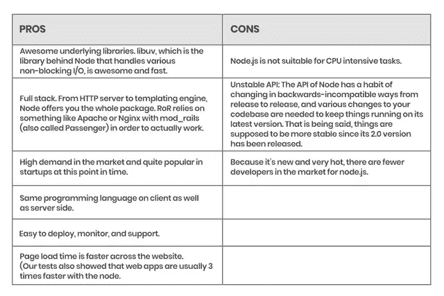

# 节点。JS vs . RoR:2021 年哪个框架最好？

> 原文：<https://pub.towardsai.net/node-js-vs-ror-which-web-development-framework-is-most-preferred-29cd31875bb1?source=collection_archive---------0----------------------->

## 节点。JS vs. RoR:为 2021 年的创业选择正确的框架

对于企业来说，选择合适的技术组合是一项艰巨的任务。就此而言，大多数企业选择从专家那里获得技术咨询建议。选择合适的技术对你的企业来说非常重要，因为它可以决定你的在线投资成败。

为了帮助你，我们决定比较两种流行的语言:Nodejs 和 Ruby on Rails。在博客的最后，你可能会发现 Ruby 和 Node.js 哪种技术最适合你的业务。所以，让我们开始吧:

# 理解框架的基线

## 节点。JS:概述

Node.js 是用 C/C++、javascript 编写的，是当今著名的 JavaScript 技术之一。开发人员要求这项技术每天都在获得动力。它的包生态系统 NPM(节点包管理器)包含了包中过多的开源库。

Node.js 是由 Ryan Dahl 于 2009 年为 macOS 和 Linux 推出的，它有许多可以通过命令行使用的内置模块。Node.js 可用于处理异步 js 代码，以便执行各种活动。有很多 [**web 开发公司**](https://www.xicom.biz/offerings/web-development/) 在做企业级 Node.js 项目。

## Ruby on Rails:概述

作为一个开源编程平台，Ruby 是一种面向对象的语言。这种编程语言主要是在 Linux 上创建的，可以完美地跨所有主要平台工作，如 Windows、UNIX、Mac OS 和 DOS 等。

Ruby 于 1995 年首次发布，由松本幸宏创作。作为一个开源平台，人们可以根据自己的需要和用途自由编辑、修改。它类似于 Perl 和 Small talk，因为它是面向对象的，比如 Small talk，并且按照 Perl 很方便，这使得它的代码易于维护。

## 注意谷歌趋势！

> 根据谷歌趋势的[报告，在过去的四年里，Node。JS 刚刚把 Ruby on Rails 打成了趋势编程语言，node 还在市场上继续扩张。](https://trends.google.com/trends/?geo=TR)

***现在，我们来比较一下这些编程语言的运行时。***

从图中可以看出，Ruby on Rails 的运行时间最慢。另一个因素是编程语言提供的工作数量。市场上开发者的职位越多，对编程语言的要求就越高。

# ROR 和 Node 的详细比较。射流研究…

以下是解释 Node 和 Ruby 之间差异的要点列表:

> 与 Ruby 相比，Node.js 提供了更快的服务器端开发解决方案，这是由于它基于事件的编程模式以及单个 CPU 的非阻塞 I/O 使用。
> 
> 与 Ruby 编程语言相比，Node.js 的学习曲线更短，对于来自不同编程语言背景的开发人员来说，学习起来相当容易。相比之下，Ruby 有更多的社区和在线学习资源。
> 
> Ruby 需要明确的文件或文件夹结构，而 Node 非常灵活，我们可以将整个源代码放在单个文件或多个目录或文件中。
> 
> Node 对文件名没有规定，我们可以根据需要命名文件或文件夹，而 Ruby 对文件名有严格的规定，如果有人更改文件名，应用程序很快就会崩溃。
> 
> Ruby on rails 在其操作中支持多线程选项，它更适合 CPU 密集型 web 应用程序。相比之下，Node 是单线程编程语言，最适合海量 I/O web 应用，不适合任何 CPU 密集型 web 应用。
> 
> 在 Ruby on rails 中，没有回调，这意味着所有的指令都以顺序的方式小心地执行，另一方面，Node 有回调，它以异步的方式工作。
> 
> 在 Ruby on rails 中，代码维护非常容易，因为它有规则，同时可以在开发人员之间轻松转移，另一方面，Node.js 代码维护非常棘手或困难，因为当你 [**雇佣软件开发人员**](https://www.xicom.biz/offerings/hire-software-developers/) 时，它没有任何规则。
> 
> 节点是相当不一致的，因为 API 会频繁地改变，并随着时间的推移而改进。另一方面，Ruby 的功能相当一致，因为它的变化很少。
> 
> 一个节点可以作为后端和前端开发的编程技术，另一方面 Ruby 只用于后端 web app 开发。
> 
> 节点包生态系统节点包管理器(NPM)有大量的库，另一方面，Ruby 没有 Node 那么多。

# Ruby on Rails 与 Node Js 在不同参数上的比较:

**1。框架类型**

Ruby 是一个自以为是的编程框架，期望以特定的方式做大量的事情，这在调试任何 web 应用程序时都是一个缺点

另一方面，Node 是一个非自以为是的编程框架，因为它提供了更多的控制，但在开发时没有需要遵循的标准规则。在软件开发团队中工作，任何人都需要有编码时需要遵循的特定规则和准则，而哪个节点没有。

**2。开发时间**

Ruby 可以创建一个完整的 CRUD web 应用程序，具有良好的数据库连接，通过命令行使用几个命令就可以进行迁移。

另一方面，Node 将需要一些时间，因为 web 应用程序开发人员需要找到模块，编写代码，这将需要与各种其他 web 模块集成。此外，Node 在选择不同组件方面提供了出色的灵活性。此外，整合这些组件需要更多时间。

**3。性能**

Ruby on rails 在性能方面非常慢，这是这种编程技术的瓶颈。有时调试 Ruby on rails web 应用程序是一项耗时的任务，由于其抽象的本质，这是一个困难的过程。

在大多数情况下，Node 比 Ruby on rails 快得多，这是因为它基于 JS 的引擎，尽管它有各种各样的问题。

**4。学习曲线**

Ruby 非常容易学习，因为它有大量的教程&在线学习课程。它有一个最活跃的网络应用开发者社区，通过这个社区，任何人如果在学习时被困在任何地方，都可以轻松地学习。

与 Ruby on Rails 相比，node 的学习曲线更短，但是来自 C 或 C++等不同编程背景的 web 应用程序开发人员也可以轻松学习。前端 [**web 应用程序开发人员**](https://www.xicom.biz/offerings/hire-web-developers/) 很容易学会这项技术，因为它是用 JavaScript 编写的。

**5。CPU 密集型任务**

Ruby on rails 非常适合各种 CPU 密集型任务，比如数据处理、图像处理和快速 web 应用程序开发。

Node 在处理各种 CPU 密集型任务时会导致 web 应用挂起，因为它在整个过程中使用单线程。除此之外，它将花费很长时间，并阻止各种其他任务运行程序。

**6。可扩展性**

Ruby on rails 技术不像 Node 技术那样具有可扩展性，因此大多数公司由于可扩展性问题从 Ruby 迁移到 Node，如 LinkedIn、纽约时报、PayPal、优步等。

与 Ruby on rails 相比，Node 具有更好的可伸缩性，因为它拥有带抽象的集群，可以用最少的中央处理单元生成基于 web 应用程序工作负载的进程。

**7。人才发现**

因此，很少有人知道 Ruby on rails，因为他们同时了解 Ruby on rails 和框架。他们有很大的需求和要求给高薪，因为这些是很难得到的。

Node 有更多精通这项技术的人。我们可以从一个人那里获得后端和前端开发人员，而不需要支付像 Ruby on rails 那样高的费用。

# 你应该知道的 Ruby on Rails 的优点和缺点

> RoR 的好处

首先，我们将看到 Ruby on Rails 的优点，然后是它的缺点。如前所述，RoR 有一个非常强大的 MVC 架构。大多数基于 RoR 的应用程序在基本文件夹和文件方面看起来非常相似。它有一个非常坚实的基础，然后您可以使用 gems、自定义库和包来创建它。除此之外，RoR 有一个伟大的观点，这意味着它让你与它的做事方式保持一致。

RoR 假设编码者会以某种方式书写一个符号，有些人可能会说这有点受限。但它使更干净的编程代码变得更容易，也使产生问题和错误变得相当复杂。从这个意义上来说，你不能创造你真正想要的东西并不是一种限制，但在这种情况下，你会去做。如果你用正确的方法去做，这可能是最简单的方法之一。

Roy 还有一个非常好的数据库迁移功能。除此之外，它允许 web 开发人员在数据库中修改和创建各种表以及列，而不必手动输入、更改或添加内容。除此之外，它还提供了一个小故事或路线，您可以通过它来了解数据库的结构到底发生了什么。

现在到节点，有各种各样的迁移包或模块，就像 DB-migrate，它们可能工作得很好，但不如 RoR chord 迁移系统那样深入和易于使用。当谈到各种原型和快速 web 开发时，没有各种各样的技术可以超越障碍。因此，通过一些基本的配置和两个搭建订单，您就有了一个功能齐全的基于 CRUD 的 web 应用程序。

除此之外，数据库迁移也以此速度增加。如果您使用各种第三方模块和其他工具，Node 和 Express 非常适合快速应用程序开发过程。但是这些酒吧都有现成的东西。

RoR 技术有各种利弊，但在大多数情况下，它完全值得尊敬，使用起来非常干净。RoR 是一种多范式技术，它可以制作函数式程序代码，但就大部分而言，它是一种面向对象的编程语言。除此之外，任何事物都很容易被看作一个物体。RoR 是 RoR 的包管理器，被广泛用于扩展这个框架的基本功能。NPM 类似于 Node。所有 Rails web 应用程序都有一个 gem 文件，您可以在其中轻松定义自己的 gem。在这之后，您可以轻松地执行 assembly 命令来安装它们，这类似于用节点安装 NPM。

RoR 的另一个好处是，它已经存在了很长时间，有一个相当聪明和受人尊敬的社区。当你雇佣 Ruby on rails 开发人员时，你会得到非常聪明并且对框架充满热情的开发人员。在主框架中有过多的资源，包括博客帖子、论坛和文档，以帮助您解决问题。这些都是 Ruby on Rails 的其他好处。

> RoR 的陷阱

让我们来谈谈这项技术的一些缺陷。人们听到的对 RoR 最大的抱怨之一是它的速度相对较慢。RoR 是一个奇妙的框架，其核心有许多特性。除了一些较轻的框架之外，它还有一个 gem 依赖因子和各种类似的应用程序文件。自动化程度如此之高，以至于开发人员不太了解 rails 框架是如何工作的。你可能也知道 Ruby 语言、语法或者你的 web 应用程序结构，但是对于真正了解 RoR 如何工作的人来说，这是非常好的，因为它有快速的 web 开发过程。

另一方面，一些 web 应用程序开发人员确实需要付出额外的努力才能真正理解一些东西。与小型 web 应用程序相比，大型项目的 RoR 更加困难。除此之外，您可能会遇到一些测量问题。

另一个缺点是，酒吧不如节点受欢迎。目前，Node 处于定制 web 应用程序开发的前沿，RoR 的兴奋已经消退。在我看来，如果你是找工作的话，我会告诉你学习节点，也许 Express.js 更保险一点。更多的 [**软件开发公司**](https://www.xicom.biz/) 使用 JS 的开发者比其他任何语言都多。如果这是 5 年前，你会是三个主要的编程语言之一。

但是现在这年头不怎么流行了。因此，我之前简单提到过，主要的 RoR 框架有非常好的例子和文档，可以让您学习简单的命令并轻松地迁移数据库。这一切都很好。虽然，当你试图学习一门更高级的编程语言，并试图找出具体的宝石时，有时似乎你是在大海捞针。

一些相当大的公司已经在其主要平台上使用或正在使用 RoR。我认为它不会比 Twitter 更伟大。除此之外，由于一些领域问题，他们已经将大部分后端服务转移到 Java 和 Scala。但他们已经使用 RoR 很长时间了，我很确定他们仍然在这个平台的其他方面使用它，比如他们与 Shopify 的合作。除此之外，Basecamp 是一个项目管理解决方案，说 Rails 是这个项目的心脏和灵魂。运行 GitHub 的这个程序是在 RoR 创建的。Soundcloud 和流行的流媒体服务 Hulu 都是在 RoR 创建的。从一开始，Groupon、SlideShare、LivingSocial 和 Urban Dictionary 就在他们的开发项目中使用了 RoR。

RoR 的利与弊

# 节点的优点和缺点。Js 你应该知道

> 节点的好处。射流研究…

既然我们已经看到了 RoR，让我们开始看看节点的利弊。对于这件事，我们先从赞成者说起。Node 的一大好处是它比你更受欢迎。基本上，它是最新的 web app 开发技术之一，在这个市场上有很高的需求。这种 web 开发技术在创业公司中相当流行。除此之外，围绕 Express 和 Node JS 框架还有一个蓬勃发展的开源社区。NPM 有太多发展良好的单元，当谈到性能和速度时，这项技术严重落后。事实上，把几乎所有的东西都拿出来。它运行在谷歌的快速 JavaScript 引擎上。除此之外，该节点还广泛用于创建实时 web 应用程序，这些应用程序几乎与桌面应用程序相似。

除此之外，Node.js 也是异步的。这意味着当程序向服务器发送请求时，不需要响应。此外，它还可以继续实施。此外，节点运行在一个线程中，而不是其他发送请求的编程语言中。他们等待这个需要完成的请求，然后他们发送下面的请求，以此类推。所以 Node 是非常可扩展的，在一个主题上，在其中起着非常关键的作用。除此之外，Node 还能与 MongoDB 等 NoSQL 数据库很好地协作，这些数据库比 MySQL 等传统关系数据库更具可伸缩性。几乎所有重要的公司所有的 [**软件开发公司**](https://www.xicom.biz/) 世界各地都已经将他们的编程改为 Node.js，并且已经报告至少在生产率方面有了相当大的提高。

Node.js 的另一个很棒的特性是它使用了 JavaScript，JavaScript 被大量的 web 栈广泛使用。大多数时候，前端的语言和后台是不一样的，但是在使用 Node **，**的时候就不是这样了，我们在后台和前端使用 JavaScript。主导这个行业的客户端框架有各种各样:Angular、React、Vue.js，除此之外，它还是 Node.js 技术的一大补充。显然，JavaScript 与各种非常流行的 JSON APIs 配合得相当好。

Node.js，Express，或者 Happy.js，这些 web app 开发框架都没有真正灵活的文件结构。此外，它允许 web 应用程序开发人员随心所欲地创建自己的 web 应用程序。他们可以在他们的 javascript 应用程序中插入任何东西。如果你想在 MVC 中得到一个更传统的架构，我认为 Node 有好有坏。但在大多数情况下，如果你非常清楚自己在做什么，并且是一名优秀的程序员，那么灵活性是一件好事。

就像 Ruby Gems 一样，Node 也有自己的包管理器，称为 npm 或 Node package manager。npm 和 Ruby gems 之间最大的区别是管理依赖关系的方式。使用 Ruby，依赖项是全局安装的。所以一定要用组装工具，一定要自己管理。npm 真的照顾到他们单位的一切。它位于节点模块文件夹中。那么这些单元也可以有它们自己的节点单元文件夹和它们自己的依赖项。国家预防机制似乎有更好的文档，至少在我的经验中是这样。

> Node 的陷阱。射流研究…

因此，我们已经看到了 Node.js 的积极方面和优势。现在让我们看看一些缺陷。对于许多 CRUD 风格的 web 应用程序来说，它和 Node 一样好，但对于需要大量 CPU 的应用程序来说，它是相当愚蠢的。除此之外，这样做的原因是，每次你做一些需要时间的事情，比如运行一个 CPU，它会将所有传入的请求排队，因为它运行在一个单独的线程上。像 Apache 这样有更多可用线程的软件会在它们之间分配 CPU 时间。除此之外，只有 I / O 操作是并行的，因为它们是异步执行的。CPU 密集型任务的一个例子是 3D 演示、视频编码、科学建模等。

关于这个结的另一个抱怨是，它可能有点不一致。有些人认为 API 经常变化。除此之外，有时，它与以前的版本不兼容。不仅如此，整个 Express app 架构是免费的，非常灵活。有时候你可以给开发者足够的绳子上吊。

关卡非常严格，这使得编写错误的代码变得困难。除此之外，由于节点不同步，它将处理许多回调函数，并可能经常出现和进入所谓的地狱回调。除此之外，还有一些解决方案，比如异步实用程序和承诺的使用。你可以做一些事情来避免这种情况。这个我个人并不觉得困扰，但是我知道有些不习惯异步编程的开发人员有一个问题就是回调太多。

如您所见，这两个选项各有利弊，但都是很棒的技术。除此之外，任何事情都应该根据具体情况进行评估，而不是在所有情况下都说这个比另一个好。

Node.js 的利与弊

# 结论:

RoR 仍然是一个流行的框架和喜爱。它受到了许多 web 应用程序开发公司的喜爱。但是，节点技术的这两个最大优势。首先，它是基于 JS 的技术，第二个优势是它有一个事件驱动的架构，这使得它适合于移动应用程序、聊天应用程序或任何其他使用其余服务作为后端的移动应用程序。如果您有任何疑问，并发现选择节点或 RoR 有困难，您可以从网站开发公司获得帮助，或者您也可以 [**为您的项目聘请网站开发公司**](https://www.xicom.biz/offerings/web-development/) 。