# 非线性模型

> 原文：<https://pub.towardsai.net/non-linear-models-53e6ea42e207?source=collection_archive---------1----------------------->

## 当公式看起来不错，但不利于分析时

这不是我第一个关于非线性模型的博客。事实上，如果你仔细阅读我的博客列表，你会发现我申请了其中的几个。就我个人而言，我喜欢非线性模型，因为它们有生物学基础，如果你的数据与该基础无关，那么进一步发展就会变得相当困难。和往常一样，[第一步是最难的](https://towardsdatascience.com/in-modelling-the-first-steps-are-the-hardest-a4250b80a0f2)，没有什么比非线性模型更适合这个前提了。

我不会深入谈论非线性模型，但我会向你们简要展示我与另一位研究人员交给我的数据集的斗争。这是营养商业数据，所以我不能分享数据本身，但你可以看到我做了什么。此外，给我的公式超出了我的理解范围，但是我要展示的是，如果一个看起来完美的公式与数据拟合得太完美，它可能很难使用。

让我们从加载库和数据开始。这是来自小猪的数据，是跨时间测量的。

```
rm(list = ls())
library(readr)
library(nlstools)
library(nlme)
library(ggplot2)
library(nls2)## new file from Theo
Oral_data_for_Marc <- read_delim("Oral data for Marc.csv", 
                                 ";", escape_double = FALSE, trim_ws = TRUE)
data<-Oral_data_for_Marc
rm(Oral_data_for_Marc)
data<-data[, 1:3]
data<-data[complete.cases(data),]
head(data);str(data)
as.numeric(gsub(",", ".", gsub("\\.", "", data$D9std)))
data$D9std <- gsub(",", "", data$D9std)
data$D9std <- as.numeric(data$D9std)                          
data$D9std<-data$D9std/1000000000
data$Big<-as.factor(data$Big)
```

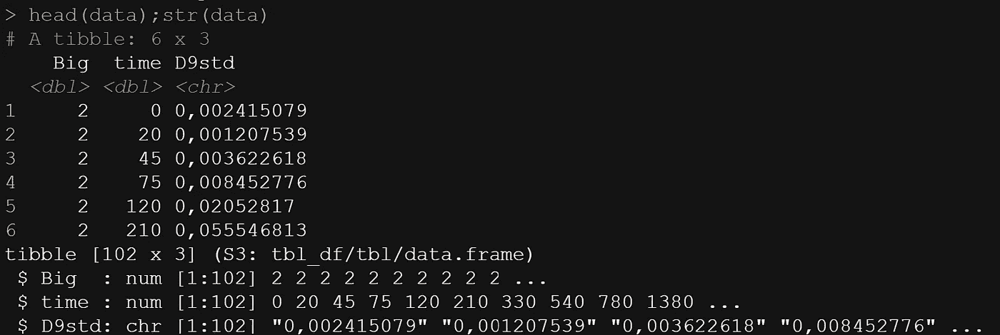

每只小猪(**大**)、时间和结果的数据感兴趣。

现在，数据从一开始就不容易处理，尤其是结果。它是作为一个字符加载的，但是我不能当场生成一个数字，迫使我先做一些转换。

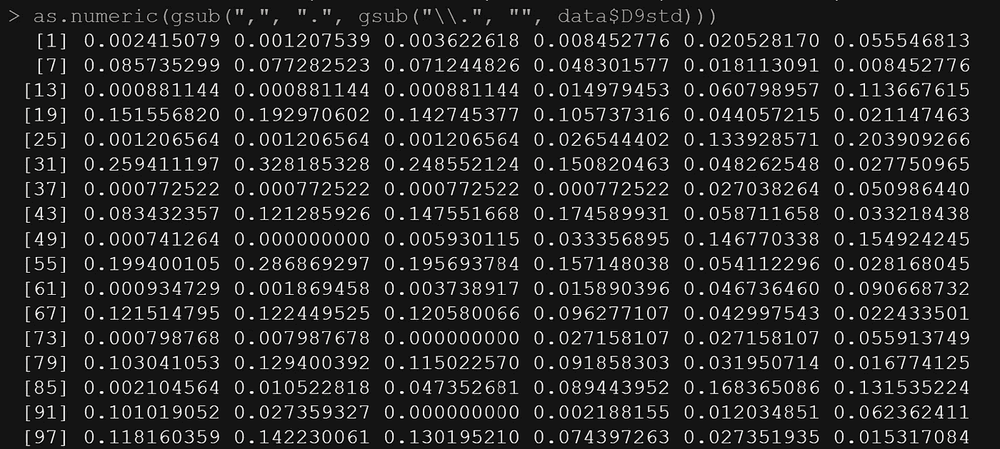

转换数据。

```
ggplot(data, 
       aes(x=time, 
           y=D9std, 
           group=Big, 
           col=Big))+
  geom_point()+
  geom_line()+
  theme_bw()+
  labs(x="Time", 
       y="Value", 
       col="Pig" )
```

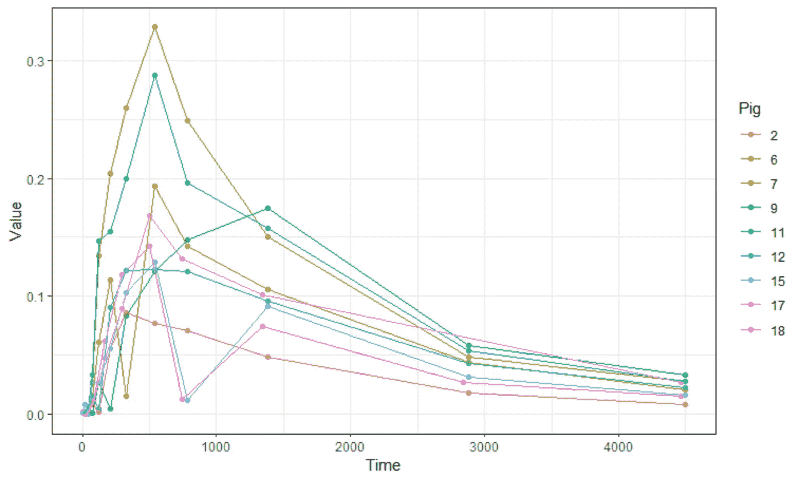

绘制数据。我有九只小猪，显示跨时间(秒)的数据。大多数遵循一个独特的模式，但不是全部，这将给我们的非线性模型带来一些麻烦。

不仅路径会导致问题，而且开始，这就是为什么我从数据中删除了几秒钟。让我们看看数据会是什么样子。

```
datasub<-data[data$time>=30,];head(datasub)
colnames(datasub)[2]<-"x" # time called x
colnames(datasub)[3]<-"y" # D9std called y
datasub$Big<-NULL # not informative vector
datasub<-as.data.frame(datasub)
datasub$y <- gsub(",", "", datasub$y)                          
datasub$y<-as.numeric(datasub$y)
head(data)
head(datasub);str(datasub)
plot(datasub$x, datasub$y)
```

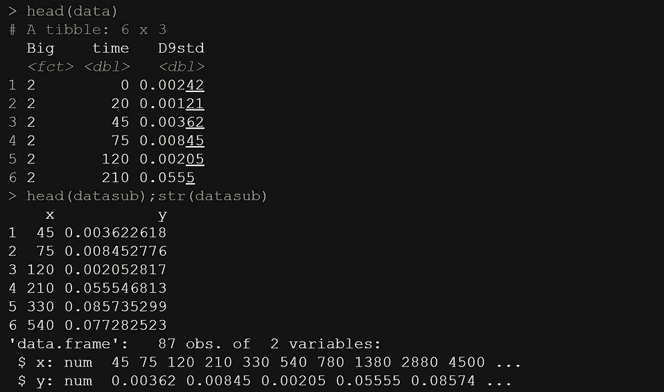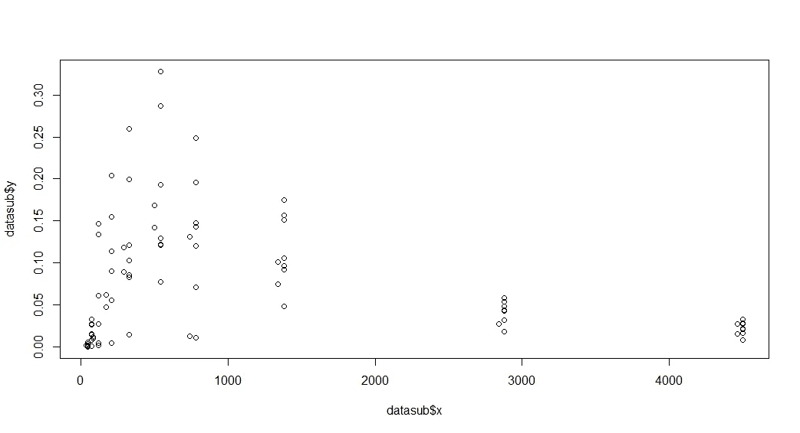

老实说，也好不到哪里去。

现在，是时候看看公式了。正如我所说的，这是交给我的，我不知道怎么会有人想出这么复杂的公式。它真的很大，包括几个隔间。下面你会看到连接公式的方法，以及我如何测试它以确保我在 r 中正确地翻译了它。

```
formulaExp<-as.formula(y~P*(I(1-(exp(-(Ks*x))))^B)*(Ka*((exp(-(Ke*x)))-(exp(-(Ka*x))))/(Ka-Ke)))f1<-function(x, P, Ks,B, Ka, Ke){
  P*(I(1-(exp(-(Ks*x))))^B)*(Ka*((exp(-(Ke*x)))-(exp(-(Ka*x))))/(Ka-Ke))}f1(20, P=2.48, Ks=0.014, B=1.52, Ka=0.00059, Ke=0.00690)
```

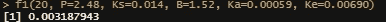

给出了一个合适的值。

非线性回归建模的最大障碍是找到精确的值。因为非线性模型不是封闭的，所以搜索是迭代的。获取峰值的一种方法是绘制数据并叠加曲线的几个层次。

```
plot(datasub$x, datasub$y)
curve(f1(x, P=2.48, Ks=0.014, B=1.52, Ka=0.00059, Ke=0.00690), add=T, col="red") 
curve(f1(x, P=3.5, Ks=0.014, B=1.52, Ka=0.00059, Ke=0.00690), add=T, col="green") 
curve(f1(x, P=3.5, Ks=0.010, B=1.52, Ka=0.00059, Ke=0.00690), add=T, col="yellow") 
curve(f1(x, P=3.5, Ks=0.010, B=1.52, Ka=0.00050, Ke=0.00590), add=T, col="blue") 
curve(f1(x, P=3.5, Ks=0.010, B=1.42, Ka=0.00059, Ke=0.00690), add=T, col="orange") 
curve(f1(x, P=3.0, Ks=0.010, B=1.62, Ka=0.00080, Ke=0.0090), add=T, col="purple")
```

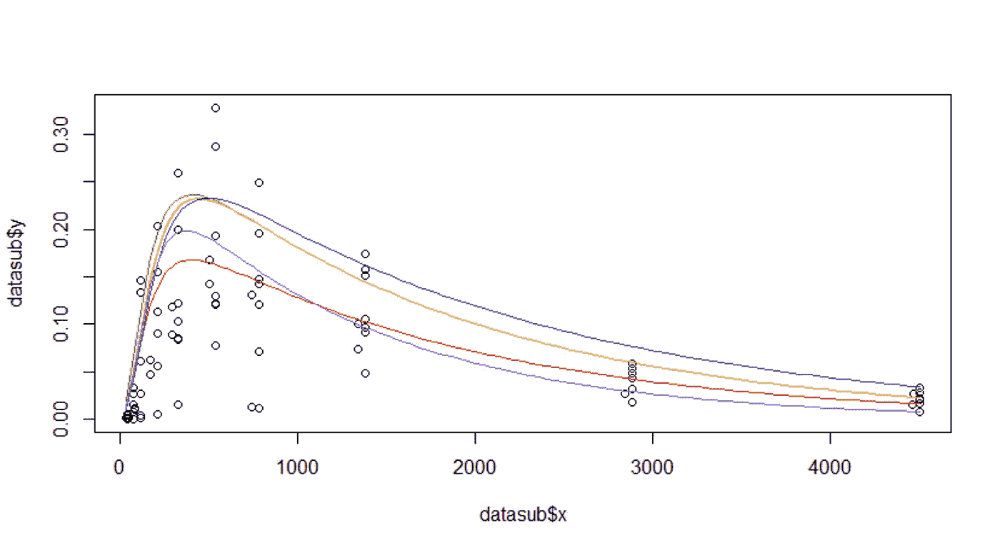

这实际上看起来非常非常好！曲线以辉煌的方式跟随数据。虽然这个公式很复杂，但它却能创造奇迹。

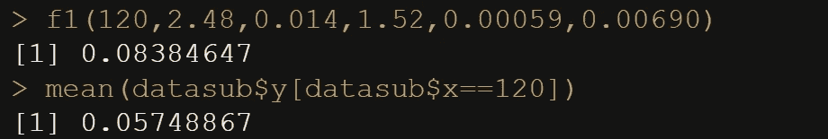

检查每个参数的系数是否接近数据中的平均值的简单方法。这个练习是一个额外的检查，但是考虑到上面拟合的曲线，已经没有必要了。

在 R 中，有一个非常好的包叫做 [NLStools](https://cran.r-project.org/web/packages/nlstools/nlstools.pdf) ，它将帮助你查看数据并提供函数来预览你认为合适的系数。就像我之前说的，这个过程非常困难，与简单的线性回归或混合建模不同，合适的起始值是找到解决方案的关键。如果有的话。


提供了残差平方和，如果不进行比较，这并不意味着太多。然而，考虑到规模，它仍然比你想要的多。

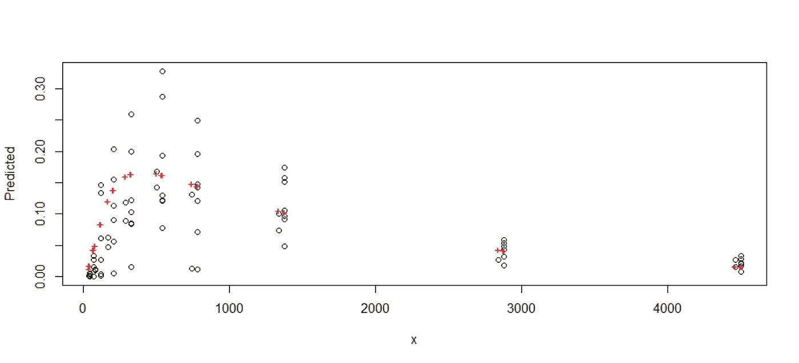

属于预览过程的图片。该模型看起来不错，但高残差平方和是肯定要解释的。

到目前为止，我已经为这个公式提供了一个或几个场景。如果你知道去哪里找，这很好，但你经常不知道，所以最好进行网格搜索。这简单地意味着，你创建一个组合矩阵，然后让模型筛选到那个矩阵。

下面是网格的命令及其外观。

```
grid.theo<-expand.grid(list(P=seq(2, 4, by=0.1), 
                            Ks=seq(0.010, 0.020, by=0.01), 
                            B=seq(1.4, 1.6, by=0.01), 
                            Ka=seq(0.005,0.007,by=0.01),
                            Ke=seq(0.006,0.008, by=0.01))) 
grid.theo
```

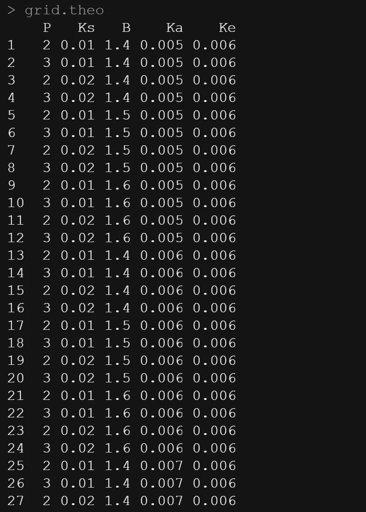

然后，是时候将模型输入网格了。

```
mod1 <- nls2(formulaExp,
             data=datasub,
             start = grid.theo, 
             algorithm = "brute-force")
plot(mod1)
nls2(formulaExp, data=datasub, start = mod1)
```

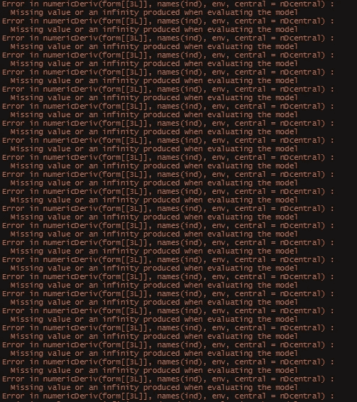

我得到了很多错误。

然而，该模型确实产生了。您可以看到所选模型的公式、系数和残差平方和。它看起来比我从上次预览中获得的值高了很多。

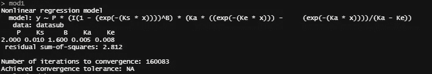

现在，通过将网格搜索直接连接到模型，还有其他使用网格搜索的方法。在这里，你看到我又开始了。

```
f1_nls_fit <- nls.multstart::nls_multstart(y ~ f1(x, P, Ks,B, Ka, Ke),data = datasub,
lower=c(P=2, Ks=0.01, B=1.4, Ka=0.005, Ke=0.006),
upper=c(P=4, Ks=0.02, B=1.6, Ka=0.007, Ke=0.008),
start_lower = c(P=2, Ks=0.01, B=1.4, Ka=0.005, Ke=0.006),
start_upper = c(P=4, Ks=0.02, B=1.6, Ka=0.007, Ke=0.008),
iter = 500,supp_errors = "Y")summary(f1_nls_fit)
plot(f1_nls_fit)plot_nls <- function(nls_object, data) {
  predframe <- tibble(x=seq(from=min(datasub$x), to=max(datasub$x), 
                               length.out = 1024)) %>%
    mutate(ypred = predict(nls_object, newdata = list(x=.$x)))
  ggplot(data, aes(x=x, y=y)) +
    geom_point(size=3, alpha=0.5) +
    geom_line(data = predframe, 
              aes(x=x, y=ypred), 
              col="red", lty=2)+
    theme_bw()}plot_nls(f1_nls_fit, datasub)
```

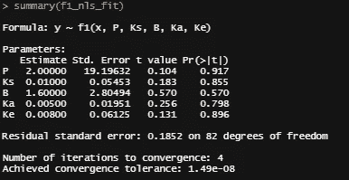

残差标准误差现在低得多，收敛容易获得，我们有体面的系数。但是后来，我开始看标准误差，我开始担心。

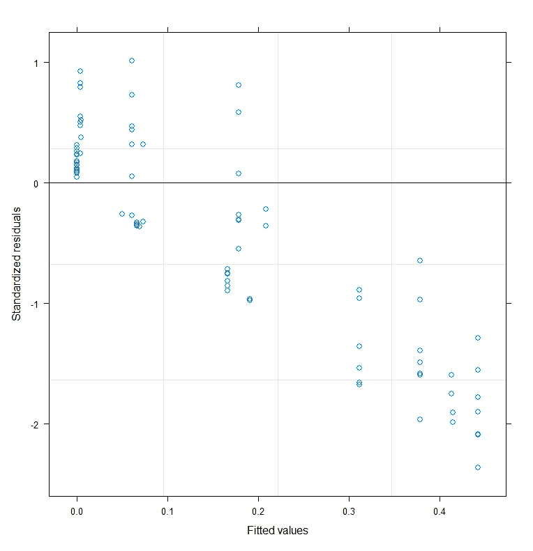

这显然不是你想看到的。


这也好不到哪里去。

让我们再试一次，改变控制措施，从一个单一的列表开始系数。

```
control1<-nls.control(maxiter=100, tol=1e-10, minFactor=1/100000000, warnOnly=T)regr.nls<-nls(formulaExp,start=list(P=2.48, Ks=0.014, B=1.52, Ka=0.00059, Ke=0.00690),control=control1, data=datasub, trace=T)summary(regr.nls)
overview(regr.nls)
plotfit(regr.nls, smooth=T)
```

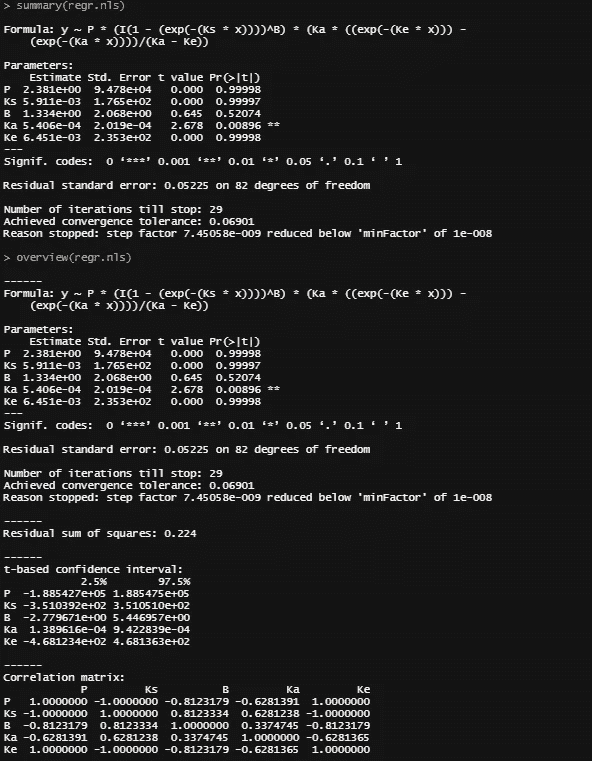

也好不到哪里去。事实上，这个概述揭示了手头的问题。标准误差如此之大，是因为模型中的参数几乎相同。它们完全相关，这使得它们是多余的，并且模型不稳定。这不是你想要的，看起来完美的非线性公式现在变成了一个问题。

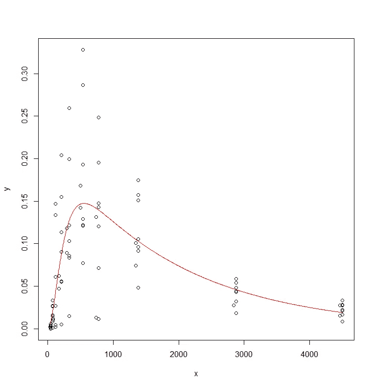

即使平均值看起来很好。

让我们仔细看看残差。

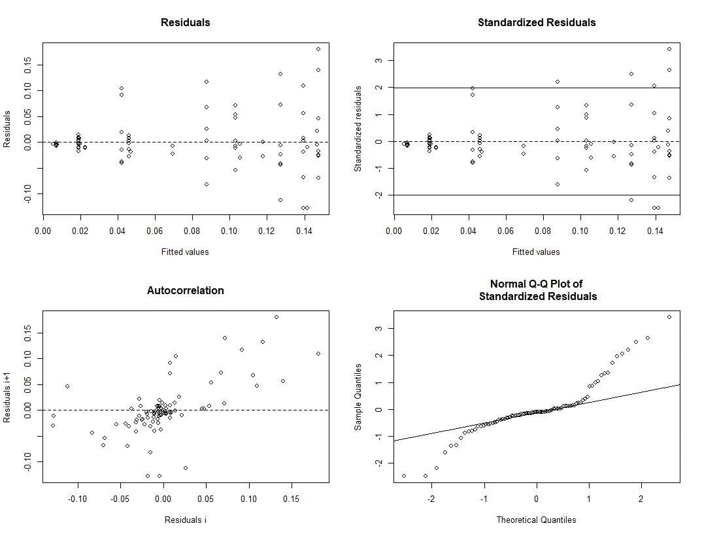

不错，但也不是很好。即使它是好的，我也不会保留这个公式，因为系数之间的完美相关性(多重共线性)确实是你需要尝试和避免的！

显示系数之间相互联系的一个更好的方法是绘制等高线。

```
regr.cont1<-nlsContourRSS(regr.nls) 
plot(regr.cont1)
regr.conf1<-nlsConfRegions(regr.nls,exp=4, length=20) 
plot(regr.conf1, bound=T)
regr.nls.pro<-profile(regr.nls)
plot(regr.nls.pro)
```

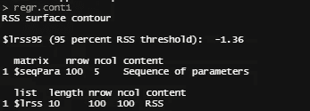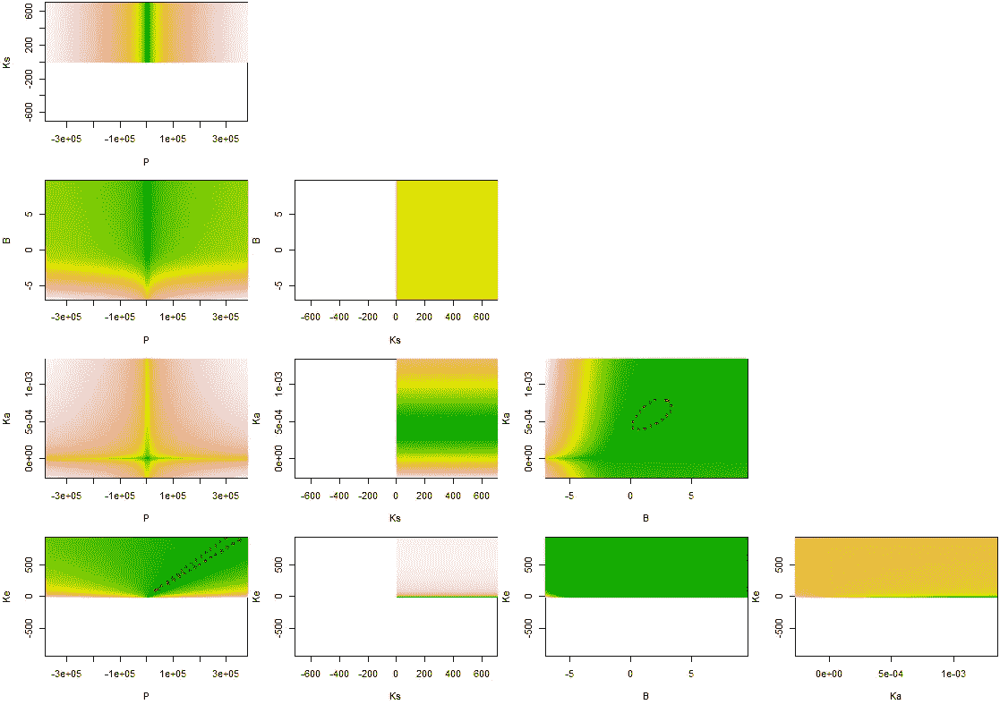

对一些人来说，就像所有有 T2 P T3 的东西一样，这甚至是不可能的。对于那些可能的，我真的不知道是怎么回事。它看起来不体面，摸起来不体面，操作起来也不体面。


这些功能也不喜欢他们所看到的。

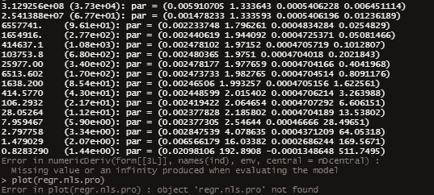

这没用。如果我想看一下数据，我需要做更多的工作。

也许，是时候看看非线性回归的混合建模方面了。我们有多只猪，所以这应该是可能的，你们中那些记得第一幅图的人也记得不是每只猪都有相同的曲线。

我将转向 **nlme 包，**，我以前非常依赖它，并开始将数据分组到一个 **nlme** 喜欢的数据集中。

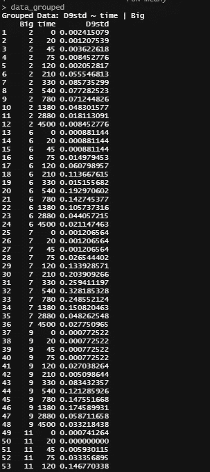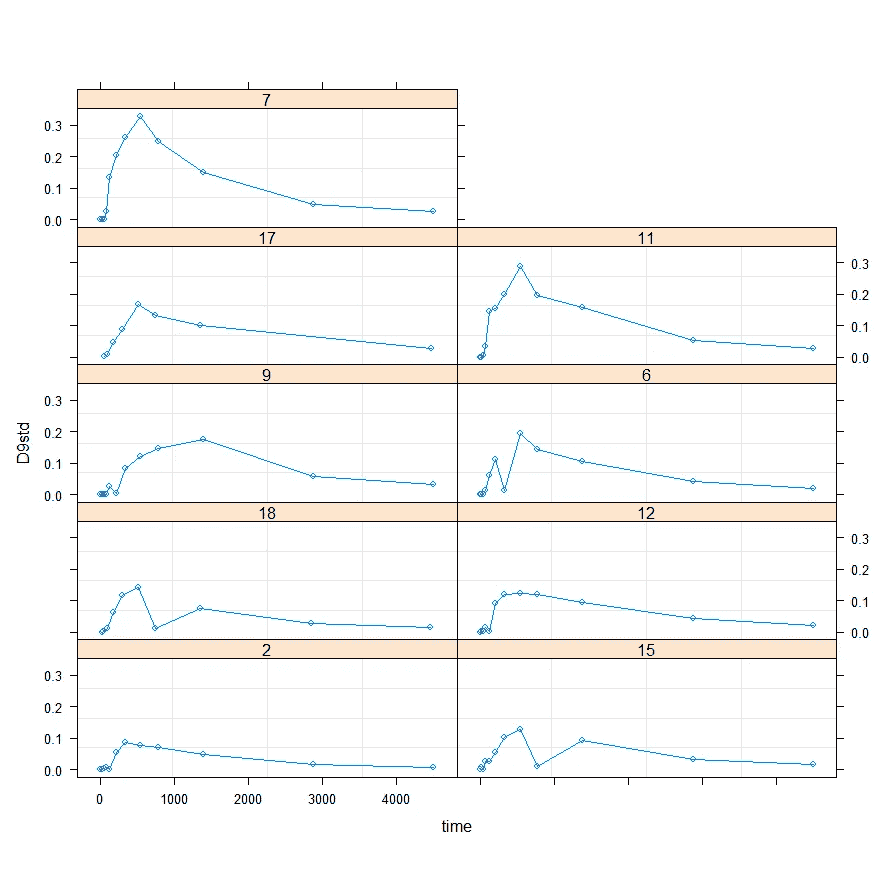

将表中的数据分组并绘制。当然，不是每头猪都有相同的曲线。这就是非线性模型的问题所在，因为它们在盒子里有特殊的自由度。我感觉他们的盒子比数据要求的要小得多。

让我们去吧！

```
f1_nlme_fit <- nlme(D9std ~ f1(time, P, Ks, B, Ka, Ke),
                    data = data_grouped, 
                    fixed = P + Ks + B + Ka + Ke ~ 1, 
                    random = P ~ 1, 
                    groups = ~ Big, 
                    start = c(P=2.48, Ks=0.014, B=1.52, Ka=0.00059,  
                    Ke=0.00690),verbose = F)
```

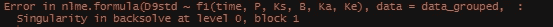

不起作用。

这让我回到了前一段时间的原始概述，向我展示了严重的相关性。这是行不通的，公式太严格了！由于我不知道它是如何组成的，我决定去寻找一个完全不同的模型。一个以生物学解释为代价给我更多自由的世界。

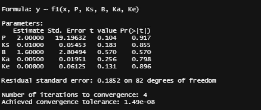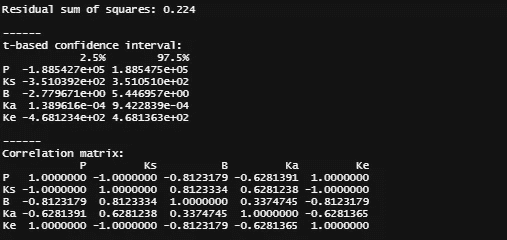

一般加性混合模型-使用时间作为样条曲线，但仍保留分组数据集。但是，如果不指定模型中指定的层次，什么都不会发生。

```
gamm_fit<-mgcv::gamm(D9std~s(time), data=data_grouped)
plot(gamm_fit$gam,pages=1)
summary(gamm_fit$lme) 
summary(gamm_fit$gam) 
anova(gamm_fit$gam) 
par(mfrow = c(2, 2))
mgcv::gam.check(gamm_fit$gam)
```

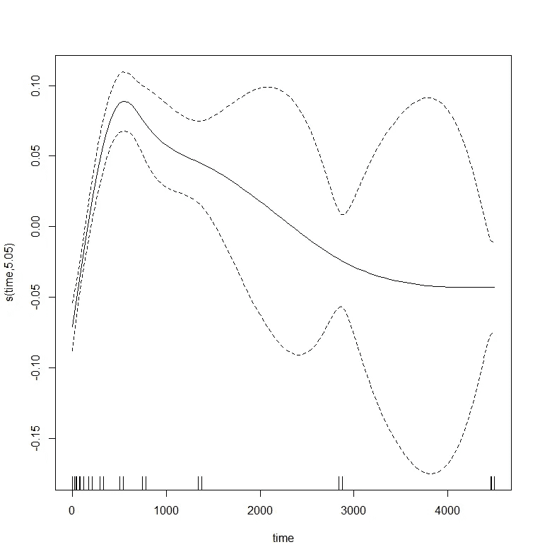

均值曲线看起来不错，但置信带却很吓人。欢迎来到数据中有高方差和一些奇怪曲线的后果。

以及 **lme** (混动车型)部分的 [**gamm**](https://www.rdocumentation.org/packages/mgcv/versions/1.8-40/topics/gamm) 功能。

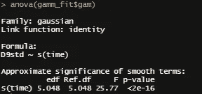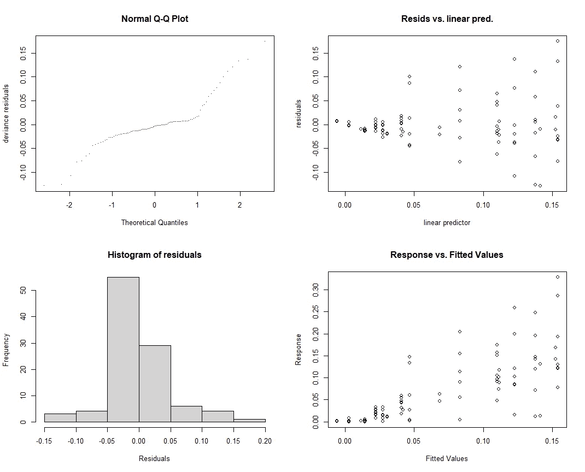

残差清楚地显示了模型是如何失去对数据的控制的。太多的差异，太多的传播没有多大用处。

让我们通过添加一个随机截距来合并模型中的层次结构。

```
gamm_fit2<-mgcv::gamm(D9std~s(time),
                      data=data_grouped,
                      random=list(Big=~1))
plot(gamm_fit2$gam,pages=1)
big <- data_grouped$Big
rm(big)
par(mfrow = c(2, 2))
mgcv::gam.check(gamm_fit2$gam)
```

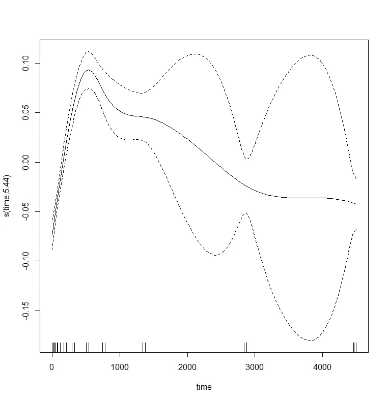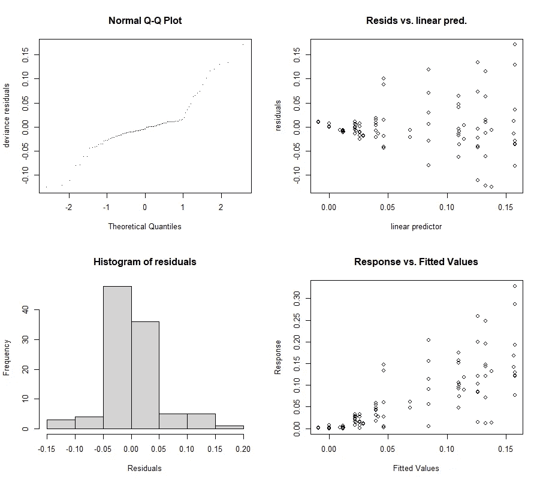

老实说，什么都没有改变。正如所料，差异并不是一开始就有的。

让我们添加一个随机的斜率。

```
gamm_fit2.1<-mgcv::gamm(D9std~s(time),
                      data=data_grouped,
                      random=list(Big=~time))
anova(gamm_fit$lme, gamm_fit2$lme, gamm_fit2.1$lme)
```

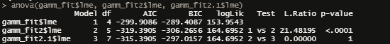

现在，令人惊讶的是，随机斜率并没有好到哪里去。事实上，随机截距确实优于均值模型，但随机斜率则不然。因此，本着想要有一个**简约**模型的想法，我们将选择 AIC /似然比。

最后但同样重要的是，我想检查我做的模型是否有意义。过度拟合总是一个问题，由于我已经失去了非线性函数的生物学相关性，我想至少确保这个数据驱动的模型正在寻找正确的东西。

```
pred<-fitted(gamm_fit2$lme);pred
pred<-fitted(gamm_fit2$gam);preddata_grouped$pred<-pred
ggplot(data_grouped, 
       aes(x=time))+
  geom_point(aes(y=D9std))+
  geom_point(aes(y=pred), col="red")+
  geom_line(aes(y=pred), col="red", lty=2)+
  theme_bw()+
  facet_wrap(~Big)
```

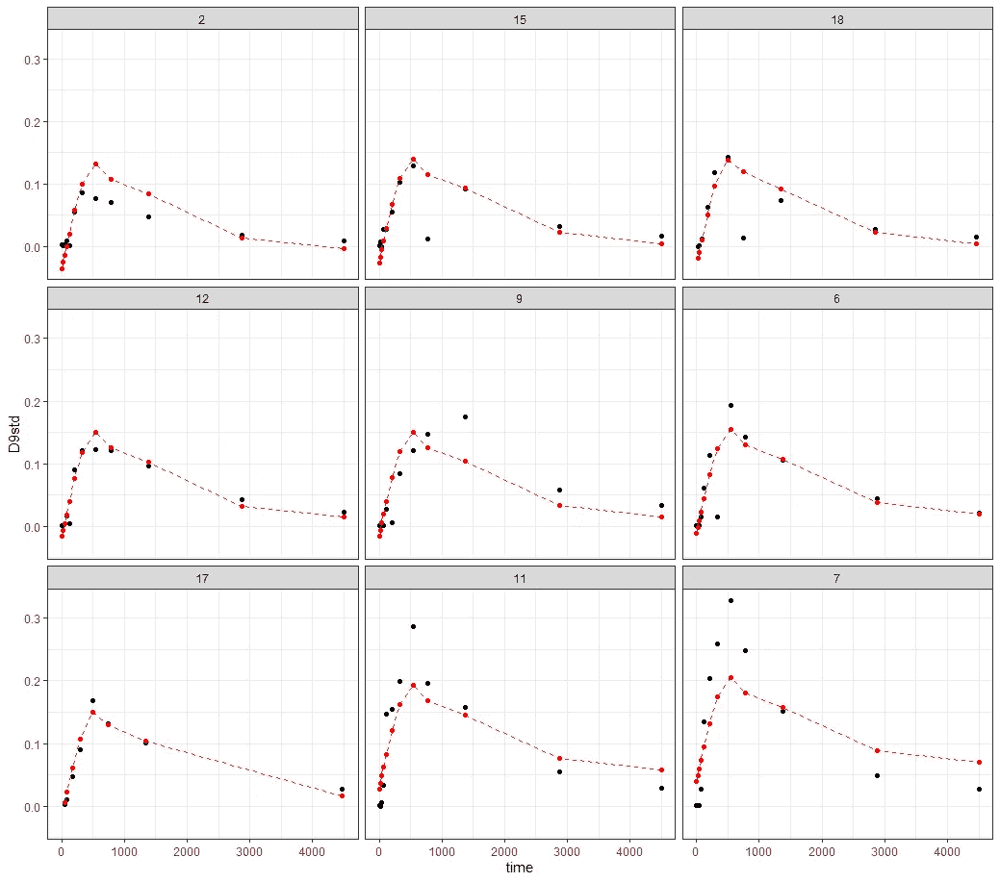

看起来是的！当然，每头猪的曲线都是不同的，在某种程度上，这些曲线确实遵循了数据。然而，对于这样的数据集，这样的方差，只有**时间**是不行的。

最后一次检查是为特定的猪创建完整的时间路径。

```
df<-data.frame(time = seq(0,5000, 1),Big  = "15")
rand_big<-ranef(gamm_fit2$lme, level=2)
df$pred<-rand_big$`(Intercept)`[2] + mgcv::predict.gam(gamm_fit2$gam,df)
ggplot(df, 
       aes(x=time))+
  geom_line(aes(y=pred), col="red", lty=2)+
  geom_point(data=data_grouped[data_grouped$Big=="15", ], 
             aes(x=time, y=D9std), col="black")+
    theme_bw()
```

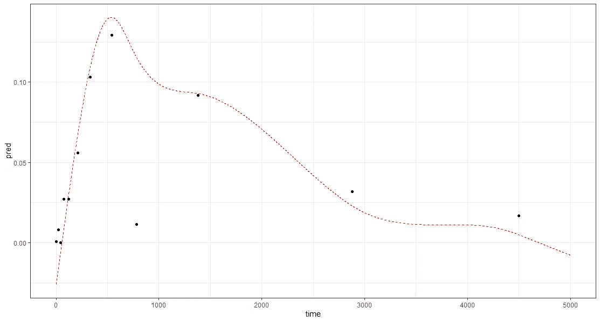

看起来也不错。

所以，我希望你喜欢这个小帖子。别忘了，做模特并不容易。这就是为什么它很有趣！