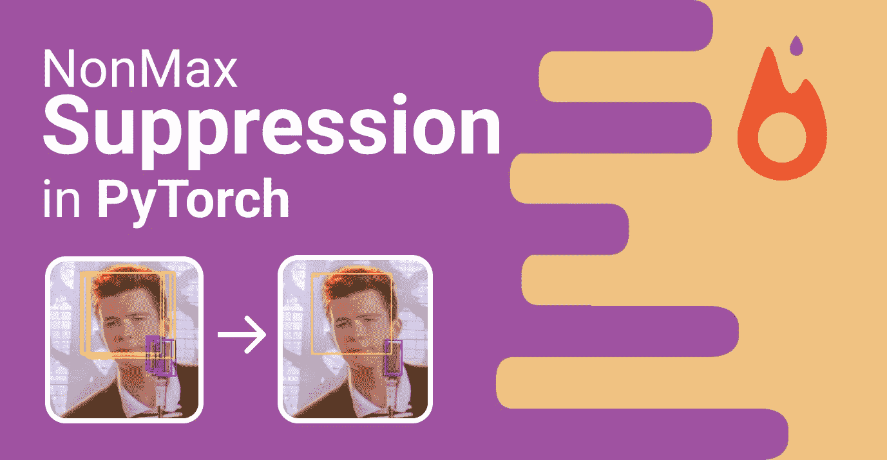
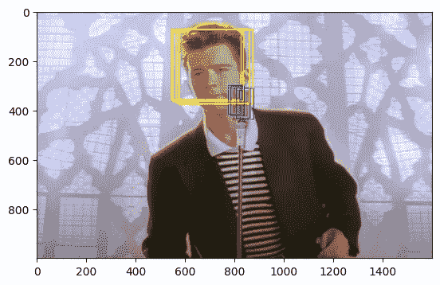
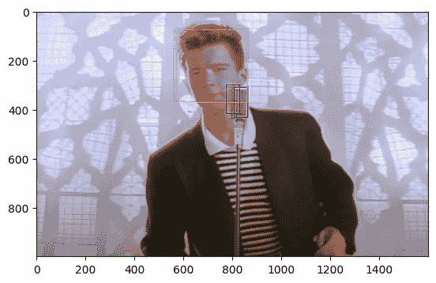

# PyTorch 中的非最大抑制(NMS)

> 原文：<https://pub.towardsai.net/non-max-suppression-nms-in-pytorch-35f77397a0aa?source=collection_archive---------1----------------------->



作者图片

***我在***[***LinkedIn***](https://www.linkedin.com/in/francesco-saverio-zuppichini-94659a150/?originalSubdomain=ch)***，过来打个招呼*** 👋

今天我们将看到如何在 PyTorch 中实现非最大值抑制

*这里的代号是*[](https://github.com/FrancescoSaverioZuppichini/non-max-suppression-in-pytorch)**而本文的互动版可以在* [*这里*](https://github.com/FrancescoSaverioZuppichini/non-max-suppression-in-pytorch/blob/main/README.ipynb)*

# *序言*

*如果你是做计算机视觉(尤其是物体检测)的，你知道什么是*非最大抑制(nms)* 。网上有很多很好的文章给出了恰当的概述。简而言之，*非最大抑制*使用一些试探法来减少输出边界框的数量，例如并集交集(iou)。*

*从`[PyTorch](https://pytorch.org/vision/stable/generated/torchvision.ops.nms.html)` [doc](https://pytorch.org/vision/stable/generated/torchvision.ops.nms.html)*

> **NMS 迭代地用另一个(得分较高的)盒子移除 IoU 大于 iou_threshold 的得分较低的盒子。**

*[这是一篇来自](https://towardsdatascience.com/non-maximum-suppression-nms-93ce178e177c) [Sambasivarao K](https://medium.com/@SambasivaraoK) 的精彩文章，它贯穿了 *nms* 的始终，让你对它的功能有一个很好的了解。*

*现在假设我们知道它是做什么的。让我们看看它是如何工作的。*

# *例子*

*让我们加载一个图像并创建边界框*

**

*鸣谢[https://i0 . WP . com/craffic . co . in/WP-content/uploads/2021/02/ai-remastered-Rick-astley-never-got-to-give-you-up . jpg？w=1600 & ssl=1](https://i0.wp.com/craffic.co.in/wp-content/uploads/2021/02/ai-remastered-rick-astley-never-gonna-give-you-up.jpg?w=1600&ssl=1)*

*让我创建两个`bboxes`，一个用于`head`，一个用于`mic`*

*我们在`[0, 1]`范围内有`bboxes`，这不是必须的，但是当你有多个类时它是有用的(我们将在后面看到为什么)。*

**

*作者图片*

*让我们添加更多的重叠框*

**

*作者图片*

*好吧，够乱了。我们现在有六辆`bboxes`。我们也来定义一下`scores`，这个通常是模型输出的。*

*还有我们的`labels`、`0`为*头*、`1`为*头**

*作为最后一步，让我们排列数据*

*让我们看看他们*

**

*作者图片*

*很好！*

# *履行*

*因此，NMS 通过反复移除分数低的重叠包围盒来工作。所以，步骤如下。*

*模仿 torch 的实现，我们的`nms`有三个参数(实际上是从 torch 的 doc 中复制和粘贴的):*

*   *盒子(`Tensor[N, 4]`)–执行 NMS 的盒子。它们应该是带有`0 <= x1 < x2 and 0 <= y1 < y2`的(`x1, y1, x2, y2`)格式。*
*   *分数(`Tensor[N]`)–每个盒子的分数*
*   *iou _ threshold(`float`)–丢弃所有与`IoU > iou_threshold`重叠的框*

*我们将返回非隐藏边界框的索引*

*让我们一行一行来*

*我们根据`scores`得到排序的索引*

*我们正在创建用于迭代`bboxes`的`indices`*

*`keep`是一个向量，用来知道`bbox`是否应该被保留，如果`keep[i] == 1`则`bboxes[order[i]]`不被抑制*

*我们迭代所有的`bboxes`*

*如果电流`bbox`未被抑制`keep[i] = 1`*

*使用排序后的位置获取`bbox`*

*计算当前`bbox`和所有其他候选之间的`iou`。注意两件事*

*这将把所有被抑制的`bboxes`置零(因为`keep`将等于`0`)*

*我们需要与排序后的所有下一个`bboxes`进行比较，我们需要跳过当前的，所以这就是为什么我们有一个`+ 1`*

*选择`iou`大于`iou_threshold`的指数*

*由于我们之前对`bboxes`、`(bboxes ...)[i + 1:])`进行了切片，我们需要将偏移量添加到那些索引中，所以我们添加了`+ i + 1`。*

*最后，我们返回`return order[keep]`，映射回原始的`bboxes`索引(未排序)*

*好吧，我们试试！*

**

*作者图片*

*由于我们有多个类，我们需要让我们的`nms`在同一个类中计算 iou。有一个很好的技巧。*

*还记得我们的`bboxes`在`[0,1]`之间吗？嗯，我们可以把`labels`加到他们身上，用不同的职业推开`bboxes`。*

**

*作者图片*

*如果我们将阈值改为`0.1`*

**

*作者图片*

*让我们检查一下官方的`torch`实现*

**

*作者图片*

*一样的结果！让我们看表演吧*

```
*534 µs ± 22.1 µs per loop (mean ± std. dev. of 7 runs, 1,000 loops each)*
```

```
*54.4 µs ± 3.29 µs per loop (mean ± std. dev. of 7 runs, 10,000 loops each)*
```

*我们的实现大约慢了 10 倍，考虑到我们没有使用定制的 cpp 内核，我认为这是有意义的！*

*如果你认为我错过了什么，请在 [GitHub](https://github.com/FrancescoSaverioZuppichini/non-max-suppression-in-pytorch) :)上自由发表*

*在这篇文章中，我们已经看到了如何在 PyTorch 中实现非 max 抑制，希望它不再吓人！*

*下一场见🚀*

*弗朗西斯科*