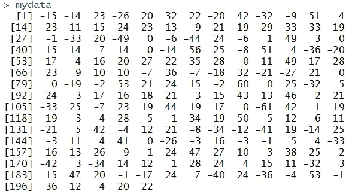
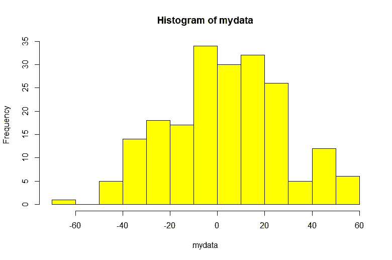
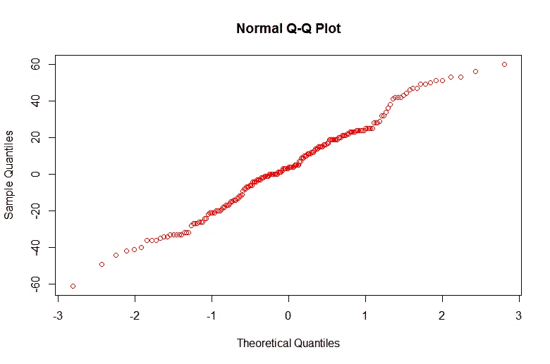

# 数据会问，“你觉得我看起来正常吗？”

> 原文：<https://pub.towardsai.net/normality-tests-for-data-analysis-7c7d775bcfbb?source=collection_archive---------3----------------------->

## [数据科学](https://towardsai.net/p/category/data-science)

## 数据科学的正态性检验

作为数据分析师或数据科学家，首先必须评估样本数据，样本数据的来源可以是一手或二手的，但分析数据的性质非常重要。

让我们把它放入如下假设中，

**零假设**:样本数据平均分布正态

**交替假设:**平均样本数据分布不正态

> 这是什么意思？假设公式

让我们看看，这里我们将**零假设**作为正态分布的数据，通常它描述了如果数据是正态的，那么**我们将不采取任何行动**，我们将继续构建预测模型。

在**替代假设**的情况下，它描述了如果数据不是正态分布的，那么**我们将不得不在继续构建预测模型之前采取任何行动**,**作为数据科学家的典型行动可以是数据的标准化**一旦采取了该纠正行动，那么只有他或她将继续构建预测模型。

> 检验数据正态性的策略

现在为了检验样本数据是否正常，我们将首先决定如下策略:

# 数据可视化方法:

这将使数据的性质可视化，但不能量化。

1.  **绘制直方图**，图形显示范围内的频率分布
2.  **绘制 Q-Q 图**，一种比较概率分布的图形方法。

# 统计测试/方法:

1.  根据**达戈斯蒂诺的 K 正态性检验**计算 p 值
2.  基于**夏皮罗-维尔克(S-W)正态性检验**计算 p 值

> **我们的假设**

请注意，我们已经考虑了以下值，

**置信度为 95%，**这意味着我们有 95%的信心，我们的决定不会出错。
**显著性水平为 5%，**这意味着我们的决策有 5%的几率会出错。

行业标准/规范认为置信度为 95%，
这意味着 5%的误差是允许的。

> 进行实验以检验假设

# 策略 1: **绘制直方图**

分析数据分布的最常见的可视化工具是直方图。其中数据被分成预定义的一组仓。在图的 Y 轴上，我们总是在一个条柱内有值的频率或出现。
这些容器在图的 X 轴上按升序排列。

为了检查样本数据分布的正态性，可以基于直方图主观推断样本数据是否遵循正态分布(换句话说，**数据分布是否遵循钟形曲线**)。

我们使用 R 编程环境[R-studio]来实现



样本数据分布



样本数据分布直方图

根据上面的直方图，可以推断出**数据正态分布在**值的范围内，但是如果没有统计方法的帮助，一个**不能定量地证明**。

# 策略 2: **绘制 Q-Q 图**

Q-Q 图是一个典型的散点图，它允许我们比较各个数据分布的分位数(x 对 y)。我们将使用 Q-Q 图的变体，即**正态 Q-Q 图**，它将标准正态分布(x 轴)的分位数与样本数据分布(y 轴)进行比较。如果一个图给出了一条相当直的线，那么我们可以从主观上确认样本数据来自正态分布总体，即它的正态分布数据。

我们使用 R 编程环境[R-studio]来实现



正常 Q-Q 图

在上面的 q-q 图中，我们可以很容易地发现绘制的点大约分散在直线**上，这证实了数据很大程度上遵循正态分布**，但是我们的主张同样无法从数量上得到证明。

# 策略 3: **达戈斯蒂诺的 K 正态性检验**

这种统计检验允许我们在数据分布中找到一个显著的偏态分量。**偏斜度是数据分布中不对称度的度量**。

该测试主要给出两个值，

> **统计** : s +k，其中`s`为`[**skewtest**](https://docs.scipy.org/doc/scipy/reference/generated/scipy.stats.skewtest.html#scipy.stats.skewtest)`返回的 z 值，`k`为`[**kurtosistest**](https://docs.scipy.org/doc/scipy/reference/generated/scipy.stats.kurtosistest.html#scipy.stats.kurtosistest)`返回的 z 值。
> 
> **p 值**:介于 0 和 1 之间，是给定统计模型在零假设为真时的计算概率。
> 
> 重要考虑

人们应该注意以下接受/拒绝零假设的规则，

**如果 p 高，NULL 将飞**(接受零假设/数据未能拒绝零假设)

**如果 p 较低，NULL 将变为**(拒绝零假设/接受替代假设)

这里的 **p** 是指统计检验得到的 **p 值**。

```
import numpy as npimport scipy.stats as sc#generate random seednp.random.seed(1)#generate random set of numbersvalue=15+7*np.random.randn(50)print("Size of univariate observations-:",len(value))statval,pval=**sc.normaltest(value)**print("Statistics: ",statval)print("P-value: ",pval)alpha=0.05if(pval>alpha): print("Null Hypothesis: Data Distribution is Normal, Wins!!!")else: print("Alt Hypothesis: Data Distribution is not Normal, Wins!!!")
```

上述代码片段的输出是:

**单变量观察值大小-: 50
统计量:0.44153052875099047
P 值:0.801904893845168
零假设:数据分布正态，胜！！！**

# 策略 4:夏皮罗-维尔克正态性检验

该测试验证一组数据值，并试图确定数据集是否具有正态分布。

在实践中，夏皮罗-维尔克检验被认为是一种可靠的正态性检验，尽管有一些建议认为该检验可能适用于较小的数据样本，例如数千个或更少的观察值。

[Shapiro() SciPy](https://docs.scipy.org/doc/scipy/reference/generated/scipy.stats.shapiro.html) 函数将计算给定数据集的夏皮罗-维尔克。该函数返回由测试计算的 W 统计量和 p 值。

下面列出了对数据集执行夏皮罗-维尔克测试的完整示例。

```
import numpy as npimport scipy.stats as sc#generate random seednp.random.seed(1)#generate random set of numbersvalue=15+7*np.random.randn(50)print("Size of univariate observations-:",len(value))statval,pval=**sc.shapiro(value)**print("Statistics: ",statval)print("P-value: ",pval)alpha=0.05if(pval>alpha):
   print("Null Hypothesis: Data Distribution is Normal, Wins!!!")else:
   print("Alt Hypothesis: Data Distribution is not Normal, Wins!!!")
```

上述代码片段的输出是:

**单变量观察值大小-: 50
统计量:0.9704716205596924
P 值:0.24187302589416504
零假设:数据分布正态，胜！！！**