# 只有数字:从零开始理解和创建带有计算图的神经网络

> 原文：<https://pub.towardsai.net/nothing-but-numpy-understanding-creating-neural-networks-with-computational-graphs-from-scratch-6299901091b0?source=collection_archive---------0----------------------->

## [机器学习](https://towardsai.net/p/category/machine-learning)，[编程](https://towardsai.net/p/category/programming)， [Python](https://towardsai.net/p/category/programming/python)

更新:这篇文章得到了积极的反馈，尤其是我所敬仰的人工智能社区的人们，这让我受宠若惊。我也感谢所有分享这篇文章并花时间阅读它的人，因为你这篇文章被授予了 KDnugget 的金质徽章。谢谢大家！

理解新概念可能会很难，尤其是现在有大量的资源，而对复杂的概念只有粗略的解释。这篇博客是缺乏如何以计算图的形式创建神经网络的详细演练的结果。

在这篇以及后面的一些博文中，我将把我所学到的东西整合起来，作为一种回馈社区和帮助新加入者的方式。我将在 NumPy 的帮助下创建普通形式的神经网络。

*这篇博文分为两部分，第一部分将理解神经网络的基础知识，第二部分将包含实现第一部分所学内容的代码。*

# 第一部分:了解神经网络

# 让我们开始吃吧🍽️

神经网络是一种受大脑工作方式启发的模型。类似于大脑中的神经元，我们的“数学神经元”也是直观地相互连接的；它们接受输入(树突)，对其进行一些简单的计算，并产生输出(轴突)。

学习某样东西的最好方法是去构建它。先从一个简单的神经网络入手，手动求解。这将让我们了解计算是如何通过神经网络的。

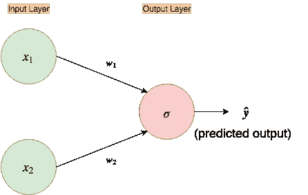

图一。简单仅输入输出神经网络

如上图所示，大多数时候你会看到一个神经网络以类似的方式描绘。但是这张简洁简单的图片隐藏了一点复杂性。让我们把它展开。

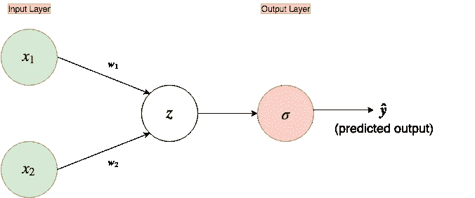

图二。扩展神经网络

现在，让我们仔细检查图表中的每个节点，看看它代表什么。


图三。输入节点 ***x₁*** 和 ***x₂***

这些节点代表我们对第一个和第二个特征的输入，****【x₂】***定义了我们馈送给神经网络*的单个示例，因此称为 ***【输入层】*****

****

**图 4。砝码**

******w₂***代表我们的权重向量(在一些神经网络文献中权重用*θ*符号、 ***θ*** 表示)。直观地说，这些决定了每个输入要素在计算下一个结点时的影响程度。如果你是新手，可以把它们想象成线性方程中的“斜率”或“梯度”常数。***

***权重是我们的神经网络必须“学习”的主要值*。因此，最初，我们将把它们设置为随机值*，并让我们的神经网络的“*学习算法”*决定产生正确输出的最佳权重。***

**为什么随机初始化？稍后将详细介绍。**

****

**图五。线性操作**

**这个节点代表一个线性函数。简单地说，*它接受所有输入，并从中创建一个线性方程/组合*。(*按照惯例，应当理解，除了输入层中的输入节点之外，权重和输入的线性组合是每个节点的一部分，因此该节点在图中经常被省略，如图 1 所示。*在这个示例中，我将把它留在这里)**

**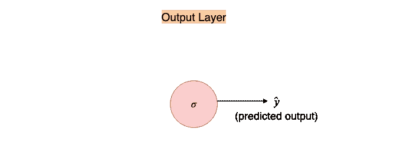**

**图六。输出节点**

**这个 ***σ*** 节点(sigmoid node)接受输入，并将其传递给以下函数，称为 **sigmoid 函数**(因为它是 S 形曲线)，也称为**逻辑函数**:**

**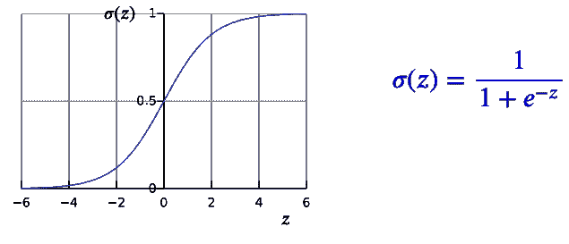**

**图 7。Sigmoid(逻辑)函数**

**Sigmoid 是神经网络中使用的许多“激活函数”之一。激活功能的作用是将输入改变到不同的范围。例如，如果 *z > 2* 那么， *σ(z) ≈ 1* 同样，如果 *z < -2 那么，σ(z) ≈ 0。S* o，sigmoid 函数将输出范围挤压到(0，1) *(此'()'符号暗示排他边界；从不完全输出 0 或 1 作为函数渐近线，而是达到非常接近边界值)***

****在我们上面的神经网络中由于它是最后一个节点，它执行输出**的功能。预测输出用 ***ŷ.表示*** ( *注:在一些神经网络文献中，这被表示为'****【h(θ)'****)，其中“h”被称为假设，即这是神经网络的假设，也称为输出预测，给定参数θ；其中θ是神经网络的权重)***

**现在我们知道了每个事物代表什么，让我们用一些玩具数据来计算每个节点。**

**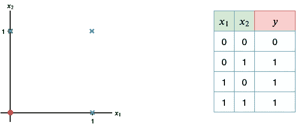**

**图 8。或门**

**以上数据代表一个**或**门(如果任何输入为 1，则输出为 1)。表格中的每一行都代表了我们希望我们的神经网络学习的一个*‘例子’*。在从给定的例子中学习之后，我们希望我们的神经网络执行或门的功能；给定输入特征，***，*试着输出相应的***【y】(也叫‘标签’)****。*我还在二维平面上绘制了这些点，以便于可视化(绿色十字表示输出(***【y】***为 ***1*** 的点，红色圆点表示输出为 ***0*** 的点)。****

**这个或门数据特别有趣，因为它是可线性分离的*，也就是说，我们可以画一条直线来分离绿色十字和红色圆点。***

***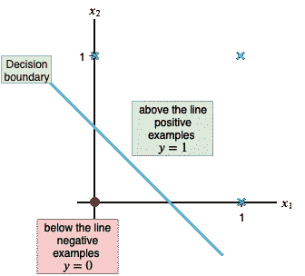***

***图九。表明或门数据是线性可分的***

***我们将很快看到我们简单的神经网络如何执行这项任务。***

***在我们的神经网络中，数据从左向右流动。用专业术语来说，这个过程叫做**‘正向传播’**；来自每个节点的计算被转发到它所连接的下一个节点。***

***让我们检查一下给定第一个例子时我们的神经网络将执行的所有计算，****x₂=0***。同样，我们将初始化权重到 ***w₁=0.1*** 和 ***w₂=0.6*** *(回想一下，这些权重是随机选择的)*****

**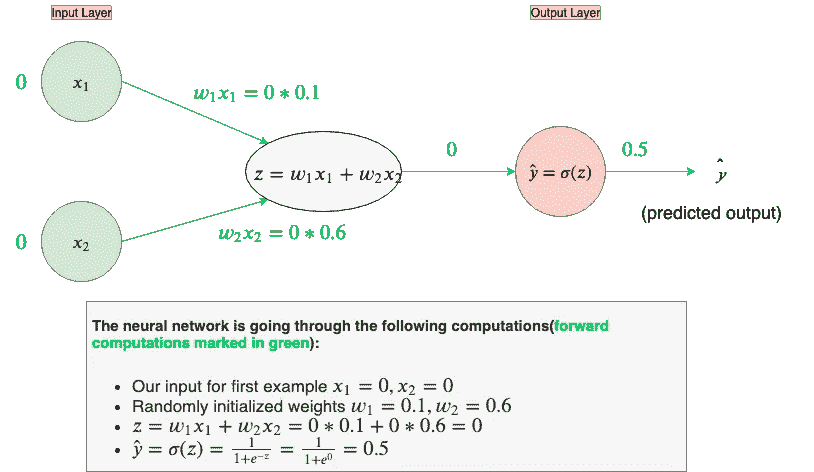**

**图 10。从或表数据向前传播第一个示例**

**以我们目前的权数，***【w₁=】0.1，******w₂= 0.6***，我们的网络的输出离我们想要的地方有点远。预测产量， ***ŷ，*** 应该是 ***ŷ≈0*** 为 ***x₁=0*** 和 ***x₂=0*** ，现在是 ***ŷ=0.5*** 。**

**那么，如何告诉神经网络它离我们想要的输出有多远呢？进来的是 ***失去功能*** 来救援。**

## **损失函数**

******损失函数*** *是一个简单的等式，它告诉我们我们的神经网络的预测输出(****【ŷ】****)离我们期望的输出(****【y】****)，* ***有多远，仅作为一个例子。******

***损失函数的* ***导数*** *指示是否增加或减少权重。正导数意味着减少权重，负导数意味着增加权重。* ***斜率越陡，预测越不正确。*****

**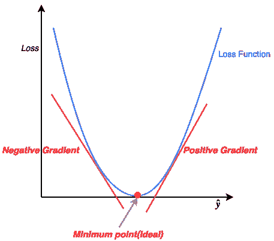**

**图 11。损失函数可视化**

***上图 11 所示的损失函数曲线是一个理想的版本。在现实世界的情况下，损失函数可能不会如此平滑，沿途会有一些颠簸和鞍点达到最小值。***

**有许多不同种类的损失函数***，每一个本质上都是计算预测输出和期望输出*** 之间的误差。这里我们将使用一个最简单的损失函数， ***平方误差损失函数。*** 定义如下:**

**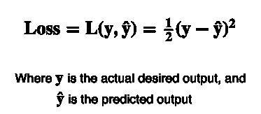**

**图 12。损失函数。计算单个示例的误差**

**取**的平方使一切都变得美好而正**并且**的分数(1/2)是存在的，以便在取平方的** **项** *的导数时抵消掉(在一些机器学习实践者中省略分数*是很常见的)。**

**直观地说，平方误差损失函数帮助我们最小化预测线(蓝线)和实际数据(绿点)之间的垂直距离。在幕后，这条预测线就是我们的*(线性函数)节点。***

**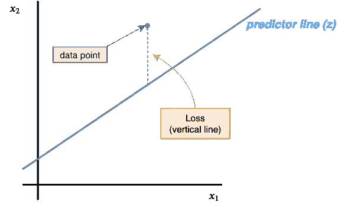**

**图 13。损失函数效果的可视化**

**现在我们知道了损失函数的目的，让我们计算我们当前预测的误差****y = 0***对于第一个例子 ***。******

**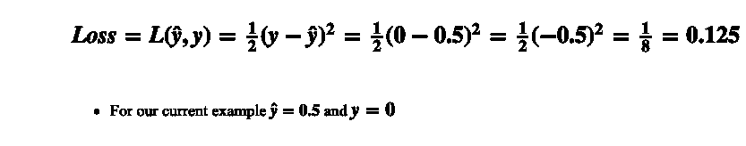**

**图 14。为 1ˢᵗ示例计算的损失**

**我们可以看到*损失*是 ***0.125*** 。鉴于此，*我们现在可以使用损失函数的导数来检查我们是否需要增加或减少我们的权重。***

**这个过程被称为*反向传播，因为我们将做与*正向*阶段相反的事情。*我们不是从输入到输出，而是从输出到输入进行回溯*。*简单地说，反向传播允许我们计算出神经网络的每个部分造成了多少损失*。***

**为了执行反向传播，我们将采用以下技术:*在每个节点，我们仅计算我们的局部梯度(该节点的偏导数)，然后在反向传播期间，当我们从上游接收梯度的数值时，我们将这些数值与局部梯度相乘，以将它们传递到它们各自连接的节点。***

**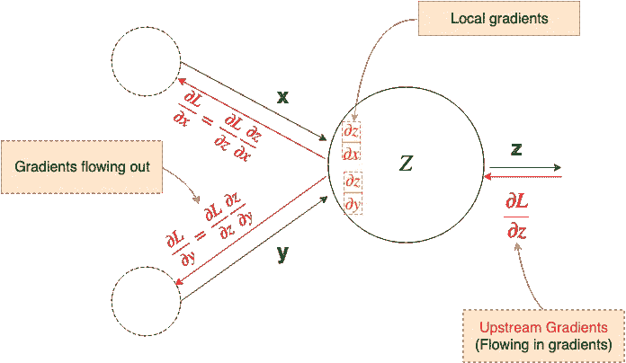**

**图 15。梯度流动**

***这是从微积分中概括出的* ***链式法则*** *。***

**由于***【ŷ】***(预测标号)决定了我们的**【实际标号】是常数，举个简单的例子，*我们将对**的损失取偏导数*****

***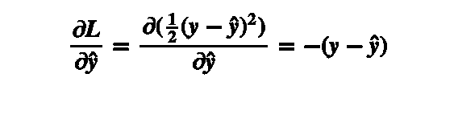***

***图 16。损失的偏导数 w.r.t *ŷ****

***由于反向传播步骤看起来有点复杂，我将一步一步地介绍它们:***

***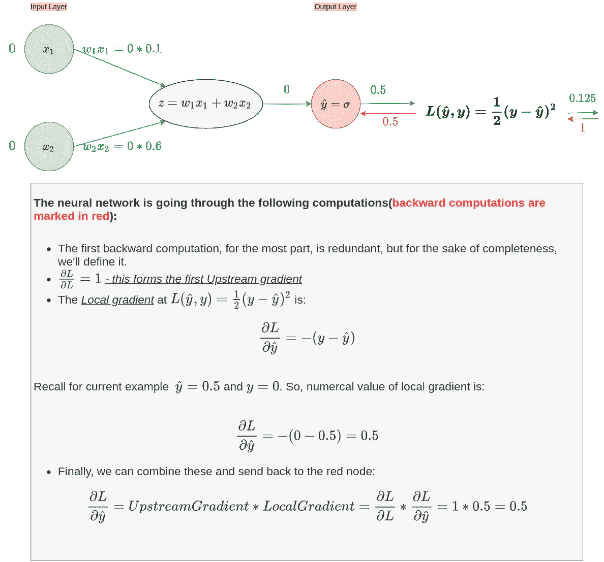***

***图 17a .反向传播***

***对于下一个计算，我们需要 sigmoid 函数的导数，因为它形成了红色节点的局部梯度。让我们推导一下。***

***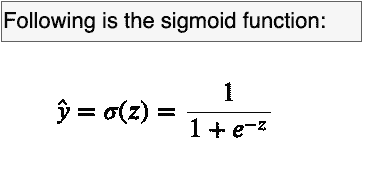******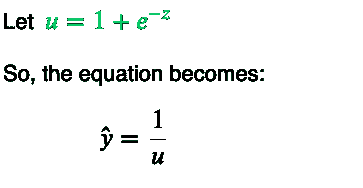******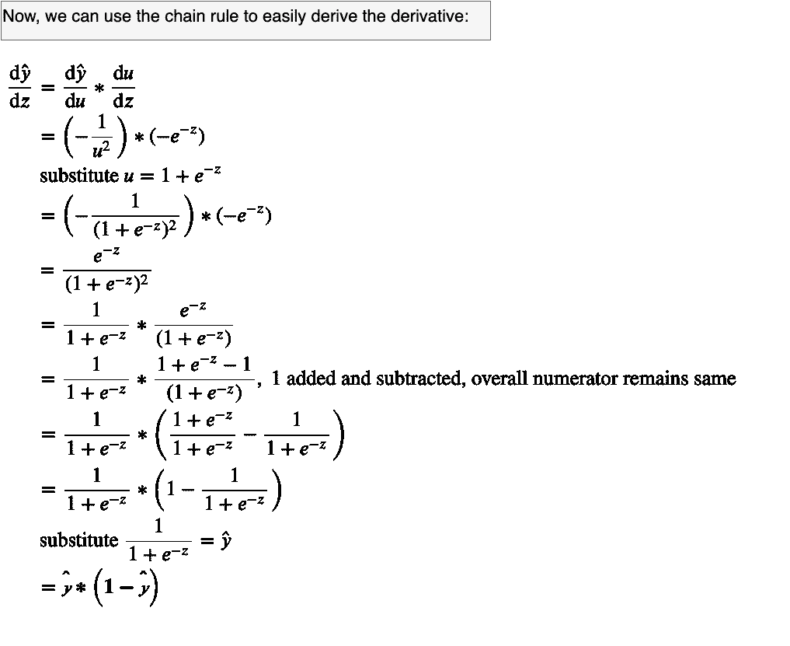***

***图 18。Sigmoid 函数的导数。***

***让我们在下一次逆向计算中使用它***

***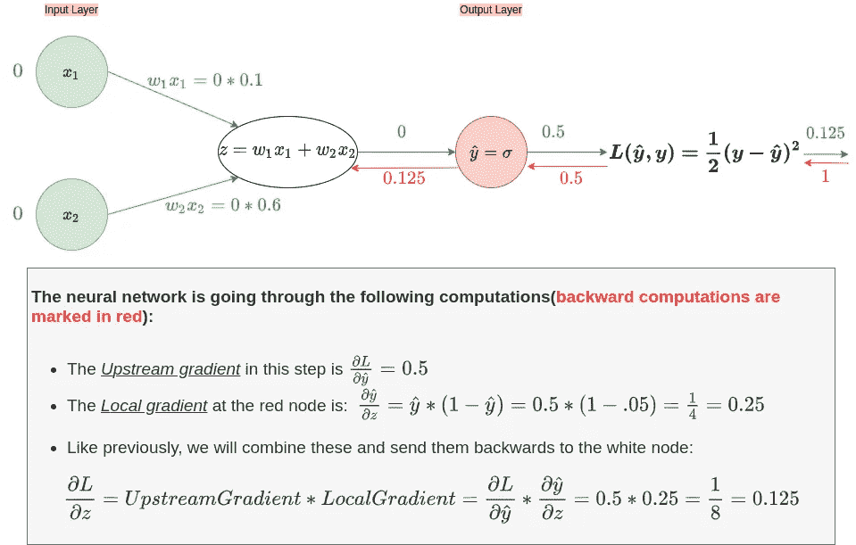***

***图 17b .反向传播***

***反向计算不应一直传播到输入，因为我们不想更改输入数据(即红色箭头不应指向绿色节点)。我们只想改变与输入相关的权重。***

***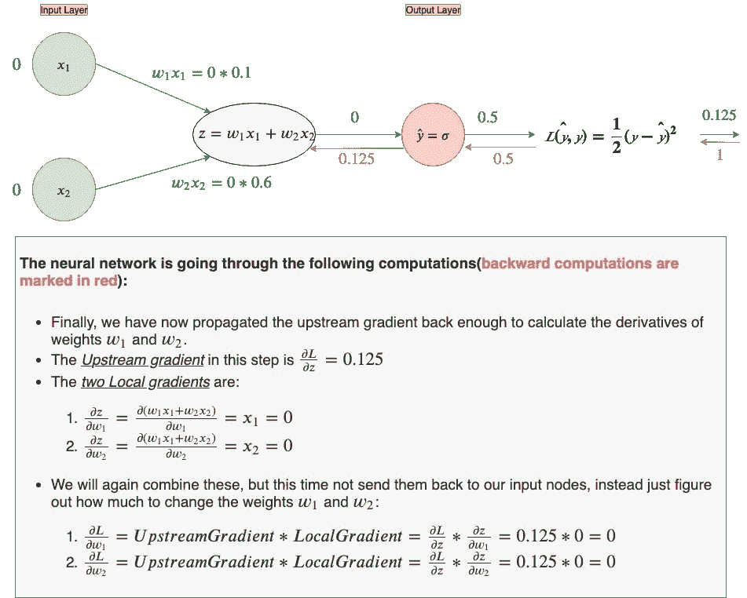***

***图 17.c .反向传播***

***注意到奇怪的事情了吗？*损失相对于 weights,w₁ & w₂的导数，为零*！如果它们的导数为零，我们就不能增加或减少权重。那么，在这种情况下，如果我们不知道如何调整权重，我们如何获得我们想要的输出呢？*这里需要注意的关键点是，局部渐变(***【∂z/∂w₁】***和***【∂z/∂w₂】***)是****【x₁】****和****【x₂】，*** 在本例中，这两者恰好为零(即不提供任何信息)***

**这就给我们带来了**偏差*的概念。*****

## **偏见**

**回想一下你高中时代的直线方程。**

****

**图 19。直线方程**

**这里 ***b*** 是偏置项。直观地说，偏差告诉我们，用***x****计算的所有输出都应该有一个加性偏差*b .因此，当 ***x=0*** (没有来自*自变量的信息)时，输出应该被偏置到正好是* ***b.*******

***注意，如果没有偏置项，一条直线只能通过原点(0，0)，那么直线之间的唯一区分因素将是梯度* ***m.*****

**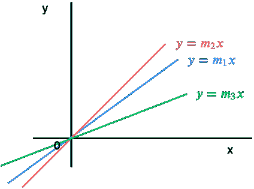**

**图 20。从原点开始的线**

**因此，利用这些新信息，让我们给神经网络增加另一个节点；偏置节点。(*在神经网络文献中，除了输入层，每一层都假设有一个偏置节点，就像线性节点一样，所以这个节点在图中也经常被省略。*)**

****

**图 21。具有偏置节点的扩展神经网络**

**现在让我们用同样的例子做一个正向传播，***【x₁=0】***y = 0，让我们设置 bias， ***b=0*** *(初始 bias 总是设置为零，而不是一个随机数)*，我们让 Loss 的反向传播算出如何调整 bias。**

****

**图 22。带有偏差单位的 OR 表数据的第一个示例的前向传播**

**嗯，偏差为“ ***b=0*** ”的前向传播根本没有改变我们的输出，但在我们做出最终判断之前，让我们先做一下后向传播。**

**像以前一样，让我们一步一步地进行反向传播。**

**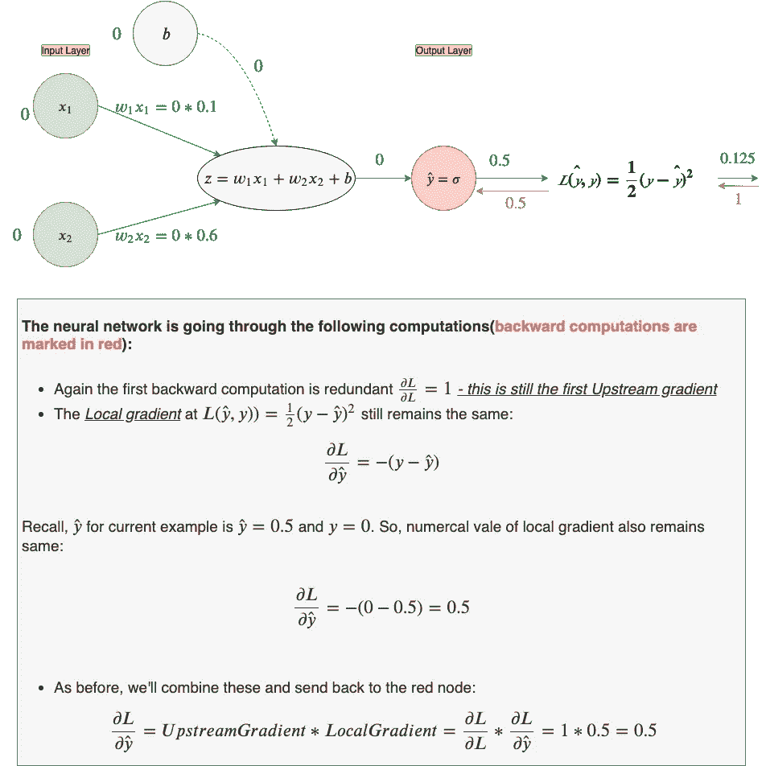**

**图 23.a .有偏置的反向传播**

**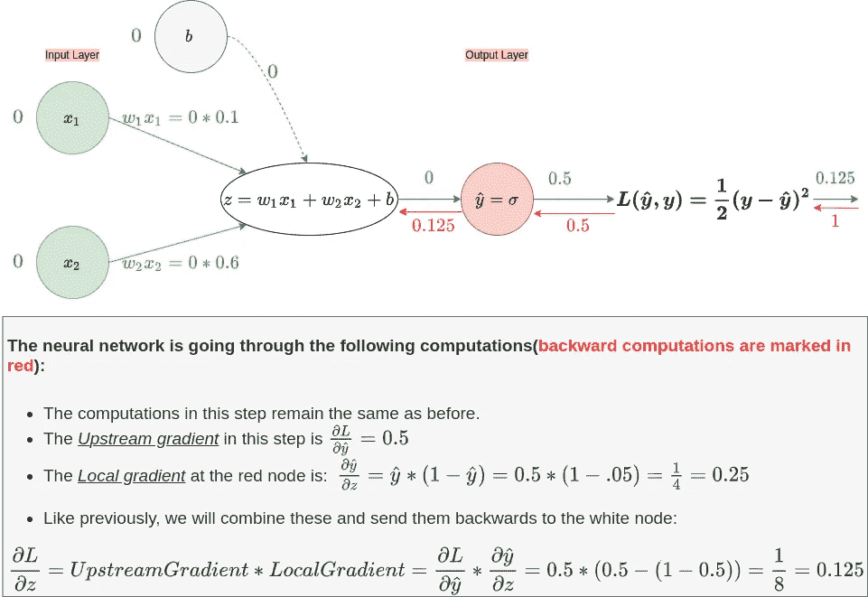**

**图 23.b .有偏置的反向传播**

**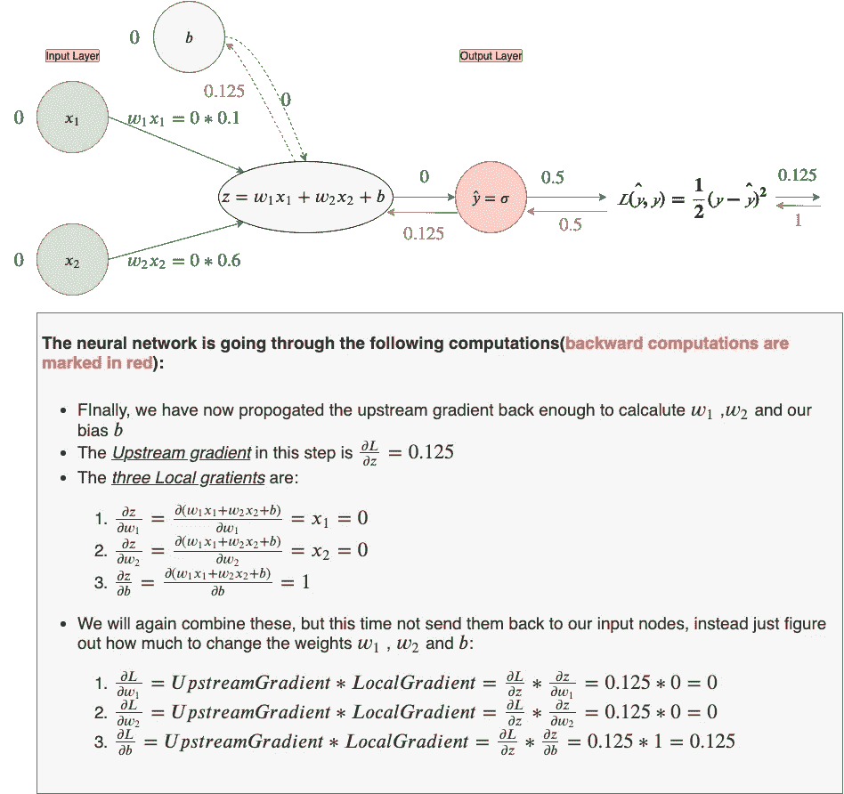**

**图 23.c .有偏置的反向传播**

**万岁！我们刚刚算出了调整偏差的幅度。你注意到最酷的事情了吗？回忆反向传播允许我们计算出神经网络的每个部分造成了多少“损失”。当输入没有提供信息时，反向传播算法将损失函数中的所有误差分配给偏置项。**

**由于偏差的导数( **∂L/∂b** )为正 0.125，我们将需要通过向梯度的负方向移动来调整偏差(回想之前的损失函数曲线)。这在技术上称为 ***渐变下降*** ，因为我们使用渐变的方向从倾斜区域“下降”到平坦区域。就这么办吧。**

**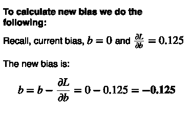**

**图 24。使用梯度下降计算新偏差**

**现在，我们已经将偏差稍微调整为 ***b=-0.125，*** ，让我们通过进行**正向传播**和**检查新的损失*来测试我们是否做了正确的事情。*****

**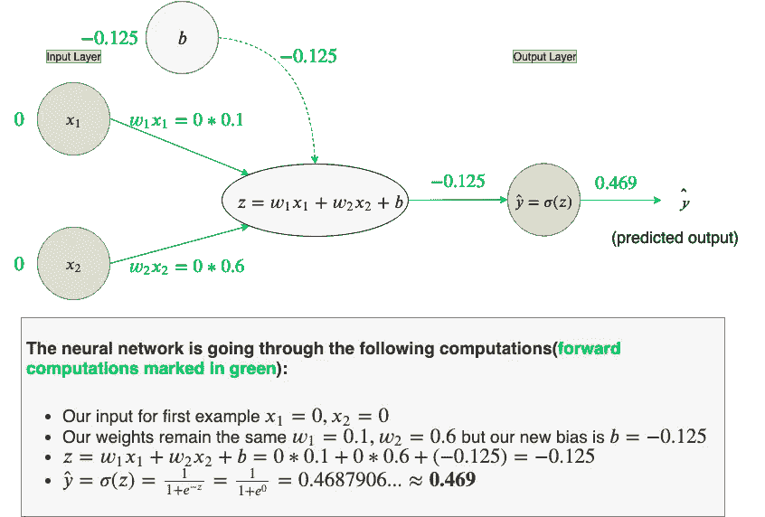**

**图 25。具有新计算的偏差的正向传播**

**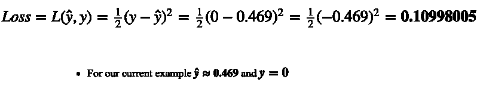**

**图 26。新计算偏差后的损失**

**现在我们预测的产量是***【ŷ≈0.469】****(四舍五入到小数点后 3 位)**比之前的 0.5 略有提高，损耗从 0.125 下降到 0.109 左右*。这种轻微的校正是神经网络仅仅通过将其预测输出与期望输出 ***y*** 进行比较，然后向与梯度 ***相反的方向移动而‘学习’的东西。*** 挺酷的吧？****

**现在你可能想知道，这仅仅是对之前结果的一个小的改进，我们如何达到最小的损失。两件事开始起作用: ***a)* 我们执行多少次迭代的‘训练’**(每个训练周期都是前向传播，计算损失，然后是反向传播，通过梯度下降更新权重)。 ***b)* 学习率。****

**学习率？？？那是什么？我们来谈谈吧**

## **学习率**

**回想一下，上面我们是如何通过向梯度的相反方向移动来计算新的偏差的(即 ***梯度下降*** )。**

**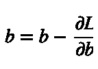**

**图 27。更新偏差的方程式**

**请注意，当我们更新偏差时，我们将 ***向渐变的相反方向移动了 1 步。*****

**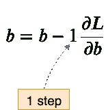**

**图 28。显示“步长”的更新偏差方程**

**我们可以在梯度的相反方向上移动 0.5、0.9、2、3 或我们想要的任何一部分步长。这个'*步数'就是我们定义的* ***学习率*** ，通常用***α***【alpha】***来表示。*****

**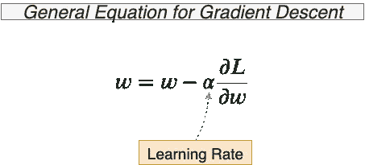**

**图 29。梯度下降的一般方程**

***学习率*定义了我们达到最小损失的速度。让我们在下面想象一下学习率的情况:**

**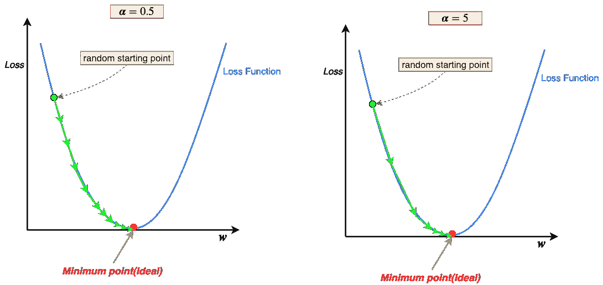**

**图 30。可视化学习速度的影响。**

**正如你所看到的，学习率越低(α=0.5)，我们沿着曲线下降的速度越慢，我们要走很多步才能到达最低点。另一方面，学习率越高(α=5 ),我们迈出的步伐越大，到达最小值的速度也越快。**

**眼尖的人可能已经注意到，当我们越来越接近最小值时，梯度下降步骤(绿色箭头)变得越来越小，这是为什么呢？回想一下，学习率正乘以曲线上该点的梯度；当我们从倾斜区域下降到 u 形曲线的平坦区域时，在最小点附近，梯度变得越来越小，因此阶梯也成比例地变小。因此，在训练期间改变学习率是不必要的(梯度下降的一些变化从高学习率开始快速下降，然后逐渐降低，这被称为“学习率退火”或“学习率衰减”)**

**那么外卖是什么？只要把学习率设置的尽可能的高，快速达到最优损耗就可以了。不会。学习率可能是一把双刃剑。*学习率太高*并且参数(权重和偏差)没有达到最优，而是开始偏离最优。*学习率*太小，参数收敛到最优需要太长时间。**

**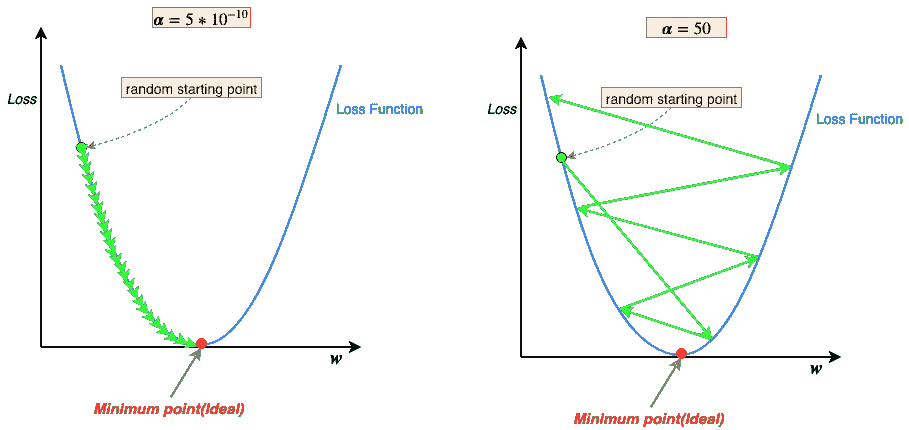**

**图 31。将非常低的学习率和非常高的学习率的效果可视化。**

**小学习 rate(α=5*10⁻ ⁰)导致无数的步骤达到最小点是不言自明的；将梯度乘以一个小数值(α)会产生一个成比例的小步长。**

**导致梯度下降发散的大学习率(α=50)可能是混杂的，但答案是相当简单的；请注意，在每一步，梯度下降通过直线移动(图中的绿色箭头)来近似其向下的路径，简而言之，它估计其向下的路径。当学习速率太高时，我们强制梯度下降以采取更大的步长。较大的步长倾向于过高估计向下的路径，并越过最小值点，然后为了校正不好的估计，梯度下降试图向最小值点移动，但是由于较大的学习速率，再次越过最小值。这种持续高估的循环最终导致结果出现偏差(即每次训练循环后的损失增加，而不是减少)。**

**学习率就是所谓的 ***超参数*** 。超参数是神经网络基本上不能通过梯度的反向传播来学习的参数，它们必须由神经网络模型的创建者根据问题及其数据集来手动调整。*(上述损失函数的选择也是超参数)***

**简而言之，目标不是找到“完美的学习率”,而是一个足够大的学习率，以便神经网络成功有效地训练而不发散。**

**到目前为止，我们只使用了一个例子( ***x₁=0*** 和 ***x₂=0*** )来调整我们的权重和偏差(*实际上，到目前为止只有我们的偏差*🙃)这减少了我们整个数据集(或选通表)中一个例子的损失。但我们有不止一个例子可以借鉴，我们希望减少所有例子中的损失。**理想情况下，在一次训练迭代中，我们希望减少所有训练示例的损失**。这被称为**批量梯度下降**(或全批量梯度下降)，因为我们在每次训练迭代中使用整批训练样本来提高我们的权重和偏差。*(其他形式有* ***小批量梯度下降*** *，其中我们在每次迭代中使用数据集的子集，以及* ***随机梯度下降*** *，其中我们到目前为止在每次训练迭代中仅使用一个示例)。***

***神经网络遍历所有训练样本的训练迭代称为* ***时期*** 。*如果使用小批量，则在神经网络遍历所有小批量之后，一个时期将是完整的，类似于随机梯度下降，其中批量只是一个例子。***

**在我们继续之前，我们需要定义一个叫做 ***的成本函数*** 。**

## **价值函数**

**当我们执行"*批次梯度下降"*时，我们需要稍微改变损失函数，以适应批次中的所有示例，而不仅仅是一个示例。这个调整后的损失函数被称为**成本函数**。**

***另外，注意成本函数的曲线与损失函数的曲线相似(同样的 U 型)。***

*****成本函数不是计算一个示例的损失，而是计算所有示例的平均损失。*****

**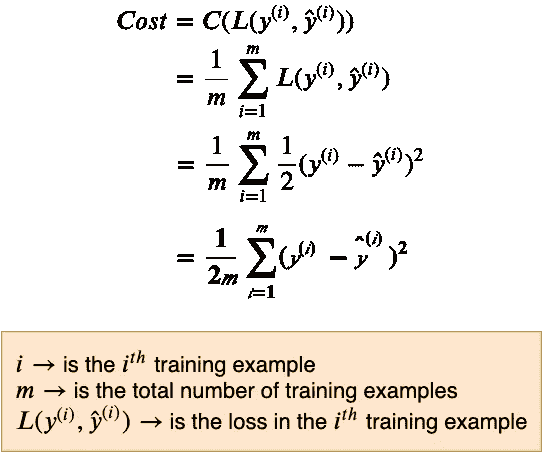**

**图 32。价值函数**

**直观上，成本函数扩展了损失函数的能力。回想一下，损失函数是如何帮助最小化单个*数据点和预测线( ***z*** )之间的垂直距离的。**成本函数有助于同时最小化多个数据点之间的垂直距离(平方误差损失)。*****

*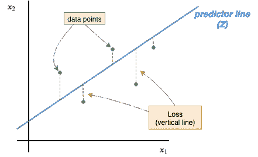*

*图 33。成本函数效果的可视化*

***在批量梯度下降过程中，我们将使用成本函数**的导数，而不是损失函数，来引导我们在所有示例中达到最小成本的路径。*(在一些神经网络文献中，成本函数有时也用字母****【J】****来表示)。)**

*让我们看看成本函数的导数方程与损失函数的普通导数有什么不同。*

## *成本函数的导数*

*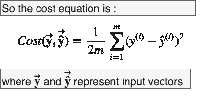*

*图 34。成本函数显示它采用输入向量*

*对这个成本函数求导可能有点冒险，成本函数将向量作为输入并求和。所以，在推广导数之前，让我们从一个简单的例子开始。*

*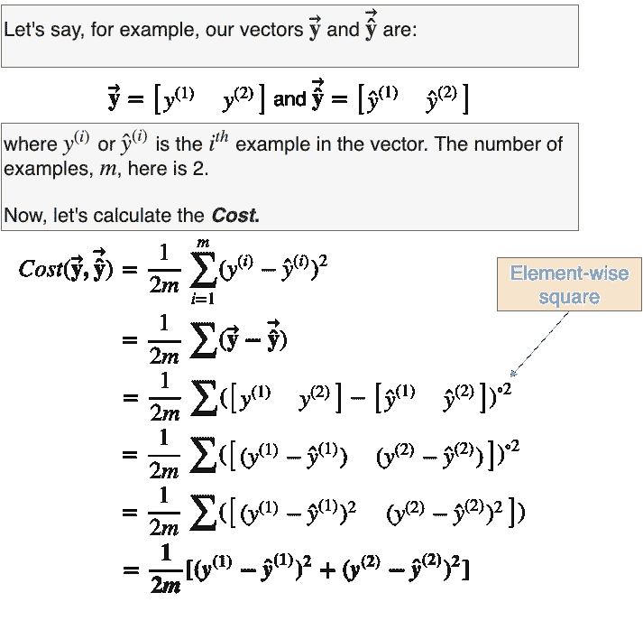*

*图 35。简单矢量化示例的成本计算*

*在成本计算方面没有什么新的东西。正如预期的那样，最终的成本是损失的平均值，但现在实现是矢量化的*(我们执行矢量化减法，然后执行元素幂运算，称为 Hadamard 幂运算)*。让我们推导偏导数。*

*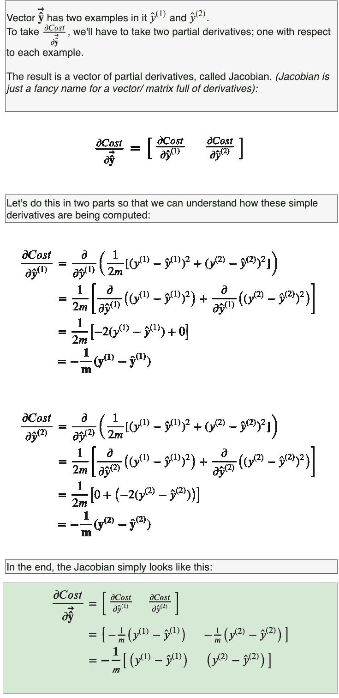*

*图 36。简单例子上雅可比矩阵的计算*

*由此，我们可以推广偏导数方程。*

*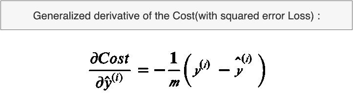*

*图 37。广义偏导数方程*

*现在我们应该花点时间来注意损失的导数和成本的导数有什么不同。*

*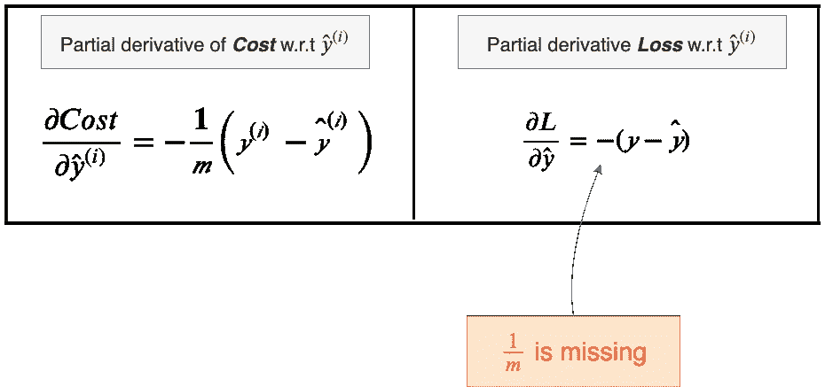*

*图 38。损失和成本相对于(w.r.t) **ŷ⁽ⁱ⁾** 的偏导数比较*

*我们以后会看到这个小变化是如何在梯度的计算中表现出来的。*

*回到批量梯度下降。*

*有两种方法执行批量梯度下降:*

***1。**对于每个训练迭代，创建单独的临时变量(大写 deltas，δ),这些变量将累积来自我们训练集中的每个 **" *m"*** 示例的权重和偏差的梯度(小写 deltas，δ),然后在时期结束时使用累积梯度的平均值更新权重。这是一个缓慢的方法。*(对于那些熟悉时间复杂度分析的人，你可能会注意到，随着训练数据集的增长，这变成了一个多项式时间算法，O(n ))**

*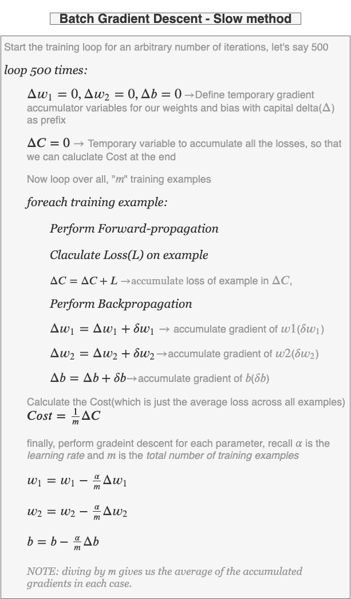*

*图 39。批量梯度下降慢法*

***2。**更快的方法类似于上述方法，但是使用矢量化计算来一次性计算所有训练示例的所有梯度，因此去除了内部循环。矢量化计算在计算机上运行得更快。这是所有流行的神经网络框架所采用的方法，也是我们将在本博客的其余部分遵循的方法。*

*对于矢量化计算，我们将对神经网络计算图的“Z”节点进行调整，并使用成本函数代替损失函数。*

*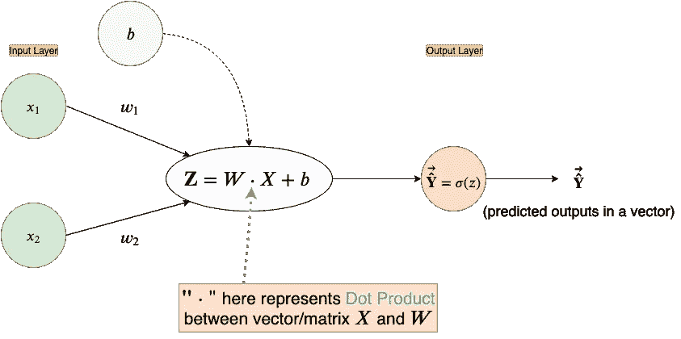*

*图 40。Z 节点的矢量化实现*

*注意，在上图中，我们在 ***W*** 和 ***X*** 之间取**点积**，它可以是适当大小的矩阵或向量。偏差 ***b*** 在这里仍然是一个单一的数字*(一个标量)*，并且将以元素方式添加到点积的输出中。预测的输出将不仅仅是一个数字，而是一个向量，*，其中每个元素都是它们各自示例的预测输出。**

**在进行前向和后向传播之前，让我们设置输出数据( ***X，W，b & Y*** )。**

**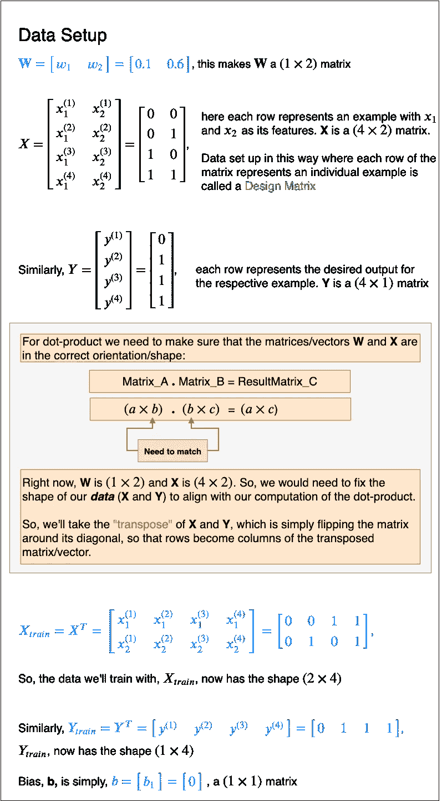**

**图 41。为矢量化计算设置数据。**

**我们现在终于准备好使用 **Xₜᵣₐᵢₙ** 、 **Yₜᵣₐᵢₙ** 、 **W、**和 **b** 进行正向和反向传播。**

***(注:以下所有结果均四舍五入至小数点后 3 位，仅为简洁起见)***

**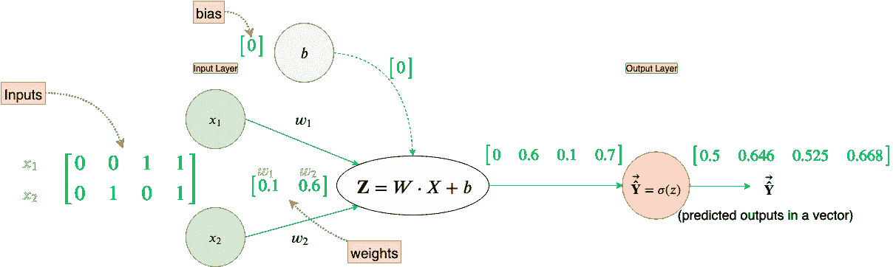****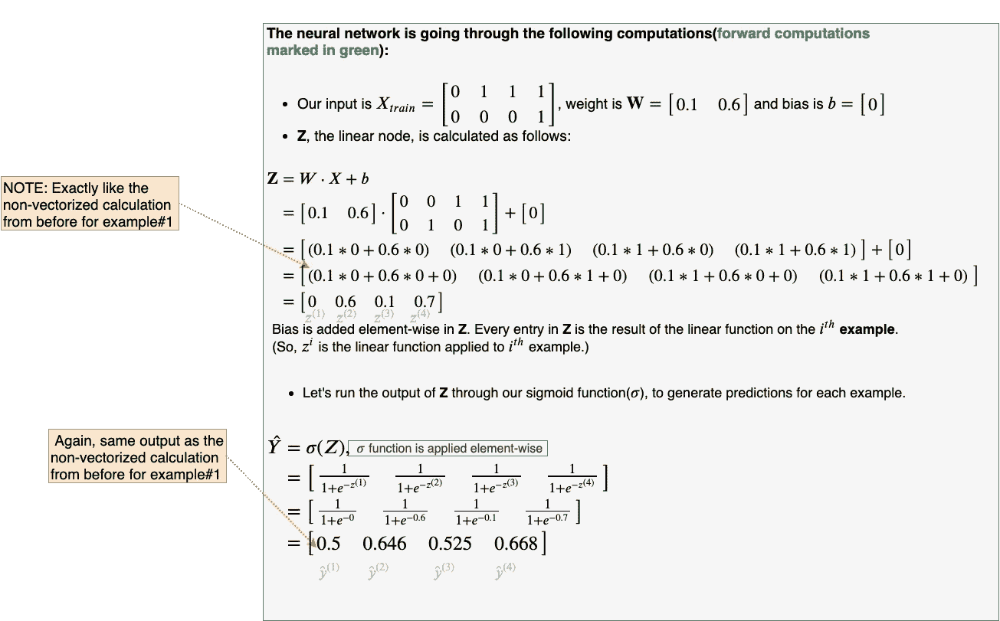**

**图 42。或门数据集上的矢量化前向传播**

**多酷啊，我们一次就计算出了数据集中所有例子的所有正向传播步骤，仅仅是通过对我们的计算进行矢量化。**

**我们现在可以根据这些输出预测来计算**成本**。*(我们将详细检查计算，以确保没有混淆)***

**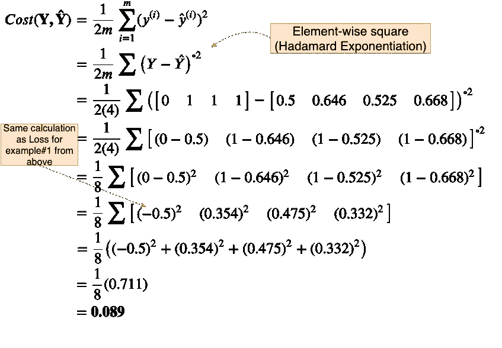**

**图 43。“或”门数据的成本计算**

**我们的**成本**与我们当前的重量 **W** ，结果是 **0.089** 。我们现在的目标是使用反向传播和梯度下降来降低这个成本。和以前一样，我们将一步一步地进行反向传播**

**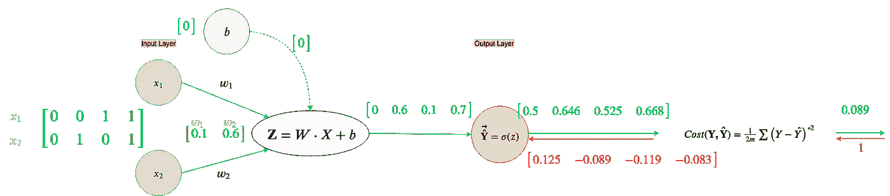****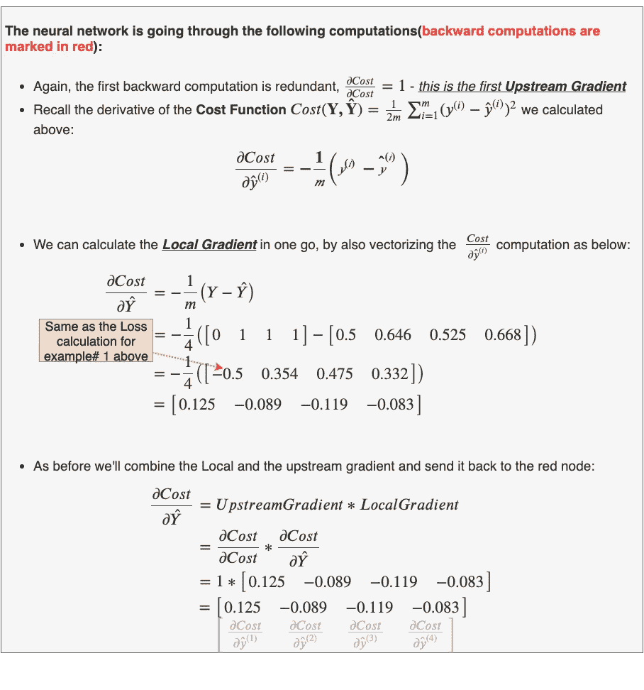**

**图 44.a .或门数据的反向矢量化**

**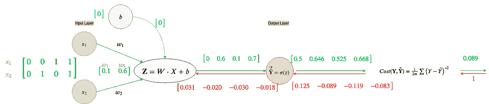****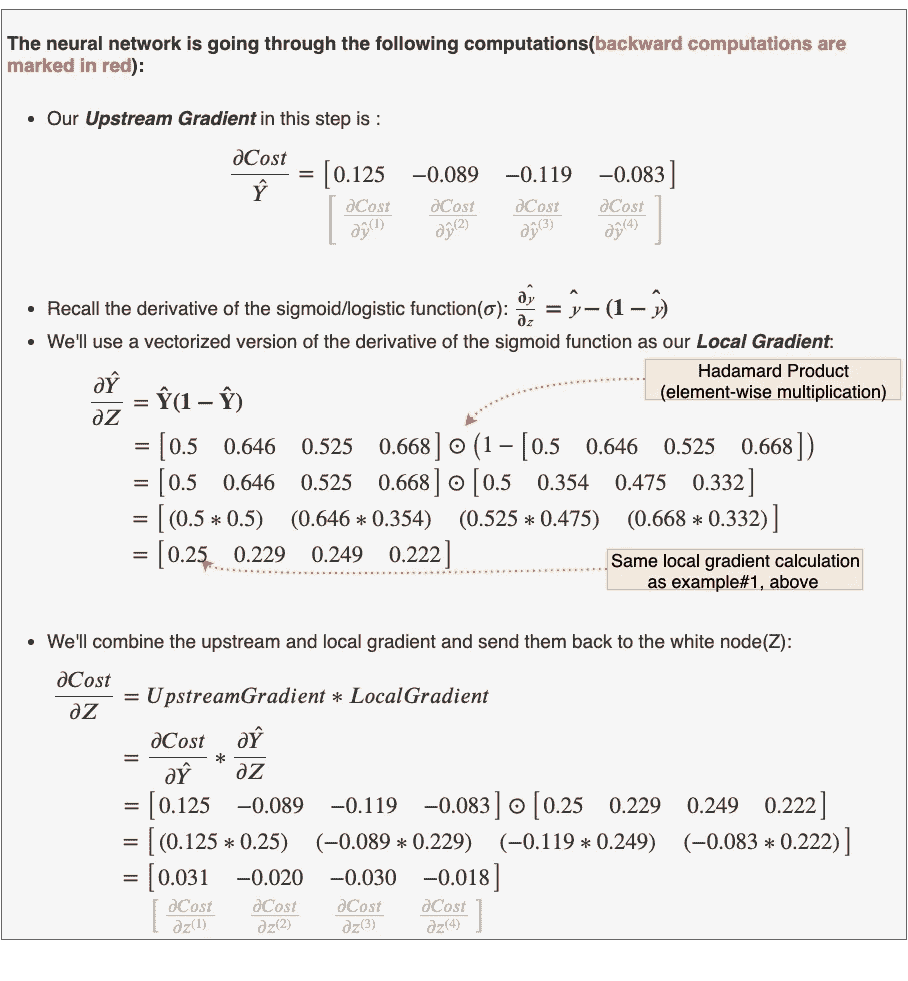**

**图 44.b .或门数据的反向矢量化**

**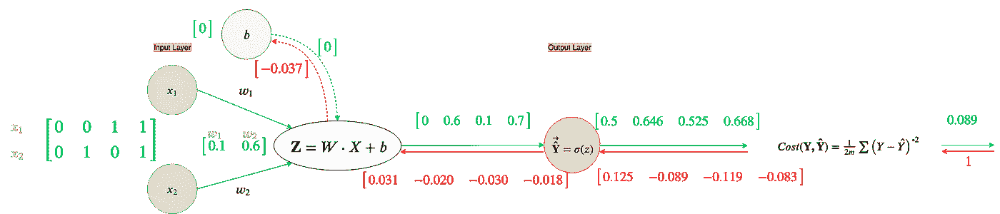****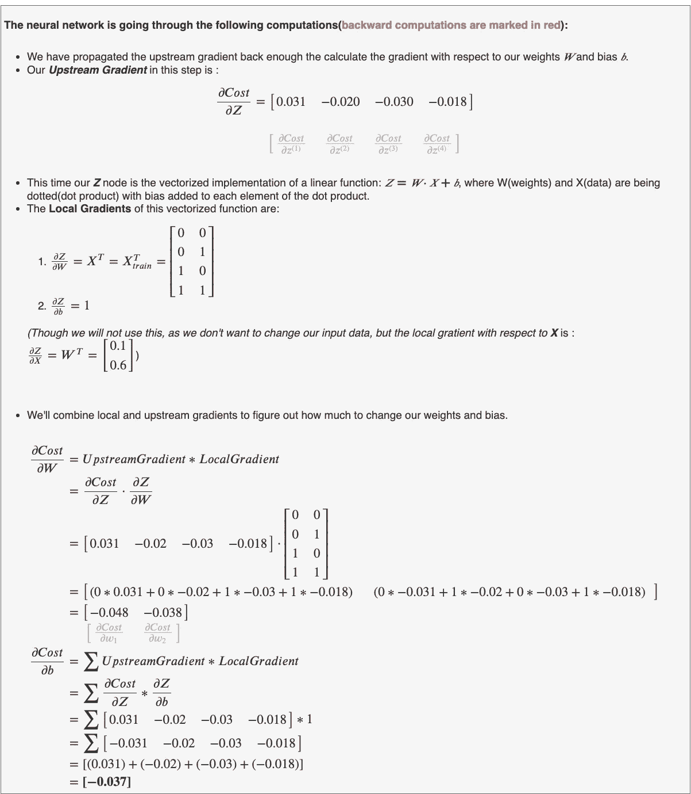**

**图 44.c .或门数据的反向矢量化**

**瞧，我们使用*批量梯度下降*的矢量化实现来一次性计算所有梯度。**

***(眼尖的人可能想知道在这最后一步中，局部梯度和最终梯度是如何计算的。别担心，我会在最后一步解释梯度的推导，很快。现在，可以说最后一步定义的梯度是对计算∂Cost/∂W 和∂Cost/∂b 的简单方法的优化***

**让我们更新权重和偏差，保持学习速率与之前的非矢量化实现相同，即 ***α=1。*****

**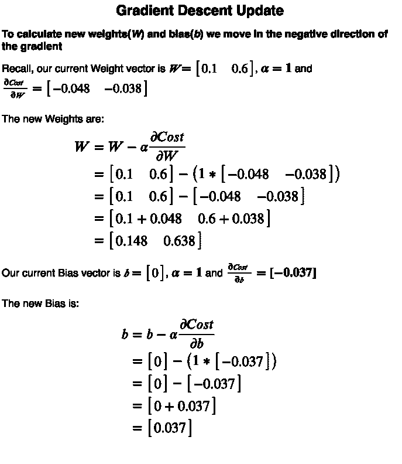**

**图 45。计算出新的权重和偏差**

**现在我们已经更新了权重和偏差，让我们做一个**正向传播**和**计算新的成本**来检查我们是否做了正确的事情。**

**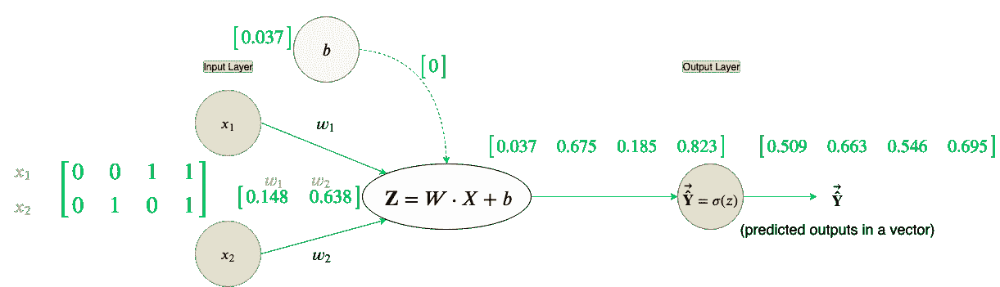****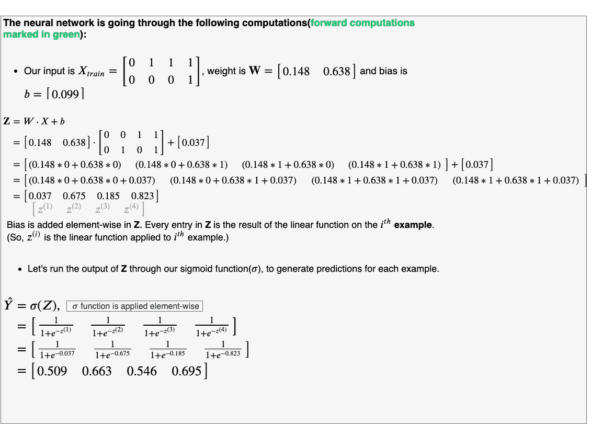**

**图 46。具有更新的权重和偏差的矢量化前向传播**

**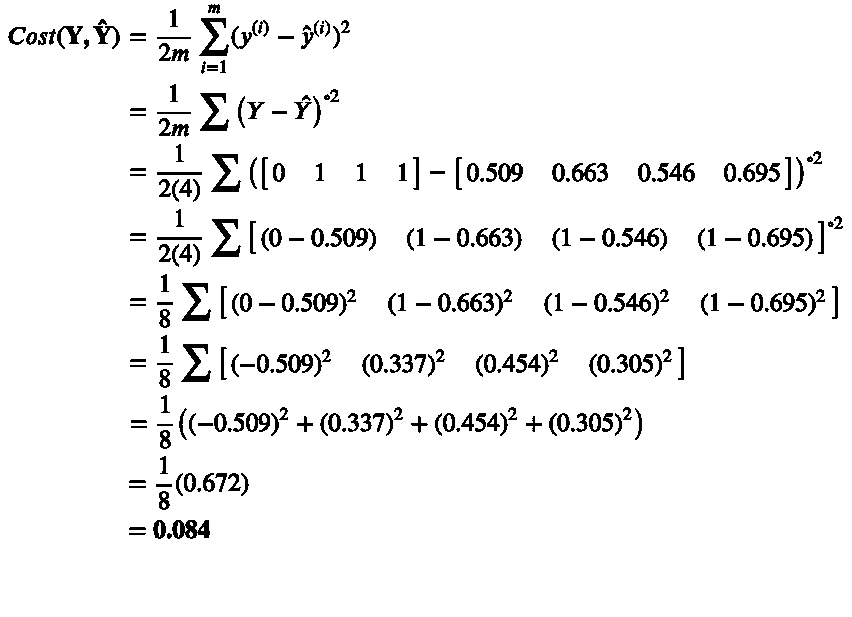**

**图 47。更新参数后的新成本**

**因此，我们*将我们的成本(所有示例的平均损失)*从最初的大约 ***0.089*** 降低到 **0.084** 。在我们能够收敛到一个低的成本之前，我们将需要进行多次训练迭代。**

**在这一点上，我建议您自己执行反向传播步骤。那的结果应该是大概的(四舍五入到小数点后 3 位): ***∂Cost/∂W = [-0.044，-0.035】******∂cost/∂b =[-0.031]。*****

**回想一下，在我们训练神经网络之前，我们如何预测神经网络可以在图 9 中分离两个类，在大约 5000 个历元(完整的批量训练迭代)之后，成本稳定地降低到大约 ***0.0005*** 并且我们得到以下判定边界 ***:*****

**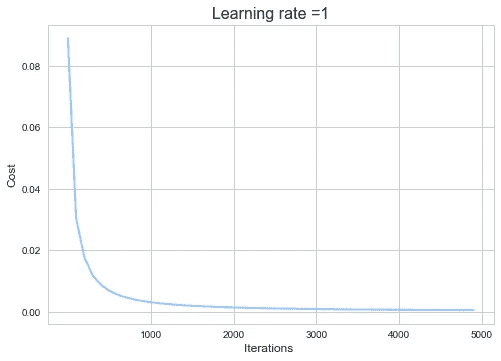****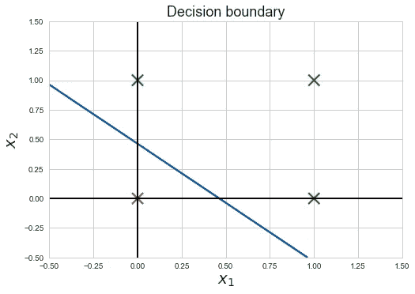**

**图 48。5000 个时代后的成本曲线和决策边界**

****成本曲线**基本上是在一定数量的迭代(在这种情况下是时期)后绘制的成本值。请注意，成本曲线在大约 3000 个时期后变平，这意味着神经网络的权重和偏差已经收敛，因此进一步的训练只会稍微改善我们的权重和偏差。为什么？回想一下 u 形损耗曲线，随着我们越来越接近最低点(平坦区域),梯度变得越来越小，因此梯度下降的步长非常小。**

****决策边界**显示了神经网络的决策从一个输出变为另一个输出的路线。我们可以通过给决策边界上下的区域着色来更好地形象化这一点。**

**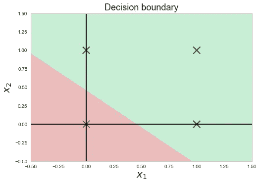**

**图 49。5000 个时代后的决策边界可视化**

**这就清楚多了。红色阴影区域是决策边界以下的区域，决策边界以下的所有内容都有一个输出( **ŷ** )为 **0** 。类似地，决策边界以上的所有内容(绿色阴影)的输出为 **1** 。总之，我们的简单神经网络通过查看训练数据并找出如何分离其两个输出类( **y=1** 和 **y=0** )来学习决策边界🙌。现在输出神经元活跃起来🔥(产生 1)每当*或***x₂*** 或两者都为 1。***

**现在是查看成本函数中的“**1/m**”(“**m**”是训练数据集中的样本总数)如何在梯度的最终计算中表现出来的好时机。**

**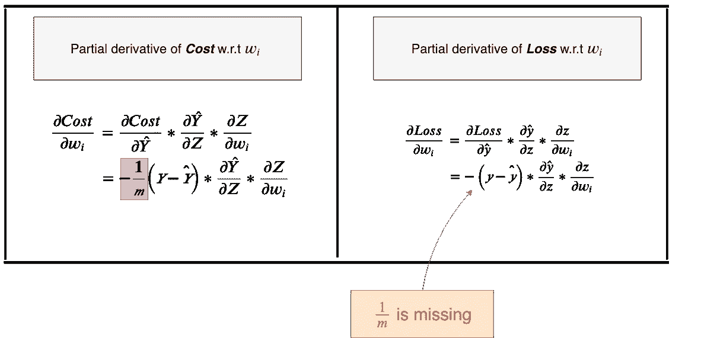**

**图 50。比较衍生小波变换成本和损失对神经网络参数的影响**

****由此可知，要知道的最重要的一点是，使用成本函数来更新我们的权重的梯度是在训练迭代期间计算的所有梯度的平均值；******同样适用于偏置**。您可能希望通过亲自检查矢量化计算来确认这一点。****

****取所有梯度的平均值有一些好处。首先，它给我们一个较少噪声的梯度估计。第二，得到的学习曲线是平滑的，帮助我们容易地确定神经网络是否在学习。当在更复杂的数据集上训练神经网络时，例如那些可能错误标记了样本的数据集，这两个特征都非常方便。****

# ****这很好，但是你怎么计算∂Cost/∂W 和∂Cost/∂b 的梯度呢？🤔。****

****我学习的神经网络指南和博客帖子经常会省略复杂的细节，或者给出非常模糊的解释。不是在这个博客里，我们会不遗余力地检查每一件事。****

## ****首先，我们要处理∂Cost/∂b.，为什么我们要对梯度求和？****

****为了解释这一点，我在三个非常简单的方程上使用了我们的计算图形技术。****

****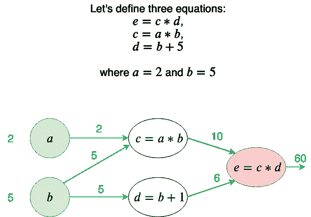****

****图 51。简单方程的计算图****

****我对 ***b*** 节点特别感兴趣，我们就这个做反向传播吧。****

****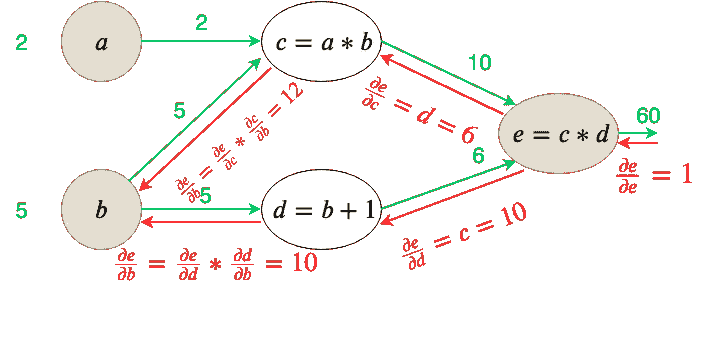****

****图 52。简单方程计算图上的反向传播****

****注意， ***b*** 节点正在从**两个**其他节点接收渐变。所以流入节点 ***b*** 的渐变的总和就是流入的两个渐变的总和*。*****

**********

*****图 53。流入节点 **b** 的梯度之和*****

*****从这个例子中，我们可以归纳出以下规则: ***从所有可能的路径中，将所有进入的渐变求和到一个节点。********

****让我们想象一下如何在**偏差**的计算中使用该规则。*我们的神经网络可以被视为对我们的每个示例*进行 ***独立的*** *计算，但是在批量训练迭代期间使用权重和偏差的共享参数。Below bias ( ***b*** )被可视化为我们的神经网络执行的所有单独计算的共享参数。*****

***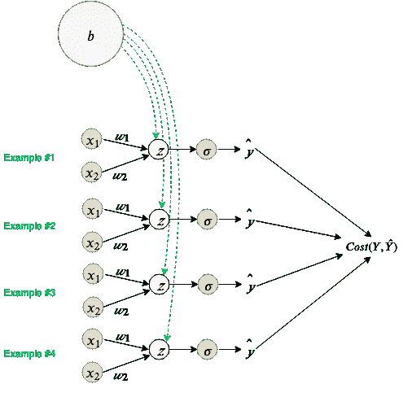***

***图 54。可视化跨训练时期共享的偏差参数。***

***遵循上面定义的一般规则，我们将对从所有可能路径到偏置节点的所有输入梯度求和， **b** 。***

***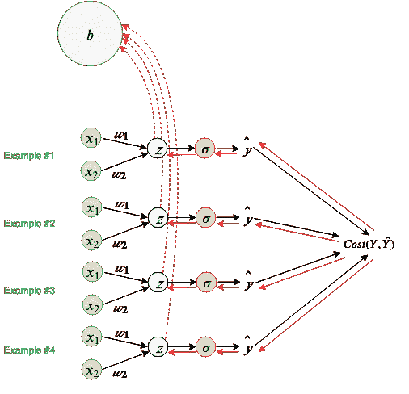***

***图 55。可视化到共享偏置参数的所有可能的反向传播路径***

***因为∂Z/∂b(在 z 节点的局部梯度)等于 **1** ，所以在**t5】b的总梯度是来自每个例子的关于成本的梯度的总和。*****

***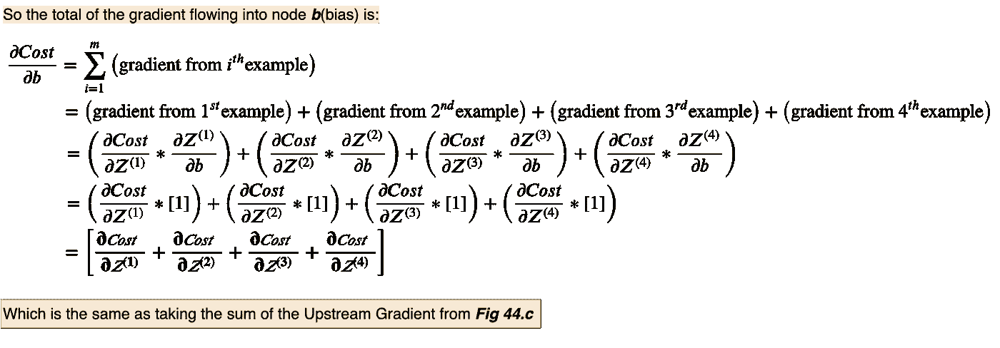***

***图 56。∂Cost/∂b 是上游梯度之和的证明***

***既然我们已经得到了偏差的导数，让我们继续讨论权重的导数，更重要的是权重的局部梯度。***

## ***局部 gradient(∂Z/∂W)如何等于输入训练数据的转置(X_train)？***

***这可以用与上述偏差计算类似的方式来回答，但是这里的主要复杂之处是计算权重矩阵(***【w】***)和数据矩阵(***【xₜᵣₐᵢₙ】***)之间的点积的导数，这形成了我们的局部梯度。***

***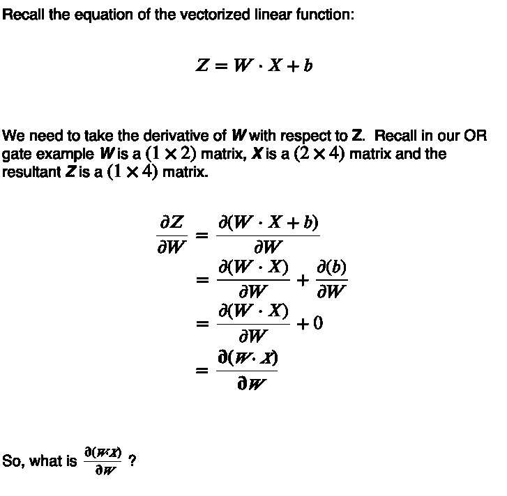***

***图 57a .计算点积的导数。***

***点积的导数有点复杂，因为我们不再处理标量；取而代之的是，无论是 ***W*** 和 ***X*** 都是矩阵， ***W⋅ X*** 的结果也是矩阵。让我们先用一个简单的例子来更深入一点，然后再从中归纳。***

***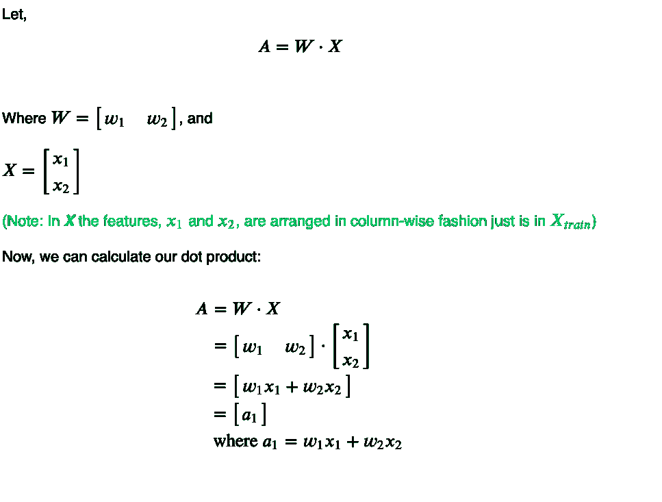***

***图 57b .计算点积的导数。***

***让我们计算一下 ***A*** 相对于 ***W*** 的导数。***

***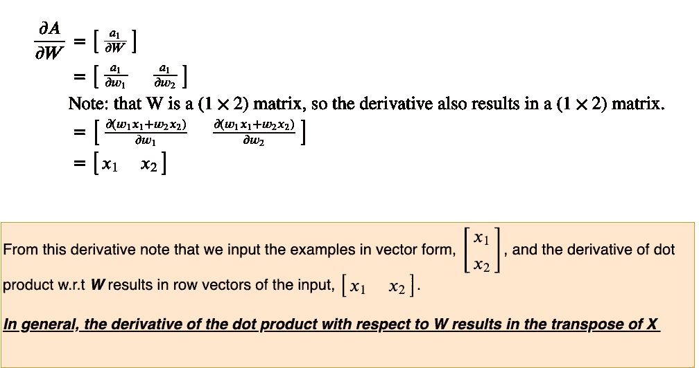***

***图 57c .计算点积的导数。***

***让我们在批量训练迭代的情况下将这一点形象化，其中多个例子同时被处理。*(注意输入的例子是列向量。)****

***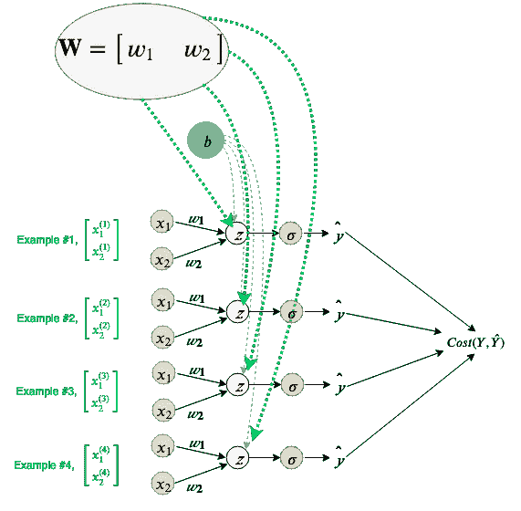***

***图 58。可视化在整个训练时期共享的权重***

***正如偏差( **b)** 在批量训练迭代中的每个计算中被共享一样，权重( ***W*** )也被共享。我们还可以将梯度流回权重可视化，如下所示*(注意，每个示例 w.r.t 对* ***W*** *的局部导数导致输入示例的行向量，即输入的转置)*:***

***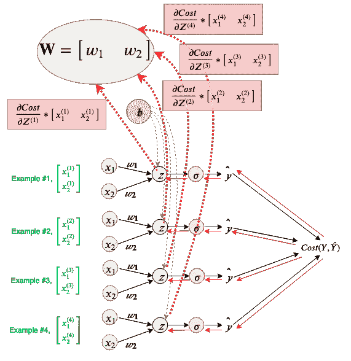***

***图 59。将所有可能的反向传播路径可视化到共享权重参数***

***同样，遵循上面定义的一般规则，我们将对从所有可能路径到权重节点的所有传入梯度求和， **W** 。***

***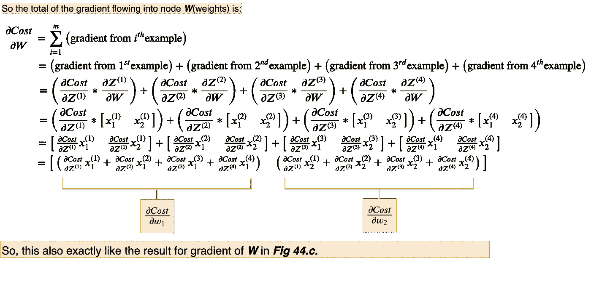***

***图 60。可视化后∂Cost/∂W 的推导。***

***到目前为止，我们所做的计算，*，虽然是正确的，并且是一个很好的解释，但是，这不是一个优化的计算。我们也可以将这种计算矢量化。让我们接下来做那个****

****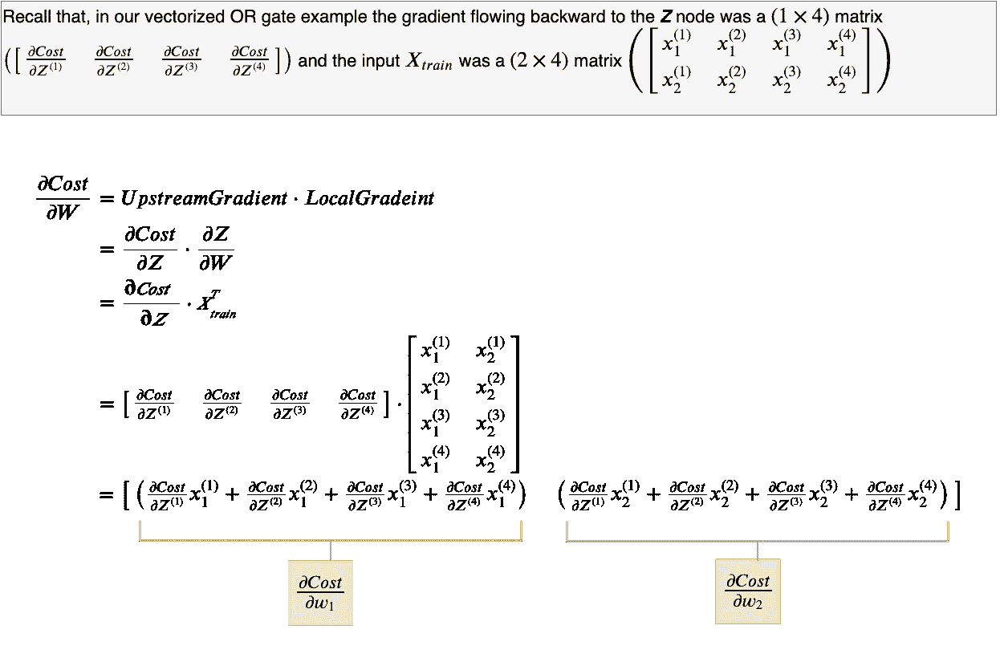****

****图 61。证明∂Cost/∂W 是上游梯度和*转置的点积*****

## *****有没有更简单的方法来解决这个问题，不需要数学？*****

*****是啊！使用 ***量纲分析*** 。*****

*****在我们的 OR 门示例中，我们知道流入节点*的梯度是a (1 × 4)矩阵，Xₜᵣₐᵢₙ是(2 × 4)矩阵，并且成本相对于 ***W*** 的导数需要与 ***W*** 大小相同，即(1 × 2)。因此，生成(1 × 2)矩阵的唯一方法是取*和***【xₜᵣₐᵢₙ】***之间的点积。*******

*****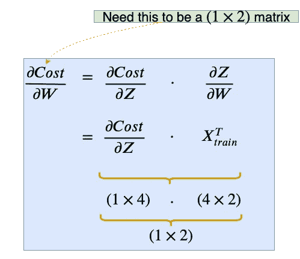*****

*****同样，已知 bias， ***b*** ，是一个简单的(1 × 1)矩阵，流入节点 Z 的梯度是(1 × 4)，使用量纲分析我们可以确定成本 w.r.t ***b*** 的梯度也需要是一个(1 × 1)矩阵。我们能做到这一点的唯一方法，给定局部梯度(***【∂z/∂b】***)正好等于***【1】***)，是通过对上游梯度求和。*****

*****最后一点要注意的是，推导导数表达式时，先做一些小例子，然后从这些例子中进行归纳。例如，在这里，当计算点积 w.r.t 对***【W，*** *的导数时，我们使用单个列向量作为测试用例，并从那里进行推广，如果我们使用整个数据矩阵，那么导数将产生一个(4 × 1 × 2)张量(多维矩阵)，在此基础上的计算可能会有点麻烦。******

*****在结束本节之前，让我们看一个稍微复杂一点的例子。*****

*****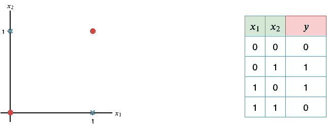*****

*****图 62。异或门数据*****

*****上面的图 62 显示了一个异或门数据。看着它注意标签，***【y】***，等于*只有当其中一个值*或*等于***【1】***，*不同时等于*。这使得它成为一个特别具有挑战性的数据集，因为数据不是线性可分的，即没有单一的直线判定边界可以成功地将数据中的两个类( ***y=1*** 和 ***y=0*** )分开。XOR 曾经是早期人工神经网络的祸根。********

*****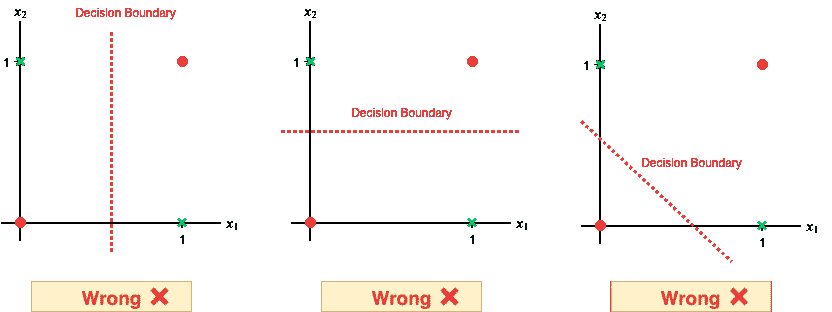*****

*****图 63。一些错误的线性决策界限*****

*****回想一下，我们当前的神经网络之所以成功，只是因为它能够计算出能够成功分离两类或门数据集的直线决策边界。直线不会在这里切断它。那么，我们如何让神经网络来解决这个问题呢？*****

*****嗯，我们可以做两件事:*****

1.  *****修改数据本身，以便除了特征*和***【x₂】***之外，第三个特征提供一些附加信息来帮助神经网络决定好的决策边界。这个过程称为 ***特征工程*** 。******
2.  *****改变神经网络的架构，使其更深入。*****

*****让我们看一看哪一个更好。*****

## *****特征工程*****

*****让我们看一个类似于 XOR 数据的数据集，它将帮助我们实现一个重要的认识。*****

*****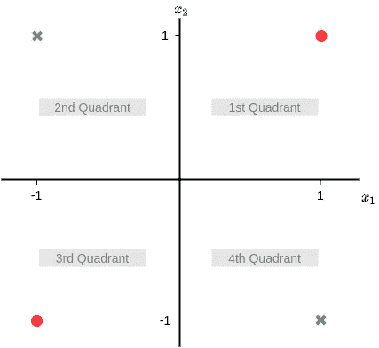*****

*****图 64。不同象限中的类 XOR 数据*****

*****图 64 中的数据与 XOR 数据完全一样，只是每个数据点分布在不同的象限。请注意，在 **1ˢᵗ和 3ʳᵈ象限中，x₁和 x₂的乘积为正**，而在 **2ⁿᵈ和 4ᵗʰ象限中，x₁和 x₂的乘积为负。*******

*****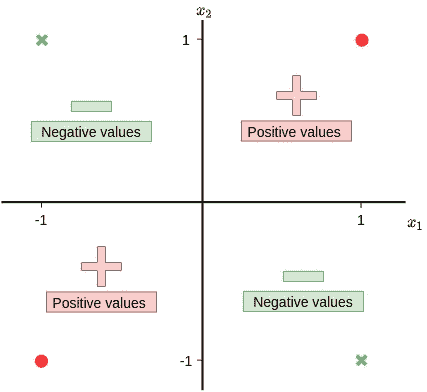*****

*****图 65。正负象限*****

*****这是为什么呢？在 **1ˢᵗ** 和 **3ʳᵈ** 象限**中，数值的符号被平方**，而在 **2ⁿᵈ** 和 **4ᵗʰ** 象限**中，数值是一个负数和一个正数之间的简单乘积，从而产生一个负数。*******

*****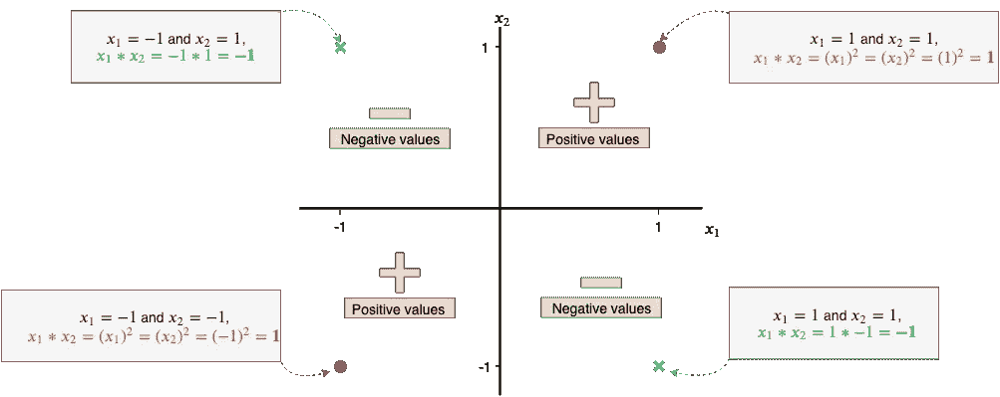*****

*****图 66。特性乘积的结果*****

*****所以，这给了我们一个使用两个特性的*产品的模式。我们甚至可以在 XOR 数据中看到类似的模式，其中每个象限都可以以类似的方式识别。******

*****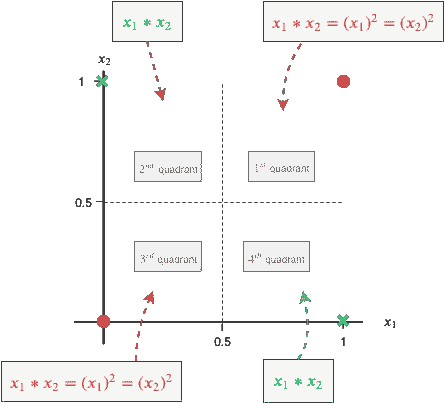*****

*****图 67。XOR 数据图中的象限模式*****

********因此，一个好的第三个特征，x₃，将是特征 x₁和 x₂(i.e. x₁*x₂).的乘积********

*****特征的乘积称为一个 ***特征交叉*** 并产生一个新的 ***合成特征*** 。*特征交叉可以是特征本身(如****【x₁】【x₁】…****)，也可以是两个或两个以上特征的乘积(如****【x₁*x₂】【x₁*x₂*x₃】…****)，甚至是两者的组合(如****【x₁*x₂****)。例如，在房屋数据集中，输入要素是房屋的宽度和长度(以码为单位),标注是房屋在地图上的位置，此位置的更好预测因子可能是房屋宽度和长度之间的要素交叉，这为我们提供了一个新要素“房屋的平方码大小”。******

*****让我们将新的合成特征添加到我们的训练数据中，Xₜᵣₐᵢₙ.*****

*****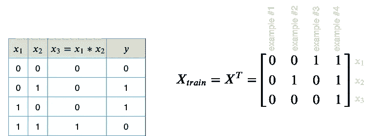*****

*****图 68。新培训数据*****

*****使用这种特征交叉，我们现在可以成功地学习决策边界，而无需显著改变神经网络的架构。我们只需要为 ***x₃*** 添加一个输入节点，并给输入层添加一个对应的权重(*随机设置为 0.2* )。*****

*****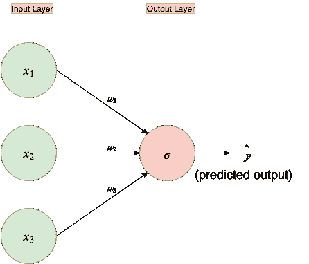*****

*****图 69。具有特征 cross(x₃的神经网络)作为输入*****

*****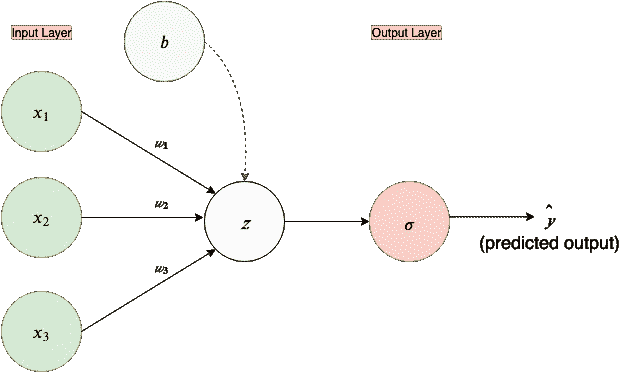*****

*****图 70。具有特征 cross(x₃的扩展神经网络)作为输入*****

*****下面给出的是神经网络的第一次训练迭代，你可以自己进行计算并确认它们，因为它们是一个很好的练习。由于我们已经熟悉了这种神经网络架构，我不会像以前一样一步一步地完成所有的计算，尽管这将是你展示肌肉并与下面的答案相符的好时机。*****

******(以下所有计算均四舍五入至小数点后 3 位)******

*****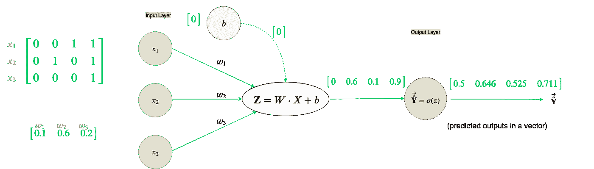*****

*****图 71。第一次训练迭代中的正向传播*****

*****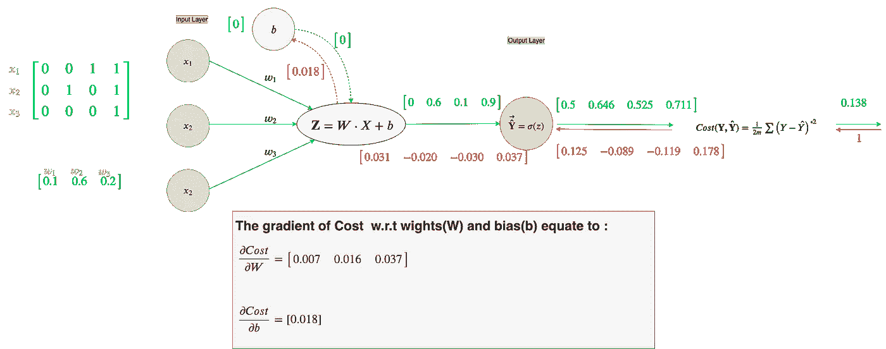*****

*****图 72。第一次训练迭代中的反向传播*****

*****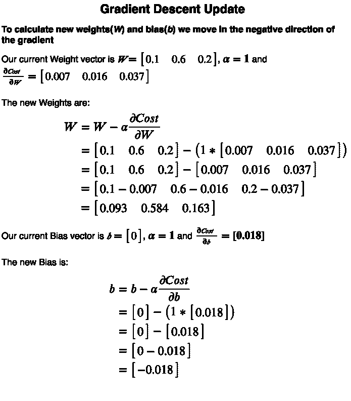*****

*****图 73。在第一次训练迭代中，为新的权重和偏差进行梯度下降更新*****

*****经过 5000 个时期后，学习曲线和决策边界看起来如下:*****

*****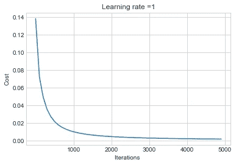**********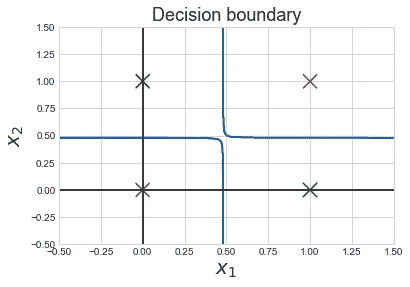

图 74。具有特征交叉的神经网络的学习曲线和决策边界***** 

*****和以前一样，为了更好地可视化，我们可以对神经网络的决策从一个变化到另一个的区域进行着色。*****

*****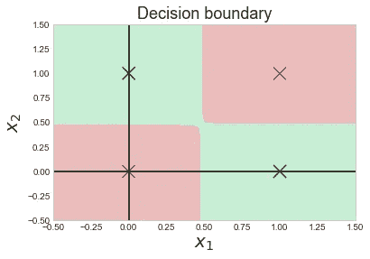*****

*****图 75。阴影决策边界更好的可视化*****

********注意，特征工程允许我们创建一个非线性的决策边界。*** 它是怎么做到的？我们只需要看看 ***Z*** 节点在计算什么函数。*****

**********

*****图 76。添加特征交叉后，节点 **Z** 正在计算多项式*****

*****因此，特征交叉帮助我们创建复杂的非线性决策边界。*****

********这是一个非常强大的想法！********

## *****改变神经网络结构*****

*****这是更有趣的方法，因为它允许我们自己绕过特征工程，而 ***让神经网络计算出特征本身！********

*****我们来看看下面这个神经网络:*****

*****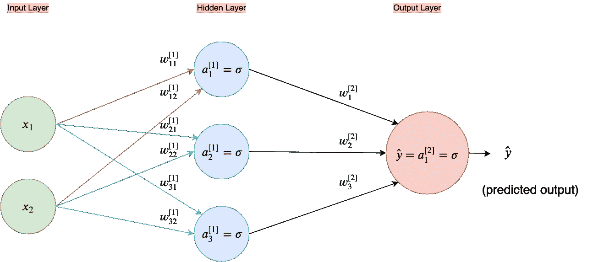*****

*****图 77。单隐层神经网络。*****

*****因此，我们在“或”门示例的神经网络架构中间添加了一些新节点，保持输入层和输出层相同。中间这列新节点叫做 ***隐藏层。*** *为什么要隐藏图层？因为在定义它之后，我们不能直接控制隐藏层中的神经元如何学习，不像输入和输出层，我们可以通过改变数据来改变它；此外，由于隐藏层既不构成神经网络的输出也不构成神经网络的输入，所以它们本质上对用户是隐藏的。******

********我们可以有任意数量的隐藏层，每层中有任意数量的神经元*** 。这种结构需要由神经网络的创建者来定义。*因此，* ***隐藏层的数量和每层中神经元的数量也是超参数。我们添加的隐藏层越多，我们的神经网络架构就变得越深，我们在隐藏层中添加的神经元越多，网络架构就变得越宽。神经网络模型的深度就是“深度学习”这个术语的来源。********

******经过一些实验，选择了图 77 中具有三个乙状结肠神经元的一个隐藏层的架构。******

*****由于这是一个新的架构，我将一步一步地进行计算。*****

*****首先，让我们扩展神经网络。*****

*****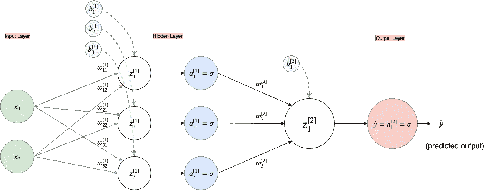*****

*****图 78。单隐层扩展神经网络*****

*****现在让我们执行一个 ***正向传播:********

*****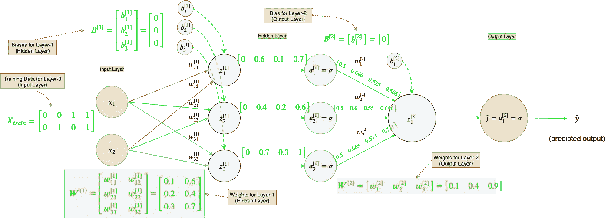**********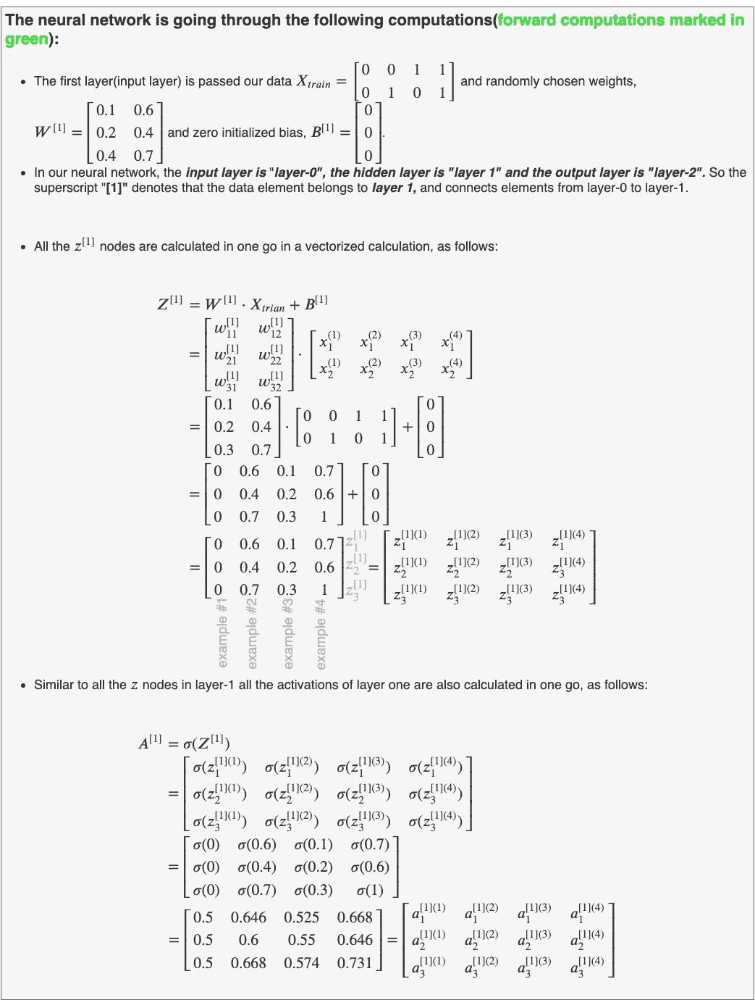*****

*****图 79.a .带有隐藏层的神经网络上的前向传播*****

*****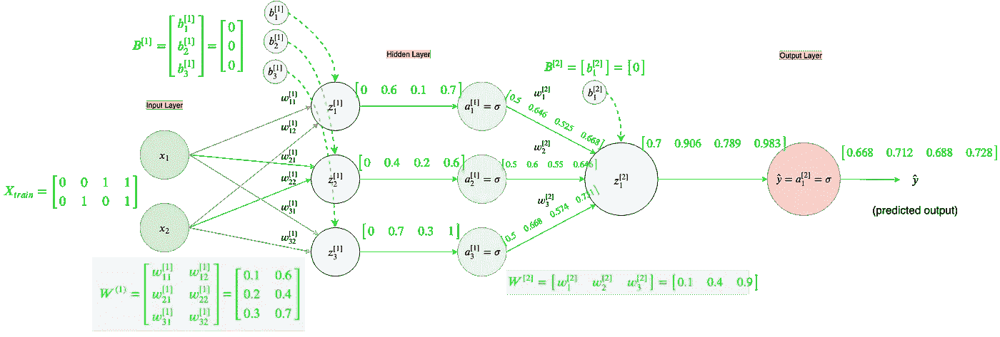**********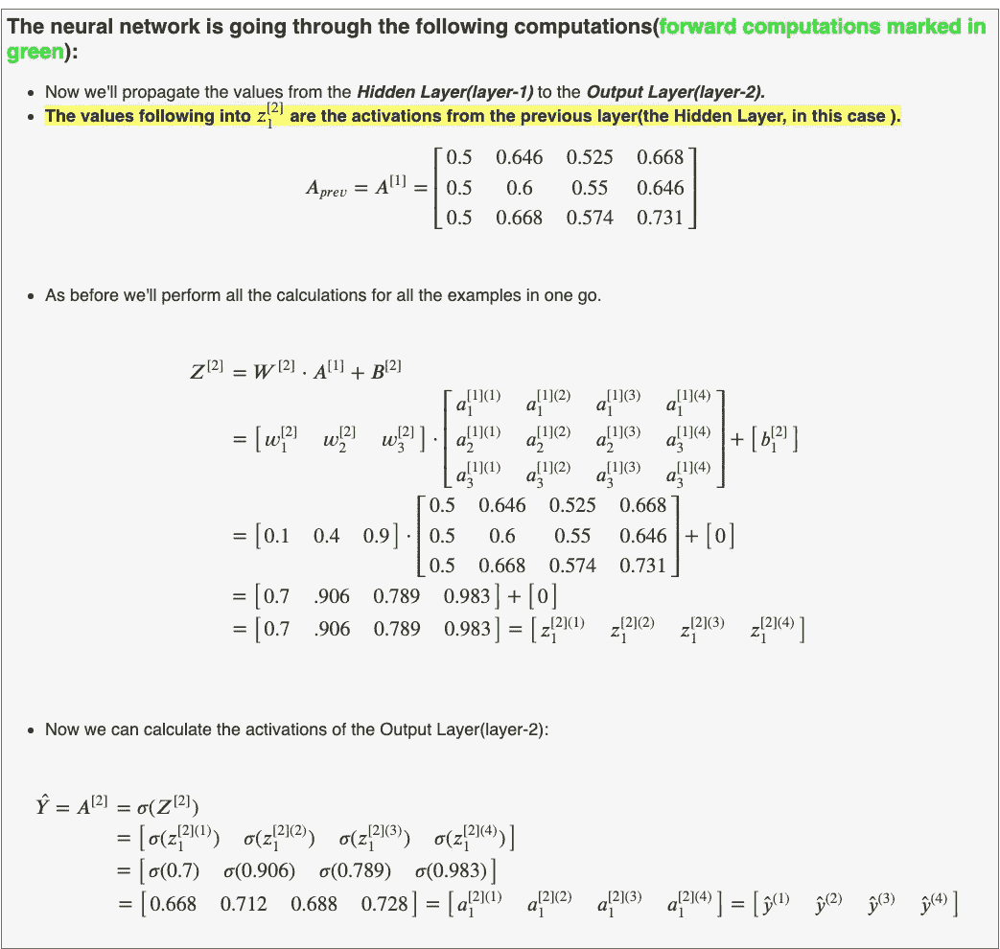*****

*****图 79b .带有隐藏层的神经网络的前向传播*****

*****我们现在可以计算成本:*****

*****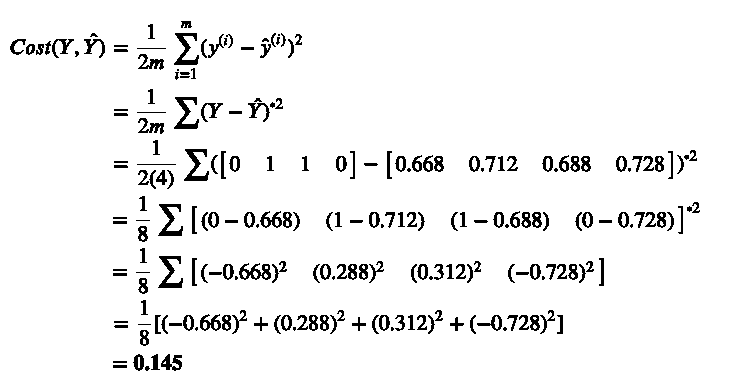*****

*****图 80。在**第一个**前向传播之后，具有一个隐藏层的神经网络的成本*****

*****计算完成本后，我们现在可以进行反向传播，并改进权重和偏差。*****

*****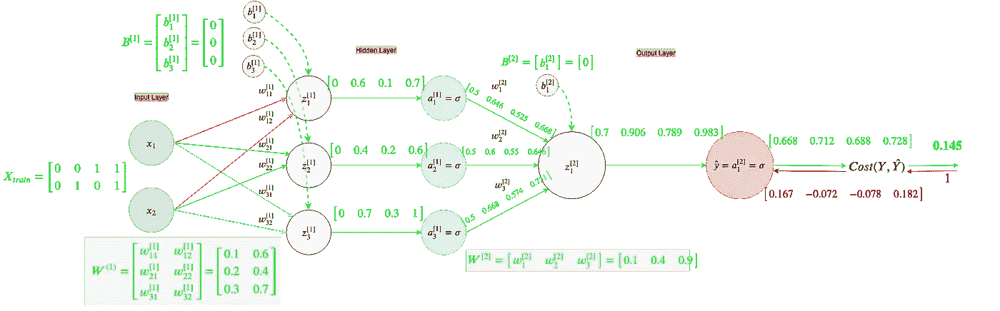**********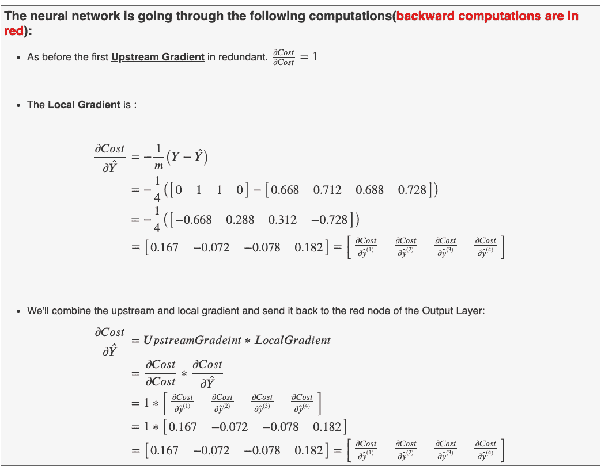*****

*****图 81.a .带有隐藏层的神经网络的反向传播*****

*****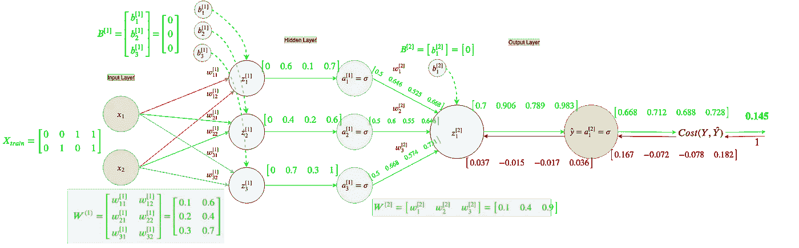**********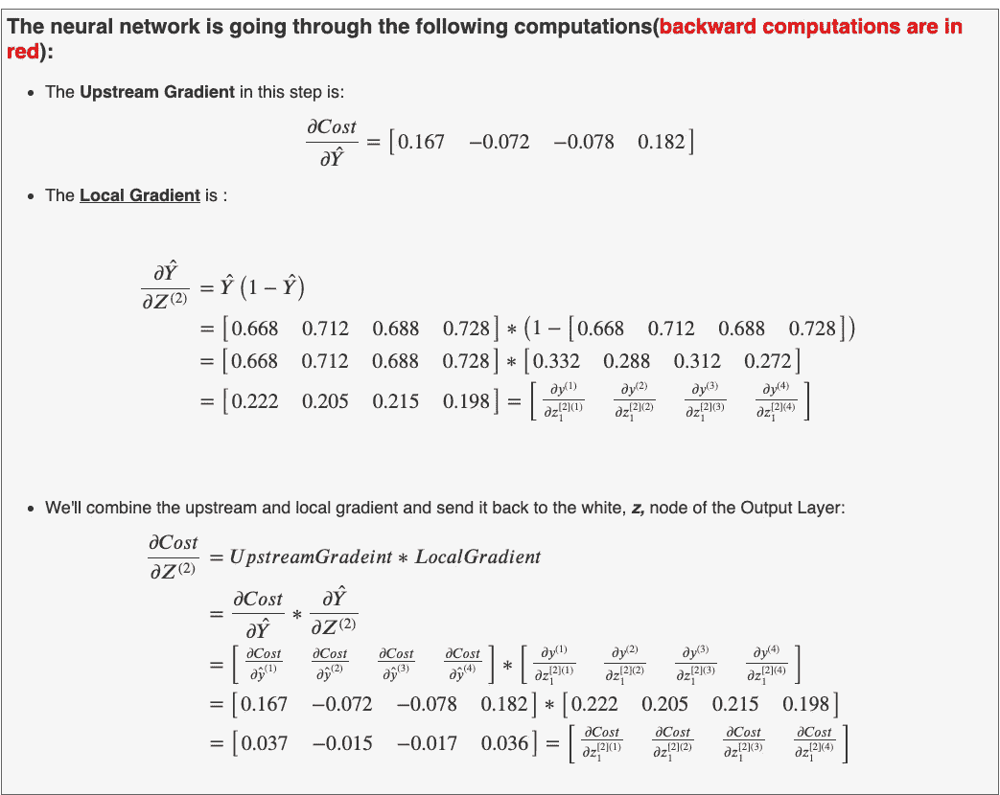*****

*****图 81b .带有隐藏层的神经网络的反向传播*****

*****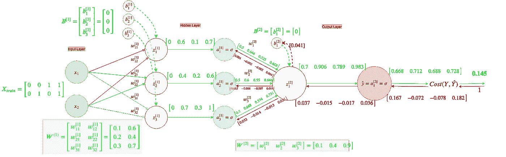***************

*****图 81c .带有隐藏层的神经网络的反向传播*****

*****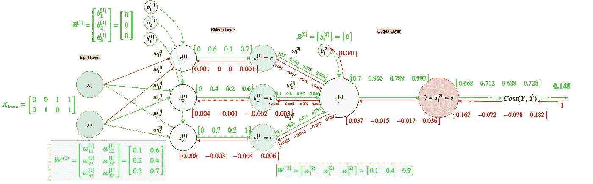**********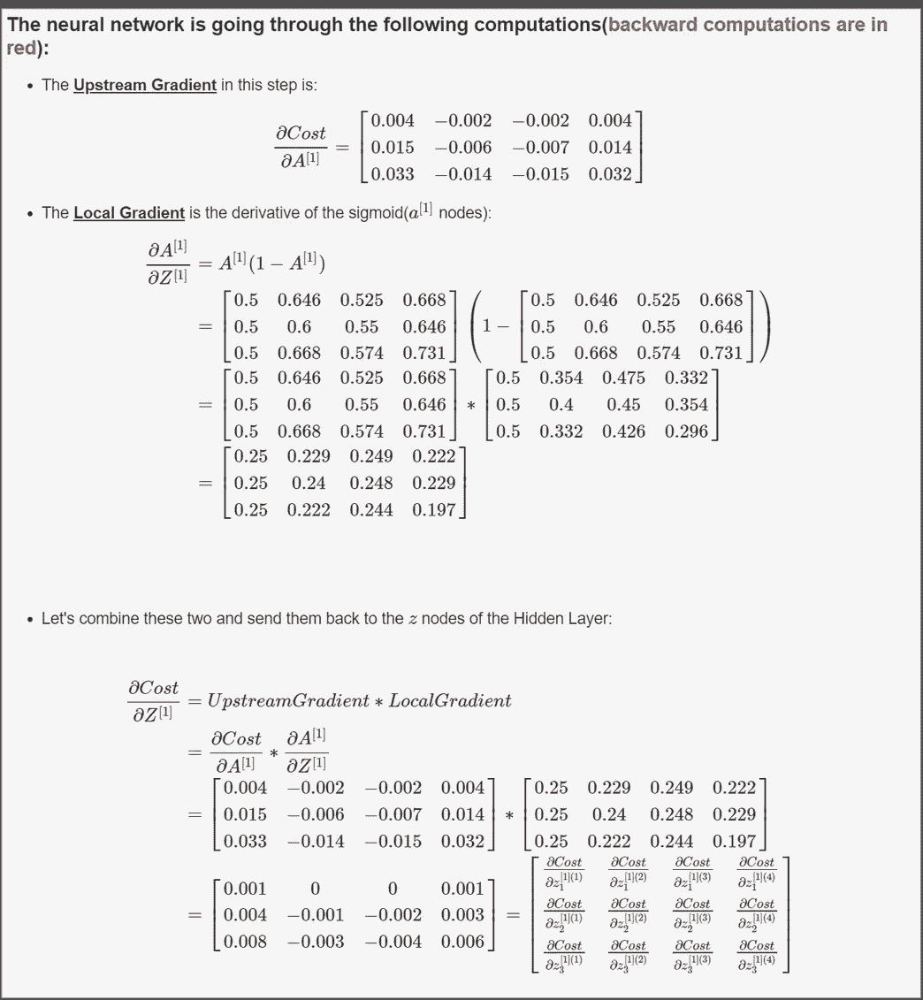*****

*****图 81d .具有隐藏层的神经网络上的反向传播*****

*****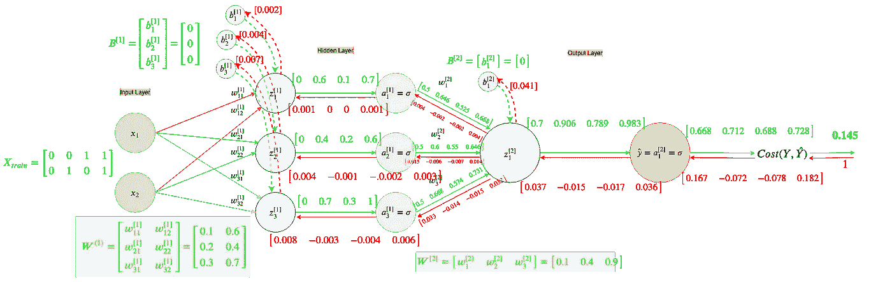**********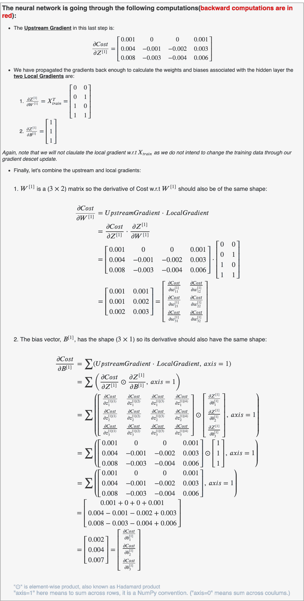*****

*****图 81e .带有隐藏层的神经网络的反向传播*****

*****嚄😅！这是很多，但它大大提高了我们的理解。让我们执行梯度下降更新:*****

*****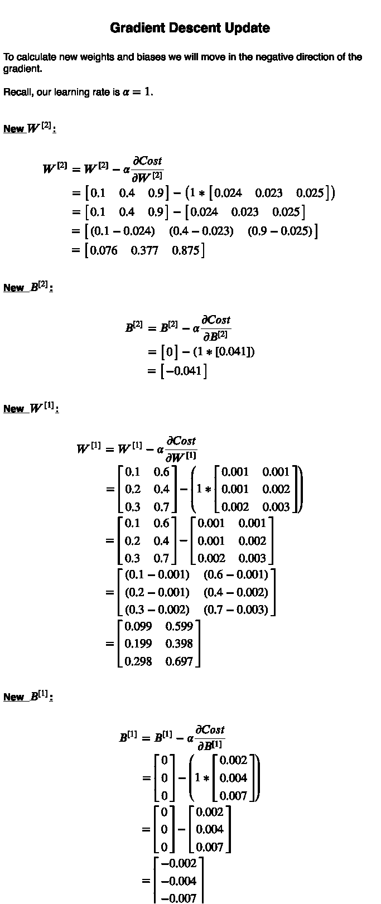*****

*****图 82。隐层神经网络的梯度下降更新*****

*****在这一点上，我鼓励所有读者自己执行一次训练迭代。产生的梯度应该约为(四舍五入到小数点后 3 位):*****

*****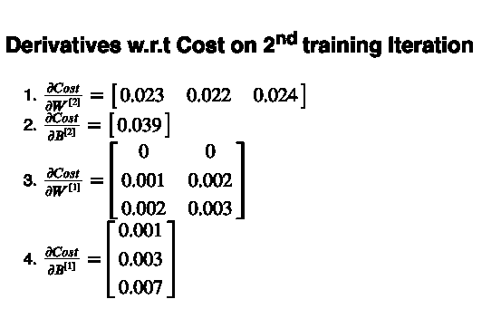*****

*****图 83。在 2ⁿᵈ训练迭代期间计算的导数*****

*****在 5000 个历元之后，成本稳步下降到大约 ***0.0009*** ，并且我们得到以下学习曲线和决策边界:*****

*****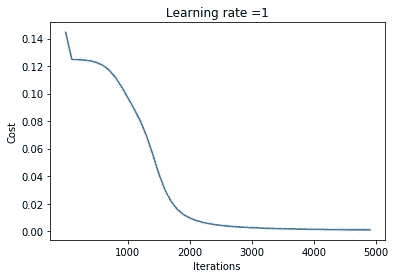**********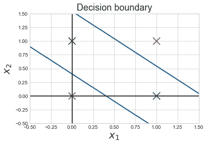

图 84。单隐层神经网络的学习曲线和决策边界***** 

*****让我们也想象一下神经网络的决策从 0(红色)变为 1(绿色)的位置:*****

**********

*****图 85。单隐层神经网络的阴影决策边界*****

*****这表明神经网络实际上已经学会了在哪里启动(输出 1)和在哪里休眠(输出 0)。*****

*****如果我们添加另一个可能有 2 或 3 个 sigmoid 神经元的隐藏层，我们可以得到一个更复杂的决策边界，可能会更紧密地适合我们的数据，但让我们把它留给编码部分。*****

*****在结束本节之前，我想回答一些剩余的问题:*****

## *****1-那么，特征工程和深度神经网络哪个更好呢？*****

*****嗯，答案取决于很多因素。一般来说，如果我们有大量的训练数据，我们可以使用深度神经网络来达到可接受的精度，但如果数据有限，我们可能需要执行一些特征工程，以从我们的神经网络中提取更多的性能。正如您在上面的特征工程示例中所看到的，要进行良好的特征交叉，您需要对他们正在处理的数据集有深入的了解。*****

******特征工程与深度神经网络是一个强大的组合。******

## *****2-如何计算神经网络的层数？*****

*****按照惯例，如果没有可调权重和偏差，我们不会计算层数。因此，虽然输入层是一个单独的“层”,但在指定神经网络的深度时，我们不将其计算在内。*****

*****所以，我们的最后一个例子是一个“ *2 层神经网络*”(一个隐藏层+输出层)，而它之前的所有例子只是一个“ *1 层神经网络*”(仅输出层)。*****

## *****3-为什么使用激活功能？*****

********激活函数是非线性函数，给神经元增加非线性。特征十字是隐藏层*** 中激活功能叠加的结果。因此，一组激活函数的组合导致复杂的非线性决策边界。在这篇博客中，我们使用了 sigmoid/logistic 激活函数，但是还有许多其他类型的激活函数( *ReLU 是隐藏层*的流行选择)，每一种都提供了一定的好处。 ***在创建神经网络时，激活函数的选择也是一个超参数。********

********没有激活函数来增加非线性，无论我们叠加多少线性函数，它们的结果仍然是线性的。*** 考虑以下情况:*****

*****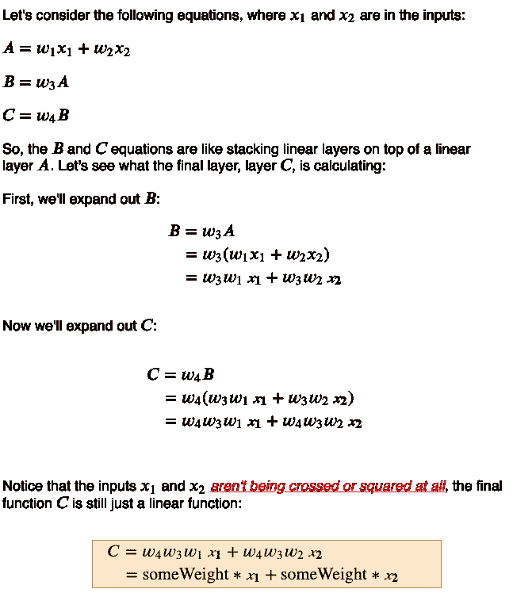*****

*****图 86。显示堆叠线性层/函数导致线性层/函数*****

*****你可以使用任何非线性函数作为激活函数。有些研究者甚至使用了 ***cos*** 和 **sin** 函数。优选地，激活函数应该是连续的，即在函数的域中没有间断。*****

## *****4-为什么随机初始化权重？*****

*****这个问题现在回答起来容易多了。请注意，如果我们将一个层中的所有权重设置为相同的值，那么通过每个节点的梯度将是相同的。简而言之，该层中的所有节点将学习关于数据的相同特征。将权重设置为 ***随机值有助于打破权重*** 的对称性，使得层中的每个节点都有机会学习训练数据的独特方面*****

*****在神经网络中有许多随机设置权重的方法。对于小型神经网络，将权重设置为较小的随机值是可以的。对于较大的网络，我们倾向于使用“Xavier”或“He”初始化方法(*将在编码部分*)。这两种方法仍然将权重设置为随机值，但控制它们的方差。现在，可以说，当网络似乎没有收敛，并且当使用将权重设置为小的随机值的“简单”方法时，成本变得静态或降低非常缓慢时，使用这些方法就足够了。权重初始化是一个活跃的研究领域，将成为未来“除了数字什么都没有”博客的主题。*****

*****偏差也可以随机初始化。但在实践中，它似乎对神经网络的性能没有太大的影响。也许这是因为神经网络中偏向项的数量比权重少得多。*****

*****我们在这里创建的神经网络类型被称为“ ***全连接前馈网络*** ”或简称为“ ***前馈网络*** ”。*****

*****第一部分到此结束。*****

*****[](https://www.buymeacoffee.com/rafaykhan)

如果你喜欢的话！***** 

# *****第二部分:模块化神经网络的编码*****

*****这一部分的实现遵循 OOP 原则。*****

*****我们先来看一下**线性层**类。构造函数将以下参数作为参数:传入数据的形状(`input_shape`)、层输出的神经元数量(`n_out`)以及需要执行哪种类型的随机权重初始化(`ini_type=”plain”`，默认为“普通”，这只是小的随机高斯数)。*****

*****`initialize_parameters`是用于定义权重和偏差的辅助函数。稍后，我们将分别讨论它。*****

*****线性层实现以下功能:*****

*   *****`forward(A_prev)`:该功能允许线性层接收来自前一层的激活(输入数据可视为来自输入层的激活)，并对其执行线性操作。*****
*   *****`backward(upstream_grad)`:该函数计算前一层的成本 w.r.t 权重、偏差和激活的导数(分别为`dW`、`db` 、&、`dA_prev`)*****
*   *****`update_params(learning_rate=0.1)`:该功能使用`backward`功能中计算的导数对权重和偏差执行梯度下降更新。默认学习率(α)是 0.1*****

*****图 87。线性图层类*****

*****现在让我们来看一下 **Sigmoid Layer** 类，它的构造函数将来自它前面的线性层的数据的形状作为参数。*****

*****Sigmoid 层实现以下功能:*****

*   *****`forward(Z)`:该功能允许 sigmoid 层接收来自前一层的线性计算(`Z`)并对其执行 sigmoid 激活。*****
*   *****`backward(upstream_grad)`:此函数计算成本 w . r . t***Z***(`dZ`)的导数。*****

*****图 88。Sigmoid 激活层类*****

*****`initialize_parameters`函数仅在线性层中用于设置权重和偏差。使用输入(`n_in`)和输出(`n_out`)的大小，定义权重矩阵和偏差向量需要的形状。然后，该辅助函数将 python 字典中的权重(W)和偏差(b)返回给相应的线性图层。*****

*****图 89。设置权重和偏差的辅助函数*****

*****最后，成本函数 `compute_cost(Y, Y_hat)`将来自最后一层的激活(`Y_hat`)和真实标签(`Y`)作为自变量，并计算和返回平方误差成本(`cost`)及其导数(`dY_hat`)。*****

*****图 90。计算平方误差成本和导数的函数*****

******此时，您应该打开*[***2 _ layer _ toy _ network _ XOR***](https://github.com/RafayAK/NothingButNumPy/blob/master/Understanding_and_Creating_NNs/2_layer_toy_network_XOR.ipynb)*Jupyter 笔记本，从这个* [***资源库***](https://github.com/RafayAK/NothingButNumPy/tree/master/Understanding_and_Creating_Binary_Classification_NNs) *中打开一个单独的窗口，并排浏览这个博客和笔记本。******

*****现在我们准备创建我们的神经网络。让我们使用*图 77* 中为 XOR 数据定义的架构。*****

*****图 91。定义层和训练参数*****

*****现在我们可以开始主要的训练循环了:*****

*****图 92。训练循环*****

*****在笔记本中运行循环，我们看到在 4900 个历元之后，成本降低到大约 0.0009*****

```
***...
Cost at epoch#4600: 0.001018305488651183
Cost at epoch#4700: 0.000983783942124411
Cost at epoch#4800: 0.0009514180100050973
Cost at epoch#4900: 0.0009210166430616655***
```

*****学习曲线和决策界限如下所示:*****

*****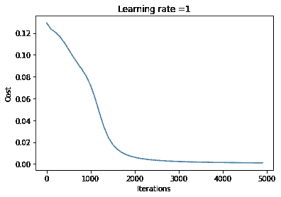**********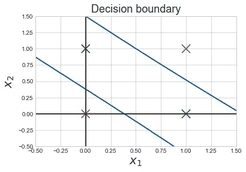**********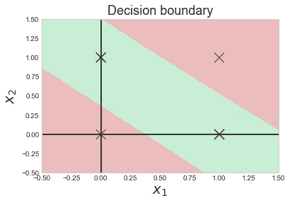*****

*****图 93。学习曲线、决策边界和阴影决策边界。*****

*****我们训练过的神经网络产生的预测是准确的。*****

```
***The predicted outputs:
 [[ 0\.  1\.  1\.  0.]]
The accuracy of the model is: 100.0%***
```

*****请务必查看 [***资源库***](https://github.com/RafayAK/NothingButNumPy) 中的其他笔记本。我们将在未来的“除了 NumPy 之外什么都不是”博客中建立我们在这个博客中学到的东西，因此，作为一个练习，你应该从记忆中创建层类，并尝试重现 ***部分*******ⅰ****中的 OR 门示例。*******

*****博客到此结束🙌🎉。我希望你喜欢。*****

*****如有任何问题，请随时通过 [twitter](https://twitter.com/RafayAK) [@RafayAK](https://twitter.com/RafayAK) 联系我*****

*****[](https://www.buymeacoffee.com/rafaykhan)

如果你喜欢的话！***** 

## *****准备好了吗？查看本系列的下一篇博客:*****

1.  *****从零开始理解和创建具有计算图形的神经网络(*当前*)*****
2.  *****[理解&创建*二元分类*从零开始使用计算图的神经网络](https://towardsdatascience.com/nothing-but-numpy-understanding-creating-binary-classification-neural-networks-with-e746423c8d5c)*****

## *****如果没有以下资源和人员，这个博客是不可能的:*****

*   *****安德烈·卡帕西( [**@** 卡帕西](https://twitter.com/karpathy))斯坦福[课程](http://cs231n.stanford.edu)*****
*   *****克里斯托弗·奥拉赫( [**@** ch402](https://twitter.com/ch402) ) [博客](https://colah.github.io/)年代*****
*   *****安德鲁·特拉斯克( [**@** 艾姆特拉斯克](https://twitter.com/iamtrask) ) [博客](https://iamtrask.github.io/)*****
*   *****吴恩达( [@AndrewYNg](http://twitter.com/AndrewYNg) )和他的 Coursera 关于[深度学习](https://www.coursera.org/specializations/deep-learning)和[机器学习](https://www.coursera.org/learn/machine-learning)的课程*****
*   *****[特伦斯·帕尔](http://parrt.cs.usfca.edu/)([**@**the _ antlr _ guy](https://twitter.com/the_antlr_guy))和[杰瑞米·霍华德](http://www.fast.ai/about/#jeremy) ( [**@** 杰里米·沃德](https://twitter.com/jeremyphoward))([https://explained.ai/matrix-calculus/index.html](https://explained.ai/matrix-calculus/index.html))*****
*   *****伊恩·古德费勒( [**@** 古德费勒 _ 伊恩](https://twitter.com/goodfellow_ian))和他那本令人惊叹的[书](https://www.deeplearningbook.org/)*****
*   *****最后，感谢 Hassan-uz-Zaman([**@**OKidAmnesiac](https://twitter.com/OKidAmnesiac))和 Hassan Tauqeer 的宝贵反馈。*****