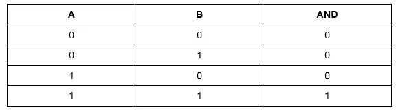
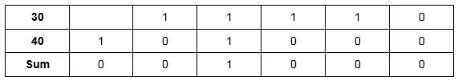
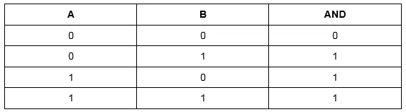
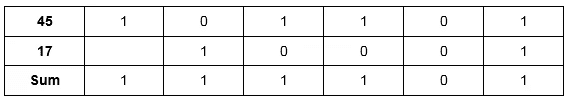
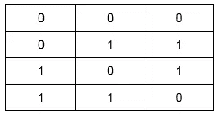
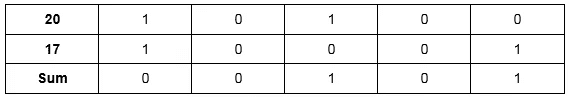
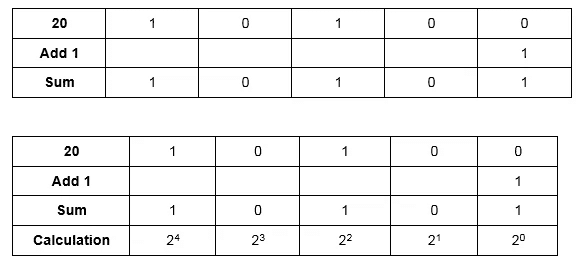
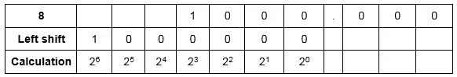
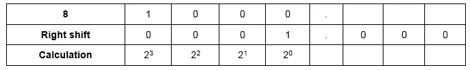

# Numpy:使用 Python 的二进制运算

> 原文：<https://pub.towardsai.net/numpy-binary-operations-with-python-10e6d6827634?source=collection_archive---------2----------------------->

## [编程](https://towardsai.net/p/category/programming)

## 运算符作用于位来执行逐位运算


由[马库斯·斯皮斯克](https://unsplash.com/@markusspiske?utm_source=medium&utm_medium=referral)在 [Unsplash](https://unsplash.com?utm_source=medium&utm_medium=referral) 上拍摄的照片

> ***二元运算***

二元运算是通过组合两个值来创建新值的简单运算。我们使用二元运算符，如按位 and、or、xor 等。，以执行二进制计算。这些运算符作用于位来执行逐位运算。

> ***numpy . bitwise _ and()***

numpy.bitwise_and()函数计算两个给定整数的相应二进制值的按位 and，输出以整数形式返回。

**程序:**

```
import numpy as makenum1 = 30
num2 = 40print(“Number1: “,num1)
print(“Number2: “,num2)output = make.bitwise_and(num1,num2)print(“Bitwise of 30 and 40: “,output)**Output:** Number1: 30
Number2: 40
Bitwise of 30 and 40: 8
```

**说明:**

让我们清楚地理解这个概念，考虑如下的和真值表:



```
The binary value of 30 = 11110
The binary value of 40 = 101000
```

我们通过将这两个二进制值相加来获得按位 and。



> ***numpy . bitwise _ or()***

numpy.bitwise_or 函数计算两个给定整数的相应二进制值的位或，输出以整数形式返回。

**程序:**

```
import numpy as makenum1 = 45
num2 = 17print(“Number1: “,num1)
print(“Number2: “,num2)output = make.bitwise_or(num1,num2)print(“Bitwise of 45 and 17: “,output)**Output:** Number1: 45
Number2: 17
Bitwise of 30 and 40: 61
```

**解释:**

让我们清楚地理解这个概念，考虑下面的或真值表:



```
The binary value of 45 = 101101
The binary value of 17 = 10001
```

我们通过将这两个二进制数相加得到按位“或”。



我们可以看到，作为和得到的二进制值是 111101，换算成十六进制就是 61。因此得到的输出是 61。

> ***numpy . bitwise _ xor()***

numpy.bitwise_xor 函数计算两个给定整数的相应二进制值的按位 xor，输出以整数形式返回。

**程序:**

```
import numpy as makenum1 = 20
num2 = 17print(“Number1: “,num1)
print(“Number2: “,num2)output = make.bitwise_xor(num1,num2)print(“Bitwise of 20 and 17: “,output)**Output:** Number1: 20
Number2: 17
Bitwise of 20 and 17: 5
```

**解释:**

让我们清楚地理解这个概念，考虑下面的 XOR 表:



```
The binary value of 20 = 101101
The binary value of 17 = 10001
```

我们通过使用上述 xor 表条件将二进制值相加来获得按位 xor:



我们可以看到，作为和得到的二进制值是 0101，换算成十六进制就是 5。因此得到的输出是 5。

> ***【numpy . invert()***

numpy.invert()函数计算数组或整数的位非。

**注意:**对于有符号整数输入值，返回的输出是二进制补码。这里负数用它们的绝对值来表示。

**程序:**

```
**#integer**import numpy as makenum1 = 20
print(“Number1: “,num1)output1 = make.invert(num1)
print(“Inversion of number: “,output1)**#array** num2 = [1,3,6]
print(“Number2: “,num2)output2 = make.invert(num2)
print(“Inversion of array: “,output2)**Output:** Number1: 20
Inversion of number -21Number2: [1, 3, 6]
Inversion of array [-2 -4 -7]
```

**解说:**

*   在第一段代码中，要求对整数求逆。所以在这里，20 的二进制数是 10100。在这个二进制值上加上“1”。



*   现在，我们只对二进制值为“1”的那些取 2x 值。还有，前面加减号。因此，我们将“20”、“21”和“22”相加，得到的输出为-21。

同样的方法也适用于数组中的元素。

> ***numpy . left _ shift()***

numpy.left_shift()函数的作用是:根据所需的位数，将整数的位数向左移动。例如:如果需要向左移动 2 位。为此，会在二进制值的最右端追加两个零。

**程序:**

```
import numpy as trialnum = 8
shift_bit = 3print(“Number Inputted:”,num)
print(“Number of bits to be shifted:”,shift_bit)output = trial.left_shift(num,shift_bit)
print(“After shifting:”,output)**Output:** Number Inputted: 8
Number of bits to be shifted: 3
After shifting: 64
```

**解释:**

这里，二进制值 8 = 1000，要移位的位数是 3。



我们现在已经向左移动了位。现在，我们只对二进制值为“1”的那些取 2x 值。在这里，只有‘26’。因此，输出返回为 64。

> ***【numpy . right _ shift()***

numpy.right_shift()函数根据所需的位数将整数的位数向右移动。例如:如果需要向右移动 2 位。为此，从最右边的位置开始减少两个二进制位。

**程序:**

```
import numpy as trialnum = 8
shift_bit = 3print(“Number Inputted:”,num)
print(“Number of bits to be shifted:”,shift_bit)output = trial.right_shift(num,shift_bit)
print(“After shifting:”,output)**Output:** Number Inputted: 8
Number of bits to be shifted: 3
After shifting: 1
```

**说明:**

这里，二进制值 8 = 1000，要移位的位数是 3。



我们现在已经将这些位向右移动了。现在，我们只对二进制值为“1”的那些取 2x 值。在这里，只有‘20’。因此，输出返回为 1。

> ***numpy . binary _ repr(number，width=None)***

numpy.binary_repr()函数查找输入整数或元素数组的二进制值。

**注:**

*   当对负数使用 width 时，返回该宽度的二进制补码，或者在前面加上减号。
*   对于有符号整数输入值，二进制补码作为输出返回。同样，二进制补码中的负数用它们的绝对值来表示。

**程序:**

```
**#simple program**import numpy as trialnum1 = 70
print(“Number: “,num1)output1 = trial.binary_repr(num1)
print(“Binary representation of 70: “,output1)**#using arrays without width parameter**import numpy as trialarr = [6,-19]
print(“Array:”,arr)out_arr = trial.binary_repr(arr[0])
print(“Binary representation of 6 without width parameter:”,out_arr)**#using arrays with width parameter**import numpy as trialarr = [6,-19]
print(“Array:”,arr)out_arr = trial.binary_repr(arr[0], width = 6)
print(“Binary representation of 6 with width parameter:”,out_arr)**Output:**Number: 70
Binary representation of 70: 1000110Array: [6, -19]
Binary representation of 6 without width parameter: 110Array: [6, -19]
Binary representation of 6 with width parameter: 000110
```

> ***numpy . pack bits(myarray，axis=None)***

numpy.packbits()函数将一个二进制值数组的元素打包成一个“uint8”数组。通过插入零比特，结果在末尾被填充。输入数组的每个元素代表一个位域，该位域解包为一个二进制值输出数组。并且作为输出获得的形状或者是相同的，或者是沿着指定轴的一维形状。

**程序:**

```
import numpy as npx = np.array([[[1,1,1],[0,0,0]],[[1,0,1],[0,1,0]]])
y = np.packbits(x, axis=-1)print(y)**Output:**[[[224]
[0]]
[[160]
[64]]]
```

> ***【numpy . unpackbits(myarray，axis=None)***

numpy.unpackbits()函数与 numpy.packbits()函数正好相反。它将“uint8”数组的一个元素解包为二进制值输出数组。

**程序:**

```
import numpy as npx = np.array([[69], [79], [88]], dtype=np.uint8)
y = np.unpackbits(x, axis=1)print(y)**Output:** [[0 1 0 0 0 1 0 1]
[0 1 0 0 1 1 1 1]
[0 1 0 1 1 0 0 0]]
```

**结论:**

总之，本文涵盖了 Numpy 二元运算的基础知识。我强烈建议阅读更多的文章，并使用 python 程序应用这些概念，因为每个模块中都有许多函数，您可以在这个主题上进行实验。

我希望你喜欢这篇文章。通过我的 [LinkedIn](https://www.linkedin.com/in/data-scientist-95040a1ab/) 和 [twitter](https://twitter.com/amitprius) 联系我。

# 推荐文章

1.[8 Python 的主动学习见解收集模块](/8-active-learning-insights-of-python-collection-module-6c9e0cc16f6b?source=friends_link&sk=4a5c9f9ad552005636ae720a658281b1)
2。 [NumPy:图像上的线性代数](/numpy-linear-algebra-on-images-ed3180978cdb?source=friends_link&sk=d9afa4a1206971f9b1f64862f6291ac0)3。[Python 中的异常处理概念](/exception-handling-concepts-in-python-4d5116decac3?source=friends_link&sk=a0ed49d9fdeaa67925eac34ecb55ea30)
4。[熊猫:处理分类数据](/pandas-dealing-with-categorical-data-7547305582ff?source=friends_link&sk=11c6809f6623dd4f6dd74d43727297cf)
5。[超参数:机器学习中的 RandomSeachCV 和 GridSearchCV](/hyper-parameters-randomseachcv-and-gridsearchcv-in-machine-learning-b7d091cf56f4?source=friends_link&sk=cab337083fb09601114a6e466ec59689)
6。[用 Python](https://medium.com/towards-artificial-intelligence/fully-explained-linear-regression-with-python-fe2b313f32f3?source=friends_link&sk=53c91a2a51347ec2d93f8222c0e06402)
7 全面讲解了线性回归。[用 Python](https://medium.com/towards-artificial-intelligence/fully-explained-logistic-regression-with-python-f4a16413ddcd?source=friends_link&sk=528181f15a44e48ea38fdd9579241a78)
充分解释了 Logistic 回归 8。[数据分发使用 Numpy 与 Python](/data-distribution-using-numpy-with-python-3b64aae6f9d6?source=friends_link&sk=809e75802cbd25ddceb5f0f6496c9803)
9。[机器学习中的决策树 vs 随机森林](/decision-trees-vs-random-forests-in-machine-learning-be56c093b0f?source=friends_link&sk=91377248a43b62fe7aeb89a69e590860)
10。[用 Python 实现数据预处理的标准化](/standardization-in-data-preprocessing-with-python-96ae89d2f658?source=friends_link&sk=f348435582e8fbb47407e9b359787e41)