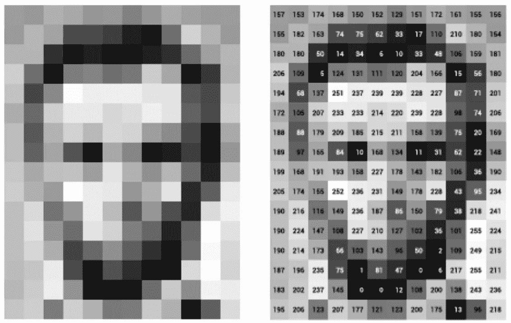
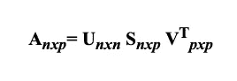
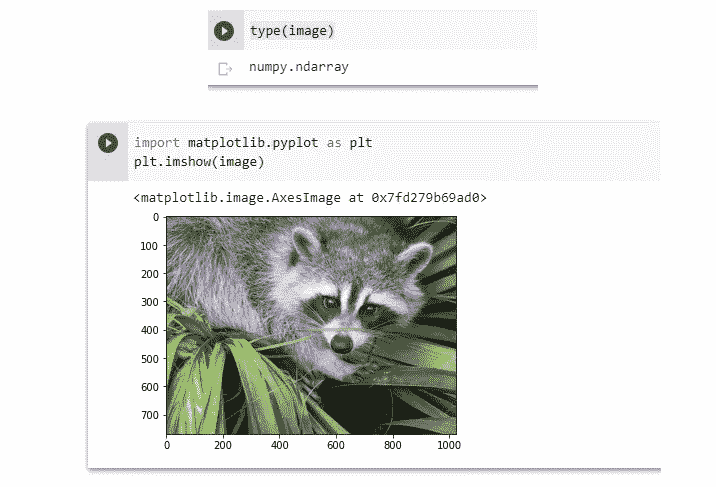
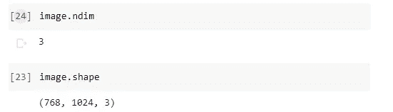
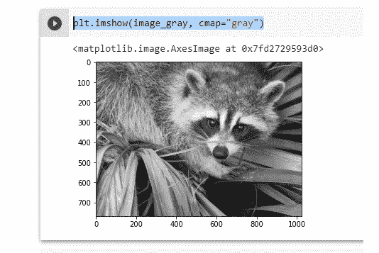
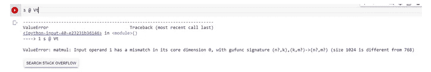
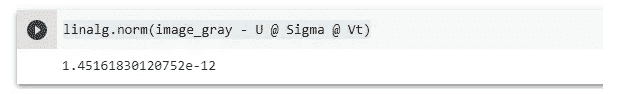
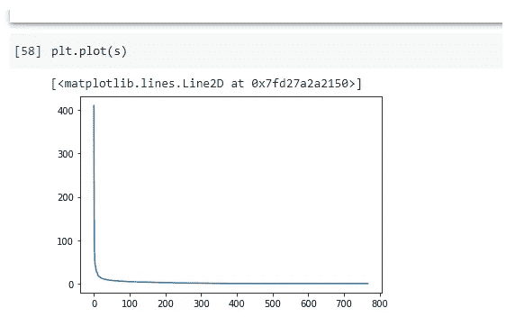

# NumPy:图像上的线性代数

> 原文：<https://pub.towardsai.net/numpy-linear-algebra-on-images-ed3180978cdb?source=collection_archive---------1----------------------->

## [数学](https://towardsai.net/p/category/mathematics)

## SVD 来生成图像的压缩近似



图片[来源](https://www.google.com/imgres?imgurl=https%3A%2F%2Fblog.tonkabi.com%2Fstorage%2Fapp%2Fmedia%2Fpixel%2520pic.png&imgrefurl=https%3A%2F%2Fblog.tonkabi.com%2Fblog%2Fpost%2Fcomputer-vision-vs-human-vision&tbnid=WHBb4jktnumlVM&vet=10CAUQxiAoBGoXChMIiM_v-8fR8QIVAAAAAB0AAAAAEAg..i&docid=l7r2USvptJr_mM&w=1130&h=715&itg=1&q=image%20pixels&client=firefox-b-d&ved=0CAUQxiAoBGoXChMIiM_v-8fR8QIVAAAAAB0AAAAAEAg)

在本教学练习中，我们将使用线性代数中的矩阵分解，奇异值分解，来生成图像的压缩近似值。我们将使用 scipy.misc 模块中的 ascent 图像:

**让我们从什么是奇异值分解开始吧？**

奇异值分解(SVD)有着广泛的应用。这些包括降维、压缩图像和数据去噪。基本上，SVD 认为一个矩阵可以表示为其他三个矩阵的乘积。用数学术语来说，SVD 可以写成:



其中 ***n*** 和 ***p*** 为行数和维度数。

我们将使用来自 scipy.misc 模块的面部图像。该图像是一个 NumPy 数组，正如我们在使用 type 函数时所看到的。

让我们使用[matplotlib . py plot . im](http://matplotlib.pyplot.im)show 函数绘制图像:

```
from scipy import misc
image=misc.face()type(image)
```



作者的照片

检查形状、轴和数组属性，结果如下



它表示我们有一个由 3 个矩阵组成的数组，每个矩阵的形状都是 768x1024。由于这是一幅彩色图像，并且我们使用了 imread 函数来读取它，因此数据被组织在三个 2D 数组中，代表颜色通道(在本例中为红色、绿色和蓝色— RGB)。因为我们将对这些数据执行线性代数运算，所以在矩阵的每个条目中使用一个介于 0 和 1 之间的实数来显示 RGB 值可能更有意思。我们可以通过设置。

[](/understand-list-with-python-example-5e02a5566ca0) [## 通过 Python 示例了解 List[]

### python 中数据结构的便捷概念

pub.towardsai.net](/understand-list-with-python-example-5e02a5566ca0) [](/understand-dictionary-with-python-example-c315e5af44ab) [## 用 Python 例子理解字典{}

### python 中数据结构的便捷概念

pub.towardsai.net](/understand-dictionary-with-python-example-c315e5af44ab) 

这个操作，将一个数组除以一个标量，由于 NumPy 的广播规则，你可以通过做一些测试来检查上面的工作；例如，查询该数组的最大值和最小值或检查数组中的数据类型:

```
image_array.max(), image_array.min()
(1.0, 0.0) image_array.dtype
dtype('float64')
```

这里，我们将使用 SVD(奇异值分解)来尝试修改比原始图像使用更少奇异值信息的图像，同时仍然保留其一些特征。

接下来，让我们从 NumPy 导入线性代数子模块:

```
from numpy import linalg
```

为了从给定的矩阵中提取信息，我们将使用 SVD 来获得 3 个数组，这些数组可以相乘以获得原始矩阵。根据线性代数理论，给定矩阵 A，可以计算出以下乘积:


*   正交矩阵是 U 是 an (m × m)。
*   矩形对角矩阵是一个 m × n 的σ，σ1，…，σmin(m，n)是所有非负且按非递增顺序排列的对角元素。

它包含 A 的奇异值，从最大到最小组织。要注意的是，这些值在矩阵 a 中被标记为重要性和非负值。

*   正交矩阵是 V 是 an (n × n)。

让我们先用一个矩阵的例子来看看这在实践中是如何工作的。请注意，根据色度学，如果我们应用以下公式，就有可能获得相当合理的彩色图像灰度版本

> Y = 0.2126R + 0.7152G + 0.0722B

其中 Y 是输出灰度图像阵列，R、G 和 B 是具有一些初始值的红色、绿色和蓝色通道阵列。

```
image_gray = image_array @ [0.2126, 0.7152, 0.0722]
image_gray.shape

(768, 1024)
```

我们在这里近似图像的灰度部分，所以我们将使用颜色图灰色

```
plt.imshow(image_gray, cmap="gray")
```



现在，将 linalg.svd 函数应用于该矩阵，我们得到以下结果:

```
U, s, Vt = linalg.svd(image_gray)
```

现在让我们再次检查形状

```
U.shape, s.shape, Vt.shape
```


注意:s 有一个特殊的形状:它只有一维。这意味着其他一些需要 2d 数组的线性代数函数可能无法工作。

例如，从理论上讲，人们可能期望 s 和 Vt 对于乘法是不冲突的。然而，这是不正确的，因为 s 在这里没有第二个轴。执行会导致值错误。这是因为在这种情况下，s 的一维数组实际上比用相同的数据构建对角矩阵更合理。为了重建原始矩阵，我们可以重建对角矩阵σ，其对角线上有 s 的分量，并且具有适当的乘法维数:在我们的例子中，σ应该是 768×1024，因为 U 是 768×768，Vt 是 1024×1024。



```
import numpy as np
Sigma = np.zeros((768, 1024))
for i in range(768):
   Sigma[i, i] = s[i]
```

现在，让我们检查一下重建的 U @适马@ Vt 是否接近原始的 img_gray 矩阵。

```
linalg.norm(image_gray - U @ Sigma @ Vt
```

# 接近

linalg 模块包括一个范数函数，它计算以 NumPy 数组表示的向量或矩阵的范数。例如，根据上面的 SVD 解释，我们期望 img_gray 和重构的 SVD 乘积之间的差的范数很小，如下面的代码所示。



为了查看近似是否公平，我们可以检查 s 中的值:



在图中，我们可以看到，尽管 s 中有 768 个奇异值，但大多数(在第 150 个条目之后)都非常小。为了建立更经济的近似值，我们需要将第一个“50”的奇异值与信息联系起来。

# 最后的想法

无论是对于 PCA(主成分分析)还是推荐算法，SVD 都是一种强大的技术，目前广泛应用于许多模型中。奇异值分解是图像处理应用中代数变换的一种重要方法。

我希望你喜欢这篇文章。通过我的 [LinkedIn](https://www.linkedin.com/in/data-scientist-95040a1ab/) 和 [twitter](https://twitter.com/amitprius) 联系我。

# 推荐文章

[1。NLP —零到英雄用 Python](https://medium.com/towards-artificial-intelligence/nlp-zero-to-hero-with-python-2df6fcebff6e?sk=2231d868766e96b13d1e9d7db6064df1)
2。 [Python 数据结构数据类型和对象](https://medium.com/towards-artificial-intelligence/python-data-structures-data-types-and-objects-244d0a86c3cf?sk=42f4b462499f3fc3a160b21e2c94dba6)
3。[Python 中的异常处理概念](/exception-handling-concepts-in-python-4d5116decac3?source=friends_link&sk=a0ed49d9fdeaa67925eac34ecb55ea30)
4。[为什么 LSTM 在深度学习方面比 RNN 更有用？](/deep-learning-88e218b74a14?source=friends_link&sk=540bf9088d31859d50dbddab7524ba35)
5。[神经网络:递归神经网络的兴起](/neural-networks-the-rise-of-recurrent-neural-networks-df740252da88?source=friends_link&sk=6844935e3de14e478ce00f0b22e419eb)
6。[用 Python 充分解释了线性回归](https://medium.com/towards-artificial-intelligence/fully-explained-linear-regression-with-python-fe2b313f32f3?source=friends_link&sk=53c91a2a51347ec2d93f8222c0e06402)
7。[用 Python](https://medium.com/towards-artificial-intelligence/fully-explained-logistic-regression-with-python-f4a16413ddcd?source=friends_link&sk=528181f15a44e48ea38fdd9579241a78)
充分解释了 Logistic 回归 8。[concat()、merge()和 join()与 Python](/differences-between-concat-merge-and-join-with-python-1a6541abc08d?source=friends_link&sk=3b37b694fb90db16275059ea752fc16a)
9 的区别。[与 Python 的数据角力—第一部分](/data-wrangling-with-python-part-1-969e3cc81d69?source=friends_link&sk=9c3649cf20f31a5c9ead51c50c89ba0b)10。[机器学习中的混淆矩阵](https://medium.com/analytics-vidhya/confusion-matrix-in-machine-learning-91b6e2b3f9af?source=friends_link&sk=11c6531da0bab7b504d518d02746d4cc)