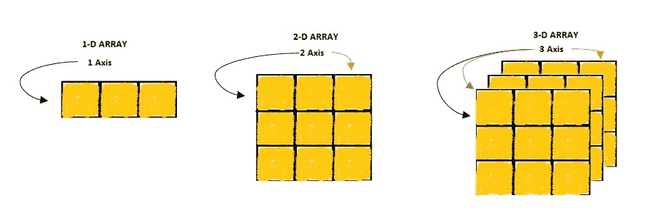
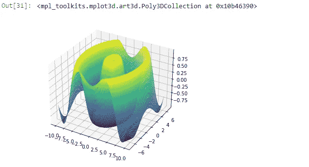

# NumPy:用 Python 从零到英雄

> 原文：<https://pub.towardsai.net/numpy-zero-to-hero-with-python-d135f57d6082?source=collection_archive---------1----------------------->

## [编程](https://towardsai.net/p/category/programming)

## python 的 NumPy 基本操作手册


照片由[詹姆斯·哈里逊](https://unsplash.com/@jstrippa?utm_source=medium&utm_medium=referral)在 [Unsplash](https://unsplash.com?utm_source=medium&utm_medium=referral) 上拍摄

NumPy 是用于多维数组计算的 python 库包。NumPy 进程比 list 更快，因为它的同构类型在内存中密集打包并执行矢量化。向量化意味着用并行硬件处理来完成计算，以使其更快。NumPy 是主要用途，因此，它被用于各种领域，如统计，代数，矩阵运算等。我们使用的阵列类型如下所示:



数组的类型。作者的照片

> ***阵列*** 简介及基础

NumPy 中使用了一个名为 ***array*** 的类，通过它的属性获得更多的功能。该功能中的不同属性是尺寸、形状、大小、类型等。让我们举个例子来了解一下这些属性。

```
#First need to import the library to use NumPy
import numpy as np# 2-D array
a = np.arange(9).reshape(3,3)
```

我们创建了一个有 2 个轴的二维数组。通过该操作形成的矩阵视图是打印的。形成的矩阵是 3 行 3 列。

```
print(a)#output:
array([[0,1,2],
       [3,4,5],
       [6,7,8]])
```

与这些数组相关的属性的功能如下所示:

```
#to know the shape of the array
a.shape                    #output:(3, 3)#to know the dimension(axes) of the array
a.ndim                     #output:2#to know the type of the array elements
a.dtype.name               #output:'int64'#to know the item size of the array
a.itemsize                 #output:8#to know the size of the array
a.size                     #output:9#to know the type of the array
type(a)                    #output:<class 'numpy.ndarray'>
```

在本文中，我们将介绍日常编程中最基本的基础知识。首先，如果没有 anaconda 发行版，我们需要安装 NumPy。

```
#to install NumPy
pip install numpy
```

每次当我们想要使用 NumPy 时，我们都必须导入它，就像我们在前面的例子中看到的那样。

数组是包含网格格式信息的结构，网格中的每个位置称为一个元素。每当我们想从网格中提取信息时，我们必须指定元素的位置。

在 python 中有很多方法可以创建数组。最常见的方式是通过 np.array 函数。让我们也看看其他方法。

```
##importing library
import numpy as np##creating array with np.array
array1 = np.array([3, 5, 9])#output: array([3, 5, 9])##creating array will all element values are zeros
array2 = np.zeros(3)   # all three elements will have zero value#output: array([0., 0., 0.])##creating array with np.ones
array3 = np.array(3)   # all three elements will have one value#output: array([1., 1., 1.])##creating array with np.arange 
array4 = np.arange(3)  # values begin with 0 and goes till the  
                         number of elements#output: array([0, 1, 2])##arange is also used to create array with evenly distributed
array5 = np.arange(3, 13, 3) #last 3 is a step size#output: array([3, 6, 9, 12])
```

> ***数组的添加和排序***

*   **排序**

排序意味着按升序排列值。

```
array1 = np.array([3, 8, 2, 6, 1, 9])
sorted_array = np.sort(array1)#output: array([1, 2, 3, 6, 8, 9])
```

*   **添加**

加法意味着连接两个数组。

```
array1 = np.array([3, 5, 8])
array2 = np.array([4, 6, 9])array3 = np.concatenate((array1, array2))#output: array([3, 5, 8, 4, 6, 9])
```

> ***重塑功能***

我们可以在合适的行和列中重塑阵列。

```
array1 = np.arange(6)
array2 = array1.reshape(3, 2)  # 3 rows and 2 columns#output: array([[0, 1],
                [2, 3],
                [4, 5]])
```

> ***分度和切片***

当我们需要来自数据中间的信息时，使用索引和切片。

```
array1 = np.array([3, 5, 2, 8, 4])array1[2]#output: 2array1[0:3]#output: array([3, 5, 2])array1[3:]#output: array([8, 4])
```

> ***对数组*** 的操作

*   **垂直堆叠阵列**

```
array1 = np.array([[3, 5],
                   [2, 1]])
array2 = np.array([[4, 6],
                   [8, 7]])np.vstack((array1, array2))#output: array([[3, 5],
                [2, 1],
                [4, 6],
                [8, 7]])
```

*   **水平堆叠阵列**

```
array1 = np.array([[3, 5],
                   [2, 1]])
array2 = np.array([[4, 6],
                   [8, 7]])np.hstack((array1, array2))#output: array([[3, 5, 2, 1],
                [4, 6, 8, 7]])
```

*   **数组的副本**

它用于复制一个数组，以保存为原始数组，供以后的操作使用。

```
array1 = np.array([[3, 5], [2, 1]])
array2 = array1.copy()
```

*   **两个数组的数学**

```
array1 = np.array([[3, 5]])
array2 = np.array([[2, 1]])#addition
array1 + array2#output: array([5, 6])#multiplication
array1*array1#output: array([9, 25])subtraction
array1-array1#output: array([1, 4])
```

*   **广播运行**

当我们想在一个标量数和一个数组(向量)之间做一个运算时，NumPy 知道这个运算是对一个数组的所有元素做的。这就是所谓的广播。

```
array1 = np.array([[3, 5]])
array1*2#output: array([6, 10])
```

*   **最大值、最小值和总和**

从数组中找出最大值、最小值和总和。

```
array1 = np.array([[3, 5, 8]])
array1.max()
array1.min()
array1.sum()#output: 8
         3
         16
```

*   **创建二维矩阵**

它用于创建一个 2 轴矩阵。

```
#2 rows and 2 columns
array1 = np.array([[3, 5], [2, 1]])
array1#output: array([[3, 5], 
                [2, 1]])#3 rows nd 2 columns
array1 = np.array([[3, 5], [2, 1], [4, 6]])
array1#output: array([[3, 5], 
                [2, 1],
                [4, 6]])#indexing of 2D matrix
array1[1:3]#output: array([[2, 1],
                [4, 6]])array1[0:2, 0]#output: array([3, 
                2])#find maximum when axis = 0 means column wise
array1.max(axis=0)#output: array([4, 6])#find maximum when axis = 1means row wise
array1.max(axis=1)#output: array([5, 2, 6])   #check row wise
```

*   **生成随机数**

我们可以生成一个特定范围内的随机数。整数函数中的参数值 2 决定了生成数字的范围。

```
rng = np.random.default_rng(0)
rng.integers(2, size=(2, 4))#output: array([[1, 1, 1, 0],
               [0, 0, 0, 0]], dtype=int64)#with new range value 
rng.integers(5, size=(2, 4))#output: array([[4, 3, 2, 1],
               [1, 0, 0, 0]], dtype=int64)
```

*   **唯一值**

要知道数组中唯一值的总数。

```
array1 = np.array([[3, 5, 2, 1, 4, 3, 4, 7 , 8]])
unique_values = np.unique(array1)#output: array([1, 2, 3, 4, 5, 7, 8])#to know the index number of unique_values as on first occurrence
unique_values, index_num = np.unique(array1, return_index=True)
print(index_num)#output: [3 2 0 4 1 8 9]#to know the number of times unique values are occurred
unique_values, occurrence_count = np.unique(array1, 
                                 return_counts=True)
print(occurrence_count)#output: array([1, 1, 2, 2, 1, 1, 1], dtype=int64)
```

index_num 输出可以这样读，值出现在 unique_values 列表中，第一次出现在第三个索引上，依此类推。值的出现意味着 3 和 4 在原始数组 1 中各出现两次。

*   **在数组上转置**

转置将改变阵列上的轴或维度。

```
array1 = np.array([[3, 5, 2], [1, 4, 6]])
array1.transpose()#output: array([[3, 1],
                [5, 4],
                [2, 6]])
```

*   **展平阵列**

它将使数组从不同的维度变为一维。

```
array1 = np.array([[3, 5], [2, 1], [4, 6]])
array1.flatten()#output: array([3, 5, 2, 1, 4, 6])
```

> ***Matplotlip 数组图***

```
from mpl_toolkits.mplot3d import Axes3D
fig = plt.figure()
ax = Axes3D(fig)
array1 = np.arange(-10, 10, 0.10)
array2 = np.arange(-7, 7, 0.20)
array1, array2 = np.meshgrid(array1, array2)R = np.sqrt(array1**2 + array2**2)
Z = np.sin(R)
ax.plot_surface(array1, array2, Z, rstride=1, cstride=1,
                cmap='viridis')
```

绘图输出:



数组的三维图。作者的照片

> ***结论***

数组的基本运算在数值计算中非常有用，如代数、数学公式、矩阵计算等。我希望这篇文章能让你对 NumPy 有所了解。

我希望你喜欢这篇文章。通过我的 [LinkedIn](https://www.linkedin.com/in/data-scientist-95040a1ab/) 和 [twitter](https://twitter.com/amitprius) 联系我。

# 推荐文章

1.  [NLP —用 Python 从零到英雄](https://medium.com/towards-artificial-intelligence/nlp-zero-to-hero-with-python-2df6fcebff6e?sk=2231d868766e96b13d1e9d7db6064df1)

2. [Python 数据结构数据类型和对象](https://medium.com/towards-artificial-intelligence/python-data-structures-data-types-and-objects-244d0a86c3cf?sk=42f4b462499f3fc3a160b21e2c94dba6)

3. [MySQL:零到英雄](https://medium.com/towards-artificial-intelligence/mysql-zero-to-hero-with-syntax-of-all-topics-92e700762c7b?source=friends_link&sk=35a3f8dc1cf1ebd1c4d5008a5d12d6a3)