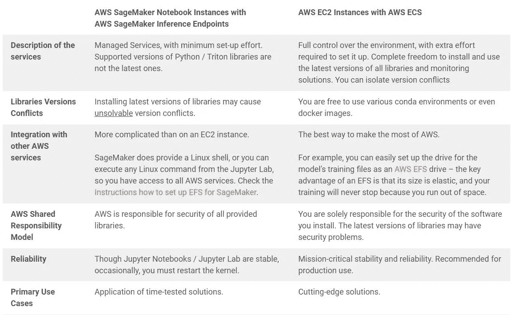
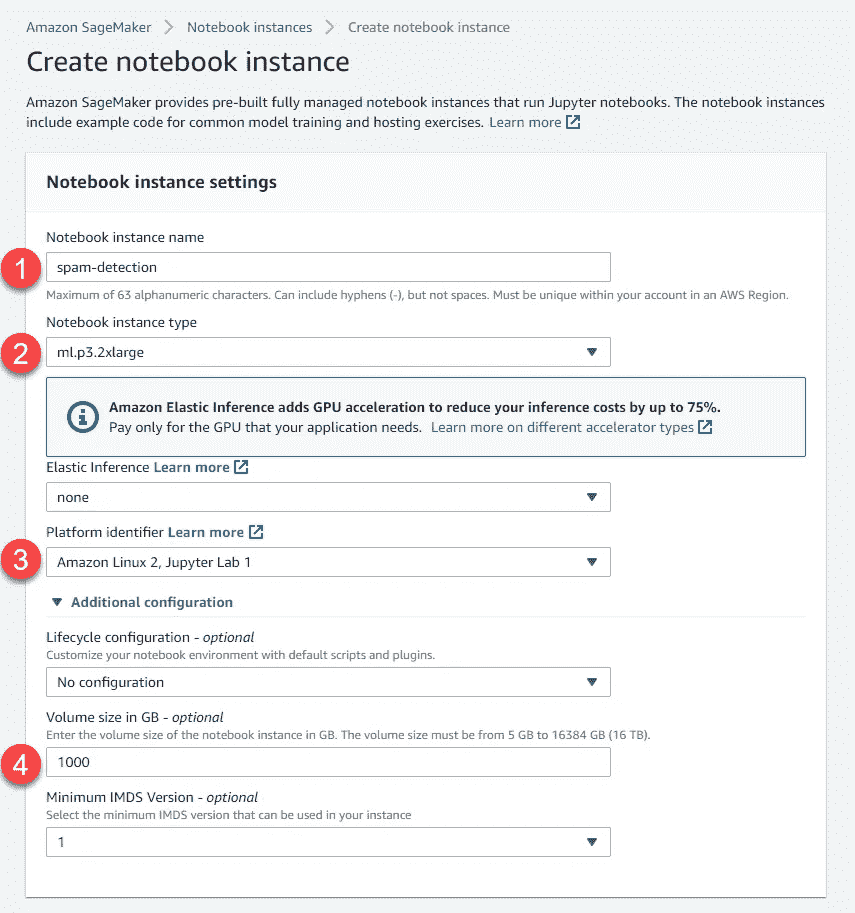
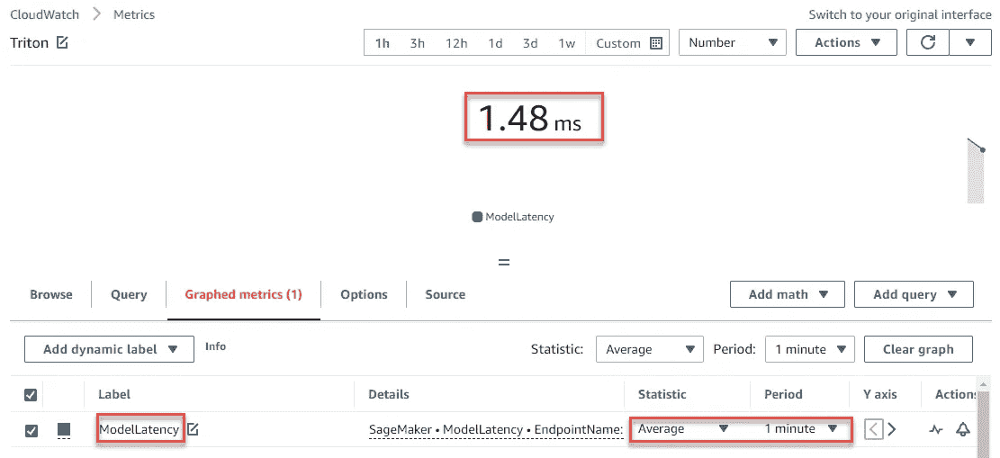
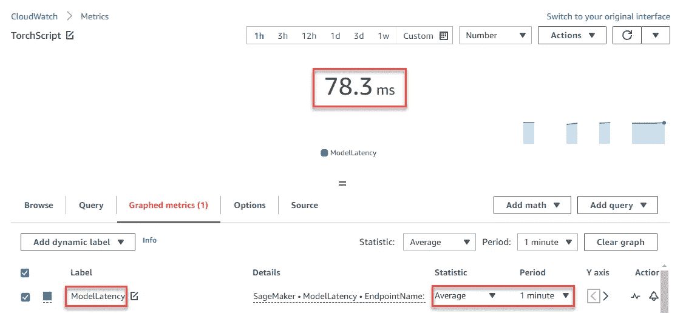

# 在 NVIDIA Triton 上使用 DistilBERT 检测现代垃圾邮件

> 原文：<https://pub.towardsai.net/nvidia-triton-spam-detection-engine-of-c-suite-labs-cc77db2c2cfe?source=collection_archive---------4----------------------->


**作者:** [Jiri Pik](https://www.linkedin.com/in/jiripik) ， [Saumya Ahuja](https://www.linkedin.com/in/saumyahuja/) ， [Janakan Arulkumarasan](https://www.linkedin.com/in/arulkumarasan/) ，[ermano Attardo](https://www.linkedin.com/in/ebjattardo/)， [Kshitiz Gupta](https://www.linkedin.com/in/kshitiz-gupta/) ，[刘家宏](https://www.linkedin.com/in/jiahong-liu514/)

# 1.介绍

每年，不需要的和未经请求的大量数字通信(“垃圾邮件”)造成了大量直接和间接的经济损失。

通过检测某些关键字、手动检查文本记录、甚至运行自然语言处理(“NLP”)管道来识别垃圾邮件的传统方法已经不够用了。

**本文描述了一种最先进的垃圾邮件检测引擎的架构，该引擎针对带有 URL 链接的社交网络帖子，由多个相互依赖的不同分类器组成，可提供实时、高性能、卓越的准确性，所需的人工审查最少。**

本文介绍了一个由三部分组成的垃圾邮件检测系统，该系统结合了现有的最佳技术方法，并侧重于 NLP 分类器的 DistilBERT 模型。

**NVIDIA Triton 推理服务器在该用例中的应用提供了比 AWS TorchScript 推理服务器高 2.4 倍的推理吞吐量，而模型延迟低 52.9 倍。**

文章的 GitHub 资源库是[https://GitHub . com/jiri pik/NVIDIA-triton-c-suite-labs-spam-detection-engine](https://github.com/jiripik/nvidia-triton-c-suite-labs-spam-detection-engine)。

# 2.单一因素方法不起作用

随着时间的推移，我们意识到**没有可靠的公共 API 考虑多种因素来生成总体垃圾邮件分数**。

部分的、单一因素的解决方案根本不起作用:

*   *阻止列表不起作用* —阻止已知滥用域名、关键字、IP 地址或用户名的解决方案非常容易被绕过
*   *文本分析方法不起作用* —分析评论中文本的解决方案，如 OOPSpam，无法解决隐藏在预览图像或目标页面中的文本
*   *基于域的方法不起作用* —旨在通过研究托管域的声誉来确定 URL 链接是否安全的解决方案，如谷歌 Web Risk API，不起作用——任何人都可以将包含垃圾文本的视频上传到 YouTube，这些服务会认为它是安全的，因为它托管在受信任的域(YouTube)上。

# 3.现代垃圾邮件检测引擎的蓝图

我们从三个不同的角度来处理这个问题:用户、消息和链接。每个社交网络的记录都来自一个来源，即用户，来自一个具有 *IP 地址*的设备，遵循*特定的 UI 步骤序列*。记录的内容有一条消息，可能包含一个链接。

**我们的联合设计由一系列模型组成:**

1.  **IP & URL 模型**

*   发帖者的 IP 地址—发帖者的 IP 地址是有效的垃圾邮件指示器，随着时间的推移，阻止它们可以显著减少垃圾邮件帖子。我们的引擎识别持续发布垃圾邮件的 IP 地址。
*   链接 URL 域—垃圾邮件 URL 遵循类似的模式。因此，如果 URL 模式与以前报告的 URL 匹配，则预示着垃圾邮件。关键特性是:
    + url_age:链接在 web 上处于活动状态的时间
    +URL _ wot _ score:URL 的信任分数
    +URL _ Google _ score:URL 的 Google Web 风险分数
    +URL _ domain:URL 的域
    +URL _ TLD:URL 的网络位置顶级域
    +URL _ subdomain _ count:URL 中的子域数量
    + url_token:
*   链接 url 上下文——我们在平台的历史数据上运行数据辩论技术，并生成与垃圾邮件相关的特征:
    +URL _ post _ count:URL 被发布的次数
    + post_share_count:带有该 URL 的消息被共享的次数
    + post_comment_count:帖子得到的响应/吸引的次数
    +domain _ report _ count:URL 的域名被报告的次数
    + text_content:的内容

**2。社会行为模型**

*   海报简介——我们研究的特征包括:( 1)朋友数量;( 2)在我们平台上的停留时间;( 3)用户过去在社交网站上的活动。如果用户配置文件与之前报告为垃圾邮件的其他帐户相似，则很有可能是垃圾邮件发送者用户配置文件。此外，用户的历史也可能指示垃圾邮件帐户。结合这些， 与垃圾邮件相关的简档特征有:
    + user_age:用户在平台上拥有帐户的时间
    + user_email_domain:用户注册的电子邮件地址的域
    + user_friends:用户的朋友数量
    + user_followers:用户的关注者数量
    + user_verified:一个布尔值，用于确定用户是否有影响力并被平台验证
    + user_posts:数量 用户在平台上发布的帖子数
    + user_spam_posts:用户帖子被举报为垃圾信息的次数
    + user_spam_report:一个布尔值，用于确定用户是否被举报为垃圾信息
    + user_link_count:用户共享此链接的次数
    + user_post_count:用户共享此帖子的次数
*   海报之旅——我们分析用户发布社交网络新记录的步骤顺序。例如，垃圾邮件发送者或机器人倾向于利用高效的工作流。
*   用户反馈——我们分析其他用户对每个社交网络记录的投诉模式

**3。内容模型**

*   NLP 分析—我们分析用户帖子和链接网页的内容，包括对页面上任何图像的 OCR 分析以及所有视频摘录的文字记录。该模型基于监督或半监督学习模型，如伯特和 GPT-3。

我们应用基于神经网络和机器学习的方法为每个子系统开发一系列模型。它们的输出然后被输入到主要的机器学习模型，一个决策树，输出最终的分类结果:


该架构带来了以下见解:

1.  如果 URL 域已经被安全禁止，我们可以立即得出结论，新社交网络的记录是垃圾邮件，并停止。
2.  然后，社交行为分析提供用户的新帖子是否是垃圾邮件的指示——例如，过去的投诉(如果存在)和发帖人的旅程是新帖子是垃圾邮件的非常强的指标(大约 90%的准确率)。
3.  最后，我们对用户帖子的文本内容和相关图像或视频的文本表示进行 NLP 分析。

# 4.垃圾邮件引擎的 DistilBERT 内容模型简介

# 4.1 伯特模型

[谷歌的基于变形金刚(BERT)的双向编码器表示无外壳模型](https://arxiv.org/abs/2202.03480)是当前最先进的文本分类模型，根据训练集的质量，准确率超过 97%。

[**伯特架构基于**](https://towardsdatascience.com/keeping-up-with-the-berts-5b7beb92766)

*   *一个 Transformer 编码器模型*(一个神经网络，它获取一个输入句子并标记每个单词，输出是每个标记的矢量数字表示)。它提供了比 LSTM 或 RNN 更好的语境理解，因为它同时处理句子。它使用单词前后的输入来构建单词的上下文，而 LSTM 或 RNN 只考虑单词之前的输入→ BERT 具有更好的性能。例如，“我需要苹果”和“我需要苹果产品”中的单词“苹果”在 LSTM 或 RNN 具有相同的向量值，但在伯特中却不同。
*   *转移学习*(为一般任务训练一个模型，并重用它来微调 BERT 以适应新任务)。伯特接受了图书语料库(8 亿字，11038 本书——与 GPT-1 相同)和英语维基百科(25 亿字)的训练。在 64 个 TPU 上用了 4 天。预训练较慢，但微调较快。有时候可以在单个 GPU 上完成。

**伯特有两个任务:**

*任务#1:掩蔽语言模型(MLM)* 最初由 Devlin 等人于 2018 年在谷歌发布。

1.  预测随机 15%的(子)单词标记。为了正则化，它:在 80%的时间里用掩码替换输入单词。在 10%的情况下，用随机令牌替换输入单词。它在 10%的时间里保持不变(但仍然预测它)
2.  它使用一个变压器编码器来做到这一点
3.  BERT 的预训练输入是两个独立的连续序列

*任务 2:下一句话预测(NSP)* 。MLM 不支持句子之间关系的概念。在这个任务中，模型被教导句子之间的关系。

塞尔吉奥·罗哈斯-加莱亚诺的一项研究强调了

*   BoW(单词袋)、TFIDF(词频逆文档频率)和 BERT 编码器可以使用广泛使用的分类算法提取有效的函数来识别垃圾邮件，但 BERT 的性能略好。这证实了他们之前引用的文献。
*   经验证据表明，BERT 可以抵抗 Mad-lib 攻击，而 BoW 或 TFiDF 则易受攻击。它使用对抗性的自动程序来产生攻击。

Andrew McCarren 和 Jennifer Foster 的研究表明，BERT 优于基于 FFNN、CNN 和 LSTM 的神经模型。

# 4.2 蒸馏模型

对于我们的垃圾邮件检测引擎，我们选择了[的 DistilBERT 变体](https://arxiv.org/abs/1910.01108)，根据其作者的说法，它是“BERT 模型大小的 60%，同时保留了 97%的语言理解能力，速度快了 60%”，这意味着它的应用也更具成本效益。

我们使用了[的 HuggingFace 实现](https://huggingface.co/docs/transformers/model_doc/distilbert)。

# 4.3 训练集

我们的训练集由以下数据集组合而成:

*   专业标记的垃圾邮件数据集
*   手动管理的垃圾邮件数据集
*   基于规则的标记数据集。

# 4.4 培训代码

下面是我们的 DistilBERT 代码的简化实现，在本文的 GitHub 库中:

```
logging.info('Loading the pretrained tokenizer and model')
tokenizer = DistilBertTokenizer.from_pretrained('distilbert-base-uncased')
model = DistilBertForSequenceClassification.from_pretrained("distilbert-base-uncased")

logging.info('Preparing the training and evaluation dataset')
train_data, val_data, train_labels, val_labels = train_test_split(dataset[COL_DATA].values, dataset[LABEL].values)
train_tokens = tokenizer(list(train_data), return_tensors="pt", padding=True, truncation=True, max_length=BATCH_SIZE)
val_tokens = tokenizer(list(val_data), return_tensors="pt", padding=True, truncation=True, max_length=BATCH_SIZE)

train_dataset = ClassificationDataset(train_tokens, train_labels)
val_dataset = ClassificationDataset(val_tokens, val_labels)

logging.info('Training Started')
trainer = Trainer(
    model=model,
    args=TrainingArguments(output_dir=TRAIN_DIR, num_train_epochs=NUM_EPOCHS),
    train_dataset=train_dataset,
    eval_dataset=val_dataset,
    compute_metrics=compute_metrics,
)

trainer.train()

model.save_pretrained(FINAL_DIR)
tokenizer.save_pretrained(FINAL_DIR)
logging.info('Training Completed')

print("**************** Evaluation ************")
metrics = trainer.evaluate()
metrics["eval_samples"] = len(val_dataset)
trainer.log_metrics("eval", metrics)
trainer.save_metrics("eval", metrics)
```

# 5.英伟达 TensorRT 和英伟达 Triton 推理服务器简介

[**NVIDIA TensorRT**](https://developer.nvidia.com/tensorrt)是一款用于高性能深度学习推理的 SDK，包括

*   提供低延迟的深度学习推理优化器和运行时
*   推理应用的高吞吐量。

TensorRT 可以理解为深度学习编译器，产生一个 NVIDIA GPU 优化的二进制可执行文件( **TensorRT engine** )。

[**NVIDIA Triton 推理服务器**](https://developer.nvidia.com/nvidia-triton-inference-server) 是一款开源推理服务器，有助于标准化模型部署和执行，并在生产中提供快速和可扩展的 AI，支持大多数机器学习框架，以及自定义 C++和 Python 代码。

Triton 的后端:

*   TensorRT 是推荐使用 Triton 进行 GPU 优化推理的后端。
*   将 TensorFlow 或 PyTorch 模型转换为 tensort 的最佳方式是将其转换为 ONNX 模型，然后将 ONNX 模型转换为 tensort。在 ONNX 到 TensorRT 的转换步骤中，TensorRT 优化器步骤运行若干优化，例如层融合，这产生了高度 GPU 优化的推理模型。
*   可以选择另一个 Triton 支持的后端，比如 TensorFlow、Torchscript、ONNX 等。

**您应该使用 NVIDIA Triton 推理服务器来部署机器学习模型的主要原因是，与其他模型服务解决方案相比，它可以提高吞吐量和硬件利用率。**

# 6.AWS 设置

相对于其他公共云，我们更喜欢 AWS 的可靠性、成本效益和易用性。我们更喜欢英伟达 GPU 来训练深度学习模型的性能。

# 6.1 AWS 推理环境

AWS 为训练和部署机器学习模型提供了两种解决方案:

1.  [AWS SageMaker 笔记本实例](https://docs.aws.amazon.com/sagemaker/latest/dg/nbi.html)用于训练， [AWS SageMaker 推理端点](https://docs.aws.amazon.com/sagemaker/latest/dg/deploy-model.html)用于推理
2.  [AWS EC2 实例](https://aws.amazon.com/ec2/)用于训练，而 [AWS ECS](https://aws.amazon.com/ecs/) 用于推理

每种解决方案都有其优点和缺点:



此外，我们强烈建议不要将不同版本的 PyTorch / TensorFlow 的输出作为另一个版本的 PyTorch / TensorFlow 的输入，例如，尝试将一个版本从 EC2 实例导入 SageMaker 笔记本。在大多数情况下，您只会在 ML 管道的末端收到一条错误消息——NVIDIA Triton 的 SageMaker 端点将无法初始化。

# 6.2 将模型部署到 NVIDIA Triton 推理服务器

下面我们介绍使用 AWS SageMaker Notebook 实例将所述模型部署到运行 NVIDIA Triton 推理服务器的 Docker 映像[的 AWS SageMaker 推理端点。](https://aws.amazon.com/marketplace/pp/prodview-mzfjpok66eclw)

我们描述了[解决方案的 Jupyter 笔记本](https://github.com/jiripik/nvidia-triton-c-suite-labs-spam-detection-engine/blob/main/SpamDetection-Triton.ipynb)中概述的步骤以及预期输出。

## 6.2.1 步骤 0 —设置 AWS SageMaker 笔记本实例

AWS 提供了多种适合深度学习的计算实例类型。查看本指南[以决定哪一个最适合您的使用案例。](https://cdn.jiripik.com/2022/06/08122920/AL-ML-for-Startups-Select-the-Right-ML-Instance.pdf)

我们使用了这个实例:



注意:

1.  我们将所需的磁盘空间增加到 1 TB 的安全值。
2.  我们不需要使用[弹性推理](https://docs.aws.amazon.com/sagemaker/latest/dg/ei.html)——它是用来添加一个分数 GPU，以更低的成本加速推理。在我们的例子中，我们已经在使用一个完整的 V100 GPU 附带的 ml.p3.2xlarge 的 GPU 实例→我们不需要弹性推理。
3.  我们用的是亚马逊 Linux 2 的平台标识符，Jupyter Lab 1。使用不同的值可能会导致版本冲突。
4.  Jupyter 实验室用于解决方案笔记本的内核是“conda _ amazonei _ py torch _ latest _ p37”。使用不同的内核可能会导致版本冲突。

## 6.2.2 步骤 1 —安装模型所需的库

```
!pip install torch -U
!pip install -qU pip awscli boto3 sagemaker transformers
!pip install nvidia-pyindex
!pip install tritonclient[http]
!pip3 install pickle5
!pip install datasets
!pip install nltk
```

注意:我们已经将 PyTorch 库升级到了最新版本。如果没有这个步骤，我们将无法保存 ONNX 文件并将其部署到 NVIDIA Triton 推理服务器。此升级会导致较小的库版本冲突—我们不依赖于它们:

```
ERROR: pip's dependency resolver does not currently take into account all the packages that are installed. This behaviour is the source of the following dependency conflicts.
torchvision 0.6.1 requires torch==1.5.1, but you have torch 1.11.0 which is incompatible.
torcheia 1.0.0 requires torch==1.5.1, but you have torch 1.11.0 which is incompatible.
```

## 6.2.3 步骤 2-训练模型

该代码已在第 4.4 节中描述。

通常，我们会添加一个在更大的测试数据集上评估模型的步骤。我们不与解决方案共享数据集，因此我们省略了。

## 6.2.4 步骤 3 —生成 ONNX 文件

```
!docker run --gpus=all --rm -it -v `pwd`/workspace-trt:/workspace nvcr.io/nvidia/pytorch:21.08-py3 /bin/bash generate_models.sh
```

ONNX 文件由[workspace-TRT/generate _ models](https://github.com/jiripik/nvidia-triton-c-suite-labs-spam-detection-engine/blob/main/workspace-trt/generate_models.sh)中的脚本生成，需要出现在解决方案中。

```
#!/bin/bash
pip install transformers[onnx]
python -m transformers.onnx --model=./ --feature=sequence-classification ./
trtexec --onnx=model.onnx --saveEngine=model_bs16.plan --minShapes=input_ids:1x128,attention_mask:1x128 --optShapes=input_ids:1x128,attention_mask:1x128 --maxShapes=input_ids:1x128,attention_mask:1x128 --fp16 --verbose --workspace=14000 | tee conversion_bs16_dy.txt
```

**trtexec** 是 TensorRT 的命令行工具，用于从 onnx 文件构建. plan 优化 TensorRT 模型文件。其参数**–save engine**(此处 *model_bs16.plan* )用于指定输出引擎的名称。

您可以通过在 PyTorch NGC 容器中做**TRT exec-–help**来了解更多信息。

注意 TensorRT 的 trtexec 命令的参数指定了**输入和输出的形状**:

1.  **批量大小**

*   当我们将 minShapes 指定为 1×128，optShapes 指定为 1×128，maxShapes 指定为 1×128 时，我们被定义为固定的批处理大小，这意味着模型只能接受批处理大小 1。
*   然而，TensorRT 支持构建具有动态形状的优化引擎，因此我们也可以，例如，将 minShapes 指定为 1×128，将 optShapes 指定为 16×128，将 maxShapes 指定为 128×128，这意味着该模型可以接受 1 到 128 之间的批量大小，并且针对批量大小 16 进行了优化。

**2。序列长度**

*   它由这些形状轮廓中的第二维表示。在本例中，它固定为 128(但是您可以将其更改为最适合您的模型的序列长度)。

**警告:只有 ONNX 到 TensorRT 的转换步骤需要在与部署 GPU 相同的 GPU 上进行
。**

这意味着，如果您在具有 g4dn.xlarge(具有 T4 GPU)的端点上进行部署，那么您需要确保 ONNX 到 TensorRT 转换步骤(我们也称之为构建 TensorRT 引擎)需要在 T4 GPU (g4dn 实例)上。

从训练模型到将模型导出到 ONNX 的所有其他事情都可以在训练 GPU 上发生，训练 GPU 可以是 p3 实例、p4 实例甚至 g4dn 实例。

trtexec 命令支持的参数取决于其版本:

*   PyTorch 21.08 NGC 容器具有 tensort 8.0.1.6，它不支持 DistilBERT 模型的动态形状。在 PyTorch 22.04 NGC 容器中，此限制在最近的 TensorRT 版本 8.2.4.2 中得到修复。
*   然而，在当前的 SageMaker 推断端点版本中使用最新的 PyTorch NGC 容器是不可能的。为了在 Triton 中成功运行 TensorRT 模型，我们还需要更新到较新的 Triton 版本，如 22.05，它具有 TensorRT 版本 8.2.4.2 或更高版本。目前 SageMaker 支持的最新 Triton 容器版本是 21.08，其中有旧的 tensort 版本 8.0.1.6，但我们需要 tensort v 8 . 2 . 4 . 2 或更高版本，最近有 [NGC Triton 22.5 容器](https://eur02.safelinks.protection.outlook.com/?url=https%3A%2F%2Fcatalog.ngc.nvidia.com%2Forgs%2Fnvidia%2Fcontainers%2Ftritonserver&data=05%7C01%7Cjiri%40jiripik.com%7C2eba4243907e4a9c2e0e08da43918c02%7Cc16662ac71064a71b92a97c86d48549a%7C0%7C0%7C637896590958586963%7CUnknown%7CTWFpbGZsb3d8eyJWIjoiMC4wLjAwMDAiLCJQIjoiV2luMzIiLCJBTiI6Ik1haWwiLCJXVCI6Mn0%3D%7C3000%7C%7C%7C&sdata=T4I%2FHI%2BpH4dou6AgGq8N3BJvp6IvQ5mGu4p4skeJic0%3D&reserved=0)。不幸的是，SageMaker 团队还没有一个具体的发布日期，他们将在 SageMaker 中正式添加新的 Triton 22.05 容器。

## 6.2.5 步骤 4 —创建 SageMaker 模型包，并上传至 SageMaker

```
!mkdir -p triton-serve-trt/bert/1/ 
!cp workspace-trt/model_bs16.plan triton-serve-trt/bert/1/model.plan 
!tar -C triton-serve-trt/ -czf model.tar.gz bert import boto3, json, sagemaker, time
from sagemaker import get_execution_rolesess = boto3.Session()
sm = sess.client("sagemaker")
sagemaker_session = sagemaker.Session(boto_session=sess)
role = get_execution_role()
client = boto3.client("sagemaker-runtime")model_uri = sagemaker_session.upload_data(path="model.tar.gz", key_prefix="triton-serve-trt")
```

该脚本依赖于定义 NVIDIA Triton 推理服务器模型的 [**模型配置文件**](https://github.com/triton-inference-server/server/blob/main/docs/model_configuration.md)**[Triton-serve-TRT/Bert/config . Pb txt](https://github.com/jiripik/nvidia-triton-c-suite-labs-spam-detection-engine/blob/main/triton-serve-trt/bert/config.pbtxt)的存在，该文件需要存在于解决方案中。**

```
name: "bert"
platform: "tensorrt_plan"
max_batch_size: 128
input [
  {
    name: "input_ids"
    data_type: TYPE_INT32
    dims: [128]
  },
  {
    name: "attention_mask"
    data_type: TYPE_INT32
    dims: [128]
  }
]
output [
  {
    name: "logits"
    data_type: TYPE_FP32
    dims: [2]
  }
]
instance_group {
  count: 1
  kind: KIND_GPU
}
```

## **6.2.6 步骤 5-创建 SageMaker 推理端点**

```
sm_model_name = "triton-nlp-bert-trt-" + time.strftime("%Y-%m-%d-%H-%M-%S", time.gmtime())container = {
    "Image": triton_image_uri,
    "ModelDataUrl": model_uri,
    "Environment": {"SAGEMAKER_TRITON_DEFAULT_MODEL_NAME": "bert"},
}create_model_response = sm.create_model(
    ModelName=sm_model_name, ExecutionRoleArn=role, PrimaryContainer=container
)print("Model Arn: " + create_model_response["ModelArn"])endpoint_config_name = "triton-nlp-bert-trt-" + time.strftime("%Y-%m-%d-%H-%M-%S", time.gmtime())create_endpoint_config_response = sm.create_endpoint_config(
    EndpointConfigName=endpoint_config_name,
    ProductionVariants=[
        {
            "InstanceType": "ml.p3.2xlarge",
            "InitialVariantWeight": 1,
            "InitialInstanceCount": 1,
            "ModelName": sm_model_name,
            "VariantName": "AllTraffic",
        }
    ],
)print("Endpoint Config Arn: " + create_endpoint_config_response["EndpointConfigArn"])endpoint_name = "triton-nlp-bert-trt-" + time.strftime("%Y-%m-%d-%H-%M-%S", time.gmtime())create_endpoint_response = sm.create_endpoint(
    EndpointName=endpoint_name, EndpointConfigName=endpoint_config_name
)print("Endpoint Arn: " + create_endpoint_response["EndpointArn"])
```

**该代码在 AWS ECR 中找到 NVIDIA Triton 推理服务器的最近位置，并将其部署到 AWS SageMaker 推理端点。部署应该不到 10 分钟。**

**注意:**

*   **在端点配置中，我们定义端点实例类型——它必须与用于创建 TensorRT 模型的实例相同。从 ONNX 模型创建 TensorRT 模型(引擎)，即 ONNX 到 TensorRT 的转换步骤，需要在与目标部署 GPU 相同的 GPU 上进行。因此，如果您想在 T4 GPU 上部署 tensort 模型，这是在 g4dn 实例中，然后您在 g4dn 实例上构建 tensort 引擎。类似地，如果您在 p3 实例中的 V100 GPU 上部署模型，那么您需要在 p3 实例上从 onnx 模型构建 TensorRT 引擎。目前，我们不能放松 TensorRT 的这一硬性要求**
*   **部署日志可从 AWS SageMaker 推断端点获得(用于 [us-east-1](https://us-east-1.console.aws.amazon.com/sagemaker/home?region=us-east-1#/endpoints) )。如果创建时间超过 10 分钟，请检查它们。如果它包含错误，部署将在 30 分钟后失败，然后您可以删除该端点。**

## **6.2.7 步骤 6-测试 Triton SageMaker 推断终点**

```
import tritonclient.http as httpclient
from transformers import DistilBertTokenizer
import torch.nn.functional as F 
import numpy as np
from retry import retry
import botocore
import concurrent
import time enc = DistilBertTokenizer.from_pretrained("./workspace-trt/")

def tokenize_text(text):
    encoded_text = enc(clean_text(text), padding="max_length", max_length=128, truncation=True)
    return encoded_text["input_ids"], encoded_text["attention_mask"] def get_sample_tokenized_text_binary(text):
    inputs = []
    outputs = []
    input_names =  ["input_ids", "attention_mask"]
    output_names = ["logits"]

    inputs.append(httpclient.InferInput(input_names[0], [1, 128], "INT32"))
    inputs.append(httpclient.InferInput(input_names[1], [1, 128], "INT32"))
    indexed_tokens, attention_mask = tokenize_text(text) indexed_tokens = np.array(indexed_tokens, dtype=np.int32)
    indexed_tokens = np.expand_dims(indexed_tokens, axis=0)
    inputs[0].set_data_from_numpy(indexed_tokens, binary_data=True) attention_mask = np.array(attention_mask, dtype=np.int32)
    attention_mask = np.expand_dims(attention_mask, axis=0)
    inputs[1].set_data_from_numpy(attention_mask, binary_data=True) outputs.append(httpclient.InferRequestedOutput(output_names[0], binary_data=True))
    outputs.append(httpclient.InferRequestedOutput(output_names[1], binary_data=True))
    request_body, header_length = httpclient.InferenceServerClient.generate_request_body(inputs, outputs=outputs)
    return request_body, header_length @retry(botocore.exceptions.ClientError, tries=5, delay=1)
def get_prediction(text):
    input_ids, attention_mask = tokenize_text(text) payload = {
        "inputs": [
            {"name": "input_ids", "shape": [1, 128], "datatype": "INT32", "data": input_ids},
            {"name": "attention_mask", "shape": [1, 128], "datatype": "INT32", "data": attention_mask},
        ]
    } response = client.invoke_endpoint(EndpointName=endpoint_name, ContentType="application/octet-stream", Body=json.dumps(payload)) result = json.loads(response["Body"].read().decode("utf8"))
    predictions = F.softmax(torch.tensor(result['outputs'][0]['data']),dim=-1)
    return torch.argmax(predictions, dim=-1).numpy()

test_texts = [
                "Oh k...i'''m watching here:)",
                "As a valued customer, I am pleased to advise you that following recent review of your Mob No. you are awarded with a £1500 Bonus Prize, call 09066364589",
                "I HAVE A DATE ON SUNDAY WITH WILL!!",
                "England v Macedonia - dont miss the goals/team news. Txt ur national team to 87077 eg ENGLAND to 87077 Try:WALES, SCOTLAND 4txt/ú1.20 POBOXox36504W45WQ 16+"
] num_inferences = 1000
start = time.time() 
with concurrent.futures.ThreadPoolExecutor() as exe: 
    fut_list = []
    for _ in range (num_inferences):
        for test_text in test_texts:
            fut = exe.submit(get_prediction, test_text)         
            fut_list.append(fut)     
    for fut in fut_list:         
        rslt = fut.result() 

elapsed_time = time.time() - start 
print('num_inferences:{:>6}[texts], elapsed_time:{:6.2f}[sec], Throughput:{:8.2f}[texts/sec]'.format(num_inferences * len(test_texts), elapsed_time, num_inferences * len(test_texts)/ elapsed_time))
```

**虽然 Triton 支持所有受支持的后端的批处理推断，但是对于这个模型，我们被限制为一个批处理大小，因为当前 SageMaker Triton 容器的 TensorRT 可用版本不支持 DistilBERT 模型的动态形状。**

**TensorRT 的这一限制已在其较新的版本中得到修复，应该很快就可以在 SageMaker Triton 容器中使用。**

## **6.2.8 步骤 7-删除 SageMaker 推理端点**

**在我们完成解决方案的测试之后，我们可以删除 SageMaker 推理端点、端点配置和模型。**

```
sm.delete_endpoint(EndpointName=endpoint_name)
sm.delete_endpoint_config(EndpointConfigName=endpoint_config_name)
sm.delete_model(ModelName=sm_model_name)
```

# **7.基于 NVIDIA Triton 和 TorchScript 的 AWS SageMaker 推理的性能比较**

**为了便于说明，我们使用 [AWS SageMaker Triton 推断端点](https://github.com/jiripik/nvidia-triton-c-suite-labs-spam-detection-engine/blob/main/SpamDetection-Triton.ipynb)和 [AWS SageMaker TorchScript 推断端点](https://github.com/jiripik/nvidia-triton-c-suite-labs-spam-detection-engine/blob/main/SpamDetection-TorchScript.ipynb)实现了相同的代码:**

*   **我们已经使用 [ThreadPoolExecutor](https://docs.python.org/3/library/concurrent.futures.html) 对四个测试文本重复了一千次推理**
*   **虽然结果只是近似值，但应该足够稳定:**与 TorchScript 推理服务器相比，NVIDIA Triton 推理服务器的吞吐量高 2.4 倍，模型延迟低 52.9 倍。****

**推理类型吞吐量模型延迟 NVIDIA Triton 推理服务器 339.35 texts/sec 1.48 msTorchScript 推理服务器 140.4 texts/sec78.3 ms**

**比较两种推理服务器的 AWS CloudWatch 模型延迟:**

********

**与 Triton 中的框架性能以及高效的 [kserve v2 协议](https://github.com/kserve/kserve/blob/master/docs/predict-api/v2/required_api.md)相比，主要的速度提升来自于 [TensorTRT 加速](https://developer.nvidia.com/tensorrt#performance)。通过尝试 Triton 本机提供的这些[优化](https://github.com/triton-inference-server/server/blob/main/docs/optimization.md#optimization)，有可能进一步提高性能。**