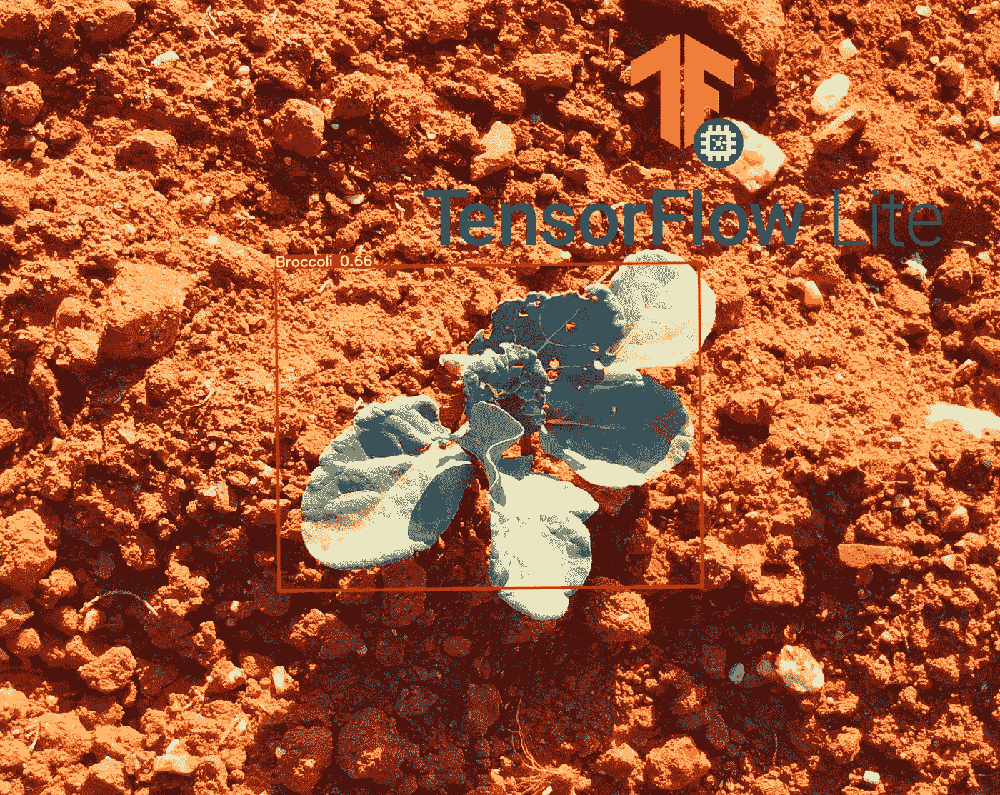
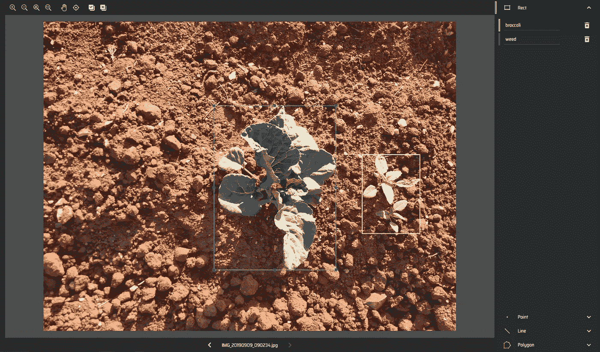
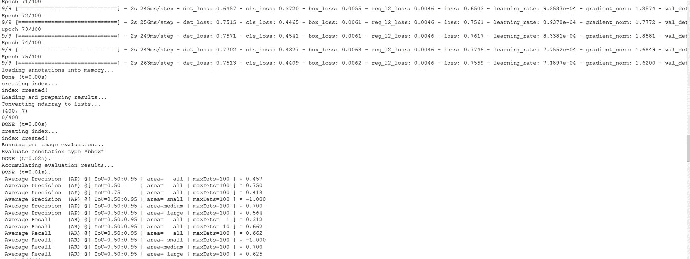
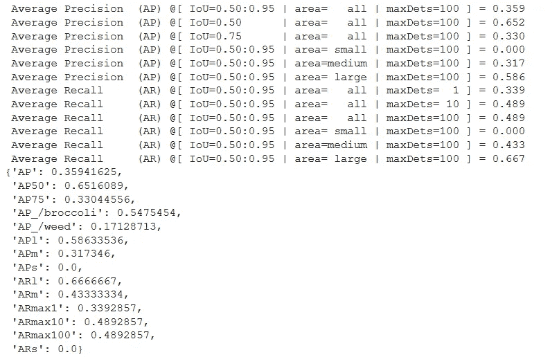

# 用 TF Lite Model-maker 实现边缘目标检测

> 原文：<https://pub.towardsai.net/object-detection-at-the-edge-with-tf-lite-model-maker-e635a17b0854?source=collection_archive---------0----------------------->

关于使用 tensor flow Lite(TF Lite)Model Maker 库进行边缘对象检测的全面教程。



图片来源[https://edenlibrary.ai/datasets](https://edenlibrary.ai/datasets)

> 您是否想知道在自定义数据集上训练对象检测网络的最简单、最快的方法是什么？你有兴趣把那些人工智能算法带到边缘吗？

有时候你需要一个快速的解决方案。它可能是一个原型或者一个不重要的任务。你需要一个既快速又准确的解决方案。像 YoloV5 或 Detectron2 这样的框架是很好的选择，但是它们需要一些努力来设置，并且通常在边缘部署它们的模型并不容易。

幸运的是，Tensorflow 团队得到了我们的支持，他们创建了一个非常棒的新工具，对象检测模型生成器 API。

# **TensorFlow Lite 模型制作师**

> Model-maker 是一个新的(实验性的，截至 2021 年 9 月)API，用于快速构建 Tensorflow lite 模型！TensorFlow Lite 模型生成器库**简化了使用自定义数据集训练 TensorFlow Lite 模型的过程。** It **利用迁移学习**减少所需训练数据量，缩短训练时间。

它目前支持 6 个任务:图像分类，物体检测，文本分类，BERT 问题回答，音频分类，和推荐系统。

尽管它目前支持的预训练模型是有限的，但它非常有用，并且您应该预计它在接下来的几个月中会变得更大。

你可以在这个 [*链接*](https://www.tensorflow.org/lite/guide/model_maker) *找到文档。*

# ***现在让我们开始建造吧！***

我们将使用 Model Maker 对象检测 API 来构建一个可以区分杂草和西兰花的网络。关于型号，我们目前仅限于 EficientDetLite 系列(0 到 4)。

# **首先，我们需要注释数据**

**用于对象检测的 Model-maker API 提供了两种加载数据的方法。**你可以使用`[from_csv](https://www.tensorflow.org/lite/api_docs/python/tflite_model_maker/object_detector/DataLoader#from_csv)`方法加载数据，或者使用`[from_pascal_voc](https://www.tensorflow.org/lite/api_docs/python/tflite_model_maker/object_detector/DataLoader#from_pascal_voc).` 方法加载数据。对于本教程，我将使用 from_pascal_voc 方法，因为我用 Pascalvoc 格式注释了我的数据(有关 VOC 的更多信息，请查看本文[文章](https://towardsdatascience.com/coco-data-format-for-object-detection-a4c5eaf518c5)

为了注释你的数据集，我建议使用 Roboflow 或者 LabelImg。我也测试了 CVAT 和 MakeSense.ai，但是看起来这些工具生成的 PascalVOC 注释和 API 预期的注释之间存在一些不兼容。这会导致数据加载过程中出现错误。

**注意:**对 Pascal VOC 注释使用 CVAT 可能会导致`KeyError:'pose'`。我发现这是因为属性<被截断>没有插入到 XML 注释中。由于属性<困难>的默认值，使用 MakeSense.ai 的注释产生了一个错误。API 要求 0，而 MakeSense 使用“未指定”。

> 我们将建造一个杂草探测器，一个能区分我的有机花椰菜和它们周围发芽的杂草的模型。如果我想让它们健康成长，我真的需要把它们取出来。



注释我的数据集。非常感谢 [**EdenLibrary**](https://edenlibrary.ai/datasets) 提供这些伟大的数据集！

完成注释过程后，您应该有一个包含所有图像以及 XML 注释文件的文件夹，数据集中的每个图像都有一个 XML。**我建议您预先将带注释的数据集分割成 train-val 分割。**

# 编码时间到了

我最喜欢的部分来了。但是，您可能需要先安装 2 个软件包。 ***我强烈建议你创建一个 conda 环境来运行你的项目*** *。现在，尝试这两个 pip 命令:*

```
!pip install  tflite-model-maker
!pip install  pycocotools
```

**注意:**有可能 *pip 安装 tflite-model-maker* 将进入递归模式以确定哪个版本与其他需求兼容。这可能会导致安装时间过长或无法完成。我设法通过安装夜间版本来解决这个问题，Google colab 是避免错误的另一个好选择。

一旦你成功地安装了 2 个包，我们就可以进入编码部分了。

## **1。导入必要的库**

```
import numpy as np
import osfrom tflite_model_maker.config import ExportFormat
from tflite_model_maker import model_spec
from tflite_model_maker import object_detectorimport tensorflow as tf
assert tf.__version__.startswith('2'
```

## **2。加载数据集**

使用 DatoLoader.from_pascal_voc()方法加载数据集

在上面的代码中，只需确保在 label_map 中，第一个类的**以数字 1 开始，**以 0 作为`background`类的保留键。

**注:**有一种方法叫拆分。假设您可以用数据加载器加载整个数据集，然后使用。split()方法将返回的对象分成训练集和验证集。然而，这个方法还没有被实现，尽管它出现在文档中。

## **3。创建和训练对象检测模型。**

Model-maker 对象检测 API 提供了 EfficientDet 系列，范围从 EfficientDet 0 到 4，0 是最小的，4 是最大的。我们用下面的代码行 [(doc)](https://www.tensorflow.org/lite/api_docs/python/tflite_model_maker/model_spec/get) 指定我们想要使用的模型。

因为手头的问题很简单，而且因为我没有很多数据，我将使用一个较小的网络来避免过度拟合问题。

```
# model specification
**spec = model_spec.get("efficientdet_lite1")**
```

> **一旦你指定了模型的名字，你就可以用一个简单的命令来训练它！**

创建和训练我们的模型

让我们检查一小部分输出。奇怪的是，评估结果并不总是在 5 个时期后出现。评估打印最重要的对象检测指标，例如不同 iou 和类别的 AP 和 AR。



用 evaluate()方法在测试数据集上评估我们的模型也很有趣。如果您有足够的数据，请将您的数据集拆分为 train-val-test 子集，并在此方法中使用测试数据集。但是，如果数据短缺，请评估验证子集。

`**model.evaluate(val_ds)**`



对于这种只有 45 幅图像的 Lite 模型，IoU=0.50 时 AP 为 0.652 就足够好了。AP_/weed 没那么好，要多搜集那个类的例子进行训练。但是，请确保您可以通过使用更大的数据集和更复杂的模型(如 EfficientDetLite4)来获得更好的性能。

你喜欢这篇文章吗？使用我的推荐链接成为中级会员。我会得到一部分奖励，对你没有额外的成本:)

[](https://medium.com/@poulinakis.kon/membership) [## 通过我的推荐链接加入 Medium-Konstantinos Poulinakis

### 阅读深度学习，数据科学，技术和媒体上的想法。您的会员费直接支持…

medium.com](https://medium.com/@poulinakis.kon/membership) 

## **4。导出模型**

现在我们有了一个训练好的模型，我们想导出它并使用它进行预测。**提供 3 种导出格式**

*   `ExportFormat.TFLITE`
*   `ExportFormat.LABEL`
*   `ExportFormat.SAVED_MODEL`

因为我想在便携设备上部署模型，所以我打算以 TFLITE 格式导出它。

```
model.export(export_dir= 'MY_EXPORT_PATH', 
             tflite_filename= 'MY_FILENAME'
             )
```

*【可选】* **:** 还有一个选项是在导出之前**量化**你的模型。量化通过将权重转换为 FLOAT16 或 INT8 来减小模型的大小。这可以在部署期间导致更快的推断。

```
from tflite_model_maker import configquantization = config.QuantizationConfig.for_float16()
model.export(export_dir= 'MY_EXPORT_PATH', 
             tflite_filename= 'MY_FILENAME',
             Quantization_config=quantization
             )
```

## **5。运行推理**

**祝贺你成功来到这里！**现在你应该已经有了一个训练有素的物体检测模型和一个 tflite 导出版本。

现在，您只需在安装了 TensorFlow Lite 解释器的设备上加载您的模型。由于我不想让这篇文章变得太长，**我将在我的下一篇文章**中记录部署的过程。我将在一个配备了摄像头的 Raspberry Pi 上部署模型，并直接在 Pi 上运行检测。敬请关注！

# 一些限制

Model Maker 仍然是一个实验性的特性，当然有很多限制。我主要依靠它来进行快速原型制作、实验和个人项目。它不适合生产使用。

1.  缺少一系列可供选择的型号
2.  您不能微调模型或添加自定义功能
3.  缺少回调，如提前停止和 best_weights_saving。

迄今为止，我非常感谢 TensorFlow Lite 团队开发了这个伟大的工具。

在本文的下一部分，我将展示如何使用 TF Lite 在 Raspberry Pi 上部署模型。在未来，我还将探索使用 Model Maker 的其他任务，如音频分类。在此之前，请密切关注该工具的新发展。

如果你学到了一些有用的东西，请关注我，获取更多的深度学习内容和技术教程。使劲鼓掌也让我感觉很棒:)

如果你愿意支持我，你可以使用我的链接成为媒体的一员。我会得到一半的奖励，不需要你额外付费:)

[](https://medium.com/@poulinakis.kon/membership) [## 通过我的推荐链接加入 Medium-Konstantinos Poulinakis

### 阅读深度学习，数据科学，技术和媒体上的想法。您的会员费直接支持…

medium.com](https://medium.com/@poulinakis.kon/membership) 

*感谢阅读，欢迎随时联系！*

**我的链接:** [中型](https://medium.com/@poulinakis.kon)|[*LinkedIn*](https://www.linkedin.com/in/konstantinos-poulinakis-4554821a3/)*|[GitHub](https://github.com/Poulinakis-Konstantinos)*