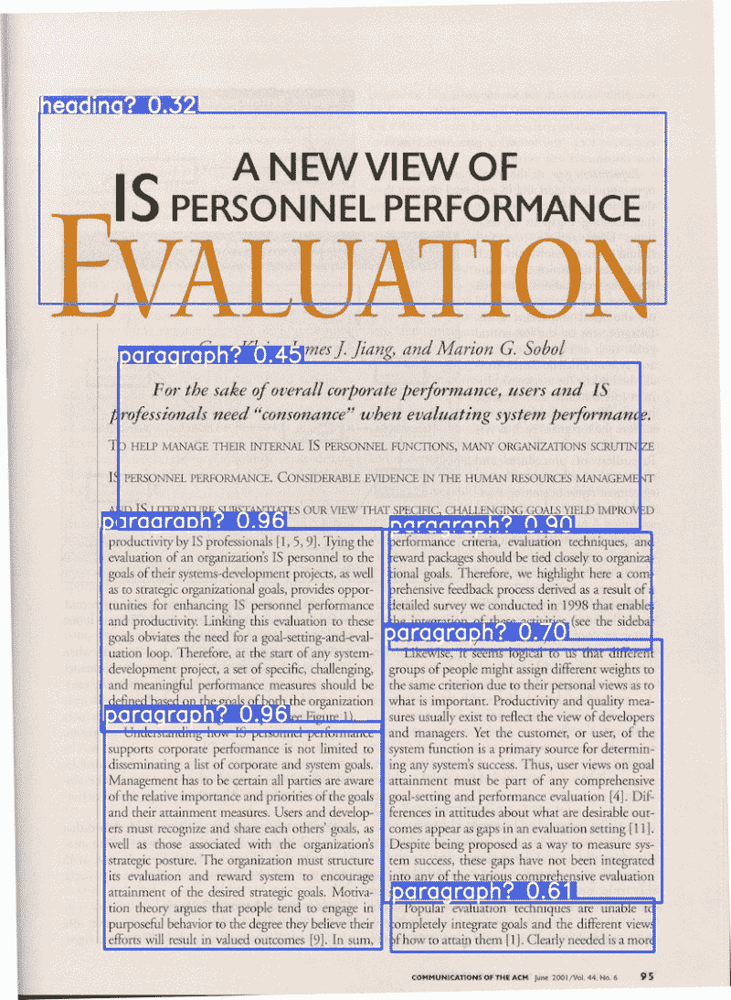
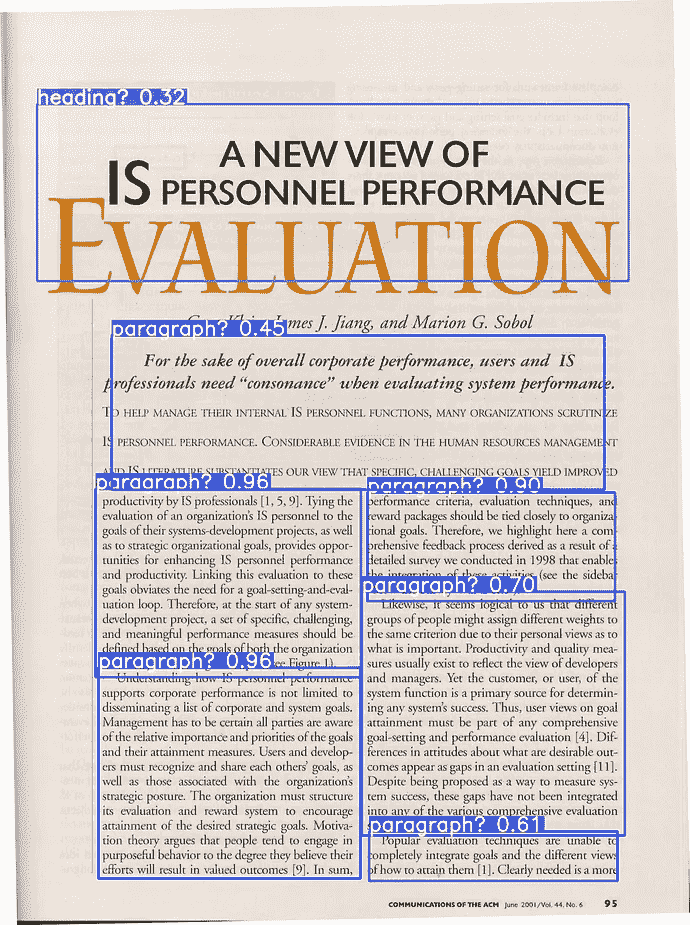
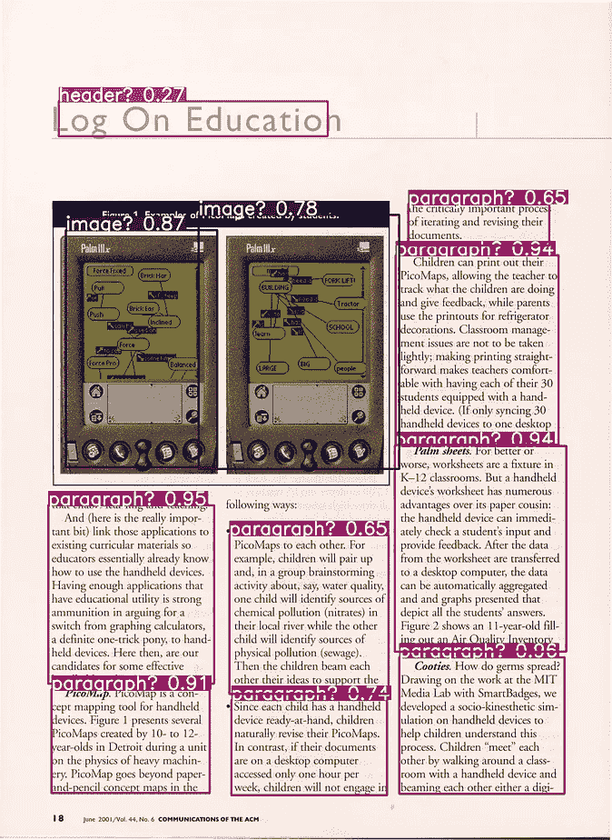
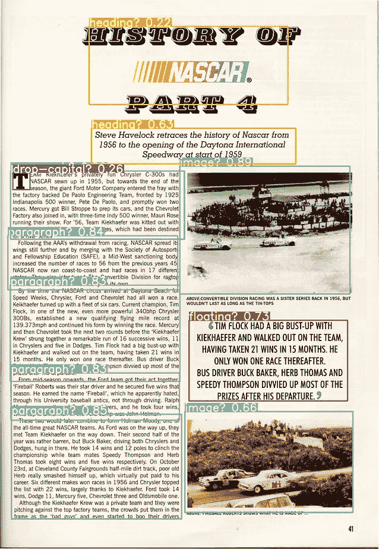
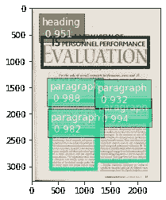
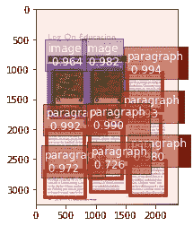
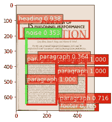
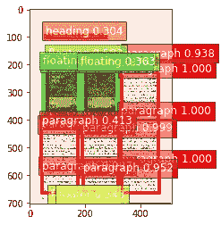
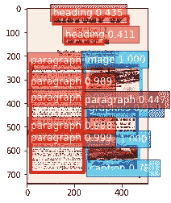

# 对象检测—使用 Monk AI 进行文档布局分析

> 原文：<https://pub.towardsai.net/object-detection-document-layout-analysis-using-monk-object-detection-toolkit-6c57200bde5?source=collection_archive---------1----------------------->

## [计算机视觉](https://towardsai.net/p/category/computer-vision)

## 这篇文章比较研究了三种不同的对象检测架构——yolov 3、Faster-RCNN 和 SSD512，内容是识别文档的不同区域，并使用 MonkAI 在几行代码中加载这些模型。



使用对象检测的文档布局分析示例

# 介绍

这是一篇关于对象检测如何帮助我们预测文档中不同区域的文章。它可以用于裁剪出标题、段落、表格、图像等。可以根据需要对其进行后续处理以获得所需信息。我们比较了 3 种不同对象检测架构的性能，即 YOLOv3、Faster-RCNN 和 SSD512，并使用 Monk 库加载这些模型。

[Github](https://github.com/swapnil-ahlawat/Document_Layout_Analysis-MonkAI) 详细教程。

## 关于数据集

用于该任务的训练数据集是 [PRImA 布局分析数据集](https://www.primaresearch.org/dataset/)。它包括各种不同的文档类型，反映了布局分析中的各种挑战。特别强调的是:

*   杂志扫描各种主流新闻、商业和技术出版物，其中包含简单和复杂的混合布局(例如，非曼哈顿，不同的字体大小等。)
*   各种学科的技术文章，包括期刊和会议记录中的论文，有简单的也有复杂的布局。

该数据集包含 18 个标签，即“标题”、“图表”、“信用”、“首字下沉”、“浮动”、“页脚”、“框架”、“图形”、“页眉”、“标题”、“图像”、“线描”、“数学”、“噪音”、“页码”、“段落”、“分隔符”和“表格”

可以从[这里](https://drive.google.com/file/d/1iBfafT1WHAtKAW0a1ifLzvW5f0ytm2i_/view)下载。

## 艾和尚:

[和尚物体检测](https://github.com/Tessellate-Imaging/Monk_Object_Detection)是所有物体检测流水线的集合。对于每个管道来说，好处是双重的——使安装兼容多种操作系统、Cuda 版本和 python 版本，并通过标准化的流程降低代码量。Monk 对象检测使用户能够用很少几行代码解决计算机视觉问题。对于这个任务，我们将使用这个库的 3 个不同的管道用于 3 个不同的架构- [*yolov3*](https://github.com/Tessellate-Imaging/Monk_Object_Detection/tree/master/7_yolov3) ，[*gluonvc _ fine tune*](https://github.com/Tessellate-Imaging/Monk_Object_Detection/tree/master/1_gluoncv_finetune)*，*和 *mxrcnn* 。

# 目录

1.  安装 Monk 对象检测工具包
2.  将预先训练的模型用于文档布局分析任务
3.  训练你自己的模型

*   *下载和预处理数据(格式转换、选择性数据扩充)*
*   *从零开始训练模型*

4.推理和比较

# 1.安装 Monk 对象检测工具包

首先，使用以下命令将库克隆到您的系统中:

```
! git clone [https://github.com/Tessellate-Imaging/Monk_Object_Detection.git](https://github.com/Tessellate-Imaging/Monk_Object_Detection.git)
```

然后，根据您的系统的 CUDA 版本或 Colab 版本，选择您想要安装的管道和该管道的正确需求文件。以下是我在此任务中使用的管道命令:

```
#For yolov3 (used for yolov3 architecture)
! cd Monk_Object_Detection/7_yolov3/installation && cat requirements.txt | xargs -n 1 -L 1 pip install#For gluoncv_finetune (used for SSD512 architecture)
! cd Monk_Object_Detection/1_gluoncv_finetune/installation && cat requirements_cuda10.1.txt | xargs -n 1 -L 1 pip install#For mxrcnn (used for FasterRCNN architecture)
! cd Monk_Object_Detection/3_mxrcnn/installation && cat requirements_cuda10.1.txt | xargs -n 1 -L 1 pip install
```

欲了解更多管道或安装方式，请访问[僧侣对象检测库](https://github.com/Tessellate-Imaging/Monk_Object_Detection)。

# 2.将预先训练的模型用于文档布局分析任务

如果您不想自己训练模型，而只想使用我们为此任务训练的模型，您可以使用下面这段代码直接使用它:

## 对于 YOLOv3:

```
**import** **os**
**import** **sys**
**from** **IPython.display** **import** Image
sys.path.append("Monk_Object_Detection/7_yolov3/lib")**from** **infer_detector** **import** Infer
gtf = Infer()
```

下载并初始化预训练模型:

```
! wget --load-cookies /tmp/cookies.txt "https://docs.google.com/uc?export=download&confirm=$(wget --save-cookies /tmp/cookies.txt --keep-session-cookies --no-check-certificate 'https://docs.google.com/uc?export=download&id=1Si1puABMiijtvLvH-XMnr2pVj4K2lUkO' -O- | sed -rn 's/.*confirm=([0-9A-Za-z_]+).*/**\1\n**/p')&id=1Si1puABMiijtvLvH-XMnr2pVj4K2lUkO" -O obj_dla_yolov3_trained.zip && rm -rf /tmp/cookies.txt! unzip -qq obj_dla_yolov3_trained.zip! mv dla_yolov3/yolov3.cfg .f = open("dla_yolov3/classes.txt")
class_list = f.readlines()
f.close()model_name = "yolov3"
weights = "dla_yolov3/dla_yolov3.pt"
gtf.Model(model_name, class_list, weights, use_gpu=**True**, input_size=416)
```

你可以测试一下:

```
#change test1 to whatever image you want it to test for.
img_path = "test1.jpg"
gtf.Predict(img_path, conf_thres=0.3, iou_thres=0.5)
Image(filename='output/test1.jpg')
```

## 对于 SSD512:

```
**import** **os**
**import** **sys**
sys.path.append("Monk_Object_Detection/1_gluoncv_finetune/lib/")**from** **inference_prototype** **import** Infer
```

下载并初始化预训练模型:

```
! wget --load-cookies /tmp/cookies.txt "https://docs.google.com/uc?export=download&confirm=$(wget --save-cookies /tmp/cookies.txt --keep-session-cookies --no-check-certificate 'https://docs.google.com/uc?export=download&id=1E6T7RKGwy-v1MUxVJm-rxt5XcRyr2SQ7' -O- | sed -rn 's/.*confirm=([0-9A-Za-z_]+).*/**\1\n**/p')&id=1E6T7RKGwy-v1MUxVJm-rxt5XcRyr2SQ7" -O obj_dla_ssd512_trained.zip && rm -rf /tmp/cookies.txt! unzip -qq obj_dla_ssd512_trained.zipmodel_name = "ssd_512_vgg16_atrous_coco";
params_file = "dla_ssd512/dla_ssd512-vgg16.params";
class_list = ["paragraph", "heading", "credit", "footer", "drop-capital", "floating", "noise", "maths", "header", "caption", "image", "linedrawing", "graphics", "fname", "page-number", "chart", "separator", "table"]gtf = Infer(model_name, params_file, class_list, use_gpu=**True**)
```

你可以测试一下:

```
#change test1 to whatever image you want it to test for.
img_name = "test1.jpg"  
visualize = **True** 
thresh = 0.3
output = gtf.run(img_name, visualize=visualize, thresh=thresh)
```

## 对于更快的 RCNN:

```
**import** **os**
**import** **sys**
sys.path.append("Monk_Object_Detection/3_mxrcnn/lib/")
sys.path.append("Monk_Object_Detection/3_mxrcnn/lib/mx-rcnn")**from** **infer_base** **import** *
```

下载并初始化预训练模型:

```
! wget --load-cookies /tmp/cookies.txt "https://docs.google.com/uc?export=download&confirm=$(wget --save-cookies /tmp/cookies.txt --keep-session-cookies --no-check-certificate 'https://docs.google.com/uc?export=download&id=1TZQSBiMDBrGhcT75AknTbofirSFXprt8' -O- | sed -rn 's/.*confirm=([0-9A-Za-z_]+).*/**\1\n**/p')&id=1TZQSBiMDBrGhcT75AknTbofirSFXprt8" -O obj_dla_faster_rcnn_trained.zip && rm -rf /tmp/cookies.txt! unzip -qq obj_dla_faster_rcnn_trained.zipclass_file = set_class_list("dla_fasterRCNN/classes.txt")set_model_params(model_name="vgg16", model_path="dla_fasterRCNN/dla_fasterRCNN-vgg16.params")set_hyper_params(gpus="0", batch_size=1)set_img_preproc_params(img_short_side=300, img_long_side=500, mean=(196.45086004329943, 199.09071480252155, 197.07683846968297), std=(0.25779948968052024, 0.2550292865960972, 0.2553027154941914))initialize_rpn_params()
initialize_rcnn_params()
sym = set_network()
mod = load_model(sym)
```

你可以测试一下:

```
#change test1 to whatever image you want it to test for.
set_output_params(vis_thresh=0.9, vis=**True**)
Infer("test1.jpg", mod);
```

# 3.训练你自己的模型

## 数据准备

可以使用以下命令下载数据集:

```
! wget --load-cookies /tmp/cookies.txt "https://docs.google.com/uc?export=download&confirm=$(wget --quiet --save-cookies /tmp/cookies.txt --keep-session-cookies --no-check-certificate 'https://docs.google.com/uc?export=download&id=1iBfafT1WHAtKAW0a1ifLzvW5f0ytm2i_' -O- | sed -rn 's/.*confirm=([0-9A-Za-z_]+).*/**\1\n**/p')&id=1iBfafT1WHAtKAW0a1ifLzvW5f0ytm2i_" -O PRImA_Layout_Analysis_Dataset.zip && rm -rf /tmp/cookies.txt! unzip -qq PRImA_Layout_Analysis_Dataset.zip
```

数据集中的所有图像都是 TIFF 格式。TIFF 图像的训练速度比 JPEG 格式的图像慢 5 倍以上，因为它们非常大。因此，TIFF 图像被转换为 JPEG 格式的图像。

```
**for** name **in** glob.glob(root_dir+img_dir+'*.tif'):     
im = Image.open(name)     
name = str(name).rstrip(".tif")     
name = str(name).lstrip(root_dir)     
name = str(name).lstrip(img_dir)     
im.save(final_root_dir+ img_dir+ name + '.jpg', 'JPEG')
```

数据以 VOC 格式显示。为了将它与各种管道一起使用，我们首先将其转换为 Monk 格式，这与许多 Monk 管道直接兼容，稍后，如果需要，我们可以很容易地将其转换为其他格式。如果你想跳过转换成 Monk 格式，而想直接转换成其他需要的格式，那么你可以查看 pipelines 的示例笔记本[这里](https://github.com/Tessellate-Imaging/Monk_Object_Detection/tree/master/example_notebooks)。

**和尚格式**

```
./Document_Layout_Analysis/ (final_root_dir)
      |
      |-----------Images (img_dir)
      |              |
      |              |------------------img1.jpg
      |              |------------------img2.jpg
      |              |------------------.........(and so on)
      |
      |
      |-----------train_labels.csv (anno_file)
```

**标注文件格式**

```
| Id         | Labels                                 |
| img1.jpg   | x1 y1 x2 y2 label1 x1 y1 x2 y2 label2  |
```

*   标签:xmin ymin xmax ymax 标签
*   xmin，ymin 边界框的左上角
*   xmax，ymax 边界框的右下角

数据转换的代码很简单，但是很长。你可以在这里查看其中一个笔记本[中的代码。](https://github.com/swapnil-ahlawat/Document_Layout_Analysis-MonkAI)

以下是用于该任务的各种管道的格式要求:

1.  *yolov3* 用于 yolov3 架构的管道需要 YOLOv3 格式的数据。你可以在这个[笔记本](https://github.com/swapnil-ahlawat/Document_Layout_Analysis-MonkAI/blob/master/YOLOv3-Document_Analysis.ipynb)里查看这个转换。
2.  *用于 SSD512 架构的 gluoncv-finetune* 流水线直接采用 Monk 格式进行训练。因此，没有必要进一步转换。
3.  *mxrcnn* 用于 fast-RCNN 架构的管道需要 COCO 格式的数据。您可以在本[笔记本](https://github.com/swapnil-ahlawat/Document_Layout_Analysis-MonkAI/blob/master/FasterRCNN-VGG16_Backend-Document_Analysis.ipynb)中查看这一转换。

## 选择性数据扩充

数据集有问题。由于文档的大部分是文本，数据集中的段落比表格或图表等其他标签多得多。为了处理数据集中的这种巨大偏差，我们只增强了那些包含这些少数民族标签之一的文档图像。例如，如果文档只有段落和图像，那么我们就不对其进行扩充。但如果它有表格、图表、图形或任何其他少数民族的标签，我们会将图像放大许多倍。这一过程有助于将数据集中的偏差减少约 25%。这种选择和扩充是在从 VOC 到 Monk 格式的格式转换过程中完成的。你可以在这里查看其中一个笔记本[中的代码。](https://github.com/swapnil-ahlawat/Document_Layout_Analysis-MonkAI)

对于数据扩充，我们使用了白蛋白库。它提供了许多不同的方法来扩充数据，如随机裁剪、转换、色调、饱和度、对比度、亮度等。你可以在这里查看更多关于这个图书馆的信息。它可以使用 pip 命令直接安装:

```
! pip install albumentations
```

下面是我们为数据扩充写的函数。很少有边界框超出图像而 Albumentations 库无法处理的情况，所以我们编写了一个自定义函数来确保标签在图像内部。

```
**def** augmentData(fname, boxes):
    image = cv2.imread(final_root_dir+img_dir+fname)
    image = cv2.cvtColor(image, cv2.COLOR_BGR2RGB)

    transform = A.Compose([
        A.IAAPerspective(p=0.7),   
        A.ShiftScaleRotate(shift_limit=0.1, scale_limit=0.1, rotate_limit=5, p=0.5),
        A.IAAAdditiveGaussianNoise(),
        A.ChannelShuffle(),
        A.RandomBrightnessContrast(),
        A.RGBShift(p=0.8),
        A.HueSaturationValue(p=0.8)
        ], bbox_params=A.BboxParams(format='pascal_voc', min_visibility=0.2))

    **for** i **in** range(1, 9):
        label=""
        transformed = transform(image=image, bboxes=boxes)
        transformed_image = transformed['image']
        transformed_bboxes = transformed['bboxes']
        *#print(transformed_bboxes)*
        flag=**False**
        **for** box **in** transformed_bboxes:
            x_min, y_min, x_max, y_max, class_name = box
            **if**(xmax<=xmin **or** ymax<=ymin):
                flag=**True**
                **break**
            label+= str(int(x_min))+' '+str(int(y_min))+' '+str(int(x_max))+' '+str(int(y_max))+' '+class_name+' '

        **if**(flag):
            **continue**
        cv2.imwrite(final_root_dir+img_dir+str(i)+fname, transformed_image)
        label=label[:-1]
        combined.append([str(i) + fname, label])
```

## 计算数据集的平均值和标准差

*mxrcnn* 流水线(用于 fast-RCNN)也需要均值和标准差作为参数之一。可以使用以下函数进行计算:

```
**def** normalize():
    channel_sum = np.zeros(3)
    channel_sum_squared = np.zeros(3)
    num_pixels=0
    count=0
    **for** file **in** files:
        file_path=final_root_dir+img_dir+file
        img=cv2.imread(file_path)
        img= img/255.
        num_pixels += (img.size/3)
        channel_sum += np.sum(img, axis=(0, 1))
        channel_sum_squared += np.sum(np.square(img), axis=(0, 1)) mean = channel_sum / num_pixels
    std = np.sqrt((channel_sum_squared/num_pixels) - mean**2)

    *#bgr to rgb conversion*
    rgb_mean = list(mean)[::-1]
    rgb_std = list(std)[::-1]
    **return** rgb_mean, rgb_stdmean, std = normalize()
mean=[x*255 **for** x **in** mean]
```

# 训练你自己的模型

这就是 Monk Library 的真正威力所在。为对象检测架构编写代码可能是一项非常繁琐的任务，但使用 Monk 对象检测库只需几行代码就可以完成。

为了进行比较，所有 3 种架构都经过了 30 个时期的训练，学习率为 0.003。

**对于约洛夫 3:**

```
**import** **os**
**import** **sys**
sys.path.append("Monk_Object_Detection/7_yolov3/lib")**from** **train_detector** **import** Detector
gtf = Detector()*#dataset directories*
img_dir = "Document_Layout_Analysis/Images/"
label_dir = "Document_Layout_Analysis/labels/"
class_list_file = "Document_Layout_Analysis/classes.txt"gtf.set_train_dataset(img_dir, label_dir, class_list_file, batch_size=16)
gtf.set_val_dataset(img_dir, label_dir)
gtf.set_model(model_name="yolov3")*#sgd is found out to perform better than adam optimiser on this task*
gtf.set_hyperparams(optimizer="sgd", lr=0.003, multi_scale=**False**, evolve=**False**)gtf.Train(num_epochs=30)
```

**对于更快的 RCNN:**

```
**import** **os**
**import** **sys**
sys.path.append("Monk_Object_Detection/3_mxrcnn/lib/")
sys.path.append("Monk_Object_Detection/3_mxrcnn/lib/mx-rcnn")**from** **train_base** **import** **# Dataset params*
root_dir = "./";
coco_dir = "Document_Layout_Analysis"
img_dir = "Images"set_dataset_params(root_dir=root_dir, coco_dir=coco_dir, imageset=img_dir);
set_model_params(model_name="vgg16")
set_hyper_params(gpus="0", lr=0.003, lr_decay_epoch='20', epochs=30, batch_size=8)
set_output_params(log_interval=500, save_prefix="model_vgg16")*#Preprocessing image parameters(mean and std calculated during data pre-processing)*
set_img_preproc_params(img_short_side=300, img_long_side=500, mean=(196.45086004329943, 199.09071480252155, 197.07683846968297), std=(0.25779948968052024, 0.2550292865960972, 0.2553027154941914))initialize_rpn_params();
initialize_rcnn_params();*#Removing cache if any* **if** os.path.isdir("./cache/"):
    os.system("rm -r ./cache/")roidb = set_dataset()
sym = set_network()
train(sym, roidb)
```

**对于 SSD512:**

```
**import** **os
import** **sys**
sys.path.append("Monk_Object_Detection/1_gluoncv_finetune/lib/");**from** **detector_prototype** **import** Detector
gtf = Detector()root = "Document_Layout_Analysis/"
img_dir = "Images/"
anno_file = "train_labels.csv"
batch_size=8gtf.Dataset(root, img_dir, anno_file, batch_size=batch_size)*#vgg16 architecture, with atrous convolutions, pretrained on COCO dataset is used for this task*
pretrained = **True**         
gpu=**True**
model_name = "ssd_512_vgg16_atrous_coco"gtf.Model(model_name, use_pretrained=pretrained, use_gpu=gpu)
gtf.Set_Learning_Rate(0.003)
epochs=30
params_file = "saved_model.params"
gtf.Train(epochs, params_file)
```

这些模型是在 16GB 的 NVIDIA Tesla V100 上训练的。YOLOv3 在训练中花费的时间最少-6-7 小时，SSD512 花费了大约 11 小时，而 fast-RCNN 花费的时间最多- 24 小时以上。

# 4.推理和比较

推理代码与直接使用预训练模型时使用的代码几乎相同。你可以在笔记本[这里](https://github.com/swapnil-ahlawat/Document_Layout_Analysis-MonkAI)查看。

从零开始训练模型后，在测试图像上获得以下结果:

**从 YOLOv3 获得的结果:**

YOLOv3 产生的输出非常准确。这是唯一一个能够在 3 种架构中识别落差的模型。尽管与其他模型相比，预测的可信度较低，但它们的分类在所有三种模型中是最准确的。



从 YOLOv3 架构推断测试图像

**从 fast-RCNN 获得的结果:**

fast-RCNN 以非常高的置信度检测到边界框，但它错过了一些重要的区域，如第一个示例中的页脚、第二个示例中的标题和第三个示例中的首字下沉。如果我们降低得到丢失盒子的阈值置信度，就会产生许多随机的盒子，而不清楚它代表什么。



**从 SSD512 获得的结果:**

SSD512 产生的输出具有非常高的置信度，其中许多置信度为 0.9+。它也是唯一能够识别页脚和文档中分隔线等干扰的模型。但它也产生了重复或不正确的标题，如第二个示例中的“浮动”(额外的框带有不正确的标签)，第三个示例中的图形和段落(同一区域的两个框带有不同的标签)。



从 SSD512 架构推断测试图像

根据它们的输出，可以从本教程中得出以下推论:

1.  Monk library 让学生、研究人员和竞争对手可以非常轻松地创建深度学习模型，并尝试不同的超参数调整，以非常少的几行代码提高模型的准确性。
2.  fast-RCNN 在这项任务中的性能最差，而 SSD512 和 YOLOv3 的结果相当。
3.  如果你想使用一个不需要花太多时间训练的模型，并且像页脚或分隔符这样的小细节不会影响你的工作，那就用 YOLOv3 吧。
4.  如果这些小细节对您的工作至关重要，并且重点是边界框预测而不是分类，请使用 SSD512。还需要考虑的是，Monk AI 的 *gluoncv-finetune* 流水线(已经用于 SSD512)也提供了在各种其他数据集上预训练的架构，比如 COCO 数据集。

## 参考资料:

1.  教程的 GitHub 库:[https://GitHub . com/swap nil-ahlawat/Document _ Layout _ Analysis-MonkAI](https://github.com/swapnil-ahlawat/Document_Layout_Analysis-MonkAI)
2.  数据集:【https://www.primaresearch.org/dataset/ 
3.  和尚物体探测库:[https://github.com/Tessellate-Imaging/Monk_Object_Detection](https://github.com/Tessellate-Imaging/Monk_Object_Detection)
4.  相册库:[https://github.com/albumentations-team/albumentations](https://github.com/albumentations-team/albumentations)

感谢阅读！我希望这篇文章对你有帮助。请在评论区分享您的反馈！你可以在 [LinkedIn](https://www.linkedin.com/in/swapnilahlawat/) 上联系我。