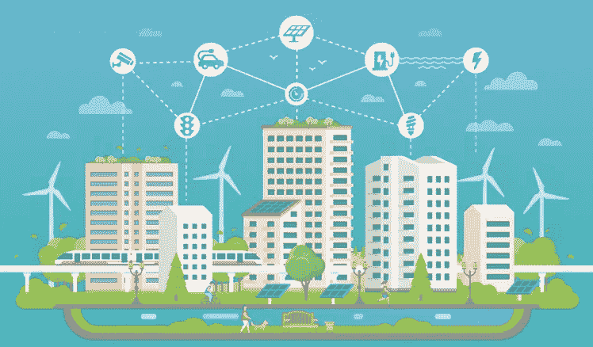
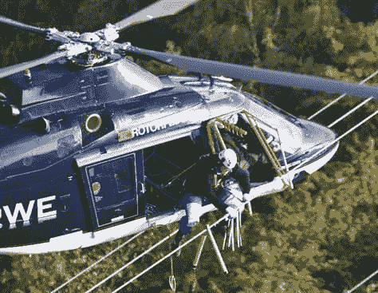
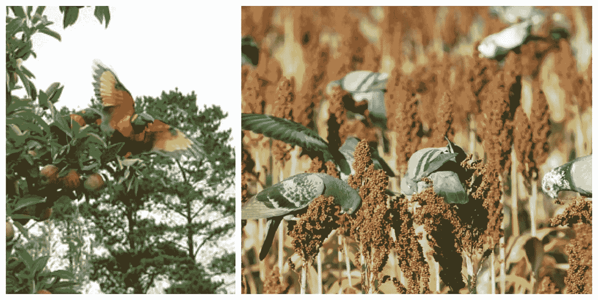
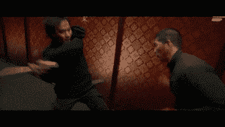

# 物体检测——智能城市最重要的“B”检测器和用例

> 原文：<https://pub.towardsai.net/object-detection-most-important-b-detectors-and-use-cases-for-smart-cities-900640608b19?source=collection_archive---------1----------------------->

## [计算机视觉](https://towardsai.net/p/category/computer-vision)

来源: [Scnsoft](https://www.scnsoft.com/blog/iot-for-smart-city-use-cases-approaches-outcomes)

让我们开始吧。在这篇文章中将涵盖以下对象检测。

1.  [公交车/重型车辆检测](https://medium.com/@mihir_rajput/object-detection-zoo-part-1-bus-detection-heavy-vehicle-detection-1f23a13b3c3?source=your_stories_page---------------------------)
2.  [鸟类检测](https://medium.com/@mihir_rajput/object-detection-zoo-part-2-birds-detection-ac578a3bb3a1?source=your_stories_page---------------------------)
3.  [棒球棍检测](https://medium.com/@mihir_rajput/object-detection-zoo-part-3-baseball-bat-detection-9b3dfd483ada?source=your_stories_page---------------------------)
4.  [自行车检测](https://medium.com/@mihir_rajput/object-detection-zoo-part-4-bicycle-detection-66a54f81ee82?source=your_stories_page---------------------------)
5.  [瓶子检测](https://medium.com/@mihir_rajput/object-detection-zoo-part-5-bottle-detection-aede763bbac3?source=your_stories_page---------------------------) **(世界环境日特辑！)**

所有这些对象都被单独训练以被检测。经过训练的模型/权重是开源的，用于非商业用途。您可以通过电子邮件、GitHub 或 LinkedIn 与我联系。此外，我制作了经过处理的视频并上传到 YouTube 上，这些视频展示了模特们在看不见的数据上的表现。

# 公共汽车/重型车辆检测

## **重要性/事实**

公共汽车和重型车辆在任何国家、城市或地区都很常见。许多人使用公共汽车在一个城市或一个州内旅行。许多公司用重型车辆来运输货物和物品。因此，这为与监控、分析和自动化相关的人工智能应用创造了机会。

## **用例**

1)用于政府的公共汽车监控/管理系统，其中政府可以跟踪使用 CCTV 摄像机。

他们可以，

-清点公共汽车站上进出的公共汽车。

-核实公共汽车的到达时间。

-跟踪特定公共汽车站的公共汽车到达频率。

这种生成的数据可以帮助政府解决很多问题。

2)车辆类型(重型或小型)是收费税和高速公路相关服务的一个主要方面，因此他们可以通过结合闭路电视镜头和计算机视觉来解决他们的问题。

3)有一些区域或桥梁禁止重型车辆通行。我们可以使用重型车辆检测来监控这些区域。

## **输出**

公共汽车/重型车辆检测

# 鸟类检测

## **重要性/事实**

事实一，

鸟撞——有时被称为鸟撞、鸟食(对于发动机)、鸟撞或鸟撞飞机危险(BASH)——是空中动物(通常是鸟或蝙蝠)和人造车辆(通常是飞机)之间的碰撞。该术语也用于描述因与电线、塔和风力涡轮机等结构碰撞而导致的鸟类死亡(参见“鸟-摩天大楼碰撞”和“塔楼倒塌”)。

来源 https://en.wikipedia.org/

仅在美国，这些事故每年造成的损失估计就达 4 亿美元[3],全球商用飞机的损失高达 12 亿美元。

事实二，

根据一项新的研究，世界上有数千万只火烈鸟、鹳、鹈鹕和其他候鸟因为飞进电线而被杀死。

来源[http://www.nbcnews.com/](http://www.nbcnews.com/)

既然我们知道这个用例很重要。让我们探索它的一些应用和输出。

事实三，

对于种植者来说，由于鸟类造成的园艺作物损失是一项持续增加的成本。对损害的估计各不相同，但在研究文献中通常报告为小浆果产量的 30%至 35%，葡萄酒和鲜食葡萄的 7%，苹果和梨的 13%，核果类水果的 16%，坚果类作物的 22%。1 这包括食用的整个水果。从灌木或藤条上掉落的水果，以及滞销的水果(啄、洞、斜线)。这些估计与 2012 年进行的 OFVGA 种植者调查一致，该调查报告称浆果作物损失 35%，苹果损失 10%，鲜嫩水果损失 15%，葡萄损失 7%。

来源[https://onvegetables . files . WordPress . com/2013/06/managing-bird-damage-in-crops-fact sheet-final . pdf](https://onvegetables.files.wordpress.com/2013/06/managing-bird-damage-in-crops-factsheet-final.pdf)

## **用例**

1)鸟类管理员，即饲养或出售鸟类的人(尤其是白鸽管理员，因为在印度他们允许鸽子飞行一段距离)，可以很容易地跟踪鸟类，计数和监控它们。

2)在机场跑道等飞机起降区域，可以放置鸟击监测系统，防止鸟击造成重大事故。

3)我们可以在发电厂、巨大的移动塔或任何其他导致大量鸟类死亡的区域附近放置监控系统。

4)农田和农场的监控系统可以帮助农民避免作物和蔬菜受损。

嗯，你可能想知道如何防止这些事故，如何让鸟类远离这些地区？

答案是通过结合检测+报警触发。当有检测，你可以触发警报，使某些噪音，使鸟类飞走！

## **输出**

# 棒球棒检测

## **重要性/事实**

“棒球棒虽然是娱乐用的，但通常被用作攻击性武器。在英国，袭击更可能只发生在身体部位:然而，使用棒球棒的趋势已经被急救部门和警察观察到。球棒是一种容易获得的武器，一种简单的木制武器，在体育用品商店只卖 15 英镑。目前，对购买这些蝙蝠没有任何限制，这些蝙蝠是在攻击中使用时发病和偶尔死亡的主要原因。”

受伤分为三大类:

*   *面部外伤* — 6 例(30%)，其中鼻骨骨折 3 例，颧骨骨折 2 例，颧弓骨折 1 例。
*   头部损伤 — 8 (40%)例:多为轻伤和头皮裂伤，本研究中无颅骨骨折或颅内损伤。
*   *四肢创伤* — 6 例(30%)，上肢软组织损伤 5 例，胫骨骨折 1 例。

患者结果记录如下:

*   出院未复查:4 例(20%)。
*   出院时门诊(颌面急诊科)复查:8 例(40%)。
*   入院治疗:8 例(40%)。

来源:Raid-2 电影打斗场景

## 来源:

1.Groleau G A，Tso K L，Olshaker J S. *等*棒球棍殴打致伤。创伤杂志 199334366–372。[ [考研](https://www.ncbi.nlm.nih.gov/pubmed/8483176) ] [ [谷歌学术](https://scholar.google.com/scholar_lookup?journal=Trauma+J&volume=34&publication_year=1993&pages=366-372&) ]

2.Ord R . A .贝宁 R . m .因殴打造成的颌面部棒球棒伤。口腔颌面外科杂志 199553514–517。[ [考研](https://www.ncbi.nlm.nih.gov/pubmed/7722718) ] [ [谷歌学术](https://scholar.google.com/scholar_lookup?journal=Oral+Maxillofac+Surg+J&volume=53&publication_year=1995&pages=514-517&) ]

3.Berlet A-C，Talenti D P，Carroll S . f .*等*棒球棒:城市伤害的流行机制。创伤杂志 199233167–170。[ [考研](https://www.ncbi.nlm.nih.gov/pubmed/1507276) ] [ [谷歌学术](https://scholar.google.com/scholar_lookup?journal=Trauma+J&volume=33&publication_year=1992&pages=167-170&) ]

## **用例**

1.  这种物体检测可用于组织者或政府希望防止这类物体进入的公共区域、事件或聚会。
2.  棒球检测对于从安全摄像机检测暴力也是有用的。当然，这将需要一些额外的努力，我们可能需要嵌入任何活动识别算法。

## **输出**

# 自行车检测

## **重要性/事实**

嗯，最近，骑自行车是一种新的趋势，许多人都在适应它。一些首席执行官、演员、商人、办公室职员更喜欢自行车而不是其他交通工具。这种偏好主要是为了健康和环境贡献。

在我居住的艾哈迈达巴德，有一个自行车共享和租赁项目。看看这里 https://mybyk.in/的。

随着这些与“自行车”相关的项目的开展，骑自行车代替其他交通工具再次成为一种趋势。

嗯，当事情变得时髦时，总是从中获益。作为一名人工智能工程师，我很容易挑选任何趋势性的机会，并将其与人工智能相关/结合，并提出一些用例和解决方案。

## **用例**

1.  像[自行车共享](https://mybyk.in/)这样的项目可以使用自行车检测，通过闭路电视摄像头自动管理、计数和保护他们的自行车。
2.  自行车比赛或任何其他相关事件可以使用使用相机的自行车检测来获得通知(了解参与者已经到达的位置，因为赛道有时很长)，有趣的自动洞察，如多少参与者已经到达/走过特定的里程碑。
3.  自行车检测对于自动监控一些禁止自行车的地方(如国道)或只允许自行车的地方(如河边或花园)也是有用的。
4.  此外，这在智能城市中可能很有用，可以获得关于有多少人使用自行车或骑自行车的频率的有趣见解和信息。哪个地区的自行车数量最多，哪个地区的自行车数量最少？

## **输出**

# 瓶子检测

## **重要性/事实**

瓶子是我们日常生活中最重要的部分之一。每个人都使用它们。塑料瓶，钢或铝瓶，水瓶，饮料瓶，总之瓶子无处不在！

另一方面，塑料瓶正在迅速影响环境。它对陆地和海洋造成了破坏。这里有一些例子/事实，

*   塑料瓶需要 700 年才能溶解。
*   瓶装水 90%的成本是瓶子本身。
*   80%的塑料瓶从未被回收。
*   仅在美国，每年就有 3800 万个塑料瓶被填埋。
*   生产这数十亿个塑料瓶需要 2400 万升石油。
*   普通美国人每年消耗 167 瓶水。
*   瓶装水和船运是人类历史上最不节能的供水方式。
*   瓶装水是美国第二受欢迎的饮料。

来源:[https://my equa . com/blogs/blog/89626311-关于塑料瓶的事实](https://myequa.com/blogs/blog/89626311-facts-about-plastic-bottles)

作为一个环保主义者，我建议不要使用塑料瓶或有限制地使用塑料瓶。

> 为此，需要自动监控。这就是我选择在这个世界环境日训练瓶子检测算法的重要原因！

## **用例**

*   海滩、湖泊、花园、电影院、一些不允许使用瓶子的街道、瓶子检测，可以使用 CCTV 摄像机自动监控这些区域。
*   瓶子制造商可以利用这一点进行计数和监控。
*   自动化或 ROBO 酒店(使用机器人自动服务)可以使用瓶子检测来验证桌子上是否有所有必需品(主要是水瓶)。

## **输出**

瓶子检测

在结束语中，我鼓励您使用这些用例及输出，构建出色的应用程序，将它们集成到智能城市项目中，增强您的知识和技能。

任何反馈，建议将不胜感激。

你可以通过 [LinkedIn](https://www.linkedin.com/in/mihir-rajput/) 或者 [GitHub](https://github.com/mihir135) 和我联系。