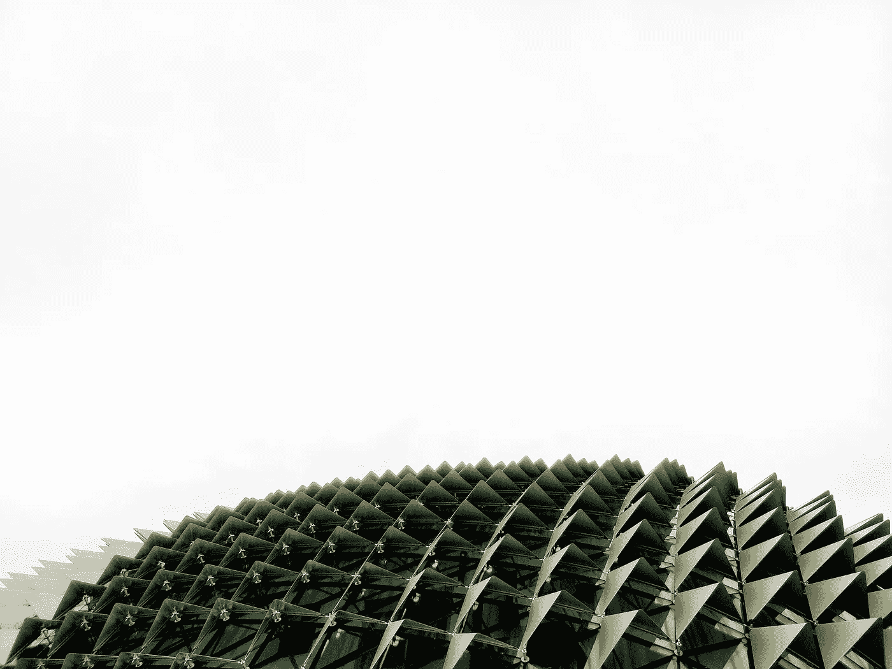
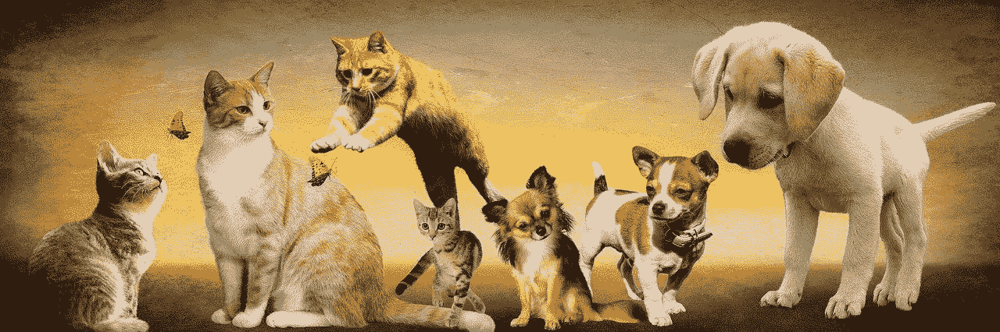
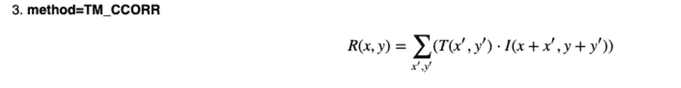
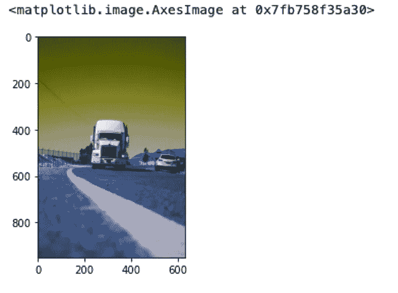
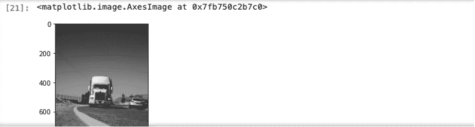
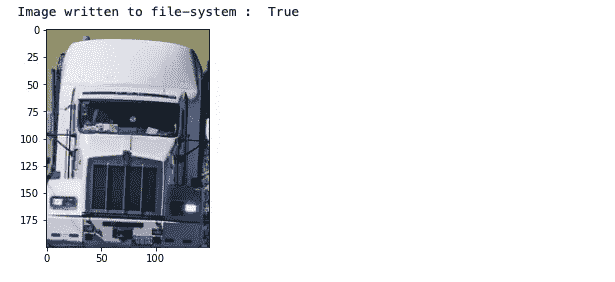
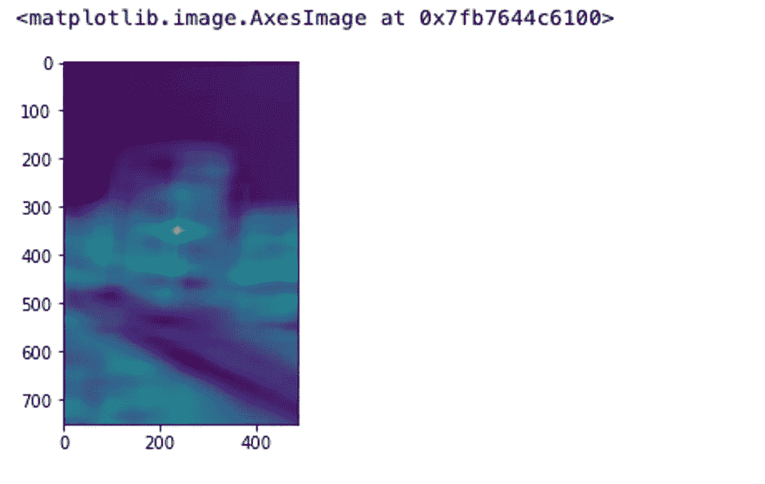
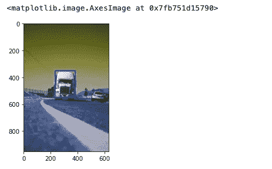

# 使用 OpenCV 进行目标检测

> 原文：<https://pub.towardsai.net/object-detection-using-opencv-cec18e5b746d?source=collection_archive---------3----------------------->

## [计算机视觉](https://towardsai.net/p/category/computer-vision)



[timJ](https://unsplash.com/@the_roaming_platypus?utm_source=unsplash&utm_medium=referral&utm_content=creditCopyText) 在 [Unsplash](https://unsplash.com/s/photos/object-detection?utm_source=unsplash&utm_medium=referral&utm_content=creditCopyText) 上的照片

目标检测是图像处理的重要组成部分。自主车辆必须检测车道、路面、其他车辆、人、标志和信号等。我们生活在这样一个动态的世界，一切都在不断变化。不久前，一个朋友给了我一个 PDF 文件，告诉我在 PDF 中定位并获取一个特定的值。物体检测的应用无处不在。这里是另一个例子，数据科学家正在使用物体检测来识别来自蔬菜叶子的行星疾病。

几周前，我正在研究自动驾驶汽车上的深度学习和计算机视觉。这篇文章包括了我研究中的一些有趣的事情。**特征检测**是物体检测的任务之一。那么，什么是特征检测呢？对于人类来说，我们通过了解图案、形状、大小、颜色、长度等来识别物体。它也有点类似于计算机。F **特征**是我们训练我们的模型知道它是否找到一个。特征可以是任何东西，如形状、边、长度等。以及它们的组合。在我之前的一个关于 [DeepFake 检测](https://medium.com/towards-artificial-intelligence/deep-fake-detection-using-opencv-and-mtcnn-833625abdd03)的项目中，我使用了 MSE(均方误差)、PSNR(峰值信噪比)、SSIM(结构相似性指数)和直方图作为识别 DeepFake 图像和真实图像的特征。

一个特征可以是一般情况下可以找到的任何独特的东西。一个好的特性必须是可重复的和可扩展的。例如，假设目标是从包含猫和其他动物图像的大图像集中检测狗。



图片来自 [Pixabay](https://pixabay.com/?utm_source=link-attribution&utm_medium=referral&utm_campaign=image&utm_content=2222007) 的 [Gerhard G.](https://pixabay.com/users/blende12-201217/?utm_source=link-attribution&utm_medium=referral&utm_campaign=image&utm_content=2222007)

回到之前关于特性的陈述，它必须是独一无二的，并且需要在大多数数据中呈现。如果我们有大部分图像与上面两张图像相似，那么这里的不好的特征是什么？

在这种情况下，一个不好的特征是耳朵的大小。我们的理解是狗的耳朵一般都比较大。但这不是我们样本图像中的原因。在第一张图片中，狗耳朵的大小与猫相似，甚至更小。如果我们使用耳朵大小作为特征，仅使用这两个图像来训练我们的模型，我们将有 50%的真阴性或假阳性。这带来了另一个重要的观点。也就是说，如果你想在你的模型中获得更高的成功，你应该仔细选择特性。一个故事也不可能是一个很好的分离特征，因为它不清晰可见。尺寸也不是一个好的选择。

我们的目标是识别另一个物体，比如路上的卡车。我们可以使用像 Harris 角点检测或 canny 边缘检测这样的技术来检测边缘。我们需要从图像中分离出汽车、行人和标志。我们可以使用 OpenCV 来具体识别卡车。

```
import cv2cv2.matchTemplate()
```

模板匹配简单地说是一种在模板图像上滑动输入图像并在模板图像下比较模板图像和输入图像的技术。它返回一个灰度图像，每个像素表示有多少像素的邻居与模板匹配。OpenCV 中有许多模板匹配方法。这是相关系数的数学公式。



来源: [OpenCV 文档](https://docs.opencv.org/3.4/de/da9/tutorial_template_matching.html)

一旦在两幅图像中找到匹配，就会找到亮点。OpenCV 官方文档中有详细的代码示例。让我们在路上找到卡车。

```
import cv2
import numpy as np
import matplotlib.image as mpimgfrom matplotlib import pyplot as plt
%matplotlib inlineimage_color = cv2.imread('actual_truck.jpg')
plt.imshow(image_color)
```

我们从文件中读取图像。我们将在此图像中定位卡车。



原始图片来源:照片由[埃内斯托·莱昂](https://unsplash.com/@thekidflame?utm_source=unsplash&utm_medium=referral&utm_content=creditCopyText)在 [Unsplash](https://unsplash.com/s/photos/truck?utm_source=unsplash&utm_medium=referral&utm_content=creditCopyText) 上拍摄

## 图像高度和宽度


## 将图像转换为灰度

使用灰度的原因是为了使图像尽可能简单。不需要多色图像。颜色增加了图像的复杂性，提高了信噪比。

```
image_gray = cv2.cvtColor(image_color, cv2.COLOR_BGR2GRAY)
plt.imshow(image_gray, cmap = 'gray')
```



## 创建模板图像

这是我们的模板图像。OpenCV 使用该图像收集特征并定位卡车。

```
import cv2
import numpy as np
import matplotlib.image as mpimg
from matplotlib import pyplot as plt
%matplotlib inlineimage_color = cv2.imread('sample_truck.jpg')
x= 235
y =  350
h = 200
w = 150
cropped=image_color[y:y+h, x:x+w]
plt.imshow(cropped)
status  = cv2.imwrite('t.jpg', cropped)
print("Image written to file-system : ",status)
```



## 执行模板匹配

```
# Perform template matching using OpneCV
result = cv2.matchTemplate(image_gray, template, cv2.TM_CCOEFF_NORMED)
print(result.shape)
plt.imshow(result)
```



## 定位卡车

```
min_val, max_val, min_loc, max_loc = cv2.minMaxLoc(result)
top_left = max_loc
bottom_right = (top_left[0] + w, top_left[1] + h)
cv2.rectangle(image_color, top_left, bottom_right, (10,10,255), 5)
plt.imshow(image_color)
```



## 结论

在这篇文章中，我们涵盖了什么是图像处理及其应用。我们讨论特性和一些不好的特性例子。选择一个不好的特征会导致假阳性或真阴性。然后我们讨论一下 cv2.matchTemplate() **。**稍后我们使用模板匹配来识别路上相似的卡车。