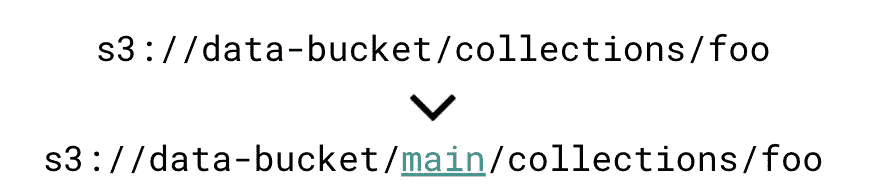

# 对象存储对于大数据是否高效？

> 原文：<https://pub.towardsai.net/object-storage-521d5454d2d?source=collection_archive---------3----------------------->

## [数据工程](https://towardsai.net/p/category/data-engineering)

## 使用对象存储来存储、归档和管理数据

由[弗兰克·麦肯纳](https://unsplash.com/@frankiefoto?utm_source=unsplash&utm_medium=referral&utm_content=creditCopyText)在 [Unsplash](https://unsplash.com/s/photos/storage?utm_source=unsplash&utm_medium=referral&utm_content=creditCopyText) 上拍摄的照片

## 介绍

在大数据时代，对象存储架构不断受到希望存储、归档和管理大量数据的团队的青睐。

在今天的文章中，我们将讨论对象存储架构的基本概念。此外，我们还将探讨它与文件和数据块存储的区别，以及它为它们带来的优势。

## 什么是对象存储？它是如何工作的

对象存储(也称为*基于对象的存储*)是一种**数据存储架构**，用于存储大量**非结构化数据**。

所谓[非结构化数据](https://www.mongodb.com/unstructured-data)，我们通常指的是不能基于特定数据模型或模式进行排列的数据，因此它不能存储在传统的关系数据库中。文本、图像和音频文件可能是最常见的非结构化数据类型。

由于[不断增长的非结构化数据量](https://www.ibm.com/downloads/cas/Z2ZBAY6R)，随着时间的推移，此类数据的存储变得越来越具有挑战性。基于对象的存储可用于以经济高效且可扩展的方式解决这一问题，让团队存储和管理数 Pb 的数据！

在基于对象的体系结构中，对象是存储在平面环境中的数据片段。换句话说，在对象存储中，没有层次或任何其他结构感。每个对象都是一个自包含的存储库，包含三个基本信息元素:数据本身、元数据和唯一标识符。

## 对象存储与文件存储和块存储

正如我们已经提到的，基于对象的存储最适合于非结构化数据。文件和块存储体系结构是另外两种非常适合存储结构化数据的替代方案。

[**文件存储**](https://www.ibm.com/cloud/learn/file-storage) **架构**将数据构建并存储在文件夹内。存储中的每个文件都被正确命名，并与所需的元数据(例如，文件类型、最后修改日期等)相关联。)并在目录和子目录中分层构建。这种类型的架构最适合于我们需要处理相对少量的数据而不需要复杂的组织结构的用例。随着存储数据的增长，文件搜索和检索时间变得越来越耗时。

[**块存储**](https://www.ibm.com/cloud/learn/block-storage) **架构**是文件存储的替代方案，旨在提高效率和性能。这种类型的存储将数据文件分成大小相等的块，每个块存储在一个唯一的地址中。因此，块存储是“结构不可知的”,因为创建的块可以存储在系统中的任何地方。为了从块存储中检索数据文件，这些文件将从不同的地址放在一起。

正如我们已经讨论过的，**对象存储**用于存储非结构化数据。基于对象的存储将对象视为独立的数据单元，而不是将文件放在目录中(文件存储)或将它们分成块(块存储)。此外，这种类型的存储允许用户丰富元数据，以便在需要时可以利用它们(例如，为了执行某种数据分析)。因此，对象存储适用于存储大量需要以可伸缩方式高效检索的非结构化数据。此外，它们非常适合静态文件或不经常更新的文件(如音频或视频文件)。

## 基于对象的存储的优势

如前所述，在存储、归档和管理大量非结构化数据时，基于对象的存储是理想之选。在本节中，我们将讨论这种架构带来的好处。

*   **可伸缩性**:与其他类型的存储架构相比，这无疑是对象存储最重要的优势。由于数据不是存储在复杂的分层目录中，而是存储在平面环境中，因此用户可以在当前配置中添加更多服务器，以支持更大的数据量并提高吞吐量。
*   **高可用性**:可以配置对象存储，以便跨物理上不同的存储复制数据。当特定磁盘或节点出现故障时，复制故障设备内容的群集中的另一个存储中的数据仍然可用。显然，为了实现高可用性，您可能还需要考虑将集群节点分布在不同的地理区域，以便即使在特定位置发生物理灾难时，数据仍然可以被访问。
*   **复杂性**:与在分层文件系统中存储数据的文件存储相比，基于对象的存储在平面环境中存储数据。这提高了整体性能，最重要的是，它还降低了复杂性，特别是在处理相当大量的数据时。
*   **云** **兼容性:**对象存储通常托管在云上，主要的云提供商提供存储即服务。这意味着不同的团队可以共享相同的数据存储库，但是每个团队可能只能访问数据空间的一部分，因此可伸缩性得到了增强，成本也降低了。

## 对对象存储中的数据进行版本控制

如前所述，存储在基于对象的存储中的对象带有唯一的标识符(ID)和元数据。当涉及到**数据版本**时，这两个元素都可以使用。

如果您在 Amazon Web Services 上托管对象存储，那么您可以使用 S3 API(或者如果您不在 AWS 上，您的云提供商提供的任何相关 API)对您的数据进行版本控制。

另一种可能性是使用第三方工具进行数据版本控制，例如[**lakeFS**](https://lakefs.io/)**，它提供了一个类似于 *Git 的*模型来帮助团队版本控制和管理数据。**

****

**来源: [lakeFS](https://docs.lakefs.io/#why-you-need-lakefs-and-what-it-can-do)**

**要了解更多关于 lakeFS 的信息，请访问 lakeFS [GitHub 库](https://github.com/treeverse/lakeFS)和[文档](https://docs.lakefs.io/)。此外，您还可以阅读下面的文章，该文章提供了如何开始使用 lakeFS 对数据进行版本化的分步指南。**

** [## 使用 MLFlow 和 LakeFS 实现高效工作流的数据版本控制

### 构建弹性、原子和版本化的数据湖操作

pub.towardsai.net](/data-versioning-for-efficient-workflows-with-mlflow-and-lakefs-892df1f8e7d8)** 

## **最后的想法**

**在今天的文章中，我们讨论了对象存储的工作方式以及在大数据环境中带来的优势。此外，我们讨论了这种体系结构如何区别于更传统的方法，如文件存储和块存储。**

**最后，我们讨论了应该使用对象存储的几个用例(例如存储大量非结构化数据)，并介绍了 lakeFS，这是一个在其他产品中提供对象存储数据版本控制的工具。**