# Python 中基于粒子滤波器的目标跟踪

> 原文：<https://pub.towardsai.net/object-tracking-with-particle-filters-in-python-77a61bb4fd91?source=collection_archive---------0----------------------->

得益于训练数据和算法的改进，以及廉价 GPU 和大量带标签训练数据集的可用性，计算机视觉在过去几年中取得了快速进展。计算机视觉的主要任务之一是目标跟踪。目标跟踪广泛应用于视频监控、汽车跟踪、人物检测和跟踪等领域。我们将使用粒子过滤器来跟踪一个移动的物体。粒子过滤器是解决机器人、人工智能甚至金融问题的强大而高效的解决方案。

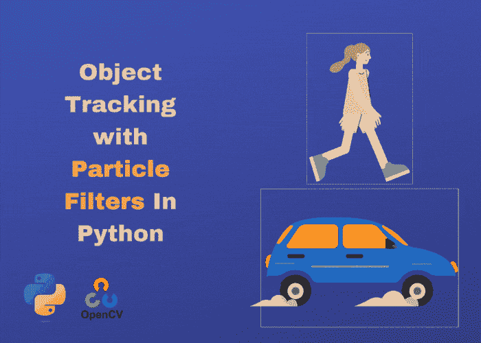

Python 中基于粒子滤波器的目标跟踪

# 目录:

1.  **粒子滤波简介**
2.  **使用 OpenCV** 加载&显示视频帧
3.  **初始化粒子滤波器**
4.  **根据速度状态移动粒子**
5.  **防止颗粒从边缘掉落**
6.  **测量每个粒子的质量**
7.  **给粒子分配权重**
8.  **根据权重对粒子进行重采样**
9.  **使颗粒变模糊**
10.  **参考文献**

 [## GitHub-youssefHosni/Python 中的实用计算机视觉

### 这将是一系列的计算机视觉项目，将涵盖大部分的计算机视觉任务和应用…

github.com\](https://github.com/youssefHosni/Practical-Computer-Vision-In-Python) 

**如果你想免费学习数据科学和机器学习，看看这些资源:**

*   免费互动路线图，自学数据科学和机器学习。从这里开始:[https://aigents.co/learn/roadmaps/intro](https://aigents.co/learn/roadmaps/intro)
*   数据科学学习资源搜索引擎(免费)。将你最喜欢的资源加入书签，将文章标记为完整，并添加学习笔记。[https://aigents.co/learn](https://aigents.co/learn)
*   想要在导师和学习社区的支持下从头开始学习数据科学吗？免费加入这个学习圈:[https://community.aigents.co/spaces/9010170/](https://community.aigents.co/spaces/9010170/)

如果你想在数据科学&人工智能领域开始职业生涯，但不知道如何开始。我提供数据科学指导课程和长期职业指导:

*   长期指导:[https://lnkd.in/dtdUYBrM](https://lnkd.in/dtdUYBrM)
*   辅导课程:[https://lnkd.in/dXeg3KPW](https://lnkd.in/dXeg3KPW)

***加入*** [***中等会员***](https://youssefraafat57.medium.com/membership) ***计划继续无限制学习。如果你使用下面的链接，我会收到一小部分会员费，不需要你额外付费。***

 [## 加入我的介绍链接媒体-优素福胡斯尼

### 阅读 Youssef Hosni(以及媒体上成千上万的其他作家)的每一个故事。您的会员费直接支持…

youssefraafat57.medium.com](https://youssefraafat57.medium.com/membership) 

# 1.粒子滤波器简介

粒子滤波器是一种用于函数优化的通用算法，其中使用粒子(采样)来搜索解搜索空间。那么这意味着什么呢？在我们的例子中，每个粒子都包含了关于物体在粒子所在位置的可能性的测试。在对粒子进行评估之后，根据粒子的好坏来分配权重。然后好的粒子倍增，坏的粒子通过重采样过程去除。

下一代粒子会预测物体可能在哪里。然后对这一代进行评估，循环重复。

与卡尔曼滤波器相反，粒子滤波器可以模拟非线性物体运动，因为运动模型不应该像离散卡尔曼滤波器那样写成状态转移矩阵。**此外，粒子滤波器相当容易理解，但有一个负面的东西:滤波器的性能取决于粒子数，其中粒子数越高，估计越好，但成本也越高。**然而，粒子滤波器主要用于通用函数优化，包括对象跟踪。下图显示了粒子滤波器的两个主要步骤:预测和校正。

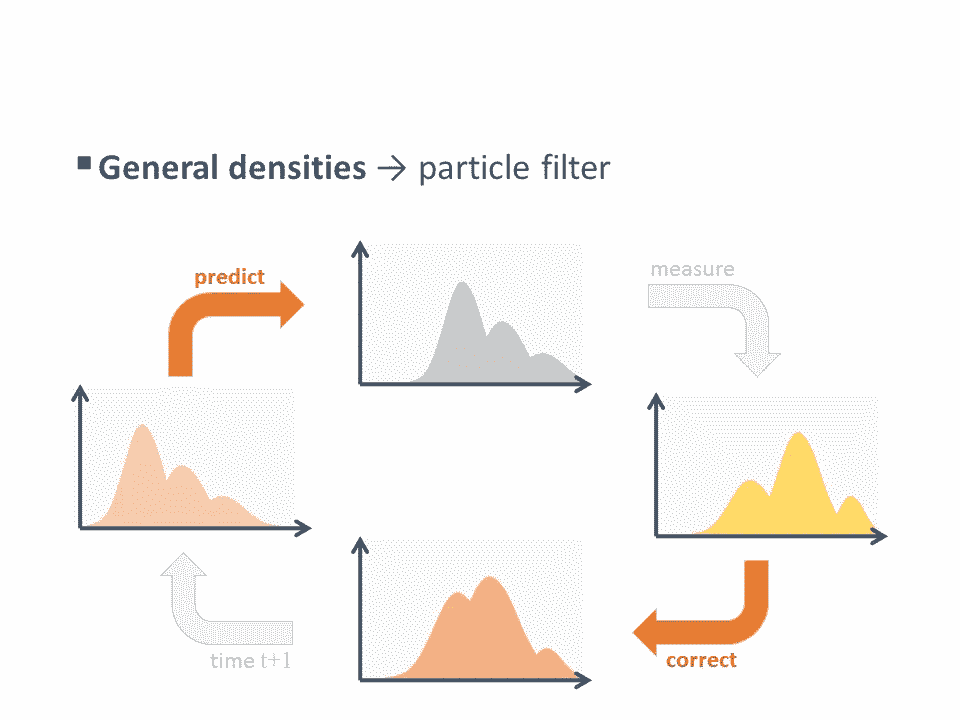

粒子过滤器的循环/由[**Darko juri ci**](https://www.codeproject.com/script/Membership/View.aspx?mid=5380146)

粒子滤波器的循环从一般概率密度开始。首先，滤波器根据所提供的状态转换(例如，运动模型)预测下一个状态，然后，如果适用，将噪声测量信息并入校正阶段，并且在此之后重复该循环。

# 2.使用 OpenCV 加载和显示视频帧

让我们首先导入 NumPy 数学库和 OpenCV 计算机视觉库，因为它们将在整个项目中广泛使用。然后我们设置随机种子，这样每次运行代码时，我们都会得到一致的结果。

我们现在可以加载视频帧，并使用 OpenCV 显示它们，代码如下:

在上面的代码中，我们首先从 OpenCV 调用一个名为 **VideoCapture，**的函数，它将返回一个视频捕获对象。当视频打开时，我们想要读取帧。所以我们将调用这个视频对象的 **read** 方法，它将返回一个状态标志，然后是帧，它实际上是一个像素颜色值的数组。

只要这个标志有效，我们就放弃这个框架。这就把这个函数变成了一个 Python 生成器，我们会反复调用它，它会不断循环并生成帧。如果状态不好，我们就跳出循环，释放资源，什么也不产生。然后，我们将连续显示每一帧 30 毫秒，如果该帧已经结束或如果您按下 **q** 键，循环将会中断。

以下是能够在这里显示的 GIF 格式的视频，但它最初是 mp4 格式的:

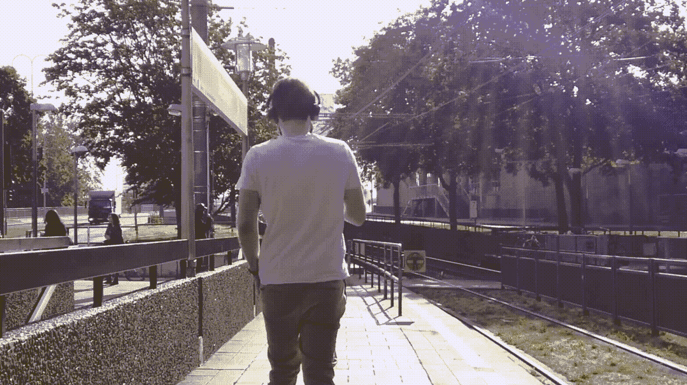

因为我们将在不同的函数中使用帧值，正如我们将很快看到的，所以最好创建一个函数来获取视频路径并返回每个帧的值:

最后，让我们创建一个显示函数来显示粒子和被跟踪的粒子。所以我们要做的第一件事是检查是否有粒子要显示。如果是这样，我们将遍历它们，并将它们的值作为像素坐标。所以如果你想这么做，我们必须把它们转换成整型。接下来，我们将这些粒子绘制成视频帧顶部的一个小圆圈。我们可以使用 OpenCV 的**圆形函数**，递给它视频帧，以及圆心和半径一，然后我们将设置颜色。

每次我们使用 OpenCV 时，颜色惯例是 BGR 而不是 RGB。所以这次我们用绿色，设置一个很小的曲线，厚度为一个像素。这就解决了粒子问题。

接下来，如果我们得到了粒子的位置，我们会尝试在整个视频中跟踪它。我们想在那里画一个漂亮的圆。所以这个位置实际上是一个(x，y)元组，所以我们可以直接使用它。我们将使用一个稍大的圆，15 像素，这次使用红色，曲线厚度为 5 像素。接下来，我们要展示视频画面。OpenCV 中有一个图像显示函数。

接下来，我们想给自己一个暂停和停止视频播放的方法。所以，在显示完视频帧后，我们可以使用 OpenCV 的 **waitKey** 函数等待 30 毫秒，看看用户是否按了 Escape 键。如果有，我们可以就此打住。因此，如果我们用 0 调用 waitKey，那么它将无限期地等待下一次按键。如果用户按了两次 Escape 键，那么我们返回 True，让程序的其余部分知道回放应该停止。

# **3。初始化粒子过滤器**

为了初始化我们将在视频顶部显示的粒子，我们需要估计目标的状态，即它在视频帧中的位置和速度。视频一开始，我们不知道那个状态。我们只知道位置应该在框架内的某个地方，速度可以是任何方向，但不能太快。

我们将用一组粒子来表达我们对目标态的估计。每个粒子都有自己的位置和速度。由于我们还没有关于目标的信息，我们的粒子将均匀地分散在框架中，它们将具有随机的速度。

我们可以从初始化粒子数为 **5000 粒子**和初始速度范围为每帧一个像素开始。然后我们将创建粒子阵列。它将被随机数字填充，每个粒子有一行和四列。前两个是粒子的坐标，后两个是它们的速度。前两列的值介于零和框架的长度和高度之间。

速度将取初始值 0.5，我们将把它居中到零，以便有可能向两个方向移动。我们要把速度范围减少一半。这将会使速度下降，所以一切都以零为中心。你会注意到粒子随机均匀分布。这里的每一行代表一个粒子，前两列是几百，这里是 x 和 y 位置，然后我们有速度分量，小于 1。

我们将使用下面的代码显示视频:

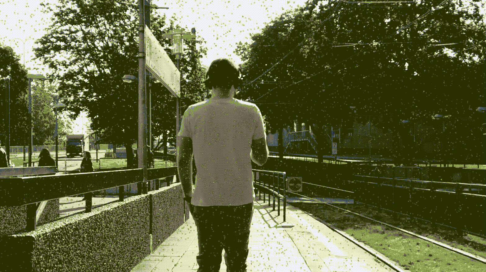

带有初始化粒子的行走视频

# 4.根据速度状态移动粒子

你可能已经注意到，在视频播放过程中，粒子并没有移动，即使它们有速度。原因是我们没有根据速度更新它们的位置。

我们可以用下面的代码解决这个问题。我们将用第三列中的 x 方向速度分量来增加粒子的 x 坐标。我们对 y 轴也做了类似的事情。所以让我们运行代码，防止粒子从视频帧的边缘掉落，看看它是否有效。

现在你看到的是粒子按照它们的速度运动，使用下面的代码:

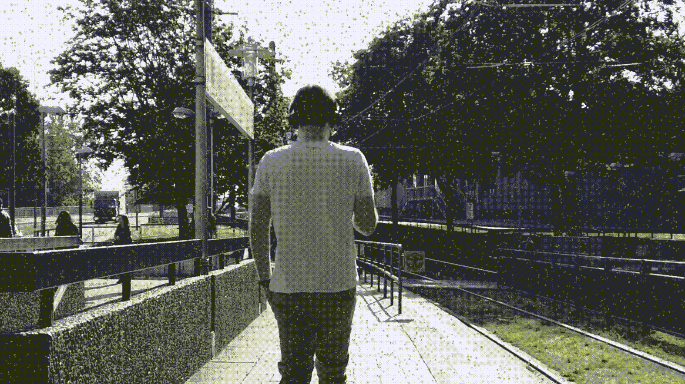

粒子按照它们的速度运动

# 5.防止颗粒从边缘掉落

接下来，我们将添加一些逻辑来防止它们从帧的边缘脱落，并决定哪些粒子比其他粒子更相关。我们将通过限制粒子的坐标(x，y)来做到这一点。为此，我们将循环遍历所有粒子，并在 x 和 y 坐标上添加上下边界。x 坐标的新值将是**宽度-1**和当前值的最小值。因为 y 坐标将是**高度-1**和当前值的最小值。

通过这样做，我们将防止 x 值变得大于 WIDTH-1，并且我们减去 1，因为帧坐标是从零开始的。因此，如果你有一个 100 像素宽的帧，你会希望坐标从 0 到 99。然后我们要给这个值设定一个下限。我们将取零的最大值和上限值。所以这会阻止 x 和 y 低于零。

我们将使用下面的代码显示视频:

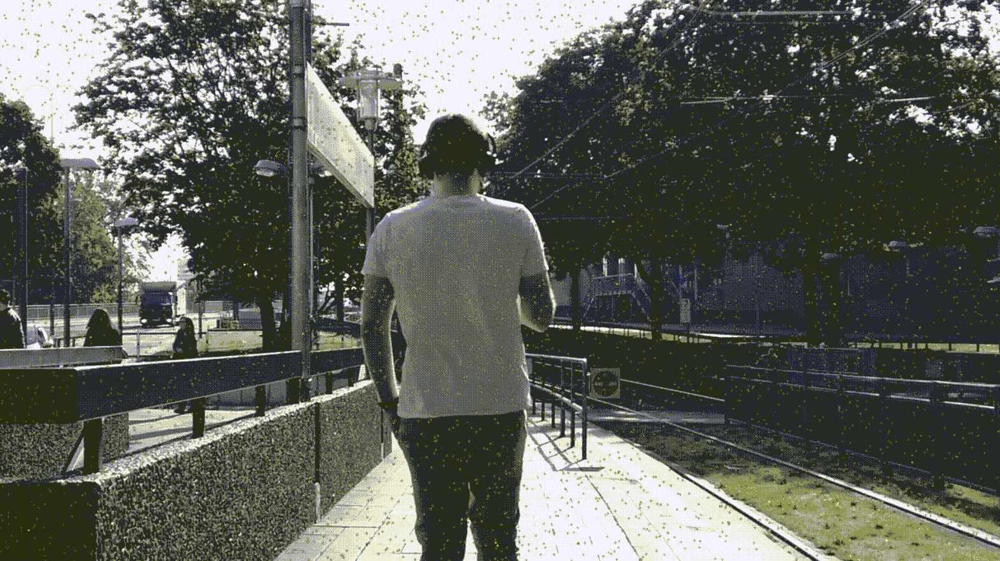

防止颗粒从边缘掉落。

# 6.测量每个粒子的质量

为了改进我们的状态估计，我们希望检查每个粒子下的像素的颜色，并将其与目标颜色进行比较。因此，现在，为了获得目标颜色的精确值，我们可以暂停视频，截图并在 gimp 或其他类似的软件中打开它，然后，使用吸管工具，我们可以找到一些像素的 BGR 值。

在这种情况下，我们希望跟踪人的肘部。所以如果我们检查一下，你会发现它是 105，63，66。你可以选择另一个像素来代表整个目标。不太亮，也不太暗。

我们将创建一个 NumPy 数组来存储这些颜色差异，并将其称为错误，我们将从零开始填充它。然后我们将遍历所有的粒子，我们想用它们的 x 和 y 位置作为像素坐标。因为我们需要它们是整数，所以我们要转换 X 和 Y 的位置。所以要取出那个位置的像素值，全靠 NumPy 索引。这里我们索引视频帧。所以帧是按行和列存储的。所以我们先用 y，再用 x，然后取出所有三个像素的值。
最后，我们想要一个单一的值来表示该像素的色差。一种方法是取两种颜色之间的均方差。

# 7.为粒子指定权重

在本节中，我们将计算粒子权重并对粒子过滤器进行重新采样。我们将使用我们计算的误差来计算每个粒子的权重。当误差较低时，我们希望权重较高。这意味着粒子位于像素颜色与目标颜色非常匹配的位置。

我们能做的最简单的事情就是反转误差。从这个意义上说:如果我们找出最大的错误，然后减去 errors 数组，这将是按元素进行的，权重数组的元素数将与 errors 数组的一样多。接下来，我们要防止粒子沿着边缘堆积。所以我们想把边上粒子的权重设为零。

我们可以设定一个条件，x 等于零。那是沿着框架的左手边。我们可以做一个逻辑 OR，并设置条件，如果 x 粒子值等于宽度-1。这是框架的右边缘，我们对 y 做同样的事情，所以 y 在框架的上边缘为零，在下边缘，它等于高度-1。

# 8.根据粒子的权重对粒子进行重采样

现在我们要用这些重物做一些很酷的事情。如果我们将它们归一化，使它们总和为 1，我们就可以用它们作为粒子的概率分布。所以，换句话说，我们要通过从当前粒子中采样来构建一个新的粒子数组。权重高的会被多次选中，权重低的可能根本不会被选中。

NumPy 对于这种重采样有一个非常有用的函数。我们将调用**选择**函数。

*   这个函数的第一个参数是采样范围。所以如果我们只给它一个整数，它足够聪明地知道我们想要在从零到最大值的范围内重新采样。
*   我们需要传递给函数的第二个参数是取多少样本。因为我们要替换整个粒子阵列，所以我们需要和粒子一样多的样本。
*   最后，我们只告诉它概率分布。

所以一旦我们完成了这个重采样，我们就有了新的指数，它指向我们采样的当前粒子。然后我们只是根据这些索引号重建一个粒子数组。最后，如果我们能得出一个单一的 x，y 位置，那就太好了，这是我们对目标粒子位置的最佳猜测。

到目前为止，我们已经用所有粒子表达了我们的状态估计。但是我们希望有一个最佳的猜测。这很容易做到，只要取所有粒子的平均 x 和 y 位置。我们将返回粒子数组，并返回一个将 x 和 y 转换为整数的元组。所以这将允许我们使用这个元组直接以一个索引
作为像素坐标。

正如你在下面代码生成的视频结尾所看到的，看起来粒子云塌陷到一个像素上并停止了移动。

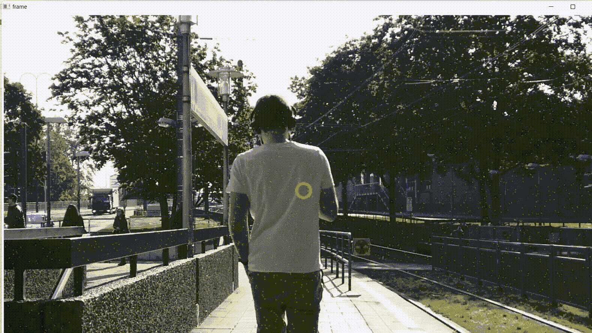

代码还给出以下错误:概率包含 NaN，它代表非数字。所以基本上，程序崩溃了。

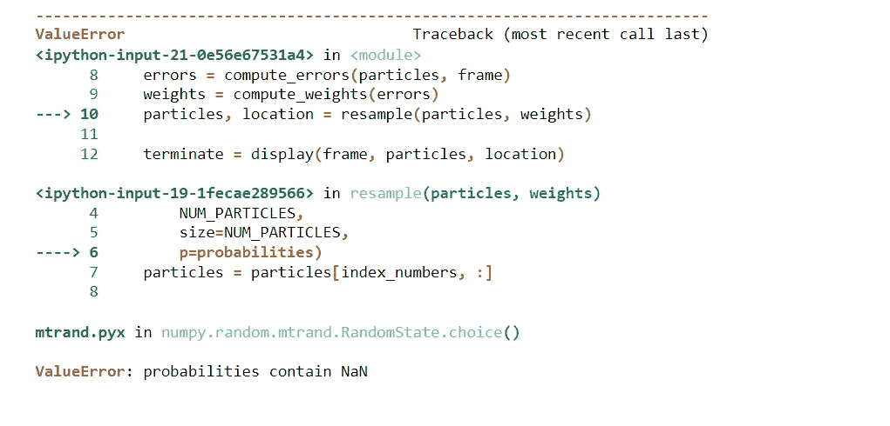

所以当所有的粒子都在同一个像素上时，它们都有相同的误差。因为我们计算重量的方式，重量都是零，然后我们把它们除以所有重量的总和。所以被零除不是一个好主意，我们应该修正它。

# 9.使颗粒变模糊

在之前的任务中，我们的粒子过滤器在一个像素上做得很好。但它不是目标上的一个像素。我们需要它来定位目标并保持跟踪目标，即使它在帧周围移动或光照条件发生变化。解决这个问题的方法就是添加噪声。在粒子滤波器中，我们可以使用噪声来表达我们对目标状态的不确定性。

我们将生成一些高斯噪声，并添加到每个粒子。如果目标在下一帧发生变化，由于我们添加的噪声的变化，一些粒子会以同样的方式发生变化，所以它们会随着目标一起移动。没有随目标移动的其他粒子将有更多的颜色误差，并且不会被重新采样。下面是完成这项工作的代码:

我们将使用高斯噪声，因此我们将指定位置的标准偏差。我们可以用一个像素的标准偏差，对于速度，可能是每帧半个像素。接下来，我们创建噪声:我们将一次创建一列，然后将所有列连接成一个数组。下面的代码生成的输出视频如下所示:

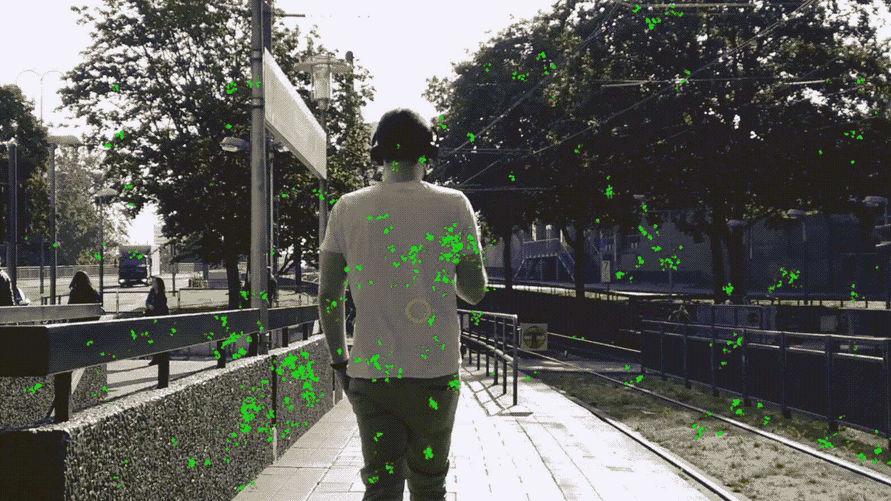

看起来粒子云分布在不同的物体上，没有被吸引到目标上。事实证明，仅仅调整参数并没有真正改善粒子滤波器的行为，改变标准偏差或粒子数量。我们真正想做的是让权重对色差更敏感，这样只有目标上面的权重会被重新采样。一个可能的解决方案是平方权重，因为当我们平方大于 1 的数字时，最大的数字会比较小的数字增加更多。因此，较大的权重变得更大，这些粒子将被重新采样更多，所以这可能会使权重对颜色更敏感。让我们在平方权重后再次运行代码，并查看下面的输出:

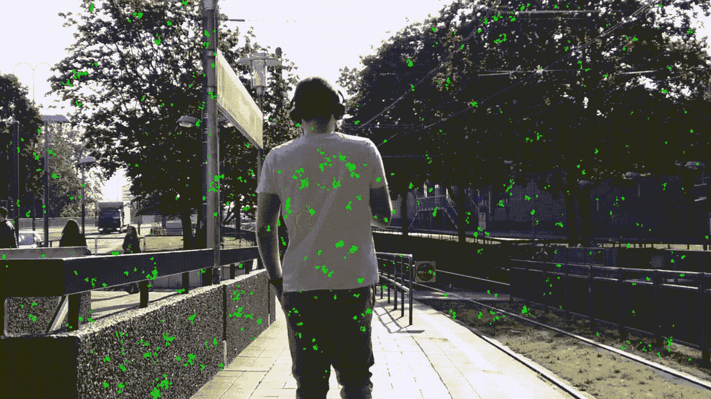

你可以看到，粒子更多地被吸引到 t 恤和砖块上，似乎它无法区分皮肤，所以我们可以将权重的幂增加到 8。

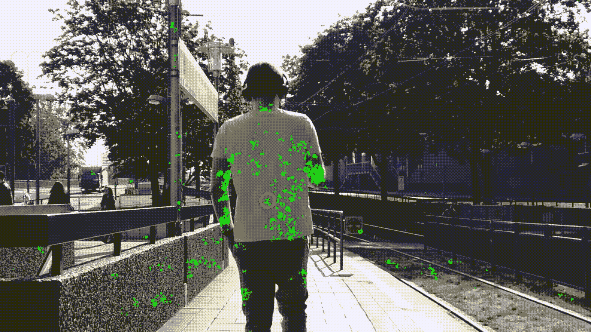

正如你从视频中看到的，现在好多了，但粒子云仍有一些扩散，它需要很长时间才能到达目标，但它已经锁定目标，并保持锁定。如果我们把权重提高到更高的幂，比如 16，会怎么样？

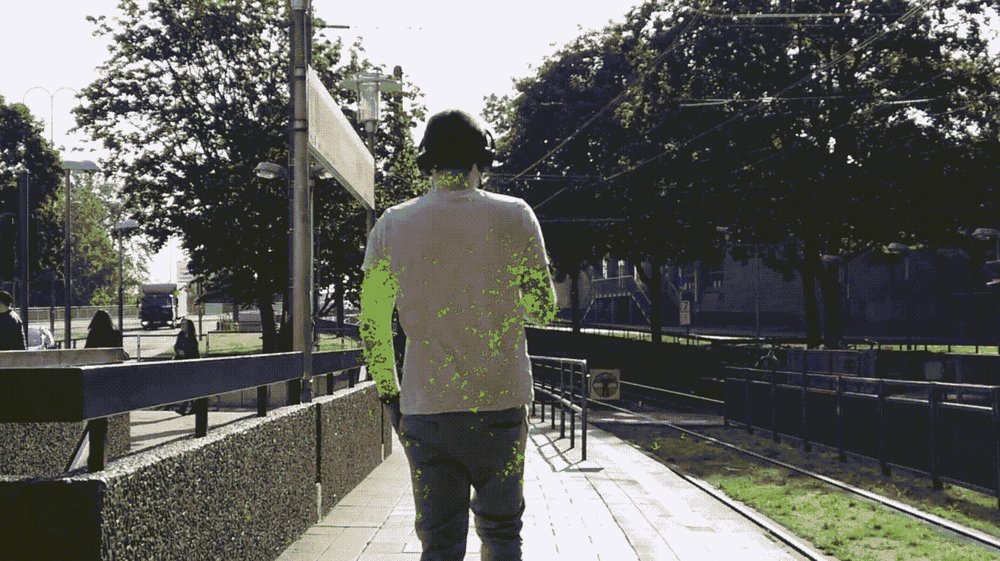

现在它工作得更快更好了。所以我们不想再增加了。如果权重变得对颜色太敏感，那么如果照明条件改变一点，过滤器可能会有问题，并且它不再能找到与原始目标颜色非常接近的匹配。像现在这样已经很不错了。你也可以试着将权重增加到 32，看看会发生什么。

# 10.参考

1.  [物体跟踪:轻松粒子滤波](https://www.codeproject.com/Articles/865934/Object-Tracking-Particle-Filter-with-Ease)

2.[数据&全文使用的代码](https://github.com/youssefHosni/Practical-Computer-Vision-In-Python/tree/main/Tracking%20Objects%20in%20Video%20with%20Particle%20Filters)

***喜爱文章？成为*** [***中等会员***](https://youssefraafat57.medium.com/membership) ***继续无限制学习。如果你免费使用下面的链接，我会收到一小部分会员费。***

 [## 加入我的介绍链接媒体-优素福胡斯尼

### 阅读 Youssef Hosni(以及媒体上成千上万的其他作家)的每一个故事。您的会员费直接支持…

youssefraafat57.medium.com](https://youssefraafat57.medium.com/membership) 

***感谢阅读！如果你喜欢这篇文章，一定要鼓掌(高达 50！)并在***[***LinkedIn***](https://www.linkedin.com/in/youssef-hosni-b2960b135/)***上与我联系，并在*** [***上关注我，以便随时更新我的新文章。***](https://youssefraafat57.medium.com/)