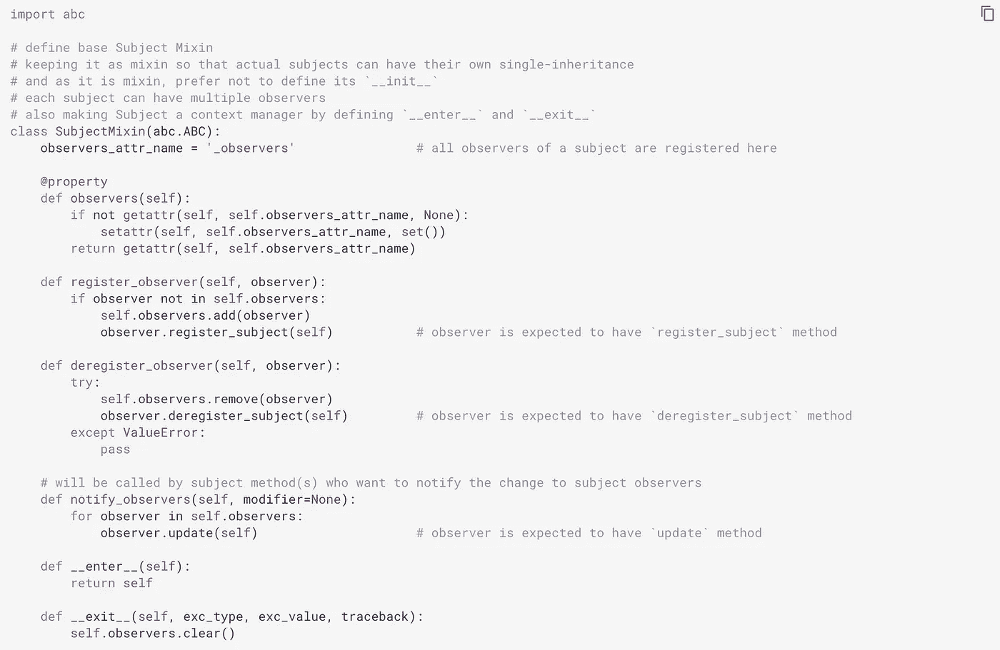
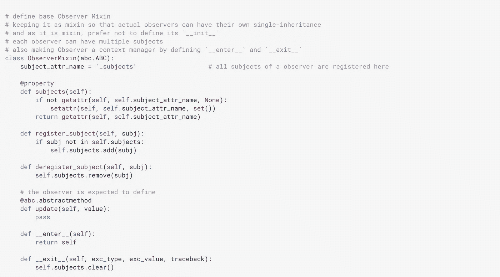
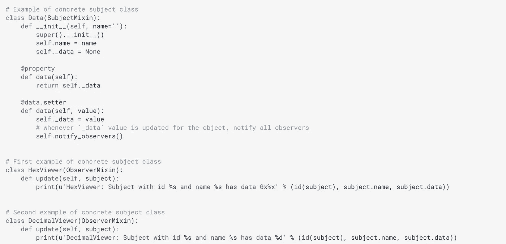
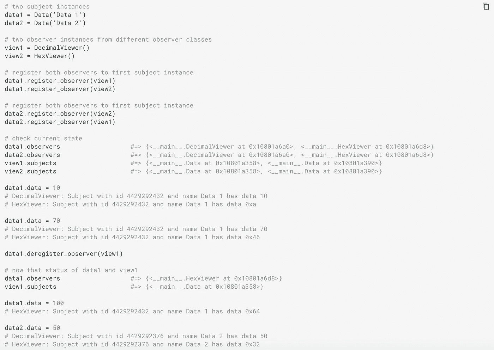

# 观察者模式与发布-订阅模式

> 原文：<https://pub.towardsai.net/observer-pattern-vs-pub-sub-pattern-7f467bcf5fe?source=collection_archive---------1----------------------->

## [软件工程](https://towardsai.net/p/category/software-engineering)，[系统](https://towardsai.net/p/category/systems)

不要把这两种相似但不同的模式搞混了，要知道什么时候用哪个。

何塞·巴勃罗·多明格斯在 [Unsplash](https://unsplash.com/?utm_source=unsplash&utm_medium=referral&utm_content=creditCopyText) 上拍摄的照片

这种差异不仅对普通软件工程师很重要，对数据工程师也很重要，并且是理解数据管道的事件驱动架构的基础。

在我们最终列出它们的区别之前，让我们分别来看看它们。

# 观察者模式

****观察者模式*** *是一种软件设计模式，其中一个名为* ***主题*** *，* ***的对象维护一个其依赖者的列表*** *，名为* ***观察者*** *，并自动通知它们任何状态变化，通常是通过调用它们的一个—维基百科定义[1]**

**观察者模式允许一个给定的对象(称为* ***主题*** *)被一组动态的“观察者”对象监控。每当主体上的一个值发生变化，它就让所有的* ***观察者*** *对象知道发生了变化，通过调用它们的方法* `*update()*` *(说)方法。每当核心对象改变时，每个观察者可能负责不同的任务；受试者不知道或不关心那些任务是什么，观察者通常也不知道或不关心其他观察者在做什么。**

*作为一个例子，让我们创建一个`SubjectMixin`,我们可以将它混合在任何 Python 类中，以使它容易地符合观察者模式的主题。*

**

*一段作者代码的截图*

*类似地，让我们创建一个`ObserverMixin`，我们可以将它混合到任何类中，使它很容易附着到观察者模式的对象上。*

**

*一段作者代码的截图*

*此外，让我们创建一个名为`Data`的主题和两个名为`HexViewer`和`DecimalViewer`的观察者。*

**

*一段作者代码的截图*

*最后，让我们来看看观察者模式的作用:*

**

*一段作者代码的截图*

# *发布-订阅(发布-订阅)模式*

*****发布者-订阅者模式*** *可以被认为是观察者模式* *的* ***改进(异步和松耦合)版本。在发布-订阅模式中，消息的发送者(称为发布者)不直接向特定的接收者(称为订阅者)发送消息。有一个* ***中间组件*** *，称为****broker****，(或消息代理，事件总线)，发布者向其发送数据，订阅者从其接收数据。它过滤所有传入的消息并相应地分发它们。常用的消息过滤方法有* ***基于主题的*** *和* ***基于内容的*** *。*****

***这意味着发布者和订阅者* ***甚至不知道对方*** *的存在，因此只是松散耦合。***

**您可能希望使用 Apache Kafka 检查[数据流，以欣赏发布-订阅机制的美妙之处，这有助于使您的架构具有水平可伸缩性、容错性，并允许您以低延迟传输数据。](https://medium.com/@goyalmunish/data-streaming-with-apache-kafka-e1676dc5e975)**

# **观察者和发布-订阅模式之间的区别**

**我们现在明白了这两种模式分别是什么。让我们列出它们的不同之处:**

*   **在观察者模式中，数据源本身(主体)知道谁是它的观察者。所以，在主体和观察者之间没有中间人。而在发布订阅中，发布者和订阅者是松散耦合的，他们甚至不知道对方的存在。他们只是通过经纪人进行交流。**
*   **与我们在前面的例子中看到的类似，观察者模式大部分是同步实现的，即当事件发生时，主体调用其所有观察者的适当方法。然而，发布-订阅模式通常是异步实现的(使用消息队列)，比如 Apache Kafka。**
*   **观察者模式通常在单个应用程序范围内实现。另一方面，发布者-订阅者模式主要用作跨应用程序模式(例如 Kafka 如何被用作事件驱动架构的核心),并且通常用于解耦数据/事件流和系统。**

**参考资料:**

**[1] [观察者模式](https://en.wikipedia.org/wiki/Observer_pattern)，维基百科**

****这里有一些相关的有趣故事，你可能会觉得有帮助:****

*   **[用 Apache Spark 进行分布式数据处理](https://medium.com/@goyalmunish/distributed-data-processing-with-apache-spark-2a5e473b0cb1)**
*   **[使用 Apache Kafka 进行数据流传输](https://medium.com/@goyalmunish/data-streaming-with-apache-kafka-e1676dc5e975)**
*   **[Apache Cassandra —用于结构化和半结构化数据的分布式行分区数据库](https://medium.com/@goyalmunish/apache-cassandra-distributed-row-partitioned-database-for-structured-and-semi-structured-data-1dc37e72e67c)**
*   **[带有 Apache 气流的数据管道](https://medium.com/@goyalmunish/data-pipelines-with-apache-airflow-46258deb2844)**
*   **[使用 Argo 设计工作流](https://medium.com/@goyalmunish/designing-workflows-using-argo-9d0dc5036348)**
*   **[MapReduce 的原因和方式](https://medium.com/@goyalmunish/the-why-and-how-of-mapreduce-17c3d99fa900)**