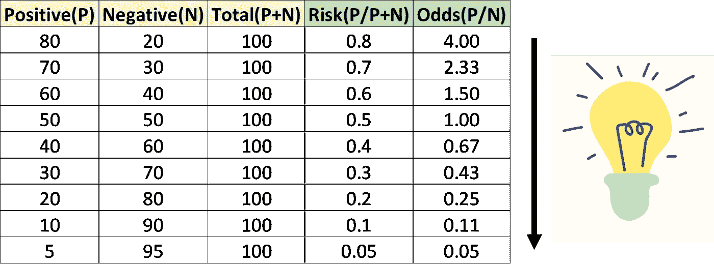
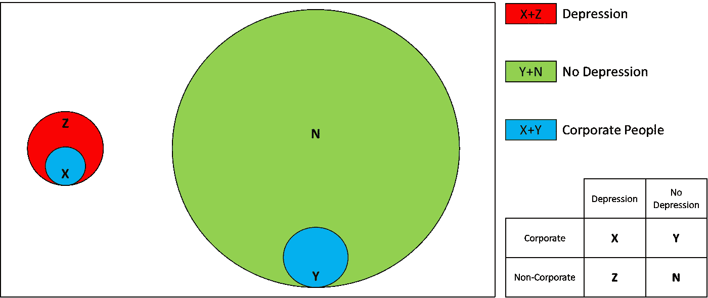
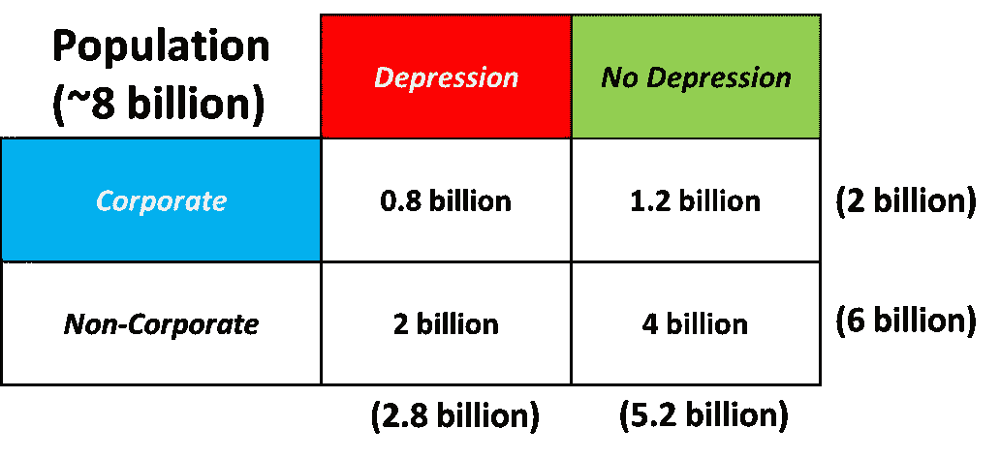
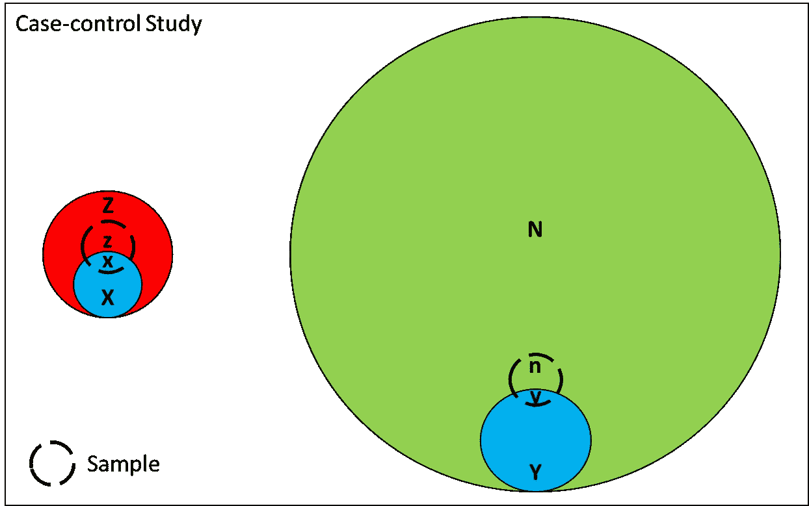
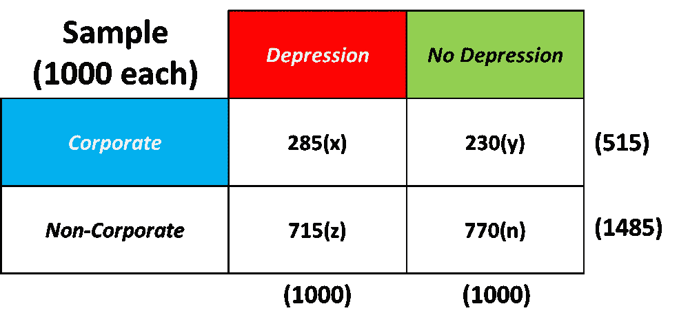

# 优势比做了风险比做不到的事情——一个直观的例子

> 原文：<https://pub.towardsai.net/odds-ratio-does-what-risk-ratio-fails-to-do-an-intuitive-example-312ff89a08b4?source=collection_archive---------0----------------------->

## [统计数据](https://towardsai.net/p/category/statistics)

## 从头开始理解这个概念

照片由[悉尼·西姆斯](https://unsplash.com/@fairytailphotography?utm_source=medium&utm_medium=referral)在 [Unsplash](https://unsplash.com?utm_source=medium&utm_medium=referral) 上拍摄

让我们从这篇博客的终极要点开始:

> “在风险比显示不一致的情况下，比值比是人群和样本统计(具有显著效果的病例对照研究)的一致衡量标准”

现在我们想到的问题是——为什么会这样？

我将用一个相关的例子来证明这一点，这样我们也可以围绕它建立一个直观的感觉。但是在跳到这个例子之前，让我们看看风险和几率是如何表现的:

(图片由作者提供)

请注意，随着风险度量变得越来越低，就差异而言，几率变得越来越小。正是因为这个原因，在事件发生率(此处为正)相对较低的情况下，几率和风险的解释是相似的。在事件发生率相对较高(高于 0.3 或 30%)的情况下，这两项指标存在显著差异。

但是我们试图理解的要点是为什么在病例对照研究中优势比保持一致，而风险比变得不一致。是时候借助一个例子来解释这一点了——我们正在考虑的场景与抑郁症及其在企业中的主导地位这一敏感问题有关:

(图片由作者提供)

你在上面看到的是人口的代表；然而，对于对照案例研究，仅从受影响人群和未受影响人群中提取样本。让我们首先计算风险(公司)、风险(非公司)、优势(公司)、优势(非公司)、风险比率和优势比率，取人口的大概数字只是为了理解概念:

(图片由作者提供)

风险(公司)= 0.8/2 = 0.40

风险(非公司)= 2/6 = 0.33

赔率(公司)= 0.8/1.2 = 0.67

赔率(非公司)= 2/4 = 0.50

风险比= 0.40/0.33 = 1.21

优势比= 0.67/0.50 = 1.34

你会同意风险比测量(也称为“相对风险”)比比值比更直观，因为它传达了一个在公司工作的人比非公司工作的人患抑郁症的风险高 1.21 倍。从优势比中获得直观的感觉并不容易，但当涉及到病例对照研究(样本统计)时，这是一个一致的衡量标准。让我们看看如何:

(图片由作者提供)

从抑郁症人群(X+Z)和无抑郁症人群(Y+N)中各抽取 1000 个样本进行病例对照研究。这些值如下所示:

(图片由作者提供)

现在我们将观察自本博客开始以来我们一直在谈论的风险比的不一致性，其唯一原因是在病例对照研究中无抑郁症人群的**代表性不足**。

风险(公司)= 285/515 = 0.55

风险(非公司)= 715/1485 = 0.48

赔率(公司)= 285/230 = 1.23

赔率(非公司)= 715/770 = 0.92

**风险比率= 0.55/0.48 = 1.14**

**赔率= 1.23/0.92 = 1.34**

理解在病例对照研究中风险比是如何变化的，但是优势比保持不变(一致)。为了找出比值比保持一致的原因，让我们看看它的公式:

优势比= (x/y)/(z/n)

对方案稍作调整就完全解决了代表性不足的问题:

优势比= (x/z)/(y/n)

现在，分子反映了抑郁症组中的价值分裂(公司和非公司)，分母反映了无抑郁症组中的价值分裂(公司和非公司)，从而在病例对照研究中计算出与整个人群研究中相同的值。

就是因为这个原因。在病例对照研究中，优势比测量优于风险比，以置信区间进行估计。

## 结论:

当事件发生率相对较低，并且类别之间没有太大的显著影响时，只有风险比&优势比以类似的方式表现。此外，风险涉及前瞻性情景的过程，即，在受试者暴露于某种事物之后，计算他/她发展结果的可能性，而对于优势度量，情况相反，即，受试者已经发展出一种结果，他/她在过去暴露于某种事物的优势是感兴趣的领域。我希望我能够用一个相关的例子来说明风险比和优势比之间的区别。请务必访问类似的直观和简化的博客我的个人资料。还会有更多的…

谢谢！！！