# 使用深度学习的旧照片恢复

> 原文：<https://pub.towardsai.net/old-photo-restoration-using-deep-learning-47d4ab1bdc4d?source=collection_archive---------0----------------------->

## [深度学习](https://towardsai.net/p/category/machine-learning/deep-learning)

## 想象一下，你有你祖母 18 岁时的旧的、折叠的、甚至撕破的高清照片，没有任何瑕疵！

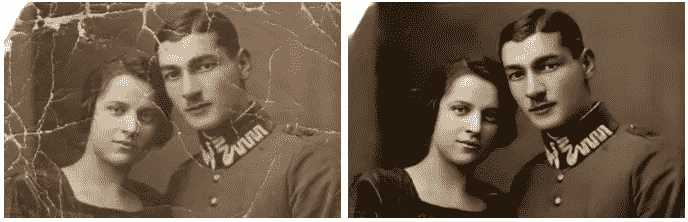

图片来自 https://arxiv.org/pdf/2009.07047.pdf

想象一下，你有你祖母 18 岁时的旧的，折叠的，甚至撕破的高清照片，没有任何瑕疵。
这被称为旧照片恢复，这篇论文刚刚开辟了一条全新的途径，使用深度学习方法来解决这个问题。

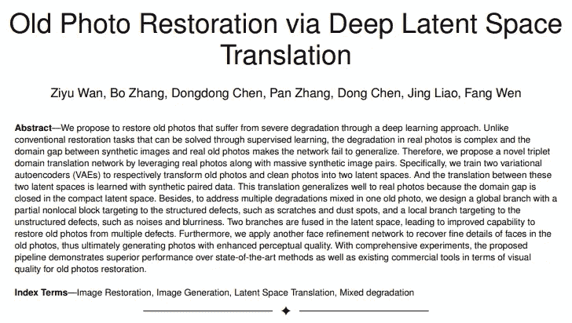

[https://arxiv.org/pdf/2009.07047.pdf](https://arxiv.org/pdf/2009.07047.pdf)

## 技术概述

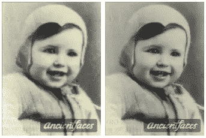

图片来自[https://arxiv.org/pdf/2009.07047.pdf](https://arxiv.org/pdf/2009.07047.pdf)

复古照片复原是计算机视觉的一个重要领域。我们都希望亲人的老照片清晰好看。

一张这样的照片并没有像这张更好看的照片那样给人带来荣誉，也没有给人带来那么多美好的回忆。

我们都至少有一张我们在乎的老照片，随着时间的推移，它看起来越来越差。这就是为什么许多人正在努力解决这个问题。

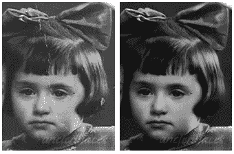

图片来自[https://arxiv.org/pdf/2009.07047.pdf](https://arxiv.org/pdf/2009.07047.pdf)

在本文中，来自香港大学和微软研究院的研究人员提出了一种新的网络来解决这一问题，称为“通过深层潜在空间翻译恢复旧照片”。

他们正在使用深度学习来恢复遭受严重退化的旧照片，就像这张一样。

目前有许多可用的方法，甚至为此开发了商业应用程序，但是这种新技术产生的结果比所有方法都好！看看最好的商业应用程序，如 Remini 或美图，可以对这些图片做些什么，以及研究人员通过他们的技术获得的结果:

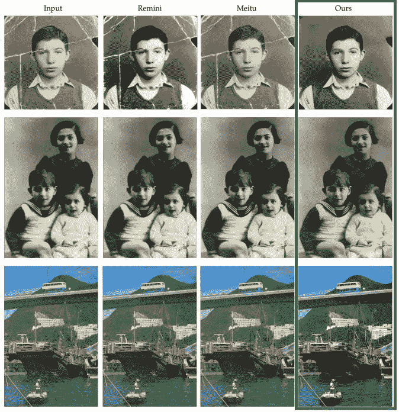

图片来自[https://arxiv.org/pdf/2009.07047.pdf](https://arxiv.org/pdf/2009.07047.pdf)

以前的传统恢复技术的主要问题是它们不能一般化。这是因为他们都在使用监督学习，这是由真实的旧图片和合成用于训练的图片之间的域差距引起的问题。如你所见:

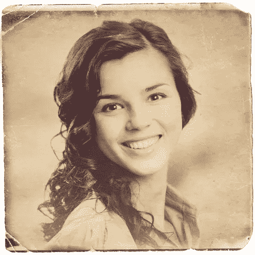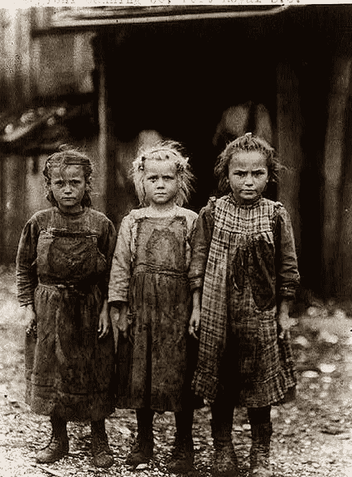

左边是合成图，右边是真实的老照片。你可以看到即使有假划痕和颜色变化也已经是高清了。右图来自[https://funny.pho.to/fr/old-photo-effect/](https://funny.pho.to/fr/old-photo-effect/)左图来自[https://www . Pinterest . ca/ken schilling/vintage-photos-of-children-playing-outside/](https://www.pinterest.ca/kenschilling/vintage-photos-of-children-playing-outside/)

正如你在这些图像中看到的，合成的旧图像和真实的旧图像之间有很大的差异。你可以看到，合成图像已经是高清晰度的，即使有假划痕和颜色变化，相比之下，另一个包含更少的细节。

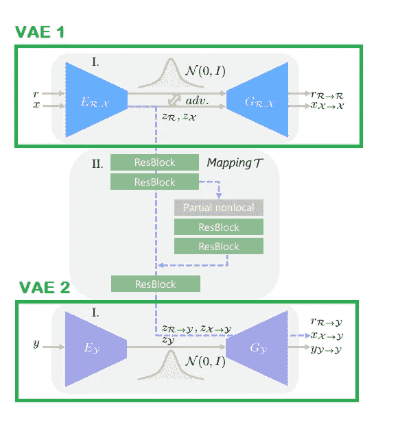

图片来自 https://arxiv.org/pdf/2009.07047.pdf

他们通过专门为此任务创建自己的新网络来解决这个问题。基本上，他们使用两个变分自动编码器，也称为 VAEs，分别将旧(退化)和干净(恢复)的照片转换到两个潜在空间。
这种到潜在空间的转换是通过合成的成对数据来学习的，但能够在真实照片上很好地推广，因为在这种紧凑的潜在空间上，相同的域间隙要小得多。

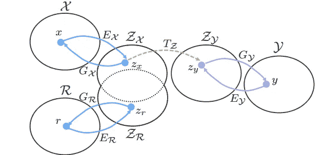

图片来自[https://arxiv.org/pdf/2009.07047.pdf](https://arxiv.org/pdf/2009.07047.pdf)

由 VAEs 产生的来自两个潜在空间的域间隙通过联合训练一个对抗性鉴别器来消除。
您可以在此图像中看到，来自潜在空间的新域“Zx”和“Zr”比原始旧图片“R”和合成旧图片“X”彼此更接近。
恢复退化照片的映射在该潜在空间中完成。

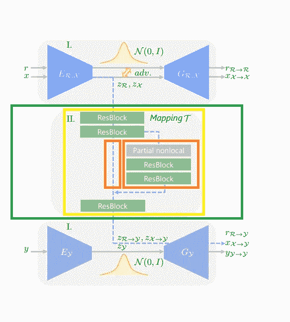

图片来自[https://arxiv.org/pdf/2009.07047.pdf](https://arxiv.org/pdf/2009.07047.pdf)

他们的网络分为特定的分支，每个分支解决一个特定的问题，他们称之为部分非本地块。
有一个针对结构性缺陷的全局分支，例如使用非局部块的划痕和灰尘斑点，考虑到全局上下文。
然后，他们深入到两个局部分支，通过使用几个残余块来瞄准非结构化缺陷，如噪声和模糊。
最后，这些分支融合到潜在空间中，提高了从所有这些缺陷中恢复旧照片的能力。

为了产生更好的结果，还有最后一步。
由于我们想要恢复的老照片很可能是来自我们所爱的人的图片，所以它们总会有一张脸在里面。

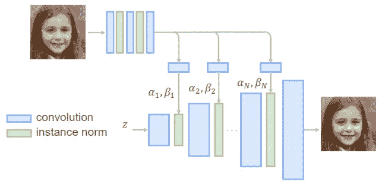

图片来自[https://arxiv.org/pdf/2009.07047.pdf](https://arxiv.org/pdf/2009.07047.pdf)

他们添加了一个人脸细化网络，从潜在空间的图片中恢复旧照片中人脸的精细细节，称为“z”，并使用退化的人脸进入网络的多个区域。
如下图所示，这大大增强了面部的感知质量。

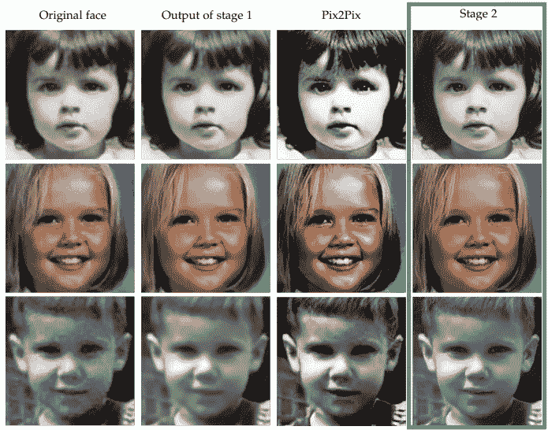

图片来自[https://arxiv.org/pdf/2009.07047.pdf](https://arxiv.org/pdf/2009.07047.pdf)

## 更多结果

现在我们已经看到了它是如何工作的，让我们来看看这个惊人的新网络的更多结果…

## 结论

当然，这只是这篇新论文的一个简单概述。
我强烈建议阅读下面链接的文章，了解更多信息。

> **论文，**https://arxiv.org/pdf/2009.07047.pdf

如果你喜欢我的工作并想支持我，我会非常感谢你在我的社交媒体频道上关注我:

*   支持我的最好方式就是在 [**中**](https://medium.com/@whats_ai) 关注我。
*   订阅我的 [**YouTube 频道**](https://www.youtube.com/channel/UCUzGQrN-lyyc0BWTYoJM_Sg) 。
*   在 [**LinkedIn**](https://www.linkedin.com/company/what-is-artificial-intelligence) 上关注我的项目
*   一起学习 AI，加入我们的 [**不和谐社区**](https://discord.gg/SVse4Sr) ，*分享你的项目、论文、最佳课程，寻找 Kaggle 队友，等等！*