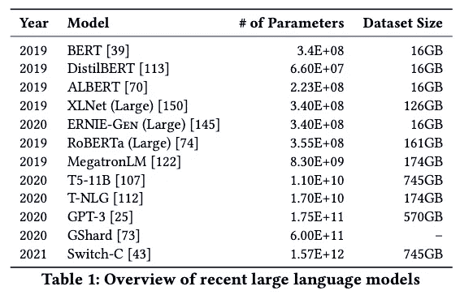
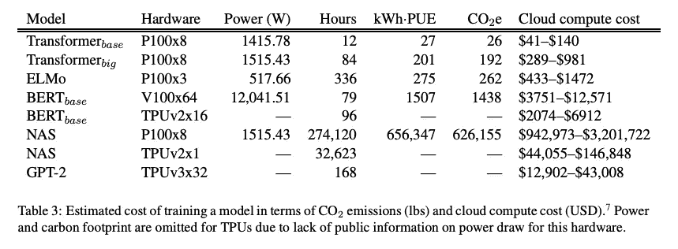

# 迫使蒂姆尼特·格布鲁离开谷歌的那篇有争议的文章里有什么？

> 原文：<https://pub.towardsai.net/on-the-dangers-of-stochastic-parrots-summarized-7eb370bc3d7b?source=collection_archive---------0----------------------->

## [意见](https://towardsai.net/p/category/opinion)

## 随机鹦鹉的危险——综述

第一作者:Emily M. Bender(左)、Timnit Gebru(右)

**简而言之——作者提高了全球对最近自然语言处理趋势的认识，并敦促与语言技术相关的研究人员、开发人员和从业人员采取全面和负责任的方法。**

# 问题出在哪里？

最值得注意的自然语言处理趋势——语言模型(LMs)的规模(基于其参数数量和训练数据规模)不断增加，如 BERT 及其变体、T-NLG、GPT-2/3 等。语言模型(LMs)在字符串预测任务上接受训练:也就是说，在给定其先前上下文或其周围上下文(在双向和屏蔽 LMs 中)的情况下，预测某个标记(字符、单词或字符串)的可能性。这种系统在训练时是无人监督的，后来针对特定任务进行了微调，当部署时，将文本作为输入，通常输出分数或字符串预测。增加模型参数/更大架构的数量并没有导致 LSTMs 的显著增加；但是，变压器却不断从中受益。只要 LMs 与性能的提高相关联，这种越来越大的 LMs 的趋势可以预期会继续。甚至像 DistilBERT 和 ALBERT 这样的模型，它们是使用知识提取、量化等技术的 BERT 的简化形式。，仍然依赖于大量的数据和大量的计算资源。

表 1:近期大型语言模型概述

# 有哪些问题？

## 环境成本

*   在 GPU 上训练一个单一的 BERT 基本模型(没有超参数调整)估计需要的能量相当于一次穿越美国的飞行(~1900 CO2e)。

来源:[NLP 中深度学习的能源和政策考虑](https://arxiv.org/pdf/1906.02243.pdf)

*   对于机器翻译的任务，其中大 LMs 已经导致性能增益，他们估计使用神经架构搜索从英语到德语翻译的 0.1 BLEU 分数的增加导致除了碳排放之外的 150，000 美元计算成本的增加。
*   ACL 2018、NeurIPS 2018 和 CVPR 2019 的大多数样本论文都声称准确性的提高是对该领域的主要贡献。**没有一个将效率作为主要贡献，而效率应该作为优先的评估指标。**

## 财务成本

*   用于训练最大深度学习模型(用于 NLP 和其他应用)的计算量在 6 年内增加了 300，000 倍，增长速度远远高于摩尔定律。这反过来又设置了进入壁垒，限制了谁能为这个研究领域做出贡献，以及哪些语言能从最先进的技术中受益。
*   许多 LMs 部署在工业或其他环境中，从长远来看，推断的成本可能远远超过培训的成本。
*   虽然一些语言技术是真正为边缘群体设计的，但大多数语言技术是为那些已经在社会中拥有最大特权的人服务的。

## 与大量培训数据相关的风险

*   从谁在为这些互联网文本集做贡献开始，我们看到互联网接入本身并不是均匀分布的，导致互联网数据过多地代表了年轻用户和来自发达国家的用户。
*   一组有限的子群体继续轻松地添加数据，分享他们的想法并开发包含他们世界观的平台；这种系统性模式反过来又恶化了基于互联网的交流的多样性和包容性，形成了一个反馈循环，降低了来自代表性不足的人群的数据的影响。
*   因此，在每一个步骤中，从最初参与互联网论坛到持续参与论坛，再到收集和最终过滤训练数据，当前的做法都赋予霸权观点特权。在接受大量网络文本作为人类“全体”的“代表”时，我们冒着延续主流观点、加剧权力失衡和进一步具体化不平等的风险。
*   一个重要的警告是，没有被很好地记录和没有得到媒体显著关注的社会运动将根本不会被捕捉到。因此，支撑 LMs 的数据会歪曲社会运动，并与现有权力体制不成比例地保持一致。
*   开发和转换框架需要以不完整的方式学习，或者在用于训练大型 LMs 的大量数据中丢失— **,特别是如果训练数据没有持续更新的话。**考虑到培训大型 LMs 的计算成本，即使是大公司也不可能足够频繁地对他们进行全面再培训，以跟上这里讨论的语言变化。
*   像毒性分类器这样的组件将需要针对每个审计上下文的文化上适当的训练数据，即使如此，如果我们不知道审计什么，我们可能会错过边缘化的身份。
*   当我们依赖越来越大的数据集时，我们有招致文档债务的风险，也就是说，将我们自己置于数据集没有文档记录并且太大而无法事后记录的情况中。虽然文档允许潜在的责任，但未记录的培训数据会使伤害永久化，且无追索权。

## 由于错误的研究努力而带来的风险

*(特别是围绕用于测试自然语言理解的任务的 LMs 的应用)*

*   为衡量 BERT 及其同类在现有和新基准上的表现而分配的研究工作带来了机会成本，一方面是因为没有花费时间来应用意义捕获方法来完成意义敏感的任务，另一方面是因为没有花费时间来探索更有效的方法来构建具有可被仔细管理并可用于更广泛语言集的数据集的技术。
*   从理论角度来看，语言是符号系统，即形式和意义的配对。但是 LMs 的训练数据只是一种形式；他们无法理解意义。因此，关于模型能力的声明必须被仔细地描述。
*   LMs 将我们与某些认识论和方法论的承诺联系起来。要么 I)我们致力于对任务进行嘈杂通道的解释，ii)我们放弃对任务进行理论洞察的任何目标，并将 LMs 视为“一些方便的技术”，或者 iii)我们隐含地假设输入、输出和意义之间的某种统计关系——已知是无效的。
*   从语言技术工作的角度来看，还远不清楚所有投入使用大型 LMs 来“击败”旨在测试自然语言理解的任务的努力，以及所有创建新的此类任务的努力，一旦 LMs 推平了现有的任务，是否会使我们更接近通用语言理解系统的长期目标。**如果一个拥有数千亿个参数并在一个非常大的数据集上训练的大型 LM 能够很好地操纵语言形式，足以在要求语言理解的测试中作弊，那么我们在构建机器语言理解方面学到了什么有价值的东西吗？**

## 大规模部署 LMs 的风险和危害

人类语言的使用发生在拥有共同基础并相互意识到这种共享(及其程度)的个人之间，他们有使用语言来传达的交际意图，并在交流时模仿彼此的心理状态。因此，人类的交流依赖于对个体之间传递的隐含意义的解释。人与人之间的交流是一种共同构建的活动，这一事实在共处的口语或手语交流中最为明显。尽管如此，我们仍然使用同样的工具来生产语言，这些语言是为那些与我们不在一起的观众(读者、听众、在时间或空间上有一定距离的观察者)准备的，并且在我们遇到这种语言时，我们也使用同样的工具来解释它。**由此可见，即使我们不知道是谁创造了我们正在翻译的语言，我们也能建立一个部分模型，知道他们是谁，我们认为他们与我们有什么共同点，并以此来解释他们的话。**

*   由逻辑模型生成的文本并不基于交际意图、任何世界模型或任何读者心理状态模型。这不可能是因为训练数据从未包括与听众分享想法，机器也没有能力做到这一点。鉴于自动生成的文本质量越来越流畅，这看起来似乎有悖常理。尽管如此，我们必须考虑到，我们对自然语言文本的感知，不管它是如何产生的，都是由我们自己的语言能力来调节的。我们倾向于将交际行为解释为传达连贯的意义和意图，不管它们是否传达。**问题是，如果交流的一方没有意义，那么对隐含意义的理解就是我们人类对语言的单一理解产生的幻觉(独立于模型)。与我们观察其输出时可能出现的情况相反，LM 是一个系统，它根据关于它们如何组合的概率信息，将在其大量训练数据中观察到的语言形式序列随意缝合在一起，但不涉及任何意义:*随机鹦鹉*** 。
*   产生文本的 LMs 将复制甚至放大其训练数据中的编码偏差。因此，风险是人们传播由 LMs 生成的文本，这意味着世界上有更多的文本强化和传播刻板印象和有问题的关联，既传播给遇到这些文本的人，也传播给在摄取了上一代 LM 输出的训练集上训练的未来 LMs。
*   在部署 LM 的人对所生成文本的真实性没有投入的情况下，不法分子可以利用大型 LM 的能力按需生成大量关于特定主题的看似连贯的文本。
*   在机器翻译任务期间，在较大的段落上产生看似连贯的文本，与大 LMs 相关的风险可能会消除可能向用户提示较长段落中的翻译错误的线索。
*   具有大量参数的 LMs 非常接近地模拟其训练数据，并且可能被提示从该训练数据输出特定信息，例如个人可识别信息，这一事实带来了风险。

# 前方推荐路径！

我们应该将我们的研究时间和努力视为一种宝贵的资源，尽可能地花在为技术生态系统构建的研究项目上，这些项目的利益至少是平均分配的。下面提到的每一种**方法都需要时间，当** **在开发过程的早期作为价值和危害**的概念性调查的一部分而不是事后发现风险时，这些方法最有价值。

1.  **考虑环境和财务影响:**在决定调查过程之前，我们应该预先考虑模型开发的财务和环境成本。除非研究人员将能源和计算效率纳入他们的模型评估，否则训练和调整最先进模型所需的资源将增加经济不平等。
2.  **进行仔细的数据监管和记录:**大量的时间应该花在收集适合手头任务的数据集上，而不是从方便或容易抓取的互联网来源获取大量数据。简单地转向大规模数据集作为包容不同观点的策略注定会失败。作为仔细的数据收集实践的一部分，研究人员必须采用诸如([自然语言处理的数据陈述](https://www.aclweb.org/anthology/Q18-1041.pdf)、[数据集的数据表](https://arxiv.org/pdf/1803.09010.pdf)、[模型报告的模型卡](https://arxiv.org/pdf/1810.03993.pdf)等框架来描述他们的模型适合的用途，并对各种条件进行基准评估。这包括提供关于模型构建中使用的数据的完整文档，包括数据选择和收集过程背后的动机。这个文档应该反映和指出研究者在收集数据和创建给定模型时的目标、价值和动机。
3.  **在设计过程的早期与利益相关者接触:**应该注意潜在的用户和利益相关者，尤其是那些会受到模型错误或误用的负面影响的用户和利益相关者。涉众对可能用例的探索仍然可以提供关于潜在风险的信息，即使没有办法保证所有用例都可以被探索。
4.  **探索实现长期目标的多种可能途径:**我们还倡导重新调整研究目标:在已经投入大量精力来使模型(及其训练数据)变得更大，并在经常以人工任务为特色的排行榜上获得更高分数的地方，**我们相信，通过专注于理解机器如何实现相关任务以及它们将如何构成社会技术系统的一部分，可以获得更多。**为此，LM 开发可能受益于指导性评估练习，如预评估。
5.  **保持对双重用途场景的警惕:**对于与 LMs 合作的研究人员来说，价值敏感型设计有助于在整个开发过程中识别谁的价值通过技术得到表达和支持，以及随后缺乏支持如何可能导致伤害。
6.  **分配研究工作以减轻危害:**最后，我们想考虑专门为边缘化人群服务的大型 LMs 的用例。我们应该考虑这样的情况:LMs 是否可以以这样一种方式构建，用它们生成的合成文本将被加水印，从而可以被检测到？有没有可以有效管理其使用的政策方法？

我们希望这些考虑鼓励 NLP 研究人员将资源和精力投入到有效处理 NLP 任务的技术中，而不是无休止地渴求数据。但除此之外，我们呼吁该领域认识到，旨在模仿人类的应用程序确实会带来极端伤害的风险。对合成人类行为的研究是伦理人工智能发展的一个亮点，其中下游影响需要理解和建模，以阻止对社会和不同社会群体的可预见的伤害。

*请在这里* *找到完整的文章* [*并参考上面没有提到的参考文献。如果这篇文章节省了你的时间，别忘了感谢它。*](https://faculty.washington.edu/ebender/papers/Stochastic_Parrots.pdf)