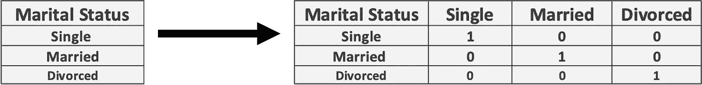
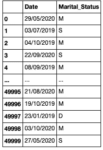
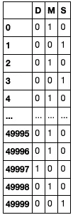
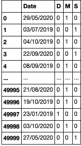

# 一个热门编码简单解释

> 原文：<https://pub.towardsai.net/one-hot-encoding-simply-explained-748a33b5f399?source=collection_archive---------1----------------------->

## [统计数据](https://towardsai.net/p/category/statistics)

由[米利安·耶西耶](https://unsplash.com/@mjessier?utm_source=medium&utm_medium=referral)在 [Unsplash](https://unsplash.com?utm_source=medium&utm_medium=referral) 上拍摄的照片

# 介绍

分类数据非常有用，几乎出现在每个行业和数据集中。然而，大多数机器学习算法只对数字数据进行操作，因为从根本上讲，计算机只能读取 1 和 0。因此，我们需要一种方法将这种分类数据映射成数字数据，以便可以在这些算法中实现。 **One Hot Encoding** 是一种无处不在的数据预处理和特征工程技术，解决了这个问题。它还有一个优点就是非常容易理解和实现！

# 这是什么？

**One Hot Encoding** 将每个唯一的 categorical 元素转换成自己的二进制向量列，因此得名 **One Hot Encoding** 。下图更直观地展示了这一过程:

作者图片

从上面我们可以看到，通过将这一列“扩展”成另外三列，三个婚姻状况分类变量被“映射”到一个二元向量。换句话说，给定一个人是单身的训练示例，单身列将包含 1(是)，已婚和离婚列将包含 0(否)。

# 履行

幸运的是，执行**一个热编码**非常简单，使用 pandas 库只用一行代码就可以完成。

首先，我们读入数据:

作者图片

这里我们看到一列有三个独特的婚姻状况分类变量。现在是时候对这些数据进行热编码了！幸运的是，在 pandas 中，有一个名为 **pd.get_dummies** 的方法，它为每个唯一的分类变量创建“虚拟”列，作为二进制向量。这是按如下方式完成的:

作者图片

啊哈！数据现在是一个热编码！这一切只用了一行代码就完成了！

现在我们简单地将(**PD . concat**)dum 数据帧与“data”数据帧合并，并删除旧的冗余“婚姻状况列”

作者图片

完了！数据已经过热编码，现在可以在您的机器学习模型中实现了！

完整代码可以在我的 GitHub 上找到:

 [## Medium-Articles/One Hot encoding . ipynb at main egorhowell/Medium-Articles

### 我在我的媒体博客/文章中使用的代码。通过创建一个关于…的帐户，为 egorhowell/Medium-Articles 的开发做出贡献

github.com](https://github.com/egorhowell/Medium-Articles/blob/main/Data%20Science%20Basics/One%20Hot%20Encoding.ipynb) 

# 和我联系！

*   要在媒体上阅读无限的故事，请务必在此注册！T3*💜*
*   [*当我在这里发布注册邮件通知时，可以获得更新！*](/subscribe/@egorhowell) 😀
*   [*领英*](https://www.linkedin.com/in/egor-howell-092a721b3/) 👔
*   [*推特*](https://twitter.com/EgorHowell) 🖊
*   [*github*](https://github.com/egorhowell)*🖥*
*   ***🏅***

> ***(所有表情符号由 [OpenMoji](https://openmoji.org/) 设计——开源表情符号和图标项目。许可证: [CC BY-SA 4.0](https://creativecommons.org/licenses/by-sa/4.0/#)***