# 一次一个乐高:解释神经网络如何从零开始学习和实现的数学

> 原文：<https://pub.towardsai.net/one-lego-at-a-time-explaining-the-math-of-how-neural-networks-learn-with-implementation-from-scratch-39144a1cf80?source=collection_archive---------0----------------------->

## [机器学习](https://towardsai.net/p/category/machine-learning)，[数学](https://towardsai.net/p/category/mathematics)

> *一个* ***神经网络*** *是线性和非线性模块的巧妙排列。当我们明智地选择和连接它们时，我们就有了一个强大的工具来逼近任何数学函数。例如，* ***用非线性决策边界*** *来分隔类别。*

运行代码的步骤:

*   git 克隆[https://github.com/omar-florez/scratch_mlp/](https://github.com/omar-florez/scratch_mlp/)
*   python scratch _ MLP/scratch _ MLP . py

尽管具有直观和模块化的性质，但并不总是深入解释的一个主题是负责更新可训练参数的**反向传播技术**。让我们从零开始构建一个神经网络，以查看使用**乐高积木作为模块化类比**的神经网络的内部功能，一次一个砖块。

# 作为片段组合的神经网络

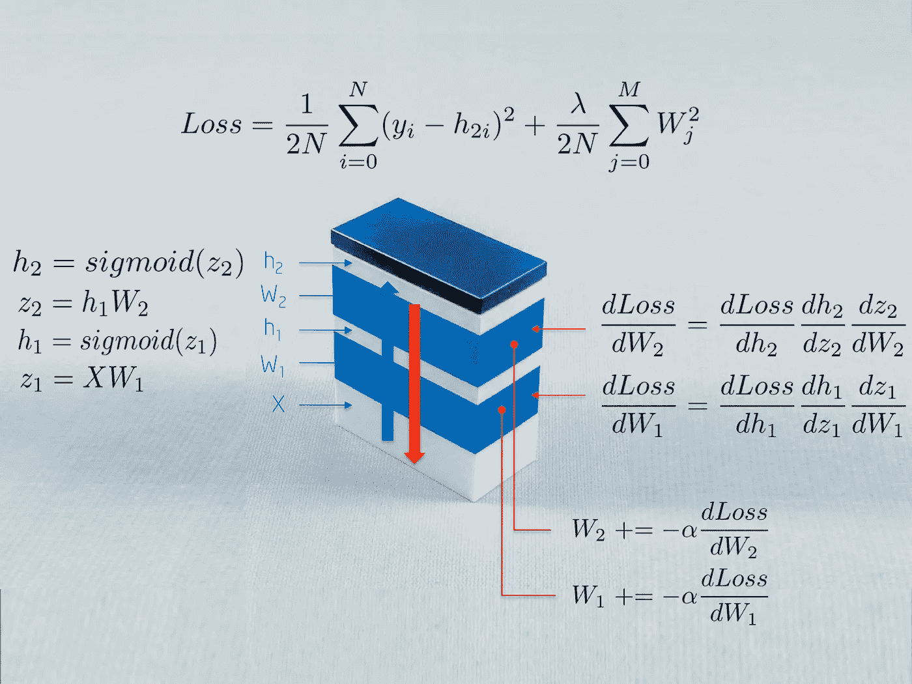

上图描述了用于训练神经网络的一些数学方法。我们将在本文中解释这一点。读者可能会感兴趣的是，神经网络是具有不同目的的模块的堆叠:

*   **输入 X** 向神经网络输入原始数据，原始数据存储在矩阵中，矩阵中的观察值为行，维度为列
*   **权重 W1** 将输入 X 映射到第一个隐藏层 h1。权重 W1 然后作为线性核工作
*   一个 **Sigmoid 函数**通过将隐藏层中的数字缩放到 0-1 来防止它们超出范围。结果是神经激活的**阵列** h1 = Sigmoid(WX)

在这一点上，这些操作只计算了一个**一般线性系统**，它不具备模拟非线性相互作用的能力。当我们再堆叠一层，增加这种模块化结构的深度时，这种情况就会改变。网络越深，我们就能学习到越微妙的非线性互动，也能解决越复杂的问题，这或许可以部分解释深度神经模型的兴起。

# 我为什么要看这个？

> *如果你了解神经网络的内部组成部分，你会很快知道当事情不奏效时首先要改变什么***并定义一个策略来测试不变量* *和* ***你所知道的预期行为*** *是算法的一部分。当您想要* ***创建您正在使用的 ML 库*** *中当前没有实现的新功能时，这也会很有帮助。**

***因为调试机器学习模型是一项复杂的任务**。根据经验，数学模型在第一次尝试时不会像预期的那样工作。它们可能会给你新数据的低准确率，花费很长的训练时间或太多的内存，返回大量的假阴性或 NaN 预测等。当知道算法如何工作变得很方便时，让我展示一些例子:*

*   *如果**需要这么多时间来训练**，那么增加迷你批次的大小来减少观察值的方差，从而帮助算法收敛，这可能是一个好主意*
*   *如果您观察到 **NaN 预测**，该算法可能已经接收到产生内存溢出的大梯度。可以把这想象成多次迭代后爆发的连续矩阵乘法。降低学习率会降低这些值。减少层数将减少乘法次数。剪切渐变将明确地控制这个问题*

# *具体例子:学习异或函数*

> *让我们打开黑盒。我们现在将从头构建一个学习 ***异或函数*** *的神经网络。这种* ***非线性函数*** *的选择绝非偶然。如果没有反向传播，就很难学会用一条* ***直线*** *来分隔类。**

*为了说明这个重要的概念，请注意下面一条直线如何不能分隔异或函数的输出 0 和 1。**现实生活中的问题也是非线性可分的**。*

*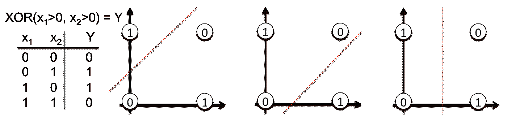*

*网络的拓扑结构很简单:*

*   ***输入 X** 是一个二维向量*
*   ***权重 W1** 是一个具有随机初始化值的 2×3 矩阵*
*   ***隐层 h1** 由三个神经元组成。每个神经元接收观察值的加权和作为输入，这是下图中用绿色突出显示的内积: **z1 = [x1，x2][w1，w2]***
*   ***权重 W2** 是具有随机初始化值的 3x2 矩阵，并且*
*   ***输出层 h2** 由两个神经元组成，因为 XOR 函数返回 0 (y1=[0，1])或 1 (y2 = [1，0])*

*更直观:*

*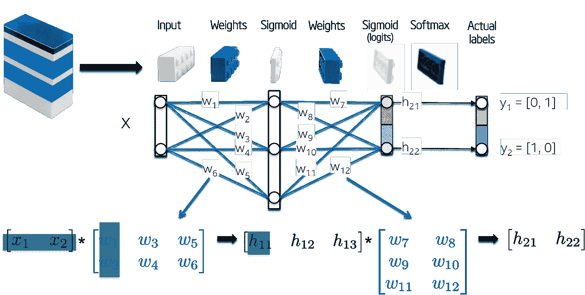*

*现在让我们训练模型。在我们的简单示例中，可训练参数是权重，但是要知道，当前的研究正在探索更多类型的参数来进行优化。例如层间捷径、正则化分布、拓扑、残差、学习率等。*

***反向传播**是一种向方向(**梯度**)更新权重的方法，该方法在给定一批标记的观察值的情况下，最小化被称为**损失函数的预定义误差度量。这种算法已经被反复重新发现，并且是一种更一般的技术的特例，这种技术被称为反向累加模式中的[自动微分](https://en.wikipedia.org/wiki/Automatic_differentiation)。***

# *网络初始化*

> **让我们用随机数初始化网络权重***。***

**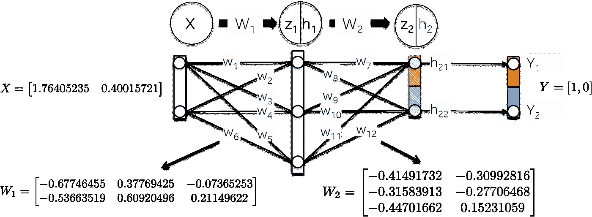**

# **向前一步:**

> ***这一步的目标是将* ***正向传播*** *输入的 X 到网络的每一层，直到计算出输出层 h2 中的一个矢量。***

**事情是这样发生的:**

*   **使用权重 W1 作为内核来线性映射输入数据 X:**

**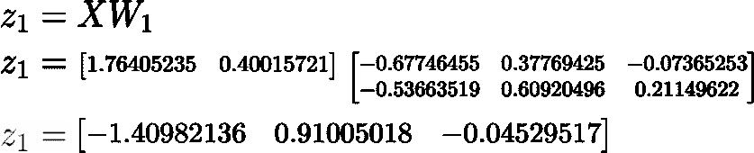**

*   **用 Sigmoid 函数缩放该加权和 z1，以获得第一隐藏层 h1 的值。**注意，原来的 2D 矢量现在被映射到一个三维空间**。**

**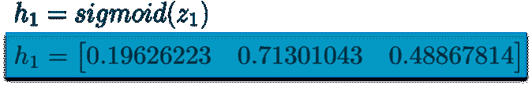**

*   **对于第二层 h2，发生类似的过程。让我们首先计算第一个隐藏层的**加权和** z2，它现在是输入数据。**

**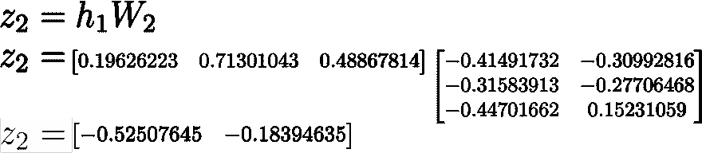**

*   **然后计算他们的 Sigmoid 激活函数。这个向量[0.37166596 0.45414264]代表网络给定输入 x 计算的**对数概率**或**预测向量****

**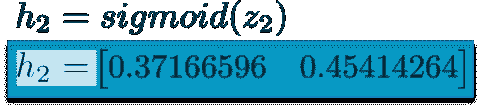**

# **计算总损失**

> ***又称“实际减去预测”，损失函数的目标是* ***量化预测向量 h2 与人类提供的实际标签 y*** *之间的距离。***

**请注意，损失函数包含一个**正则化组件**，它像在岭回归中一样惩罚大的权重值。换句话说，大的平方权重值将增加损失函数**，这是我们确实想要最小化的误差度量**。**

**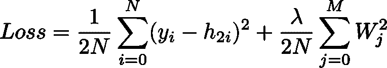**

# **后退一步:**

> ***这一步的目标是* ***以最小化其损失函数的方向更新神经网络*** *的权重。正如我们将看到的，这是一个* ***递归算法*** *，它可以重用先前计算的梯度，并且严重依赖于* ***可微函数*** *。由于这些更新减少了损失函数，网络“学习”用已知类来近似观察的标签。一个叫做* ***的属性概括了*** *。***

**这一步的顺序**比前一步的顺序**靠后。它首先计算损失函数相对于输出层权重(dLoss/dW2)的偏导数，然后计算隐藏层权重(dLoss/dW1)。让我们详细解释每一个。**

## **dLoss/dW2:**

**链式法则表示，我们可以将神经网络梯度的计算分解成**个可微分的部分**:**

**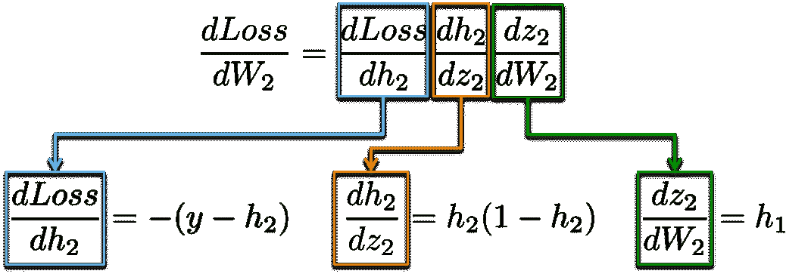**

**作为内存助手，这些是上面使用的**函数定义**和它们的**一阶导数**:**

**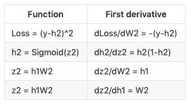**

**更直观地说，我们的目标是更新下图中的权重 W2(蓝色)。为此，我们需要沿着链计算三个**偏导数。****

****

**将值代入这些偏导数中，允许我们计算相对于权重 W2 的梯度，如下所示。**

**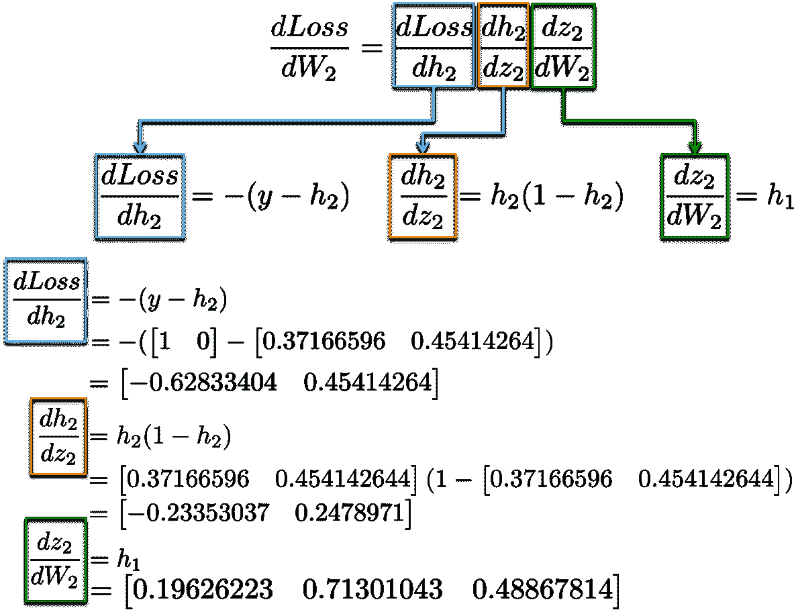**

**结果是一个 3×2 矩阵 dLoss/dW2，它将在最小化损失函数的方向上更新原始 W2 值。**

**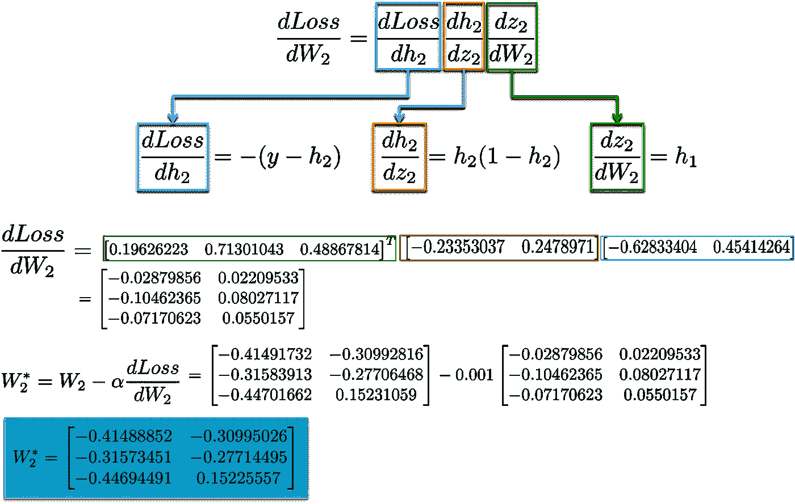**

## **dLoss/dW1:**

**计算用于更新第一隐藏层 W1 的权重的**链规则**展现了**重用现有计算**的可能性。**

**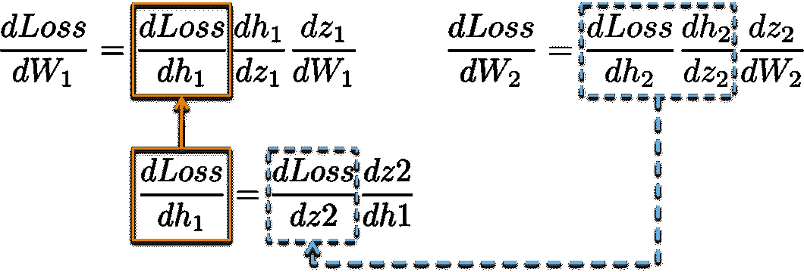**

**更直观地说，从输出层到权重 W1 的**路径接触到已经在**后面的层**中计算的偏导数。****

**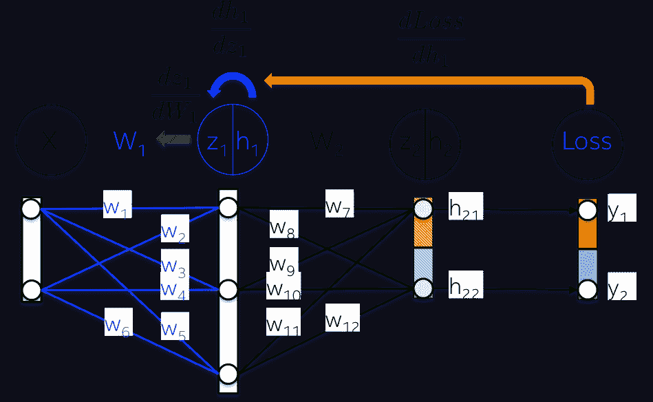**

**例如，在前面的部分中，偏导数 dLoss/dh2 和 dh2/dz2 已经被计算为用于学习输出层 dLoss/dW2 的权重的依赖性。**

**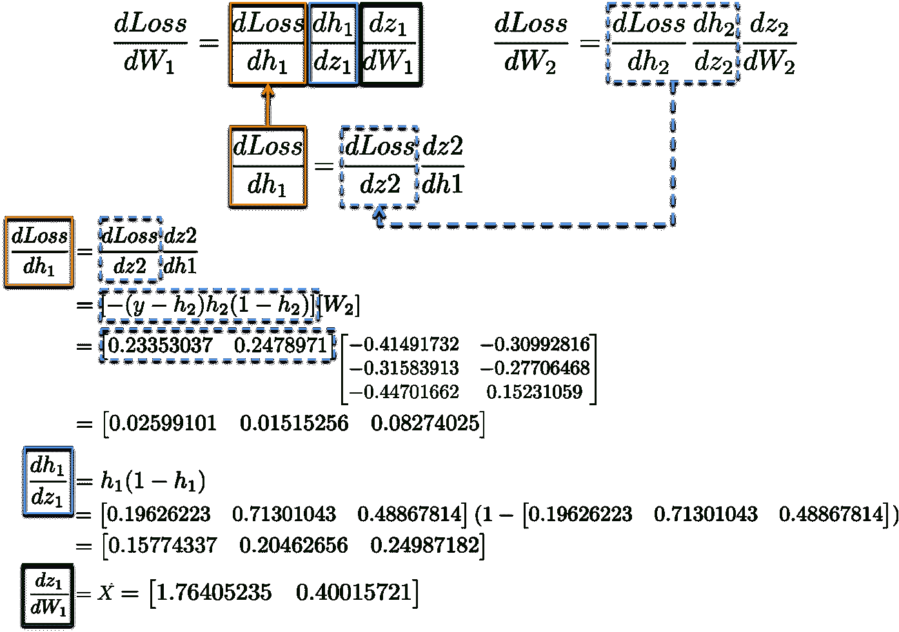**

**将所有导数放在一起，我们可以再次执行**链规则**来更新隐藏层 W1 的权重:**

**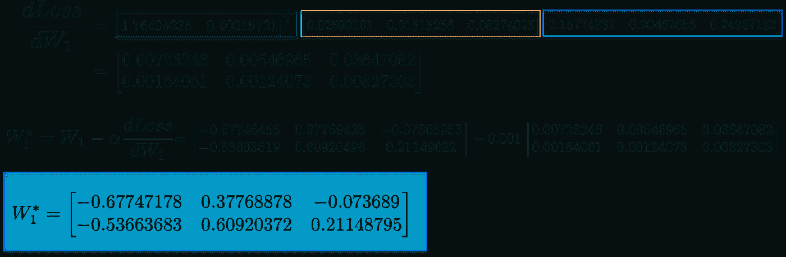**

**最后，我们将新值分配给权重，并完成了网络的训练步骤。**

**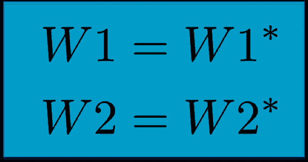**

# **履行**

**让我们仅使用 [Numpy](http://www.numpy.org/) 作为我们的**线性代数引擎**，将上述数学方程翻译成代码。神经网络在一个循环中被训练，其中每次迭代向网络呈现已经**校准的输入数据**。在这个小例子中，让我们只考虑每次迭代中的整个数据集。由于我们在每个周期中用相应的**梯度**(矩阵 dL_dw1 和 dL_dw2)更新**可训练参数**(代码中的矩阵 w1 和 w2)，因此**向前步长**、**损失**和**向后步长**的计算导致了良好的通用性。代码存储在这个库中:[https://github.com/omar-florez/scratch_mlp](https://github.com/omar-florez/scratch_mlp)**

**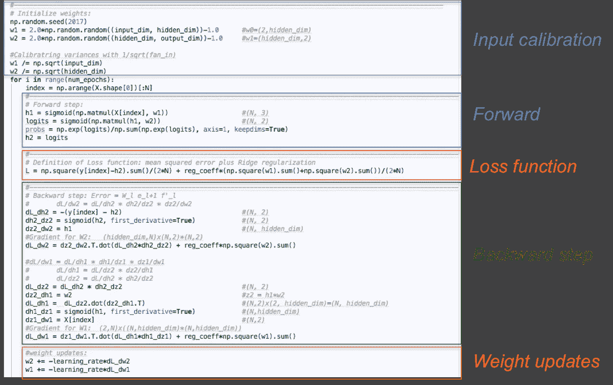**

# **让我们运行这个！**

**见下文**一些神经网络**被训练成在多次迭代中逼近**异或函数。****

****左图:**精度。**中心情节:**习得决定边界。**右图:**损失函数。**

**先来看看一个隐层有 **3 个神经元**的神经网络容量有多大。这个模型学习用一个简单的决策边界**来区分两个类，这个简单的决策边界**开始是一条直线，但随后显示出非线性行为。随着训练的继续，右图中的损失函数变得很低。**

**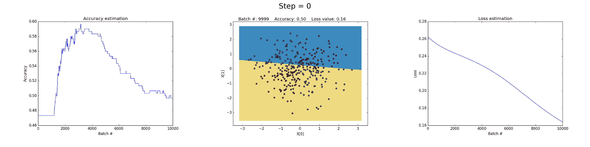**

**在隐藏层中拥有 50 个神经元显著增加了模型学习更多复杂决策边界的能力。这不仅可以产生更精确的结果，而且**还可以分解梯度**，这是训练神经网络时的一个显著问题。当非常大的梯度在反向传播期间乘以权重并因此产生大的更新权重时，会发生这种情况。这就是在训练的最后步骤(步骤> 90)中**损失值突然增加**的原因。损失函数的**正则化组件**计算已经非常大的权重的**平方值**(sum(W)/2N)。**

**这个问题可以通过**降低学习率**来避免，如下图所示。或者通过实施随着时间推移降低学习率的策略。或者通过加强监管，也许是 L1 而不是 L2。**爆炸**和**消失渐变**是有趣的现象，我们将在后面进行完整的分析。**