# 一行，神奇的代码来执行 EDA！

> 原文：<https://pub.towardsai.net/one-line-magical-code-to-perform-eda-f83a731fbc35?source=collection_archive---------0----------------------->

## 机器学习，探索性数据分析

## 一句话解决你所有的问题！

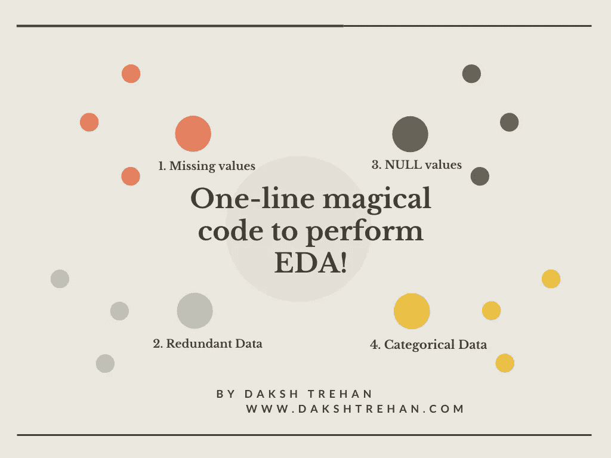

> “数据是新的石油”~克莱夫·亨比

数据是我们生活中不可或缺的一部分，与其他资源不同，它是取之不尽用之不竭的，但这里有一个问题，如果你知道如何修补它并抓住它的要点，它对你的组织才有用。

数据科学是一个包括收集、存储、处理、描述和建模的过程。

处理、描述/EDA(探索性数据分析)可以被称为一个生命周期，通过找到每个变量之间的关系并将它们可视化来发现隐藏的趋势，从而引入数据。

EDA 占用了大量的时间和精力来清理和探索我们的数据。虽然在数据处理领域，我们仍然期望数据探索有一些进步，但已经有了惊人的进步。几个开源库已经提出了*无代码*或*低代码*方法来帮助简化探索。

D-Tale 就是这样一个库，它是 Flask 后端和 React 前端的结合，提供了一种可视化和探索 pandas 数据框架的交互方式。

> D-Tale 确保您不会厌倦递归执行 df.head()！

# 实施 D 表

1.  **安装 D-Tale:** 像任何其他 Python 库一样，您可以通过在命令行中使用“pip install dtale”来轻松安装 D-Tale。

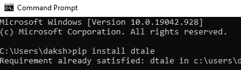

2.**导入相关库:**使用 Seaborn 加载数据集和 D-tale 进行可视化和探索。

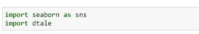

3.**选择一个数据集:**从 Seaborn 中预先定义的数据集中选择任意一个。

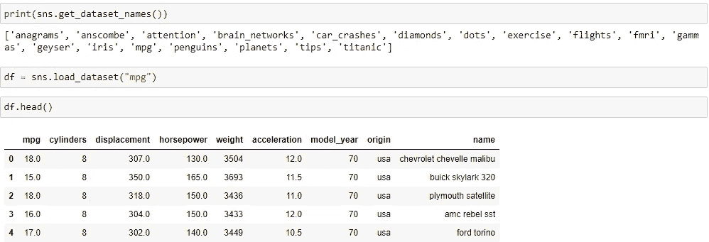

4.**获取数据的基本见解:**使用 describe()方法同样适用。

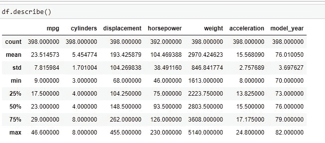

5.**使用 D-Tale:** 使用 D-Tale 库加载数据并获得交互式见解。

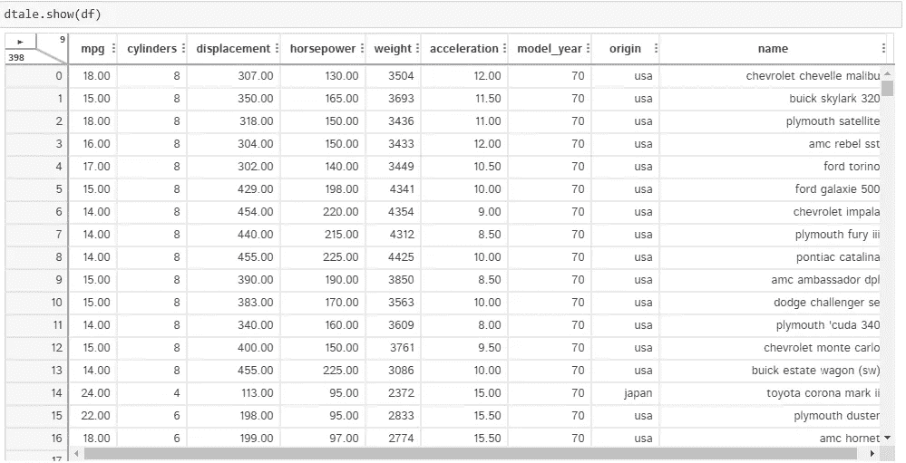

点击播放按钮并选择“在新标签中打开”:

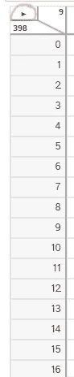

共有 398 条记录和 9 列。

# D-Tale 的特点

**以干净优雅的方式存储您的所有数据！**

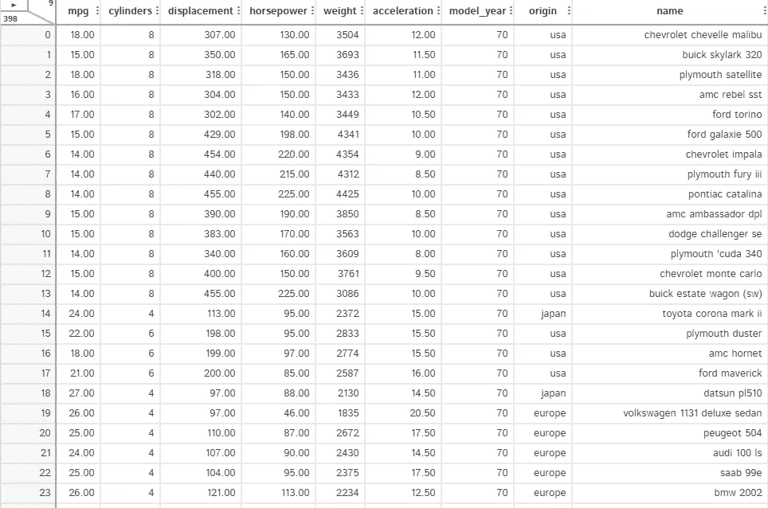

**使用“描述”按钮查找数据集的统计属性。**

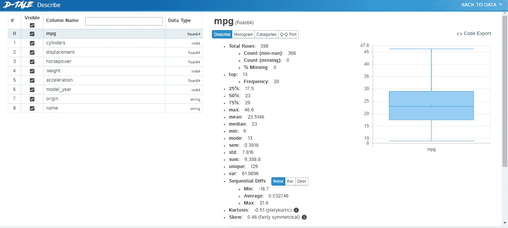

**汇总相关行和列的数据。**

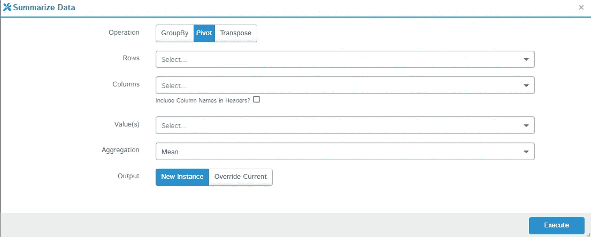

**删除重复值**

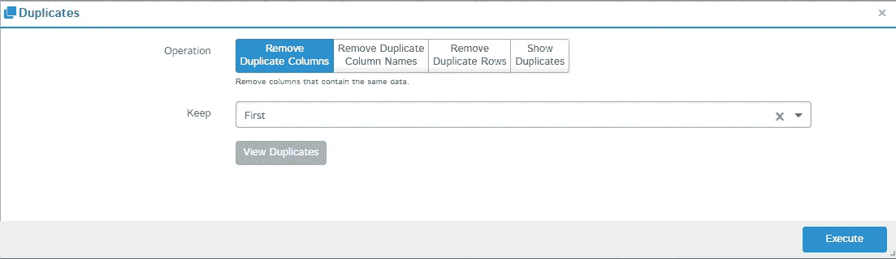

**检查数据中的相关性，以便轻松创建图表。**

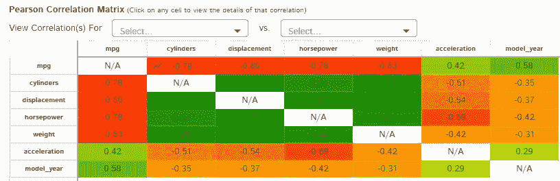

**本库帮助你用不可知论评分，帮助确定线性和非线性关系。**

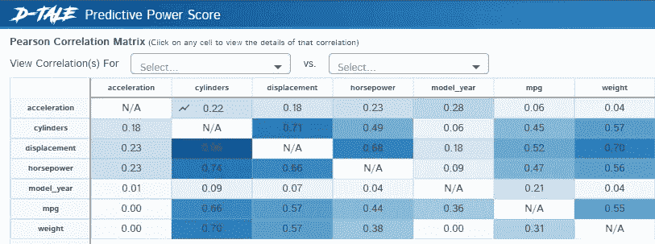

D-Tale 最令人期待的特性是它无缝创建图表的能力。

**它提供了各种各样的图表，带有针对每种图表类型的个性化数据清理选项。**

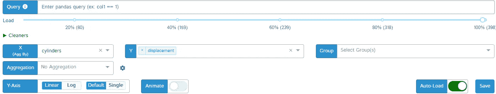

**D-Tale 的另一个突出特点是，它允许您从仪表板创建图表，并直接导入相同的代码。**

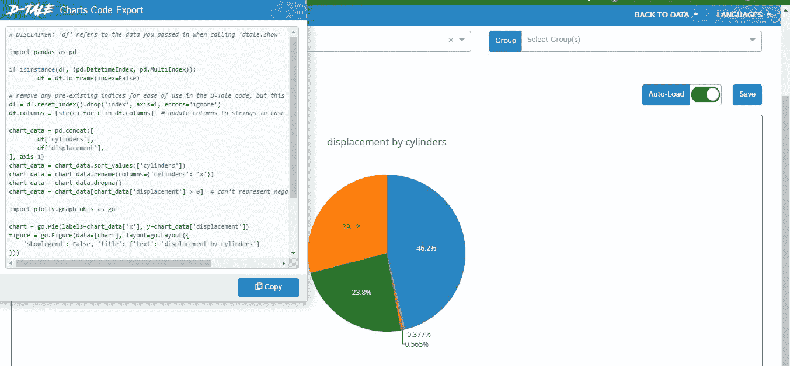

热图也可以用于整个数据或特定的列。

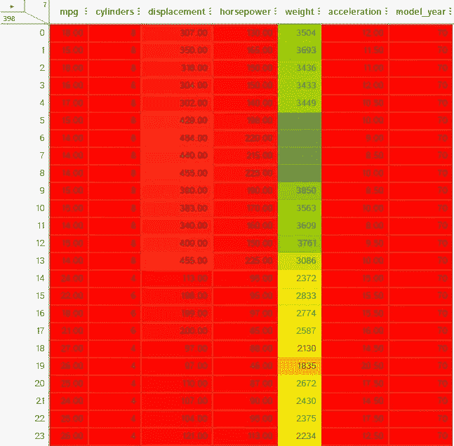

**您还可以检查特定列的统计值并执行列分析。**

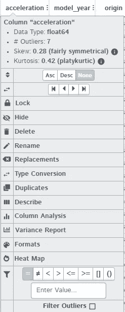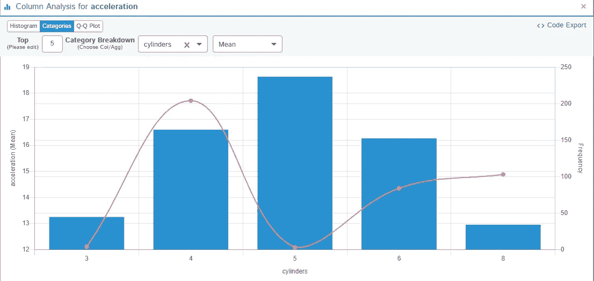

**对各列进行差异分析。**

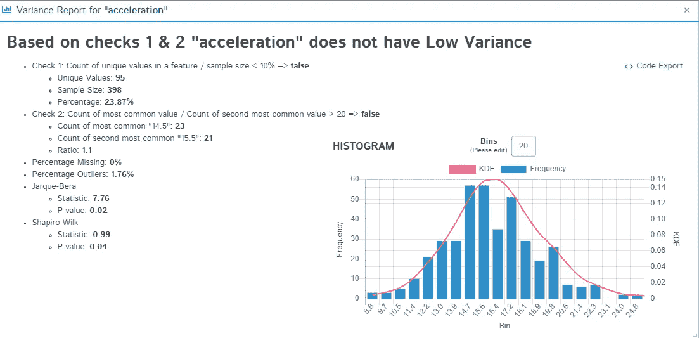

**用户还可以更改任何特定记录的数据。**

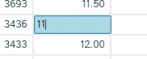

**上述代码可以在**[**dakshtrehan/D-Tale-Exploration(github.com)**](https://github.com/dakshtrehan/D-Tale-Exploration)找到

**如果你喜欢这篇文章，请考虑订阅我的简讯:** [**达克什·特雷汉每周简讯**](https://mailchi.mp/b535943b5fff/daksh-trehan-weekly-newsletter) **。**

# 结论

这篇文章帮助我们了解了非常强大的 EDA 报告工具:D 故事。我们看到了 D-Tale 如何让创建吸引人的视觉效果和探索数据变得超级简单。

# 参考资料:

[dtale PyPI](https://pypi.org/project/dtale/)

[使用 dtale 库在 Python 中进行数据探索(analyticsvidhya.com)](https://www.analyticsvidhya.com/blog/2020/11/data-exploration-dtale/)

[D-Tale 简介。互动 D-Tale 简介|作者:Albert Sanchez Lafuente |走向数据科学](https://towardsdatascience.com/introduction-to-d-tale-5eddd81abe3f)

[用 D-Tale-KD nuggets 让你的熊猫数据框栩栩如生](https://www.kdnuggets.com/2020/08/bring-pandas-dataframes-life-d-tale.html)

[Dtale 教程—熊猫数据结构可视化指南(analyticsindiamag.com)](https://analyticsindiamag.com/dtale-tutorial-guide-to-visualize-pandas-data-structure/)

[面向程序员和开发人员的社交网络(morioh.com)](https://morioh.com/p/37aa1927855f)

[D-Tale 库简介。D-Tale 是可视化的 python 库… |作者 Shruti sa xena | Analytics vid hya | Medium](https://medium.com/analytics-vidhya/introduction-to-d-tale-library-fabb369c5d91)

请随意连接:

> *作品集~*[*https://www.dakshtrehan.com*](http://www.dakshtrehan.com/)
> 
> *领英~*[https://www.linkedin.com/in/dakshtrehan](https://www.linkedin.com/in/dakshtrehan/)

关注更多机器学习/深度学习博客。

> *中等~*[*https://medium.com/@dakshtrehan*](https://medium.com/@dakshtrehan)

# 想了解更多？

[准备好拜 AI 神了吗？](https://medium.com/swlh/are-you-ready-to-worship-ai-gods-818c9b7490dc)
[利用深度学习检测新冠肺炎](https://towardsdatascience.com/detecting-covid-19-using-deep-learning-262956b6f981)
[逃不掉的 AI 算法:抖音](https://towardsdatascience.com/the-inescapable-ai-algorithm-tiktok-ad4c6fd981b8)
[GPT-3 向一个 5 岁的孩子解释。](/gpt-3-explained-to-a-5-year-old-1f3cb9fa030b)
[Tinder+AI:一场完美的牵线搭桥？](https://medium.com/towards-artificial-intelligence/tinder-ai-a-perfect-matchmaking-b0a7b916e271)
[一个圈内人的使用机器学习的卡通化指南](https://medium.com/towards-artificial-intelligence/an-insiders-guide-to-cartoonization-using-machine-learning-ce3648adfe8)
[强化强化学习背后的科学](https://medium.com/towards-artificial-intelligence/reinforcing-the-science-behind-reinforcement-learning-d2643ca39b51)
[解码生成对抗网络背后的科学](https://medium.com/towards-artificial-intelligence/decoding-science-behind-generative-adversarial-networks-4d188a67d863)
[了解 LSTM 和 GRU 的](https://medium.com/towards-artificial-intelligence/understanding-lstms-and-gru-s-b69749acaa35)
[用于假人的递归神经网络](https://medium.com/towards-artificial-intelligence/recurrent-neural-networks-for-dummies-8d2c4c725fbe)
[用于假人的卷积神经网络](https://medium.com/towards-artificial-intelligence/convolutional-neural-networks-for-dummies-afd7166cd9e)

> *欢呼*