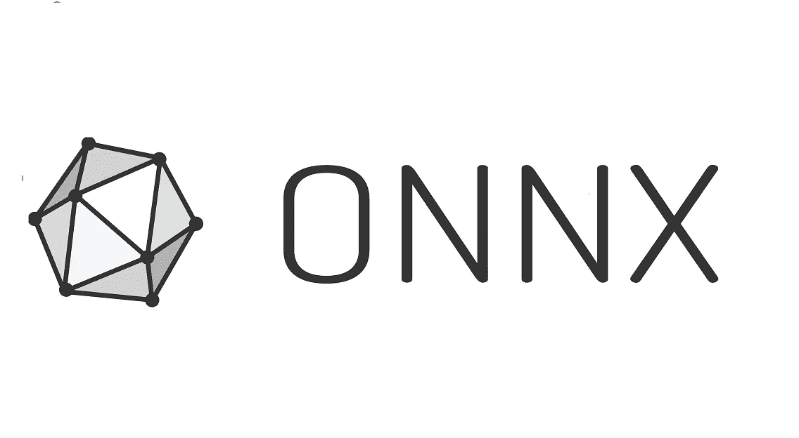
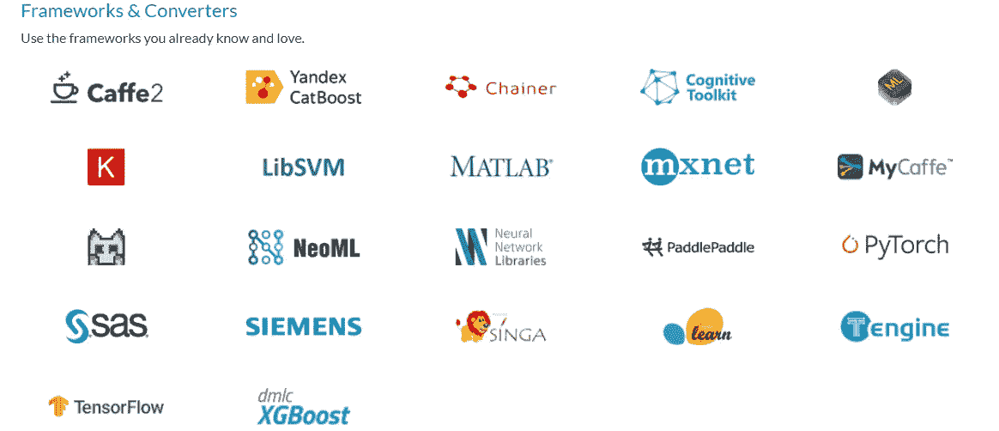
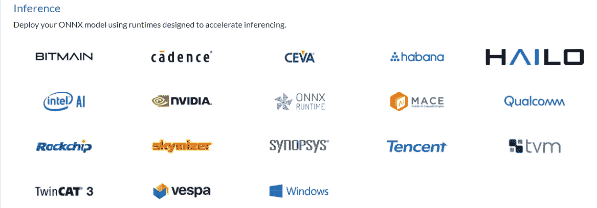
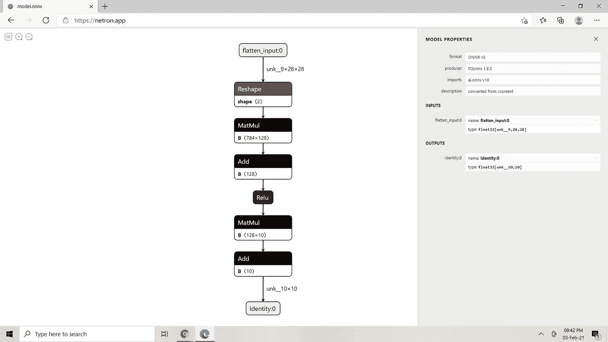

# ONNX 支持模型互操作性和更快的推理

> 原文：<https://pub.towardsai.net/onnx-for-model-interoperability-faster-inference-8709375db9bf?source=collection_archive---------2----------------------->

## [数据科学](https://towardsai.net/p/category/data-science)，[机器学习](https://towardsai.net/p/category/machine-learning)

## 了解如何使用 ONNX 将 ML 模型从任何框架转换为 ONNX 格式，并做出更快的推断



来源: [ONNX](https://github.com/onnx/onnx/blob/master/docs/ONNX_logo_main.png)

您很有可能听说过 ONNX，但不确定它的功能和使用方法。别担心，你来对地方了。在这篇初学者友好的文章中，您将了解 ONNX。让我们开始吧。

假设你建立了一个深度学习模型，使用 TensorFlow 框架进行人脸检测。但是不幸的是，您可能必须在使用 Pytorch 的环境中部署这个模型。你如何处理这种情况？我们可以想出两种方法来解决这个问题:

*a)将现有模型转换成可在任何环境下工作的标准格式。*

*b)将模型从一个框架(TensorFlow)转换到另一个所需的框架(Pytorch)。*

这正是 ONNX 所做的。使用 ONNX 平台，您可以将 TensorFlow 模型转换为 ONNX(一种开放的互操作性标准格式)。然后用它来进行推断/预测。或者，您也可以进一步将 ONNX 转换为 Pytorch，并使用 Pytorch 模型进行推断/预测。

这要归功于微软、脸书和 AWS 等合作伙伴的共同努力。现在，我们可以无缝地工作，而不用担心构建机器学习模型的底层框架。

# ONNX

**ONNX** 代表**O**pen**N**eural**N**network E**x**change。它主要可以用于三种不同的任务

*   将模型从任何框架转换为 ONNX 格式
*   将 ONNX 格式转换成任何需要的框架
*   在支持的运行时上使用 ONNX 模型进行更快的推理

虽然它在定义中说神经网络可以用于深度学习和传统的机器学习模型。所以，不要迷茫。

正如您在下面看到的，ONNX 支持大多数框架。所以，如果你在找 Pytorch，MXNET，MATLAB，XGBoost，CatBoost 模型进行 ONNX 转换参考 [**官方教程**](https://github.com/onnx/tutorials#converting-to-onnx-format) 。



来源:[https://onnx.ai/supported-tools.html](https://onnx.ai/supported-tools.html)

# ONNX 运行时

下图显示了 ONNX 支持的所有运行时列表。这些运行时引擎有助于高性能深度学习推理，因为它们带有内置优化。 [**ONNX 运行时**](https://www.onnxruntime.ai/) 也是我们将在本文中用于推理的受支持的运行时引擎之一。



来源:https://onnx.ai/supported-tools.html

现在你已经对 **ONNX** 和 **ONNX 运行时**有了大致的了解，让我们跳转到本文的主要话题。在本文中，我们将以 **Scikit-learn** 和 **TensorFlow** 模型为例，将它们转换为 ONNX 格式，并使用 **ONNX 运行时**进行推理。

在以后的文章中，我们将探讨如何将 ONNX 转换成任何期望的框架、优化和转换器模型等。

# sci kit-学习 ONNX

## **安装**

```
pip install skl2onnx, onnxruntime
```

## 密码

下面的代码简单明了。我们首先构建 Sklearn 模型(步骤 1)，将其转换为 ONNX 格式(步骤 2)，最后使用 ONNX 进行预测/推理(步骤 3)。如您所见，使用 ONNX 格式的推理比最初的 Scikit-learn 模型快 6-7 倍。如果您处理更大的数据集，结果会令人印象深刻。

有关 **skl2onnx** 的更多详情，请参考 [**本**](http://onnx.ai/sklearn-onnx/index.html) 文档。

# 张量流至 ONNX

## **安装**

```
pip install tf2onnx, onnxruntime
```

## 密码

以下代码也是不言自明的。即使在这种情况下，使用 ONNX 的推断/预测也比原始 TensorFlow 模型快 6-7 倍。如前所述，如果您处理更大的数据集，结果会令人印象深刻。

有关 **tf2onnx** 的更多详情，请参考 [**本**](https://github.com/onnx/tensorflow-onnx) 文档。

# 其他工具

ONNX 还为**优化**和**可视化**提供了另外两个工具。*优化将在以后的文章中讨论。*有两个可视化工具 [**NETRON**](https://netron.app/) 或 [**Visual DL**](https://www.paddlepaddle.org.cn/paddle/visualdl) 可以用来可视化任何机器学习或深度学习模型。

下面的截图显示了我们之前使用 [**NETRON**](https://netron.app/) 创建的 TensorFlow 深度学习模型的可视化。



作者图片

# 结论

在本文中，您了解了什么是 ONNX，以及它将如何给开发人员带来好处。然后我们研究了 ONNX 转换的例子，发现使用 ONNX 运行时的推理比原始框架快得多。最后，我们使用 NETRON visualizer 可视化了机器学习模型。

*原载于 2021 年 2 月 3 日 Pythonsimplified.com**的* ***。***

*阅读更多关于 Python 和数据科学的有趣文章，* [***订阅***](https://pythonsimplified.com/home/) *到我的博客*[***pythonsimplified.com***](http://www.pythonsimplified.com/)***。*** 你也可以在[**LinkedIn**](https://www.linkedin.com/in/chetanambi/)**上联系我。**

我希望你喜欢阅读这篇文章。如果你喜欢我的文章并想订阅 Medium，你可以在这里这样做:

[](https://chetanambi.medium.com) [## Chetan Ambi -介质

### 阅读 Chetan Ambi 在媒体上的文章。数据科学|机器学习| Python。参观 https://pythonsimplified.com/…

chetanambi.medium.com](https://chetanambi.medium.com) 

# 参考

[1].[https://onnx.ai/](https://onnx.ai/)

[2].[https://github.com/onnx](https://github.com/onnx)

[3].[https://github.com/microsoft/onnxruntime](https://github.com/microsoft/onnxruntime)

[4].[https://github.com/lutzroeder/netron](https://github.com/lutzroeder/netron)