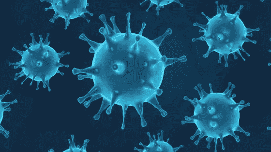
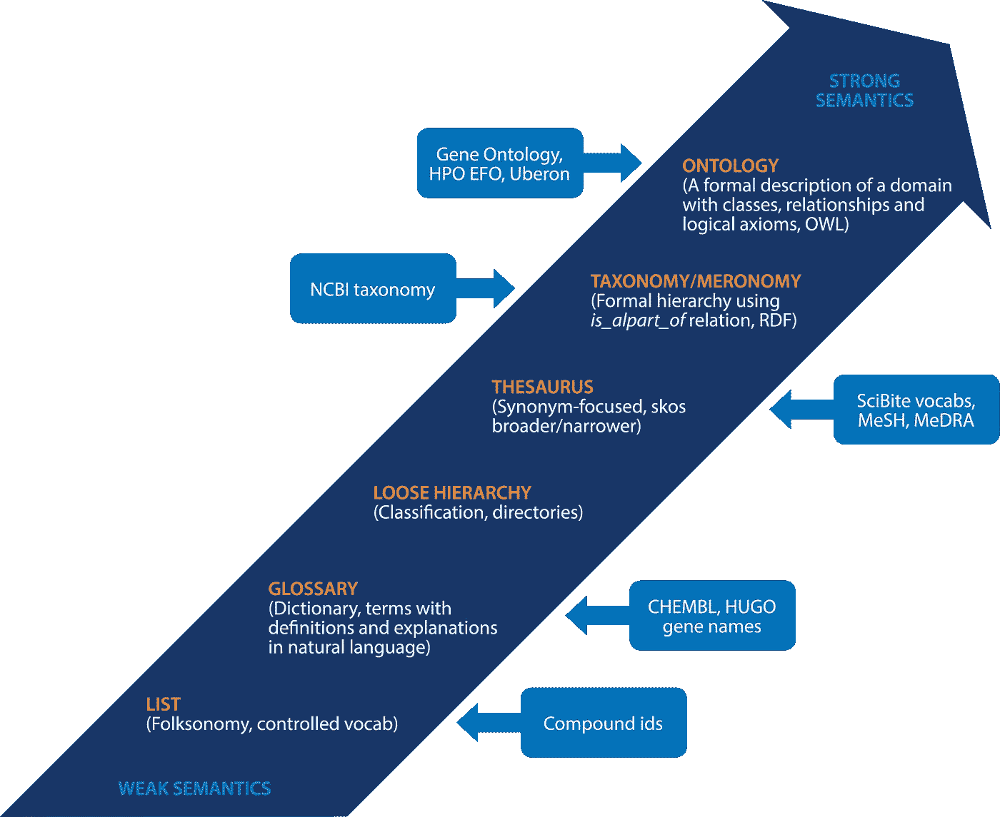
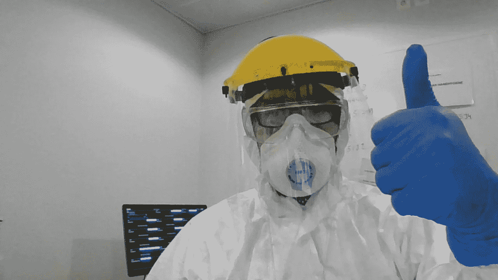

# 本体论揭开了数据科学的序幕:新冠肺炎用例

> 原文：<https://pub.towardsai.net/ontology-preludes-data-science-a-covid-19-use-case-cadfcc0b81cf?source=collection_archive---------2----------------------->

## 数据科学

斯文·范·普克，布莱恩·特文斯特鲁普，玛戈·范德·莱宁，沃纳·休斯特

*1。比利时根克 Ziekenhuis Oost-Limburg
2 麻醉、重症监护、急救医学和疼痛
治疗部。美国佛罗里达州坦帕湾 Lindon Ventures 董事总经理。
3。美国纽约州布法罗市布法罗大学生物医学信息学系。*

通信至:Sven Van Poucke，医学博士，比利时 Genk Ziekenhuis Oost-Limburg 麻醉科、重症监护科、急诊医学科和疼痛治疗科；电子邮件:svanpoucke@gmail.com。

## **摘要和关键词**

自 2019 年 12 月底在中国被发现以来，新冠肺炎疫情对全球公共卫生和经济提出了批评。政策制定者、制药公司、医疗服务提供者和患者都面临着新颖、复杂、经常冲突的问题，需要立即采取行动。有一种普遍的看法认为，准备状态和就绪状态不是最佳的，甚至是缺乏的。在本文中，我们涵盖了实际问题，并讨论了从新冠肺炎危机开始到目前为止被忽视的错过的机会。特别是，任何与分发、出版或认为理所当然的新冠肺炎数据(数据科学的宠物)、生物医学术语和疾病分类(本体论松弛)相关的内容都被严格审查。总之，在处理这些问题时，以及在今后任何类似的情况下，都需要不同程度的专业精神和责任感。

**关键词:方法论；新冠肺炎；本体；数据科学；偏置**

## **-简介**

由于医疗保健提供商正在忙于消化当前的严重急性呼吸综合征冠状病毒 2 型(新型冠状病毒)疫情，利用数据在短期、中期或长期内优化预防和治疗的机会需要迅速采取行动，防止任何智慧被冲下马桶！

严重急性呼吸综合征冠状病毒 2 型(新型冠状病毒)是一种由新冠肺炎病毒引起的传染病( [1](https://pubmed.ncbi.nlm.nih.gov/32238757/) )。尽管肺部最常受到感染，但该病毒也可能感染其他器官。感染可以通过粘膜传播，从鼻子到直肠。随着身体的免疫系统进入更高的档位来对抗感染，由此产生的炎症可能会导致多器官衰竭。

现在比以往任何时候都更需要一场基于数据管理最佳实践和通用词汇的共享和交流数据、信息和知识的宣传活动( [2)](https://www.nature.com/articles/d41586-020-01266-z) 。这包括该词汇表中使用的每个术语的一致含义，该词汇表需要配备用于评估和表示个体(不)相似性的内置机制，正如我们稍后解释的那样，我们不仅仅指个体患者，还指这些术语中描述的他们的个体疾病、个体症状等。它还要求基于这些个体所共有的特征对它们进行分类的适当原则，例如，通过对适当的域、范围、基数进行限制的形式属性来实现，并且限定它们是否是可传递的、自反的等等。至少，语义互操作性符合每个人的利益，在这种情况下，与新冠肺炎患者打交道的医疗保健提供者应该倾向于在他们领域的标准术语和分类上趋同，或者开发从他们的到其他的映射。充足的本体——与每次主要的最终资源可用于解决一些危机时弹出的快速而肮脏的工作相反——在这里将非常方便！

- ***在这次新冠肺炎危机中，实际问题是什么，哪些错过的机会被忽略了？***

***数据科学的死穴***

尽管大量与新冠肺炎患者相关的数据被制作、发布并嵌入面向公众的壮观仪表盘中，但数据质量往往像疫情本身一样模糊不清。在花费巨大努力来开发、部署和监控预测模型的时代，在弹性比准确性更重要的时代，在模型过度适应测试集以及“不准确”的模型对健康管理产生灾难性影响的时代，管理数据集至关重要( [3](https://coronavirus.jhu.edu/) )。

从数据科学家的角度来看，这里有一些来自新冠肺炎报告的恼人问题:
1。来自不同国家的结果被不断地进行比较，尽管计数和测试政策因州而异，并随着时间的推移而变化。

2.当存在显著的区域或次区域差异时，使用综合衡量标准。

3.数据直观地显示在图表上，没有 x 轴或 y 轴的明确定义。图形材料有时没有一致的 y 轴刻度(既不是线性的也不是对数的，而是完全虚构的，以说明所谓的背景的戏剧性本质)

4.注意到阳性病例与确诊病例等术语的模糊性或不一致性。

5.有一种倾向是，一般侧重于没有根据人口规模、密度或年龄进行调整的指标的比较。

6.人们通常不擅长解释低质量的可视化展示，如面积图和饼图。

7.然后，完全无用的度量标准的发明被报道为好像它们是有意义的。

8.缺乏对预测和预报中的不确定性和变化的关注，特别是当这种预测被用来为人口做出严肃的决定时。

9.依赖过时的模型或预测，即使后续数据显示它们不太可能准确(例如，未能适当更新模型)。

10.在测试设计和使用中，普遍缺乏对精确度和召回率的考虑，以及对假阳性和假阴性的影响。

关于方法和数据质量的第一个问题变得可用。[https://www . the guardian . com/world/2020/jun/03/新冠肺炎-外科领域-世卫组织-世界卫生组织-羟氯喹](https://www.theguardian.com/world/2020/jun/03/covid-19-surgisphere-who-world-health-organization-hydroxychloroquine)

***本体松懈***

生物医学术语的目的是为从业者和研究人员在生物医学领域中使用的物质、性质和过程编目并提供适当的名称。生物医学术语不仅反映了生物医学的各种子专业(大致对应于生物医学现实的专业子领域或维度)，还反映了术语发展的许多目的。人们常说，在医学领域没有什么是不可能遇到的。偏差无处不在。要描述疾病的表现，基本上不可能不借助于相关体征和症状的列表，也不可能不借助于每种特定疾病的相关体征和症状的频率分布。除了该疾病最常见的原型形式之外，还有许多临床变体，其中一些常见的表现消失了，而其他不太常见的表现取而代之。

在这种高度可变性的背景下，毫不奇怪，名称和术语不仅代表原型类别，还代表许多可能的变体。因此，形成的名称包括识别特定临床变异的信息，或关于相关病变或损伤的信息。从事术语工作的人的默认假设是，这种特制的术语与生物医学现实中的实体相对应，就像“脑膜炎”或“发烧”等更直接的术语一样。

这种假设有多种形式，从最薄弱的角度来看——不幸的是，这是目前使用的生物医学术语和疾病分类所认可的一种方式——它假设临床实践或生物医学研究中使用的每个术语都被认为是指定了一个相应的“概念”，而不管该术语是表示真实存在于现实中的实体的某一方面，还是表示一些假定的(临床)想法或概念，作为与其相关的术语的相关( [4](https://philpapers.org/archive/SMIBCO.pdf) )。然而，在下文中，我们将提供证据证明这种观点过于简单，因为它将术语传递信息的各个维度混为一谈。

*第一维度*关注的是术语是否真正表示现实中存在的事物，如果是，处于什么样的个体水平。沿着这个维度的重要区别是一个术语是否表示 1。一个*个体*又名*特定的*，例如由术语‘比利时’表示的，2。一种*型*，如用术语‘人类’、‘感染’和‘冠状病毒’表示，3。一个*类*如人类的集合，以及 4。一点也不像“瘴气”这个词，这个词曾被认为是霍乱的起因。

*第二维度*捕捉术语是使用其自然的真实边界还是通过出于实际目的由人类约定确定的平面边界来划分实体。正是沿着这个维度，例如，沿着第一维度的第三类术语可以被划分为表示真正类别*的术语，例如，作为某种类型的实例的所有个体的集合(例如，所有人类都是‘人类’类型的实例)，而那些术语仅仅是为了满足当前编码和分类的实际要求而制定的，并且表示真正类别的特设子类*，例如‘在比利时死于冠状病毒感染的人类’，可能缩写为‘比利时’

第三个维度允许我们认识到某些术语的作者或使用者在多大程度上判断他们传达的内容是否忠实于现实。这些术语包含反映可探测性、模态、不确定性、模糊性等的认识论参考。认识论负载的术语在生物医学词汇中普遍存在，因为它们试图表示的假定类别通常不符合合理的分类原则。这些术语已被证明会导致术语演变和排列的问题( [5](https://www.ncbi.nlm.nih.gov/pmc/articles/PMC4346778/) )。它们极大地增加了文本挖掘的复杂性，文本挖掘是一种用于从非结构化文本数据中自动获取有意义且可操作的信息的技术。如果患者相关数据在新冠肺炎疫情的背景下对任何科学目的有用，那么使用能够识别医学术语出现的认知背景的文本挖掘技术是强制性的。*例如，否定*被广泛使用，如在‘没有感染的证据’和‘感染已被排除’中。然后是*对冲*现象，当临床医生修改或使用诊断术语时，它会质疑诊断正确的可能性，这是一个极端的，但却是真实患者记录中的具体例子，“可能是新冠肺炎感染”。在生物学文献和临床笔记中，模糊限制语经常被用来表示不确定性或推测。对于文本挖掘应用来说，检测模糊提示及其范围是很重要的；否则，不确定事件会被错误地识别为事实事件。然而，由于语言的复杂性，识别模糊限制语及其在句子中的范围并不是一件轻而易举的事情。

最后，至少就我们的目的而言，维度反映了术语可能传达它们想要传达的内容的程度。这不仅包括它们对使用它们的受众的可理解性，还包括它们如何精细和恰当地描述它们想要表达的内容，从而考虑到现实、我们对现实的理解，甚至语言本身如何随着时间的推移而演变。例如，可以说“智能手表”一词在几年前是合适的，因为这些类型的手表能够做什么，但现在它们更多地用于其他目的(如心率监测、GPS 跟踪)，而不是便携式手表。

这四个维度**公正地对待三个不同的研究领域，这三个领域在面向生物医学术语**的概念方法中被集中在一起:*本体论*(第一和第二维度)*认识论*(第三维度)，以及*语言学术语*(第四维度)。因此，每个生物医学*术语*应该链接到生物医学*本体*，其清楚地区分了在第一和第二维度的功能中所表示的实体的性质，并且理想地链接到基于*实在论的本体*，即，一个本体认可这样的观点，即真正的类别和类型应该直接反映分类原则。这些类型必须以这样的方式在本体中表示，即它们通过突出类别之间的相似性来反映世界结构，最大化一个类别内所有共同特征的总和减去所有区别特征的度量的总和。

生物医学信息学中应用的基于实在论的本体论始于这样的想法，即类型在现实中是不变的，并且它是在生物科学教科书中使用的一般术语中捕获的或应该捕获的类型( [7](https://www.ncbi.nlm.nih.gov/pmc/articles/PMC3104413/) )。这些类型由作为与这些类型相关联的真实类的成员的细节来实例化。本体论是对这些类型以及这些类型的实例(例如生物体)如何与其他类型的实例(例如生物体部分、品质、功能、过程、疾病或症状)相关联的研究。作为一个例子，诸如“人类”和“哺乳动物”之类的两种类型之间的关系在基于实在论的本体论中反映了这样的科学规律，即对于第一类型(“人类”)的所有实例来说，它们总是第一类型的实例，同时也是第二类型(“哺乳动物”)的实例。作为另一个例子，两种类型之间的关系的*部分，当适当地解释时，反映了对于第一种类型(例如“冠状病毒”)的所有实例，在所有时间它们都是第一种类型的实例，它们具有第二种类型(例如“蛋白质外壳”)的一些实例的一部分。*

虽然有一些限制，但是某种类型的实例与其他类型或相同类型的实例之间的关系的数量或性质没有固定的限制。例如，医疗诊断不仅与由至少四个组成部分形成的配置有*关系，而且与这些组成部分本身中的每一个有*关系:患者、患者的一种或多种状况、这些状况实例化的类型以及前面的组成部分之间的关系。当一个诊断对这些成分中的一个或多个不准确时——最常见的是对疾病类型的错误分配——它在复合表达水平上失败，但在个体参考水平上仍然是关于其它成分的。( [8](https://jbiomedsem.biomedcentral.com/track/pdf/10.1186/s13326-016-0098-5)

## **-新冠肺炎感染患者的病例定义**

案例定义通常是出于监视目的而制定的，本质上是动态的。从一般卫生政策的角度来看，可以理解为风险评估应不断更新，以便为国家和当局应对疫情提供指导。

我们注意到，在中国和其他早期受影响的地区，病例定义最初很窄，随着知识的增加，它逐渐扩大到允许检测更多的病例，特别是较轻的病例和那些与推定的社区传播的最新地区没有流行病学联系的病例。在对流行病增长率和倍增时间以及生殖数量进行推断时，应该考虑到这些变化，以避免偏差。

因此，病例定义并不旨在取代临床或公共卫生从业者对个体患者评估和管理的判断。

**世卫组织为新冠肺炎引入了新的编码，包括新冠肺炎背景下的临床编码示例** ( [9](http://www9.who.int/classifications/icd/covid19/en/) )。

新冠肺炎的新法规由以下部分组成:

-新 ICD-新冠肺炎的 10 个编码
-新冠肺炎的临床编码与 ICD-10
-新冠肺炎的死亡率编码与 ICD-10

-全球监测的世卫组织·新冠肺炎病例定义

国际疾病分类(ICD-10-CM)是从汇编死亡率和发病率统计数据的术语演变而来的，但现在已成为保险业用于报告索赔的受控词汇。正如所注意到的，在许多情况下，生物医学术语不仅用于命名生物医学现实中发现的实体类别(第一和第二维)，还用于表示附加信息(第三和第四维)。

U07.1 (COVID19，已识别病毒)和 U07.2 (COVID19，未识别病毒)这两个类别都适用于死因编码。同样，为 ICD 11 号创造了新的代码。新冠肺炎在死亡证明上报告了任何其他死亡原因，选择单一潜在原因的规则与流感相同(新冠肺炎没有其他原因)。这是幻觉，在死亡证明上记录，没有特别的指导

鉴于。呼吸道感染可能发展成肺炎，肺炎可能发展成呼吸衰竭和其他后果。根据记录规则，第 2 部分报告了潜在的合并症(免疫系统问题、慢性疾病……)，框架 B 报告了其他方面(围产期、母体……)。建议对报告了新冠肺炎的证明进行人工合理性检查，特别是对报告了新冠肺炎但未被选为单一潜在死因的证明。

## **-讨论**

假设临床医生通过提供临床上所需的和可能的一切来提供最先进的护理，以便为他们的患者实现最佳结果，包括对他们所见的每个患者有一个清晰和详细的临床描述，那么基于新冠肺炎患者的可用数字和所用术语的良好临床实践的当前瓶颈可能是:

1.基于他们的技能和专业知识以及当前可用的知识，他们准确的临床观点允许他们提出与该知识一致的最佳行动方案(这可能后来证明不是最好的，但在决策时是最好的)。例如，新冠肺炎与一种主要集中在肺部的独特类型的凝血障碍有关，这无疑导致了新冠肺炎患者的高死亡率，这种影响最初没有被认识到或至少被低估。

2.执行建议的行动路线在诊断上受到具有可变或未知假阳性和假阴性等的诊断测试的有限可用性(数量和完成时间)的阻碍，在治疗上也受到阻碍(如床位限制、呼吸机等)，但最终，某些患者死亡，而其他患者康复。在这两个群体中，都有新冠肺炎患者和非患者，但一个主要的问题是，在许多情况下，绝对的真相仍然是绝对不确定的。

3.从 1 开始。第二。，可以获得大量详细的数据，但由于以下几个原因，这些数据没有被利用到我们希望的程度:由于患者超负荷，临床医生没有时间，没有准确完成这些工作的工具，或者临床医生不知道这些数据的存在。及时咨询数据科学家、本体专家只是全球顶级机构的普遍做法。

4.现实的悲哀在于，无论记录了什么细节，都在编码中丢失了。最重要的是，规则是模糊的，可能并不总是正确应用，编码是由编码员完成的，他们没有时间向临床医生询问丢失的信息，即使他们会，临床医生也太忙于临床实践工作，…这是临床编码和死亡证书管理的情况。

5.人口健康中心只接收代码，不接收细节。他们把他们的发现传达给政治家，但是没有考虑前几年的基线，季节变化，…

6.假定的非新冠肺炎患者和可能的新冠肺炎阳性患者的表面和二进制流导致这样的情况，其中后来被诊断为新冠肺炎阳性的无症状患者与健康患者混合，或者其中具有例如与极度高血糖症和多尿症相关的咽干的患者在进入急诊科的新冠肺炎流后暴露于新冠肺炎阳性患者，这是基于咽喉痛(其可能是新冠肺炎病的一部分)决定遵循该流的事实。

7.当 ICD-10 量表显示“无症状”时，这是令人困惑的，如果在这种情况下，“无呼吸道症状”是指？然而，现在有足够的证据表明，这种新病毒也攻击其他器官，所以只考虑呼吸道症状没有任何意义。此外，CT 扫描以及随后的新冠肺炎 PCR 检测表明，以腹部症状为主、没有或仅有轻微呼吸道症状的患者最终检测出新冠肺炎阳性。根据全球监测的世卫组织新冠肺炎病例定义，这些患者未被归类为疑似患者。

此外，对于临床医生来说，ICD-10 量表有点令人费解，需要加以解释。它们似乎不是为临床使用而设计的，而是为那些必须从临床医生在病历中记录的内容中获取代码的编码人员而设计的。第一张表格中间部分的句子“新冠肺炎被记录为死因”暗示了这一点。问题是缺乏关于临床医生用来确定新冠肺炎是死因的规则的信息。如果一个心脏病人因胸痛来到急诊室，他们做了新冠肺炎聚合酶链式反应测试检查，结果是阳性，病人死于急性心肌梗塞，为什么新冠肺炎会是死因呢？在疫情之外，没有人会在这种情况下费心去做病毒测试。如果他们发现了，比如说，疱疹。那么疱疹会是死因吗？

此外，对于共病，我们假设应该应用同样的规则，但是当临床医生被工作埋没时，这些规则会被应用吗？

## **-结论:**

新冠肺炎疫情引发了一场全球健康危机，在短期、中期或长期内对社会不同层面产生了未知的影响。政策制定者、制药公司、医疗服务提供者和患者都面临着新颖、复杂、经常冲突的问题，需要立即采取行动。有一种普遍的看法认为，准备状态和就绪状态不是最佳的，甚至是缺乏的。在本文中，我们涵盖了实际问题，并讨论了从新冠肺炎危机开始到现在被忽视的错过的机会，特别是对与分发、出版或认为理所当然的新冠肺炎数据、生物医学术语和疾病分类相关的任何内容进行了批判性审查。总之，现在和将来在任何类似的情况下处理这些问题，都需要不同程度的专业精神和责任感。

## **鸣谢:**

该出版物中报道的部分研究由美国国立卫生研究院国家转化科学促进中心支持，授予布法罗大学的奖励号为 KL2TR001413。内容完全由作者负责，并不代表 NIH 的官方观点。

## **利益冲突:**

所有作者都完成了 ICMJE 统一披露表。作者没有利益冲突要声明。

## **道德声明:**

作者对作品的所有方面负责，确保与作品任何部分的准确性或完整性相关的问题得到适当的调查和解决。

## **开放访问声明:**

这是一篇按照知识共享署名-非商业-节点 4.0 国际许可证(CC BY-NC-ND 4.0)发布的开放访问文章，它允许文章的非商业复制和发布，但有一个严格的限制条件，即不做任何更改或编辑，并正确引用原始作品(包括通过相关 DOI 和许可证链接到正式出版物)。参见:[https://creative common-](https://creativecommon-)s.org/licenses/by-nc-nd/4.0/.

## **-参考文献**

1.  Ahn DG，Shin HJ，Kim MH，等.新型冠状病毒疾病的流行病学、诊断、治疗和疫苗的现状 2019(新冠肺炎)。微生物生物技术。2020;30(3):313–324.
2.  伪科学和新冠肺炎——我们已经受够了。nature . 2020 . doi:10.1038/d 41586–020–01266-z .[印刷前的 Epub
3.  约翰霍普金斯冠状病毒资源中心。美国马里兰州巴尔的摩。【2020 年更新；引用 2020 年 05 月 08 日][互联网]可从:[https://coronavirus.jhu.edu/](https://coronavirus.jhu.edu/)
4.  超越概念:作为现实表征的本体论。在阿奇里·c·瓦尔齐和劳雷·维尤(编辑。)，信息系统中的形式本体论(FOIS)。2004 年第 1-12 页。
5.  本体论-认识论的分歧:医学术语的案例研究。形成本体信息系统。2004;2004:185–195.
6.  基于实在论的生物医学本体论进化方法。2006 年美国医学协会会议录，华盛顿州 DC，2006 年；:121–125.
7.  作为科学本体论协调进化方法论的本体论实在论。应用本体论，2010；5(3–4):139–188.
8.  霍根 WR，诊断，误诊，侥幸猜测，道听途说，以及更多:本体论分析。生物医学语义学。2016;7(1):54.
9.  紧急使用 ICD 新冠肺炎疾病爆发代码。世界卫生组织。瑞士日内瓦。【2020 年更新；引用 2020 年 05 月 08 日][互联网]可从:【http://www9.who.int/classifications/icd/covid19/en/】T2
10.  危重症患者的预测分析:使用可视化开放数据分析平台。PLOS 一号。2016;11(1): e0145791