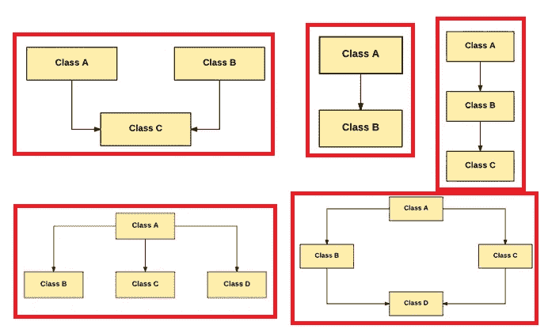
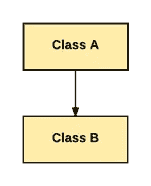
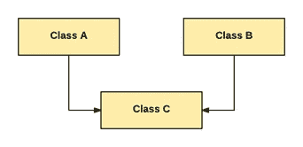
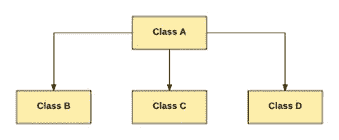
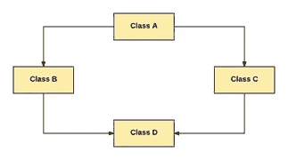

# Python 中的 OOPs 概念

> 原文：<https://pub.towardsai.net/oops-concept-in-python-b5f5833d57db?source=collection_archive---------0----------------------->

## [编程](https://towardsai.net/p/category/programming)

## OOPs 是编写程序的一种高效方式



哎呀，范式。作者的照片

> **简介 **

面向对象编程或称为 OOPs 是一种编程范式，由抽象、封装、继承、模块化和多态等原则组成。OOPs 主要有 5 个概念。使用 OOPs 的概念是编写程序的高效方式。

> ***哎呀的优点***

1.程序的可重用性

2.数据冗余

3.代码易于维护

4.安全性

> ***哎呀的 6 个概念***

1.班级

2.目标

3.数据抽象

4.数据封装

5.遗产

6.多态性

## **对象:**

对象是具有某些特征和行为的实体，可以用来存储函数和值。

**举例**:笔、纸、小费、车、销售等。

**语法**:

```
obj = object_name()
```

**程序示例**:

```
obj1 = pen()print(obj1)
```

## **类:**

一个类定义并共享一个公共模板，行为对象共享公共属性和关系。

**语法**:

```
class class_name : class_content
```

**程序示例**:

```
class stationery :
    pen = “hero”
    def __init__(object, cat, color) :
        object.cat = cat
        object.color = color def description(object) :
        return f”The {object.cat} pen is {object.color} in color”**User code** :obj = stationery(“hero”, “blue”)
print(obj.description())**Output** :The hero pen is blue in color
```

[](/7-beginners-tips-to-help-you-get-better-at-learn-python-33149417b447) [## 帮助你更好地学习 Python 的 7 个初学者技巧

### 成为 python 专家的分步主题

pub.towardsai.net](/7-beginners-tips-to-help-you-get-better-at-learn-python-33149417b447) 

## **数据抽象**

数据抽象是指只显示基本信息，而不显示任何背景细节。

简而言之，它是用来让用户的事情变得不那么复杂。至少有一个抽象函数的类称为抽象类。

**程序示例**:

下面的例子展示了一个抽象类是如何在 python 中实现的。

第一个要求是从 abc 模块导入 ABC 类，这样我们就可以在其中创建抽象方法。

这里，文具是从 abc 类继承的抽象类，来自 ABC 模块。这个 abc 模块是用抽象方法创建的另一个 python 文件，即@abstractmethod。

```
from abc import ABC, abstractmethodclass stationery(ABC) :
    def pen(self) :
        passclass S2(stationery) :
    def pen(self) :
        print(“It is of good quality”)class S3(stationery) :
    def pen(self) :
        print(“ It is of amazing quality”)**User Code** :s = S2()
s.pen()
t = S3()
t.pen()**Output** :It is of good quality
It is of amazing quality
```

## **数据封装:**

数据封装是指将相似的数据打包成一个单元。这也意味着，隐藏有价值的信息，以防止未经授权的用户访问。

**程序示例**:

为了使变量或方法不可访问，使用双下划线作为前缀。

在这里(自我。__type)是受保护的变量，不能由外部类访问。

```
class activity :
    def __init__(self, type, hours)
        self.__type = type
        self.hours = hours def description(self) :
        return f”The boy is {self.__type} for {self.hours} hours**User code** :obj = activity(“running”, 2)
print(obj.description())
print(obj.__type)
print(obj.hours)**Output** :The boy is running for 2 hoursrunning2
```

[](/machine-learning-16c8ccc2c7b8) [## 无监督学习中不同类型的聚类方法

pub.towardsai.net](/machine-learning-16c8ccc2c7b8) 

## **继承**:

子类(子类)从其父类(超类)继承数据的过程称为继承。

**共有 5 种类型的继承**:

1.  **单一继承**:在单一继承中，单一子类(子类)是从单一超类(父类)继承而来的。



作者的照片

**节目示例**:

```
class father :
    def func1(self) :
        print(“This is father’s class”)class daughter(father) :
    def func2(self) :
        print(“This is my daughter’s class”)**User code** :obj =daughter()
obj.func1
obj.func2**Output** :This is father’s classThis is my daughter’s class
```

2.多重继承:在多重继承中，一个子类可以从多个超类中继承。



作者的照片

**程序示例**:

*   考虑 2 类铅笔、油漆。这里，颜色是继承的类。
*   类颜色来自两个类(铅笔和油漆)。

```
class pencil :
    colorname = “ “
    def pencil(self) :
        print(self.pencilname)class paint :
    paintname = “”
    def paint(self) :
        print(self.paintname)class colors(pencil, paint) :
    def stationary(self) :
      print(“Brand name1 :”, self.pencilname)
      print(“Brandname2 :”, self.paintname)**User code** :c = colors()
c.pencilname = “Faber Castle”
c.paintname = “Pelican”
c.stationary()**Output** :Brandname1 : Faber CastleBrandname2 : Pelican
```

3.**多级继承**:在多级继承中，一个新类可以从一个派生类中继承。派生类充当新类的源类。


作者的照片

**程序示例**:

```
class S1 :
    def __init__(self, S1name) :
        self. S1name = S1nameclass S2 :
    def __init__(self, S2name, S1name)
        self.S2name = S2name
        s!.__init__(self, S1name)#derived classclass friend(S2) :
    def __init__(self, friendname, S2name, S1name)
    def print_name(self) :
        print(“Student1 :”, self.S1name)
        print(“Student2 :”, self.S2name)
        print(“Friend name :”, self.friendname)**User code** :s1 = friend(‘Amal’, ‘Jayan’, ‘Parul’)
print(s1.S1name)
s1.print_name()**Output** :Student1 : ParulStudent2 : JayanFriend name : Amal
```

4.**层次继承**:在层次继承中，多个类可以从一个类继承。



作者的照片

**程序示例**:

```
class A :
    def func1(self) :
        print(“This is class A”)class B(A) :
    def func2(self) :
    print(“This is class B”)class C(A) :
    def func3(self) :
    print(“This is class C”)**User code** :obj1 = B()
obj2 = C()obj1.func1()
obj1.func2()obj2.func1()
obj2.func3()**Output** :This is class AThis is class BThis is class AThis is class C
```

5.**混合遗传**:单一遗传和多重遗传的结合称为混合遗传。



作者的照片

**程序示例:**

```
class marks :
    def func1(self) :
        print(“This is marks class”)class S1(marks) :
    def func2(self) :
        print(“This is student 1 marks”)class S2(marks) :
    def func3(self) :
        print(“This is student 2 marks”)class S3(S1,S2) :
    def func4(self) :
        print(“This id student 3 marks”)**User code** :obj = S3()obj.func1()obj.func2()**Output** :This is marks classThis is student 1 marks
```

## **多态性**:

多态是面向对象编程中最重要的概念之一。当一个类的一个对象被一个消息或一个动作处理时，它以不同的方式表现的能力被称为多态。

**程序示例**:

```
class square :
    def description(self) :
        print(“This is a Square”)class rectangle :
    def description(self) :
        print(“This is a Rectangle”)class triangle :
    def description(self) :
        print(“This is a triangle”)**User Code** :s = square()r = rectangle()t = triangle()for shapes in (s,r,t) :shapes.description()**Output** :This is a SquareThis is a RectangleThis is a triangle
```

> ***结论***

OOPs 概念在软件开发项目中非常重要。

我希望你喜欢这篇文章。通过我的 [LinkedIn](https://www.linkedin.com/in/data-scientist-95040a1ab/) 和 [twitter](https://twitter.com/amitprius) 联系我。

# 推荐文章

[1。NLP —零到英雄与 Python](https://medium.com/towards-artificial-intelligence/nlp-zero-to-hero-with-python-2df6fcebff6e?sk=2231d868766e96b13d1e9d7db6064df1)
2。 [Python 数据结构数据类型和对象](https://medium.com/towards-artificial-intelligence/python-data-structures-data-types-and-objects-244d0a86c3cf?sk=42f4b462499f3fc3a160b21e2c94dba6)3 .[Python 中的异常处理概念](/exception-handling-concepts-in-python-4d5116decac3?source=friends_link&sk=a0ed49d9fdeaa67925eac34ecb55ea30)
4。[用 Python 进行主成分分析降维](/principal-component-analysis-in-dimensionality-reduction-with-python-1a613006d531?source=friends_link&sk=3ed0671fdc04ba395dd36478bcea8a55)
5。[用 Python 全面讲解 K-means 聚类](https://medium.com/towards-artificial-intelligence/fully-explained-k-means-clustering-with-python-e7caa573176a?source=friends_link&sk=9c5c613ceb10f2d203712634f3b6fb28)
6。[用 Python](https://medium.com/towards-artificial-intelligence/fully-explained-linear-regression-with-python-fe2b313f32f3?source=friends_link&sk=53c91a2a51347ec2d93f8222c0e06402)
7 全面讲解了线性回归。[用 Python](https://medium.com/towards-artificial-intelligence/fully-explained-logistic-regression-with-python-f4a16413ddcd?source=friends_link&sk=528181f15a44e48ea38fdd9579241a78)
充分解释了 Logistic 回归 8。[concat()、merge()和 join()与 Python](/differences-between-concat-merge-and-join-with-python-1a6541abc08d?source=friends_link&sk=3b37b694fb90db16275059ea752fc16a)
的区别 9。[与 Python 的数据角力—第一部分](/data-wrangling-with-python-part-1-969e3cc81d69?source=friends_link&sk=9c3649cf20f31a5c9ead51c50c89ba0b)
10。[机器学习中的混淆矩阵](https://medium.com/analytics-vidhya/confusion-matrix-in-machine-learning-91b6e2b3f9af?source=friends_link&sk=11c6531da0bab7b504d518d02746d4cc)