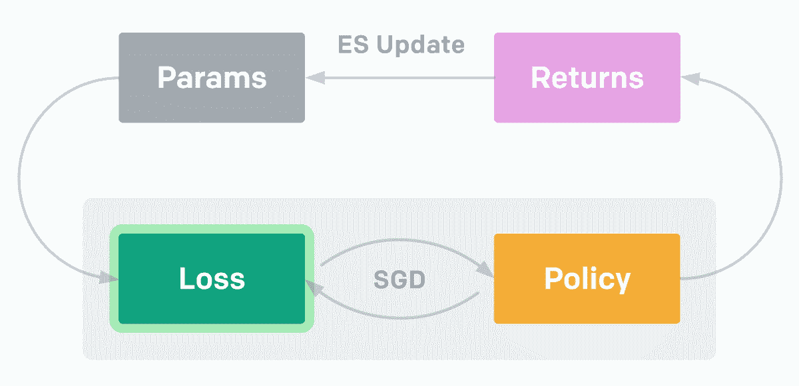
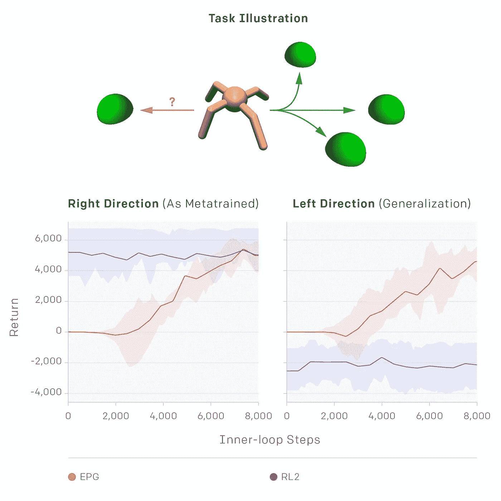

# OpenAI 为强化学习代理带来内省

> 原文：<https://pub.towardsai.net/openai-brings-introspection-to-reinforcement-learning-agents-39cbe4cf2af3?source=collection_archive---------1----------------------->

## [人工智能](https://towardsai.net/p/category/artificial-intelligence)

## 围绕进化策略梯度的研究试图在强化学习模型中重建内省。

来源:[https://janzz . technology/the-rise-of-the-machines-cognitive-computing-disruptive-potential/](https://janzz.technology/the-rise-of-the-machines-cognitive-computing-disruptive-potential/)

> 我最近创办了一份专注于人工智能的教育时事通讯，已经有超过 80，000 名订户。《序列》是一份无废话(意思是没有炒作，没有新闻等)的 ML 导向时事通讯，需要 5 分钟阅读。目标是让你与机器学习项目、研究论文和概念保持同步。请通过订阅以下内容来尝试一下:

 [## 序列

### 订阅人工智能世界中最相关的项目和研究论文。受到 85，000 多人的信任…

thesequence.substack.com](https://thesequence.substack.com/) 

自省是人类区别于其他物种的神奇认知能力之一。从概念上讲，内省可以被定义为检查有意识的思想和感觉的能力。自省在人类如何学习中也起着关键作用。你有没有尝试过自学一项新技能，比如学习一门新语言？即使没有任何外部反馈，你也可以快速评估自己是否在词汇或发音等方面取得了进步。如果我们可以将内省的一些原则应用到人工智能(AI)学科，如强化学习(RL)，这不是很好吗？

内省的魔力来自于这样一个事实，即人类可以通过生物进化过程，从其他任务的先前经验中获得形状非常好的[内部奖励函数](http://www-anw.cs.umass.edu/legacy/pubs/2009/singh_l_b_09.pdf)。该模型与 RL 代理形成鲜明对比，RL 代理的基本编码是从零开始，主要依靠外部反馈来完成任何学习任务。毫不奇怪，大多数 RL 模型比人类花费更多的时间来学习类似的任务。最近，来自 OpenAI 的研究人员发表了一篇新论文，提出了一种解决这一挑战的方法，通过创建 RL 模型，这些模型知道在一项新任务上取得进展意味着什么，通过过去在类似任务上取得进展的经验。

题为[进化的政策梯度](https://storage.googleapis.com/epg-blog-data/epg_2.pdf) (EPG)的 OpenAI 研究论文介绍了新的元学习技术，该技术基于限定学习过程的损失函数的概念。当在 RL 模型中使用时，EPG 方法不通过记忆的行为显式地编码知识，而是通过学习的损失函数使用隐含的机制。EPG 的最终目标是 RL 代理可以使用这个损失函数来学习一个新的任务。

在算法上，EPG 由两个优化循环组成。在内部循环中，代理从零开始学习解决从一系列任务中抽取的特定任务。任务系列可以是“将夹持器移动到目标位置[x，y]”，并且该系列中的一个特定任务可以是“将夹持器移动到位置[50，100]”。内环使用[随机梯度下降](https://en.wikipedia.org/wiki/Stochastic_gradient_descent) (SGD)针对外环提出的损失函数优化代理策略。外环评估内环学习后实现的回报，并使用[进化策略](https://blog.openai.com/evolution-strategies/) (ES)调整损失函数的参数，以提出将导致更高回报的新损失。

**图片来源:OpenAI**

从元学习的角度来看，损失函数由代理人最近历史的时间卷积组成，这可以带来有趣的附带好处。例如，通过检查代理的历史，损失可以激励期望的扩展行为，如探索。此外，该损失可以执行一种形式的系统识别，推断环境参数并根据这些参数调整它如何引导代理(例如，通过调整代理的有效学习速率)。

元学习策略在 RL 领域并不新鲜，但是与传统方法相比，EPG 技术确实带来了一些切实的好处。EPG 方法最明显的优点之一是它避免了 RL 模型的局部极小值的致命弱点。由于 RL 方法针对短期回报进行优化，而不是考虑整个学习过程，因此它们可能会陷入局部最小值，并且无法探索整个搜索空间。EPG 方法允许 RL 模型针对真实目标进行优化，即最终训练的政策绩效，而不是短期回报。在最初的测试中，EPG 似乎通过允许损失函数适应环境和代理历史来改进标准 RL 算法，从而导致更快的学习和在没有外部奖励的情况下学习的潜力。

在 OpenAI 研究人员为了测试 EPG 的泛化能力而进行的有趣测试中，有一个实验专注于使用 EPG 损失来有效地让“蚂蚁”走到竞技场右半部分随机定位的目标。在对损失函数进行初步计算后，实验给了蚂蚁一个新的目标，这次是在竞技场的左半部分。令人惊讶的是，蚂蚁学会了向左走！这是他们的学习曲线(图上的红线)。

**图片来源:OpenAI**

与传统的元学习模型相比，EPG 模型实现的知识概括类型非常令人鼓舞，因为它不依赖于训练分布。OpenAI 团队用 Github 上提供的 EPG [的初始实现补充了研究论文。EPG 的实现基于 Python 和 Anaconda，这使得它可以相对简单地与其他深度学习框架一起使用。](https://github.com/openai/EPG)