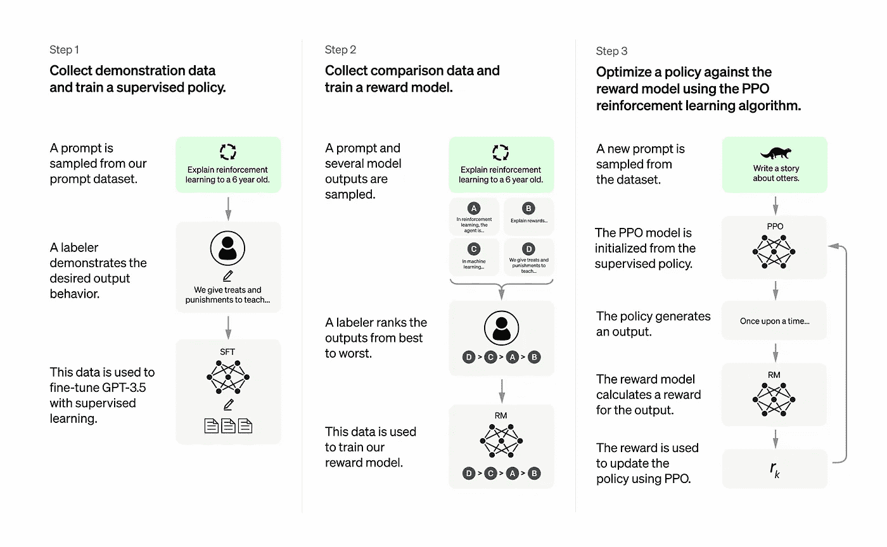

# ChatGPT — OpenAI 的全新对话模型！！

> 原文：<https://pub.towardsai.net/openai-debuts-chatgpt-50dd611278a4?source=collection_archive---------0----------------------->


演职员表:[https://unsplash.com/@etienneblg](https://unsplash.com/@etienneblg)

周一，penAI 发布了 GPT-3.5 系列“达芬奇-003”，大型语言模型(LLM)。这些模型是使用带有人类反馈的强化学习(RLHF)设计构建的。这款车型建立在 [*指令*](https://openai.com/blog/instruction-following/) 之上。RLHF 在 002 的基础上朝着正确的方向迈出了一步，002 在人类书写的文本上使用监督微调。在我之前的文章中读到过。

[](https://ithinkbot.com/openai-just-released-gpt-3-text-davinci-003-i-compared-it-with-002-the-results-are-impressive-dced9aed0cba) [## OpenAI 刚刚发布了 GPT-3 文本-达芬奇-003，我把它和 002 进行了对比。结果令人印象深刻！

### OpenAI GPT-3 文本-达芬奇-003 产生更好的质量结果(写作质量，格式，语法，和被…

ithinkbot.com](https://ithinkbot.com/openai-just-released-gpt-3-text-davinci-003-i-compared-it-with-002-the-results-are-impressive-dced9aed0cba) 

本周三，OpenAI 还发布了 [*ChatGPT*](https://openai.com/blog/chatgpt/) 。这个模型被训练成以对话的方式进行交互。根据 OpenAI 上的描述，ChatGPT 是 InstructGPT 的兄弟，它被训练成遵循提示中的指令，并提供详细的响应。

这是 open ai LLMs 迭代开发的下一步。随着每个版本的发布，OpenAI 越来越接近传闻中的 GPT-4 模型。随着每一次迭代，许多经验教训被吸取，无论这些是文本、codex、InstructGPT 还是 ChatGPT 模型。这些型号的性能和安全性都在提高。通过使用人为调节的 RLHF 步骤，已经实现了有害和虚假输出的实质性减少。

要了解更多关于 GPT-4 的信息，请查看我以前的文章。

[](/what-is-gpt-4-and-when-9f5073f25a6d) [## 什么是 GPT-4(什么时候？)

### GPT-4 是一个自然语言处理模型，由 openAI 作为 GPT-3 的继承者开发

pub.towardsai.net](/what-is-gpt-4-and-when-9f5073f25a6d) 

# 培训方法

如前所述，使用 RLHF(与 InstructGPT 相同的方法)训练模型。区别在于数据是如何设置用于训练的(以及如何收集的)。初始模型使用监督微调进行训练(像 davinci-002 模型)。模型生成了响应(多个)。这些回答与人类训练员(因此 RLHF)共享以对它们进行排序。这些等级用于奖励或惩罚加固设计。



来源: [openai](https://openai.com/blog/chatgpt/)

# 限制

ChatGPT 自我认定的局限性如下。

1.  听起来合理但不正确的答案:a)在培训的强化学习(RL)阶段，没有真实的来源来解决这个问题。b)训练模型要更加谨慎才能错误拒绝回答(麻烦提示的误报)。c)监督训练可能误导/偏向模型倾向于知道理想的答案，而不是模型生成一组随机的响应，并且只有人类评论者选择好的/高排名的响应
2.  ChatGPT 对措辞很敏感。有时，模型最终对一个短语没有响应，但对问题/短语稍加调整，它最终会正确回答。
3.  培训师更喜欢看起来更全面的长答案，这导致他们偏向于冗长的回答和过度使用某些短语。
4.  如果最初的提示或问题不明确，则模型不适合要求澄清。
5.  已经实现了一个安全层，通过仲裁 API 来拒绝不适当的请求。然而，我们仍然可以期待假阴性和阳性反应。

[](https://ithinkbot.com/human-vs-gpt-methods-to-watermark-gpt-models-e23aefc63db8) [## OpenAI 正在给 GPT 加水印:不再抄袭

### 知识产权保护通常被称为人工智能模型的“水印”，对人工智能的未来用例至关重要。这是被…

ithinkbot.com](https://ithinkbot.com/human-vs-gpt-methods-to-watermark-gpt-models-e23aefc63db8) 

学分:OpenAI.com

# ChatGPT 的例子:帮我剥一个香蕉！

**用户**:剥香蕉最好的方法是什么？它有钾吗？

**ChatGPT** :剥香蕉有几种方法，最佳方法可能因个人喜好而异。有些人喜欢拿着香蕉靠近茎，轻轻地把皮从水果上撕下来，而另一些人喜欢用刀子切掉香蕉的两端，然后沿着皮的长度切开。

至于钾的问题，香蕉是这种必需矿物质的良好来源。钾对于维持健康的血压和心脏功能，以及支持健康的肌肉和神经功能非常重要。一根中等大小的香蕉含钾约 422 毫克，约为每日推荐值的 12%。所以，是的，香蕉确实含有钾。

用户:但是果皮里有吗？

虽然香蕉含有钾，但大部分钾存在于果肉中，而不是果皮中。香蕉皮主要由纤维组织构成，含有极少的水果可食部分的营养成分。因此，尽管香蕉皮中可能含有钾，但这并不是这种矿物质的主要来源。

[](https://ithinkbot.com/generative-ai-for-healthcare-privacy-22994a4ec8c4) [## 医疗保健隐私的生成人工智能

### Syntegra 使用基因人工智能创建准确、隐私保护的合成数据

ithinkbot.com](https://ithinkbot.com/generative-ai-for-healthcare-privacy-22994a4ec8c4) 

# ChatGPT 的例子:什么是散景，假的！

**用户**:散景是怎么工作的？我能假装吗？

**ChatGPT:** 散景是一个用来描述照片失焦区域的美学质量的术语。它通常以柔和、模糊的区域为特征，将观众的注意力吸引到照片的焦点主体上。这个词来自日语单词“boke”，意思是“模糊”或“阴霾”。

散景是由相机中光圈和镜头的相互作用产生的。光圈是镜头上的一个可调开口，控制进入相机的光量。较大的光圈(较小的光圈数)允许更多的光通过，这就产生了较浅的景深。这意味着只有很小范围的距离会被聚焦，而在这个范围之外的物体会被模糊。

一般来说，光圈更圆的镜头会产生更平滑、更令人愉悦的散景。你可以通过使用编辑软件模糊照片的失焦区域，在一定程度上伪造散景，但它不会与镜头创建的自然散景相同。

# ChatGPT 的例子:想想想法！

**用户:**如何提高思路的清晰度？这到底是什么意思？

**ChatGPT:** 提高思维的清晰度可以帮助你更好地理解自己的想法，并更有效地与他人交流。有几个策略可以让你的思路更加清晰，包括以下几点:

1.  在说话或写作之前，花点时间组织你的想法。这可以帮助你以清晰的逻辑顺序表达你的想法，让别人更容易理解。
2.  使用明确具体的语言，而不是模糊或抽象的术语。这有助于让你的想法更具体，更容易理解。
3.  避免使用复杂或技术性的语言，除非你确定你的听众能理解。使用简单明了的语言有助于让你的想法更容易理解。
4.  用例子和插图来帮助阐明你的想法。这可以让其他人更容易理解你的观点，并了解它们与现实世界的关系。
5.  花时间仔细倾听他人，并提出问题来澄清任何不清楚的地方。这有助于确保你和你的听众达成共识。

总的来说，提高思维的清晰度可以帮助你更有效地交流，更好地理解自己的想法。它还可以让你作为一个个体更容易学习和成长。

**用户:**但是这是什么意思呢？

拥有清晰的思想意味着拥有定义明确且易于理解的想法和概念。这可以包括对自己的想法有一个清晰的理解，以及能够有效地将这些想法传达给别人。拥有清晰的思想还可以包括能够以逻辑和连贯的方式组织自己的思想，并使用特定和具体的语言来表达自己。总的来说，有清晰的思想意味着能够有效地思考和沟通，更好地了解你周围的世界。

# ChatGPT 示例:**修复代码中的错误！**

**用户:**这段代码没有按照我的预期运行——我该如何修复它？

```
resultWorkerErr := make(chan error)
defer close(resultWorkerErr)
go func() {
	defer cancel()
	resultWorkerErr <- b.resultWorker(ctx)
}()
err := b.worker(ctx)
cancel()
if err == nil {
	return <-resultWorkerErr
}
return multierror.Append(err, <-resultWorkerErr)
```

**ChatGPT** :没有更多的上下文，很难说代码有什么问题。你能提供更多关于代码应该做什么和什么没有按预期工作的信息吗？此外，这是整个代码还是只是其中的一部分？

**用户:只是一部分——错误永远不会出现。我觉得频道有问题**

没有更多关于代码应该做什么以及执行时会发生什么的信息，很难说。您提供的代码的一个潜在问题是`resultWorkerErr`通道从未关闭，这意味着如果`resultWorkerErr`通道从未被写入，代码可能会挂起。如果`b.resultWorker`从来没有返回一个错误，或者在它有机会返回一个错误之前就被取消了，就会发生这种情况。

要解决这个问题，您可以在写入后关闭`resultWorkerErr`通道。例如，您可以在通道上发送错误的代码行之后添加以下代码行:

```
close(resultworkerErr)
```

这将确保`resultWorkerErr`通道总是关闭的，即使`b.resultWorker`从不返回错误。同样，在没有关于您所看到的问题的更多信息的情况下，很难说这是否是您所遇到的问题。你能提供更多关于运行代码时发生了什么的细节吗？

🔔P **请跟随我和 *S*** [***订阅***](https://ithinkbot.com/subscribe) **🔔**

**🔔来*支持我*** [***成为会员***](https://ithinkbot.com/membership) **🔔**

[](https://ithinkbot.com/generative-ai-for-healthcare-privacy-22994a4ec8c4) [## 医疗保健隐私的生成人工智能

### Syntegra 使用基因人工智能创建准确、隐私保护的合成数据

ithinkbot.com](https://ithinkbot.com/generative-ai-for-healthcare-privacy-22994a4ec8c4) [](/the-art-of-negotiation-cicero-ai-6e04354fe990) [## 谈判的艺术:西塞罗·艾

### 西塞罗·艾在外交的游戏中比人类更能谈判。就像深蓝代表国际象棋，五号代表…

pub.towardsai.net](/the-art-of-negotiation-cicero-ai-6e04354fe990) [](https://ithinkbot.com/worlds-most-expensive-drug-3-5-million-1e46b5abf74f) [## 世界上最贵的药物 350 万美元！

### 药品 Hemgenix 归 CSL Behring 所有。这是治疗 b 型血友病的一剂良药，治疗费用为 3.5 美元…

ithinkbot.com](https://ithinkbot.com/worlds-most-expensive-drug-3-5-million-1e46b5abf74f) [](https://ithinkbot.com/microsoft-github-copilot-class-action-lawsuit-17062e872ca2) [## 微软/GitHub CoPilot 集体诉讼

### 2022 年 6 月，微软发布了 Github 的 AI 辅助编码解决方案。副驾驶应该帮助产生…

ithinkbot.com](https://ithinkbot.com/microsoft-github-copilot-class-action-lawsuit-17062e872ca2) [](/leadership-in-ai-is-your-leadership-fit-for-datascience-d0e9296be2d6) [## 人工智能中的领导力:你的领导力适合数据科学吗？

### 可能已经转变为数据科学领导的非技术人员领导通常不熟悉…

pub.towardsai.net](/leadership-in-ai-is-your-leadership-fit-for-datascience-d0e9296be2d6) [](https://ithinkbot.com/metas-galactica-shuts-down-in-48-hrs-76178054f41a) [## Meta 的卡拉狄加将在 48 小时后关闭！

### 以下是关于卡拉狄加的论文摘要 NLP 被认为是一种新的开源大型语言…

ithinkbot.com](https://ithinkbot.com/metas-galactica-shuts-down-in-48-hrs-76178054f41a)