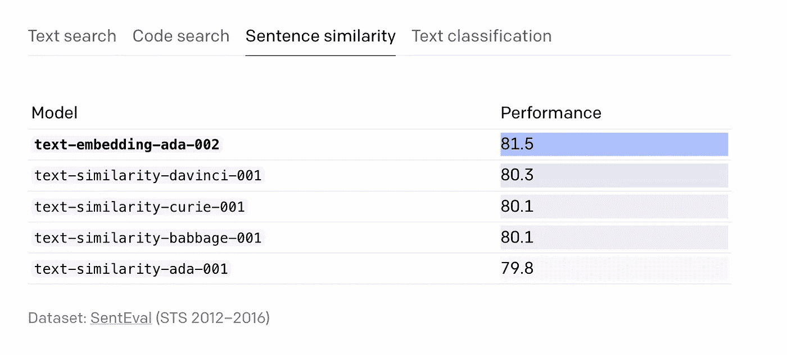
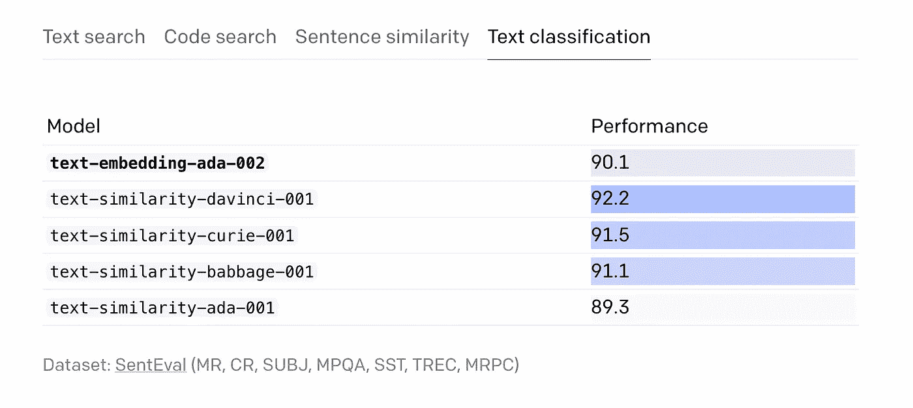
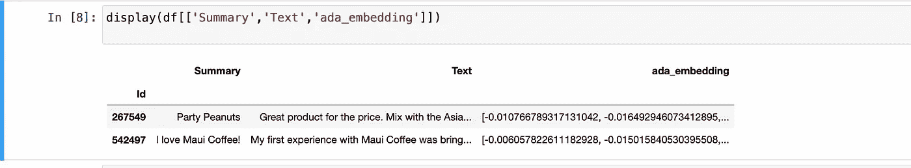
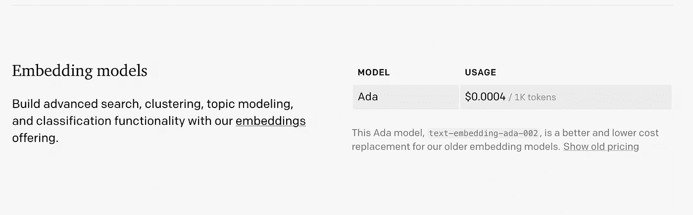

# OpenAI 发布 GPT-3 嵌入模型:文本嵌入-ada-002

> 原文：<https://pub.towardsai.net/openai-releases-embeddings-ai-3380dacfa3c5?source=collection_archive---------0----------------------->

## *它功能强大、更便宜、更灵活！*

# 你必须知道的事(TLDR):

OpenAI 刚刚公布了**文本嵌入-ada-002** 。这个模型取代了以前 5 个性能最好的嵌入模型，现在可以通过嵌入 API 获得！人工智能的终点将是 `/embeddings`

```
curl https://api.openai.com/v1/embeddings \
  -X POST \
  -H "Authorization: Bearer YOUR_API_KEY" \
  -H "Content-Type: application/json" \
  -d '{"input": "The food was delicious and the waiter...",
       "model": "text-embedding-ada-002"}'
```

回应如下图所示—

```
{
  "object": "list",
  "data": [
    {
      "object": "embedding",
      "embedding": [
        0.0023064255,
        -0.009327292,
        .... (1056 floats total for ada)
        -0.0028842222,
      ],
      "index": 0
    }
  ],
  "model": "text-embedding-ada-002",
  "usage": {
    "prompt_tokens": 8,
    "total_tokens": 8
  }
}
```

## 什么是嵌入？

嵌入是一条信息的数字表示，例如文本、文档、图像、音频等。这种表示抓住了被嵌入内容的语义，使得它对于许多行业应用程序来说是健壮的。点击 *了解更多 [*。*](https://huggingface.co/blog/getting-started-with-embeddings)*

# OpenAI 嵌入的用例是什么？

OpenAI 的文本嵌入测量文本串的相关性。嵌入最常用于:

*   **搜索**(根据与查询字符串的相关性对结果进行排序)
*   **聚类**(文本字符串按相似度分组)
*   **建议**(建议带有相关文本字符串的项目)
*   **异常检测**(识别相关性很小的异常值)
*   **多样性测量**(分析相似性分布)
*   **分类**(文本字符串按其最相似的标签分类)

阅读更多关于大家最喜欢的 chatGPT 版本的信息

[](/what-is-gpt-4-and-when-9f5073f25a6d) [## 什么是 GPT-4(什么时候？)

### GPT-4 是一个自然语言处理模型，由 openAI 作为 GPT-3 的继承者开发

pub.towardsai.net](/what-is-gpt-4-and-when-9f5073f25a6d) 

## 新型号性能更好，更便宜，更小！！

`text-embedding-ada-002`在文本搜索、代码搜索和句子相似性任务上优于所有旧的嵌入模型，并在文本分类上获得相当的性能。对于每个任务类别，我们在[旧嵌入](https://arxiv.org/abs/2201.10005)中使用的数据集上评估模型。

OpenAI 通过合并五个独立的模型，极大地简化了**[**/嵌入**](https://beta.openai.com/docs/api-reference/embeddings) 端点的接口**

1.  **文本相似度**
2.  **文本搜索查询**
3.  **文本搜索文档**
4.  **代码-搜索-文本**
5.  **代码-搜索-代码**

**这些模型被合并成一个新的模型。在文本搜索、句子相似性和代码搜索基准的不同集合上，这种单一表示比我们以前的嵌入模型表现得更好。**

## **新款车型有哪些变化？**

****更长的上下文:**新模型的上下文长度增加了四倍，从 2048 增加到 8192，使得处理长文档更加方便。**

****较小的嵌入尺寸。**新嵌入只有 **1536 维**，**是** `**davinci-001**`嵌入的八分之一，使得新嵌入在处理矢量数据库时更具成本效益。**

****降价。**与相同尺寸的旧型号相比，我们将新嵌入型号的价格降低了 90%。新型号实现了比旧达芬奇型号更好或相似的性能，而价格却低了 99.8%。**

****

**照片由 [micheile dot com](https://unsplash.com/@micheile?utm_source=medium&utm_medium=referral) 在 [Unsplash](https://unsplash.com?utm_source=medium&utm_medium=referral) 上拍摄**

**总的来说，**新的嵌入模型对于自然语言处理和代码任务来说是一个更强大的工具，而且价格更低**。我们很高兴看到我们的客户将如何使用它来创建各自领域中更强大的应用程序。**

## **但是性能怎么样？**

**简单地说，更好，但我会让数字说话。**

****对于文本搜索任务:****

****

**来源:OpenAI 网站**

****对于代码搜索任务:****

****

**来源:OpenAI 网站**

****句子相似度:****

****

**来源:OpenAI 网站**

****文本分类:****

****

**来源:OpenAI 网站**

## **有哪些局限性？**

1.  **新的`text-embedding-ada-002`型号在**sente val**线性探测分类基准上的表现并不比`text-similarity-davinci-001`好。**
2.  **对于需要在用于分类预测的嵌入向量之上训练轻量级线性层的任务，我们建议将新模型与`text-similarity-davinci-001`进行比较，并选择给出最佳性能的模型。**

**检查嵌入文档中的[限制&风险](https://beta.openai.com/docs/guides/embeddings/limitations-risks)部分，了解我们嵌入模型的一般限制。**

## **我能试运行它吗？**

**当然可以。下面是运行嵌入 AI 的样本管道的代码。**

**首先，在您的 python 环境中安装 OpenAI 库。**

```
pip install --upgrade openai
```

**这个库需要配置你账户的密钥，这个密钥可以在[网站](https://beta.openai.com/account/api-keys)上找到。在下面的代码中，密钥由字符串`“sk-…”`提供给`openai.api_key`的参数**

****

## **这要花多少钱？**

**这种型号的成本是所有先前型号中最低的，仅为 0.0004 美元/千片令牌。这一成本反映了 ADA，但考虑到去年的价格预测，它可能需要 0.1 美元/千片以上的令牌。此外，至少可以说，性能价格比是不可靠的。请查看 Neil 的博客文章，了解更多关于 OpenAI *嵌入的 [*Neil Reimer。*](https://medium.com/@nils_reimers/openai-gpt-3-text-embeddings-really-a-new-state-of-the-art-in-dense-text-embeddings-6571fe3ec9d9)***

****

**来源:OpenAI 网站**

****

**照片由[罗伯特·安德森](https://unsplash.com/@robanderson72?utm_source=medium&utm_medium=referral)在 [Unsplash](https://unsplash.com?utm_source=medium&utm_medium=referral) 上拍摄**

**支持我🔔*|***追随|*** [***订阅***](https://ithinkbot.com/subscribe)***|***[***成为会员***](https://ithinkbot.com/membership) **🔔*****

***检查我的其他作品—***

***[](https://ithinkbot.com/github-copilot-hit-with-2nd-lawsuit-ed537c0b2c9a) [## GitHub CoPilot 遭遇第二起诉讼

### 第二次集体诉讼已于 11 月 10 日提交

ithinkbot.com](https://ithinkbot.com/github-copilot-hit-with-2nd-lawsuit-ed537c0b2c9a) [](/the-art-of-negotiation-cicero-ai-6e04354fe990) [## 谈判的艺术:西塞罗·艾

### 西塞罗·艾在外交的游戏中比人类更能谈判。就像深蓝代表国际象棋，五号代表…

pub.towardsai.net](/the-art-of-negotiation-cicero-ai-6e04354fe990) [](https://ithinkbot.com/human-vs-gpt-methods-to-watermark-gpt-models-e23aefc63db8) [## OpenAI 正在给 GPT 加水印:不再抄袭

### 知识产权保护通常被称为人工智能模型的“水印”，对于人工智能的未来用例至关重要。这是被…

ithinkbot.com](https://ithinkbot.com/human-vs-gpt-methods-to-watermark-gpt-models-e23aefc63db8) [](https://ithinkbot.com/openai-just-released-gpt-3-text-davinci-003-i-compared-it-with-002-the-results-are-impressive-dced9aed0cba) [## OpenAI 刚刚发布了 GPT-3 文本-达芬奇-003，我把它和 002 进行了对比。结果令人印象深刻！

### OpenAI GPT-3 文本-达芬奇-003 产生更好的质量结果(写作质量，格式，语法，和被…

ithinkbot.com](https://ithinkbot.com/openai-just-released-gpt-3-text-davinci-003-i-compared-it-with-002-the-results-are-impressive-dced9aed0cba)***