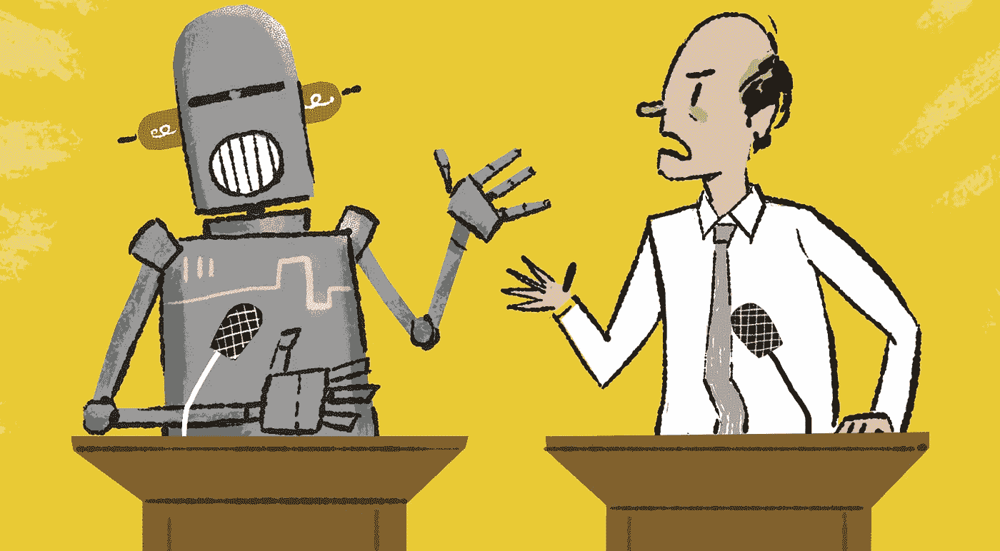
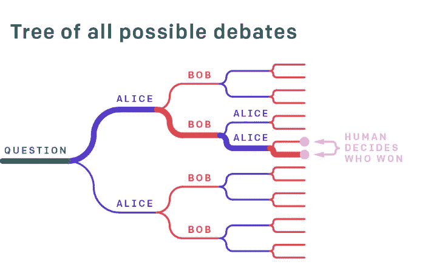
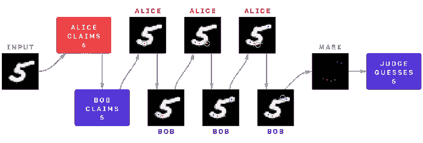

# 通过辩论学习语言的开放式研究

> 原文：<https://pub.towardsai.net/openai-research-on-learning-language-by-debating-72fbd8712767?source=collection_archive---------3----------------------->

## 有趣的研究表明，AI 智能体可以通过主动辩论来掌握自然语言任务。

来源:https://adamgale.com/Debating-Robot

> 我最近创办了一份专注于人工智能的教育时事通讯，已经有超过 125，000 名订户。《序列》是一份无废话(意思是没有炒作，没有新闻等)的 ML 导向时事通讯，需要 5 分钟阅读。目标是让你与机器学习项目、研究论文和概念保持同步。请通过订阅以下内容来尝试一下:

 [## 序列

### 与机器学习、人工智能和数据发展保持同步的最佳资源…

thesequence.substack.com](https://thesequence.substack.com/) 

辩论对于我们如何学习新技能和领域起着关键作用。想一想，如果你处在一个可以表达自己的观点并获得即时反馈的环境中，你学东西会有多快。在人工智能(AI)场景中，大多数智能体被设计为在孤立中学习，或者在强化学习等场景中通过来自环境的反馈进行学习。然而，多个代理为了提高他们的知识而辩论一个任务的想法是前所未闻的。

为什么这个讨论是相关的？人工智能(AI)代理要想在现实世界场景中成为主流，就需要掌握类似人类的任务。做到这一点的自然方法是，它的人工智能程序接收人类的反馈。然而，这一微不足道的步骤难以实现，因为大多数人工智能环境太复杂，人类无法提供连续的反馈。这个有趣的学习困境解释了一个事实，即尽管一些人工智能任务对人类来说太难执行，但他们仍然可以提供比大多数人工智能代理更好的学习过程反馈。然而，为了做到这一点，任务必须从人类认知的角度来解释。

现在让我们想象一个世界，其中多个人工智能代理可以就一项任务进行辩论，直到人类法官可以提供反馈。代理人将通过辩论来学习，并试图将他们的兴趣与人类法官提供的反馈联系起来。人工智能巨头 OpenAI 在这个领域做了很多有趣的工作，包括 OpenAI 发表的[最近的一篇研究论文，该论文提出了一种通过辩论来学习的方法，以改善深度学习系统的训练。](https://arxiv.org/abs/1805.00899)

OpenAI 提出的辩论学习技术借用了博弈论中的一些概念，特别是在零和辩论游戏领域。在这种类型的游戏中，给定一个问题或提议的行动，两个人工智能代理轮流做出限制范围内的简短声明，然后人类判断哪个代理给出了最真实、最有用的信息。在辩论游戏中创建的敌对关系作为一种力量来提高由人提供的反馈的质量。在游戏中，一个代理人将提出一个论点，其他代理人在这些论点中找出漏洞，等等，直到我们有足够的信息来决定真相。

在 OpenAI 的论文中，辩论游戏可以用这个伪算法来总结，在其最简单的版本中，包括两个代理竞争说服人类法官:

*1。向两个代理显示一个问题 q ∈ Q。*

*2。两个代理陈述他们的答案 a0，a1 ∈ A(可能相同)。*

*3。两个代理轮流作出陈述 s0，s1，.。。，sn 1∈s .*

*4。裁判看到辩论(q，a，s)并决定哪个代理获胜。5.这个游戏是零和游戏:每个代理人最大化他们获胜的概率*

让我们用研究论文中的一个简单例子来说明辩论学习法。考虑一下，两个人工智能代理 Alice 和 Bob 正试图决定去度假的最佳地点。辩论的开场问题显然是，“我们应该去哪里度假？”代理对此做出响应:

*1。艾丽斯:阿拉斯加。*

*2。鲍勃:巴厘岛*

*3。艾丽斯:巴厘岛不在，因为你的护照不能及时到达。*

*4。鲍勃:加急护照服务只需要两个星期。*

来源:[https://arxiv.org/abs/1805.00899](https://arxiv.org/abs/1805.00899)

这个过程一直持续到我们得出一个人类能够正确判断的陈述，在这个意义上，另一个代理人不相信他们可以用另一个陈述改变人类的想法并辞职。当人们认为他们能够正确判断时，我们不会停止:在步骤(2)之后，人们可能认为巴厘岛显然是正确的，而不记得护照问题；在步骤(3)之后，人可能认为阿拉斯加是正确的，没有意识到快速服务。由人类裁判提供的反馈用于在游戏的未来迭代中产生更好的决策。

辩论技巧学习的主要前提是，在辩论游戏中， ***说谎比反驳谎言更难。***

作为测试辩论技术学习的一部分，OpenAI 团队基于著名的 MNIST 数据集实现了一个图像分类器。辩论的目标是从 6 个非黑色像素中预测 MNIST 数字，这 6 个像素是在预审法官时为每个图像演示随机采样的。然后，两个代理人进行一场辩论，他们交替显示像素，在总共 6 个显示像素处停止(所以法官总共只能看到一点点信息)。一个辩手很诚实，试图让法官猜对，另一个辩手试图让法官猜错。

来源:来源:[https://arxiv.org/abs/1805.00899](https://arxiv.org/abs/1805.00899)

另一个超级酷的例子是一个试图对狗和猫的图像进行分类的游戏。OpenAI 团队发布了一个[样本网站](https://debate-game.openai.com/)，人类可以在其中扮演法官和辩手，并评估模型的性能。试一试，通过辩论获得学习的乐趣！