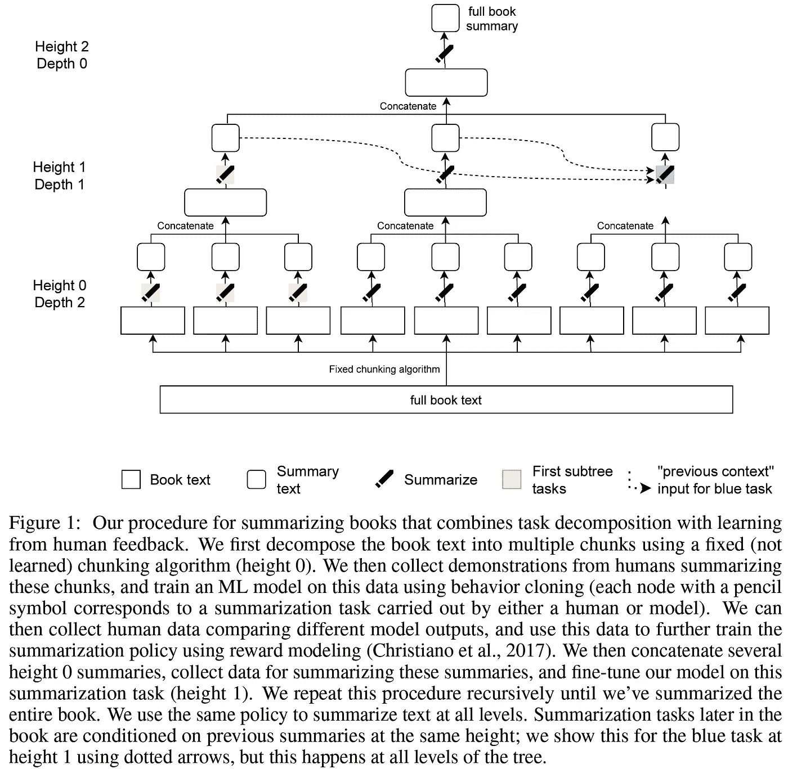

# OpenAI 在图书摘要任务上投入资源(论文综述/解释)

> 原文：<https://pub.towardsai.net/openai-threw-resources-on-book-summarization-task-paper-review-explained-70a7c755fb56?source=collection_archive---------1----------------------->

## [自然语言处理](https://towardsai.net/p/category/nlp)

解释“用人类反馈递归总结书籍”这篇论文及其有效性。

由[miko aj](https://unsplash.com/@qmikola?utm_source=medium&utm_medium=referral)在 [Unsplash](https://unsplash.com?utm_source=medium&utm_medium=referral) 上拍摄的照片

你可能熟悉 OpenAI 的 GPT 家族模型和他们的第三代(GPT-3)具有 1740 亿个参数的预训练网络。众所周知，与(当时)其他研究相比，他们发表了大量预先训练好的模型。他们最新的论文专注于微调他们最新的文本摘要模型。先看看效果如何，更重要的是效果如何？

图一。摘自[1]

这篇论文[1]大量引用了 OpenAI 之前的一项研究，名为“从人类反馈中学习总结”[2]。他们似乎试图通过在网络中添加一个循环方案来处理长文本，从而扩展这项研究。他们使用**任务分解**的思想将大序列分解成更小的序列以形成一棵树，其中叶节点(高度 0)是来自书的块，根节点(高度 2)将是我们的最终摘要，如图 1 所示。高度为 0 的每个块将被汇总(由模型或人汇总)、连接并传递到下一个高度，在下一个高度，相同的过程发生以生成汇总的**汇总，直到达到最终高度(例如，在这种情况下的高度 2)。该论文提到，叶节点(高度 0)通常由书中的 600 个标记组成，10-13 个摘要在高度 1 处连接，而当我们在树中更高时，连接的摘要的数量可以减少到 2 个。此外，还有**前一个上下文**的概念，它发生在高度> 0 处，并从与生成下一个摘要的上下文相同的高度追加先前生成的摘要。(图 1 中颜色为蓝色)论文中的解释有点模糊。不过，我的理解是，只要不超过模型的输入限制，它会在每个高度和路径上发生。**

使用任务分解方法有两个好处:1)模型在每个节点中执行相同的任务，这使得能够共享模型。2)人类将更容易对小块而不是整本书进行评估和反馈。这就把我们带到了论文的**人类反馈**部分。

图二。摘自[2]

人工反馈步骤(如论文中所述)“严格遵循[2]中的程序”，它由图 2 所示的三个步骤组成。它基本上意味着从人类标签员那里收集数据，以训练一个奖励模型，在训练时用来模仿人类的偏好。同样，解释并不简单，但似乎他们只使用第一个子树(在图 1 中用黄色突出显示)来进行行为克隆。

# 结果和讨论

他们将他们提出的架构与 T5 进行了比较，结果显示它可以将 ROUGE 得分全面提高 3-4 分。很难超越 Oracle 的提取基准，但这甚至不是一个公平的比较。(Abstractive vs. Extractive)让我们更深入地看看结果。

图 3。该模型的结果取自[1]

看到结果后，我想到的第一个问题是:将一个 1750 亿参数的模型与一个 110 亿参数的模型进行比较有意义吗？毫无疑问，如果你使用 16 倍大的模型，分数会提高！如果你仔细想想，考虑到投入了多少资源，3-4 分可能并不令人印象深刻。

当你看到论文中没有有意义的消融研究时，就有点令人怀疑了！是的，有一个表格比较了不同的训练策略。但是，我们怎么知道提出的方法实际上更好呢！？最初的 GPT-3[3]论文没有提出任何总结基准！该模型甚至没有公开供我们评估！如果单独使用 GPT-3 并将文章分成几块会更好呢？

现在，让我们看看这篇论文的两个局限性:[1]

*   **缺乏连贯性:**引入 512 令牌输入限制的 BERT [4]后，这是一个众所周知的问题。每个人都试图将序列分割成 512 个块，并分别输入到模型中。自然，生成的摘要根本不连贯。因此，经常计划无助于解决这个问题。
*   **任务分解可能会从根本上限制**:这个只是搞笑！当单词在文本中相距很远时，该算法无法找到它们之间的联系。嗯，处理长序列的主要问题仍然存在！

此外，OpenAI 似乎也对他们的实验有些怀疑。令人惊讶的是，他们甚至在他们的[博客文章](https://openai.com/blog/summarizing-books/)中使用了不同的标题和抽象概念【与论文相比】，专注于他们一年前发表的上一篇论文中提出的人类反馈方面，而不是当前论文的新颖性:**是递归的**！

# 结论

这篇论文提出了一个可能行得通的新想法！但是，没有足够的证据支持它。请记住，我们甚至不确定是**递归方案**还是**人类反馈**增加了分数，或者只是更高的参数计数。当现实中仍有许多未解的问题时，看到对这篇论文的大肆宣传有点令人羞愧。

> 我每周给 NLP 的书呆子发一份时事通讯。如果您想了解自然语言处理的最新发展，可以考虑订阅。
> [阅读更多，订阅](https://nlpiation.github.io/) —加入酷孩子俱乐部，立即报名！

# 参考

[1]吴，j .，欧阳，l .，齐格勒，D. M .，斯蒂农，n .，洛，r .，j .，&克里斯蒂亚诺，P. (2021)。递归总结带有人类反馈的书籍。 *arXiv 预印本 arXiv:2109.10862* 。
【2】stien non，n .，欧阳，l .，吴，j .，齐格勒，D. M .，Lowe，r .，Voss，c .，… & Christiano，P. (2020)。学会从人类反馈中总结。 *arXiv 预印本 arXiv:2009.01325* 。
【3】布朗、T. B .、曼恩、b .、莱德、n .、苏比亚、m .、卡普兰、j .、达里瓦尔、p .……&阿莫代伊，D. (2020)。语言模型是一次性学习者。arXiv 预印本 arXiv:2005.14165 。
【4】Devlin，j .，Chang，M. W .，Lee，k .，& Toutanova，K. (2018)。Bert:用于语言理解的深度双向转换器的预训练。 *arXiv 预印本 arXiv:1810.04805* 。