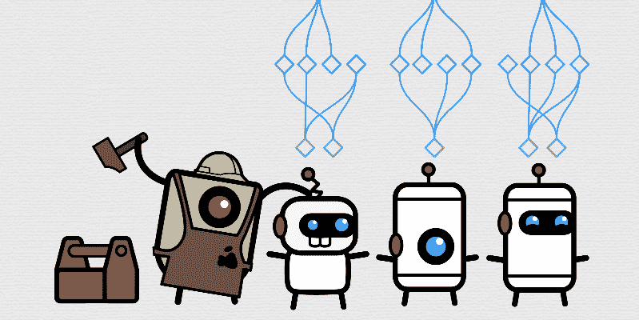
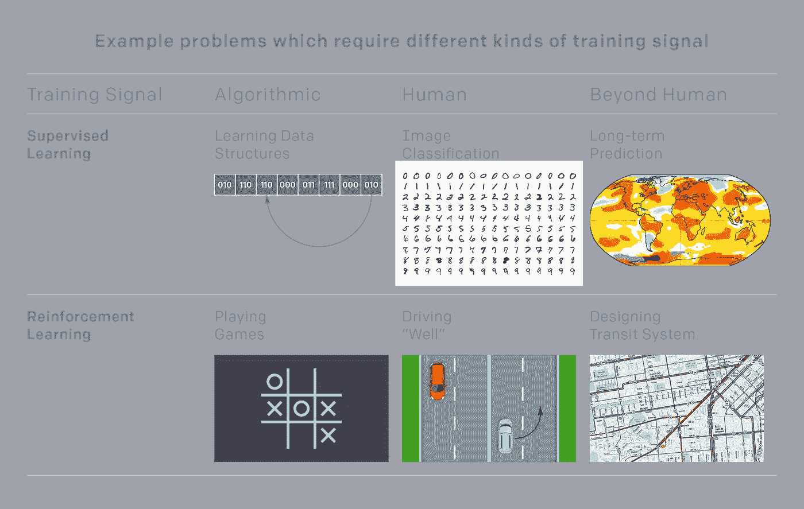
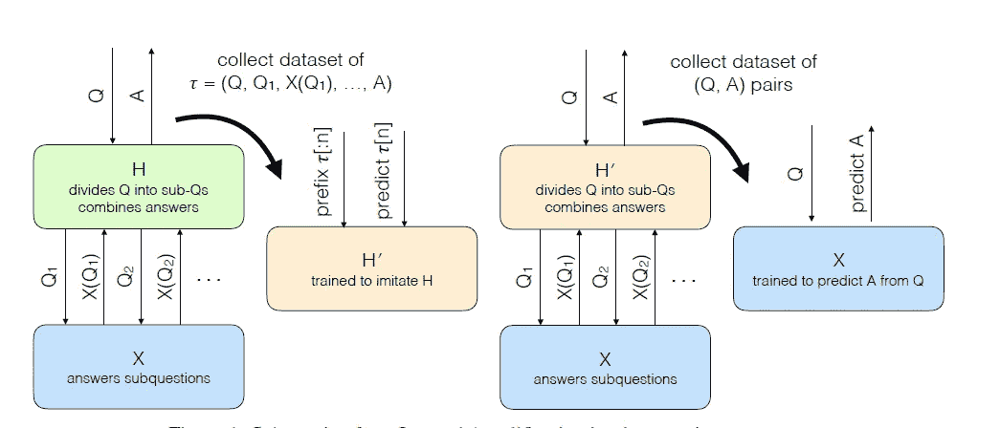
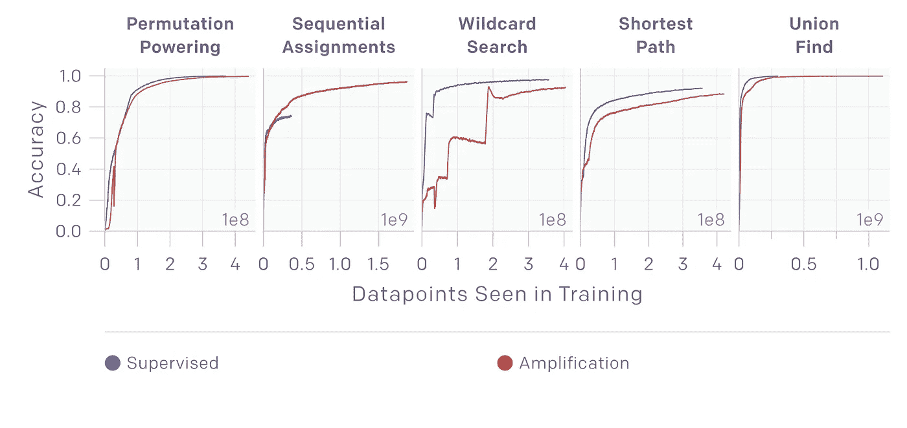

# OpenAI 使用弱教师来放大强化学习模型

> 原文：<https://pub.towardsai.net/openai-uses-weak-teachers-to-amplify-reinforcement-learning-models-27b357ca056c?source=collection_archive---------1----------------------->

## [人工智能](https://towardsai.net/p/category/artificial-intelligence)

## 这项新技术展示了如何加速强化学习模型来解决超级人类的任务。

来源:[https://www . popular mechanics . com/technology/robots/a 14457503/how-machine-learning-let-robots-teach-self/](https://www.popularmechanics.com/technology/robots/a14457503/how-machine-learning-lets-robots-teach-themselves/)

> 我最近创办了一份专注于人工智能的教育时事通讯，已经有超过 10 万名订户。《序列》是一份无废话(意思是没有炒作，没有新闻等)的 ML 导向时事通讯，需要 5 分钟阅读。目标是让你与机器学习项目、研究论文和概念保持同步。请通过订阅以下内容来尝试一下:

 [## 序列

### 订阅人工智能世界中最相关的项目和研究论文。受到 110，000+的信任…

thesequence.substack.com](https://thesequence.substack.com/) 

人类在长期过程中执行的大多数相关任务很难在目标中具体说明。考虑诸如实现科学突破、设计经济政策或组建一支 NBA 总冠军球队等过程。这些过程很难在离散的目标中建模，其性能评估是不断试验和调整的结果。从复杂性的角度来看，这些任务可以被认为是“超出了人类的规模”(BHS)，因为鉴于人类巨大的观察空间，很少能由一个人来规划。

在机器学习领域，我们依靠训练信号来指导算法的学习过程。然而，鉴于 BHS 任务的连续性和复杂性，它们没有客观的训练信号。我们如何训练机器学习系统来解决 BHS 任务？这是人工智能(AI)巨头 OpenAI 研究人员发表的一篇论文的主题[。该论文提出了一种称为迭代放大的方法，通过组合较简单问题的解决方案来逐步建立复杂问题的训练信号。](https://arxiv.org/abs/1810.08575)

# 超越监督和强化学习

“超越人类规模”(BHS)任务的描述听起来很像一个强化学习问题。我的意思是，如果我们不能有一个特定任务的算法信号，我们不能简单地实现一个基于强化学习的奖励模型吗？不幸的是，BHS 任务的大观察空间和认知复杂性使得从一开始就设计奖励模型是不可能的。让我们以一个负责设计有效经济政策的人工智能代理为例。在短期内，鉴于可能需要计算数百万个数据信号，单个人类培训师无法判断该政策的有效性。只有通过观察诸如经济增长的政策的长期效果，人类才能够建立关于该过程的稳健的训练信号。从这个角度来看，强化学习导致 BHS 任务不切实际。

基于训练信号的复杂性，我们可以将任务分为算法级、人类级和超人类级。下图举例说明了在监督和强化学习方法环境下的一些任务。大部分机器学习实践在顶部中心框(从人类标签的监督学习)、底部左侧框(带有脚本奖励的 RL)以及有时顶部左侧框(算法的监督学习)中操作。底部中心框开始用逆向强化学习等方法探索。目前，没有明确的方法来解决底部和顶部右侧框中所示的问题。

图片来源:OpenAI

解决 BHS 任务的问题归结为建立更好的训练信号。理论上，可以通过为更简单的任务逐步合成训练信号来建立 BHS 训练信号。这是 OpenAI 迭代扩增法的基础。

# 迭代扩增

大多数超越人类规模(BHS)的任务在技术上可以在一段时间内分解成更小更简单的任务。这些任务的训练信号也更容易由人类或人工智能代理来判断。例如，即使我们不能立即评估大型交通系统的性能，我们也可以量化它在单个街道上的有效性，然后将其外推至一类街道、社区，并逐步开始建立足够的数据信号来判断交通系统的整体性能。迭代扩增建立在这些动态的基础上，为 BHS 任务逐步构建训练信号。

迭代扩增技术首先对小的子任务进行采样，并通过向人类征求演示(人类可以完成这些小任务)来训练 AI 系统完成这些任务。然后，该方法开始对稍大的任务进行采样，通过要求人类将它们分成小块来解决它们，这是上一步训练的人工智能系统现在可以解决的。这些稍微困难的任务的解决方案是在人类的帮助下获得的，被用作训练 AI 系统直接解决这些二级任务的信号(没有人类的帮助)。

在数学上，人类专家 H 训练 ML 代理 X 的迭代扩增可以被建模为复合系统的函数 AmplifyH(X ),该复合系统由 H 和 X 的几个副本一起工作来解决问题组成。假设我们试图训练 X 从问题 D{Q1，Q2…Qn}的分布中预测答案 A。重复扩增过程可以总结为四个简单的步骤:

1.迭代放大重复采样一个问题 Q ~ D，用 AmplifyH(X)回答那个问题，记录 H 在这个过程中做出的每一个决定。

2.模型 H’被训练来预测 H 在这些任务的每一个中做出的决定，即预测子问题 Qi 和最终答案 a

3.该模型重复采样一个问题 Q ~ D，使用 AmplifyH'(X)回答该问题，并记录结果(Q；a)成对。

4.使用监督学习来训练使用(Q，A)对的模型。

图片来源:OpenAI

使用迭代扩增的 AI 代理的行为进展如下:

最初 X 随机回答问题。当人类问子问题时，他们经常收到不连贯或无用的子答案，

*人类能够在没有 X 任何帮助的情况下回答一些问题，最终 X 学会了复制这些简单的答案。*

*一旦 X 能够提供简单的答案，人类就能够通过将它们分成简单的片段来提供稍微好一点的答案。然后 X 学习提供稍微好一点的答案。*

这个过程还在继续，X 逐渐扩展它能够回答的查询集，并逐渐改进它提供的答案。在训练的每一点上，AmplifyH(X)都比单独工作的 X 稍微聪明一些，X 追逐这个移动的目标。

# IA 正在运行

OpenAI 团队在五个复杂的任务中测试了迭代扩增:排列供电、顺序分配、通配符搜索、最短路径和联合查找。这些任务中的每一个都有一个已知的解决方案，为了实验的目的，我们忽略了这个解决方案。相反，人工智能代理试图通过拼凑小的一步演绎来解决任务(例如，将两条路径合并成一条更长的路径)。OpenAI 使用迭代放大来学习直接算法，仅使用片段作为训练信号，从而模拟人类知道如何组合解决方案的子片段但无法提供直接训练信号的情况。在每种情况下，重复扩增都能够胜过其他方法。实验的详细结果可以在研究论文中看到。

图片来源:OpenAI

迭代放大是一种有趣的方法，可以解决超出人类规模的任务，这些任务没有明确的奖励或训练信号。像迭代扩增这样的方法是将人工智能扩展到长期规划领域的第一步，包括那些人类无法计算出明确目标的领域。