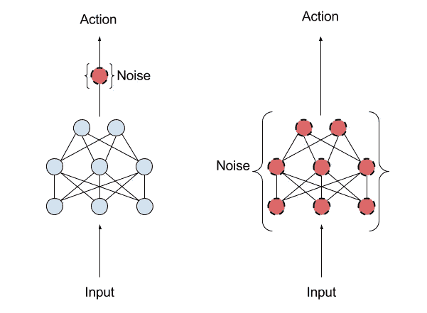

# OpenAI 希望通过使用噪声来改善强化学习模型中的探索

> 原文：<https://pub.towardsai.net/openai-wants-to-improve-exploration-in-reinforcement-learning-models-by-using-noise-541ee4dba86a?source=collection_archive---------4----------------------->

## [机器学习](https://towardsai.net/p/category/machine-learning)

## 称为参数空间噪声的方法解决了强化学习代理中重要的探索-开发挑战。

来源:[https://medium . com/analytics-vid hya/the-epsilon-greedy-algorithm-for-reinforcement-learning-5 Fe 6 f 96 DC 870](https://medium.com/analytics-vidhya/the-epsilon-greedy-algorithm-for-reinforcement-learning-5fe6f96dc870)

> 我最近创办了一份专注于人工智能的教育时事通讯，已经有超过 90，000 名订户。《序列》是一份无废话(意思是没有炒作，没有新闻等)的 ML 导向时事通讯，需要 5 分钟阅读。目标是让你与机器学习项目、研究论文和概念保持同步。请通过订阅以下内容来尝试一下:

 [## 序列

### 订阅人工智能世界中最相关的项目和研究论文。受到 85，000 多人的信任…

thesequence.substack.com](https://thesequence.substack.com/) 

探索与利用的困境是深度强化学习应用中的基本平衡之一。与执行特定行动相比，投入多少资源来获取可以改进未来行动的知识？这是支配强化学习系统行为的主要启发方法之一。理论上，最佳探索应该总是有助于获得更有效的知识，但在现实世界中，情况远非如此。开发技术以改善对环境的探索是当前一代深度强化学习模型的关键挑战之一。2018 年，来自 OpenAI [的研究人员发表了一篇研究论文](https://arxiv.org/abs/1706.01905)，提出了一种非常新颖的方法，通过引入噪声来提高增强学习算法的探索能力。

为了理解探索深度强化学习系统所面临的挑战，想想那些在实验室里呆了几十年却没有任何实际应用成果的研究人员。类似地，强化学习代理可以花费不成比例的资源，而不会产生收敛到局部最优的行为。这比你想象的更经常发生，因为探索模型与潜在过程的回报并不直接相关。OpenAI 团队认为，通过在模型的参数中引入随机水平的噪声，可以直接提高深度强化学习模型的探索能力。听起来是不是违反直觉？嗯，不应该。考虑上一次通过试错来学习一个实用的技能，比如一个棋盘游戏。我相信你能回忆起为了巩固你的知识而挑战环境条件(比如游戏规则)的例子。这实际上在输入数据集 j 中引入了噪声。

OpenAI 方法并不是第一个提出通过在深度学习模型中引入噪声来改善探索的技术。然而，它的大多数前辈集中于所谓的动作-空间-噪声方法，该方法引入噪声来改变与代理从一个时刻到下一个时刻可能采取的每个动作相关联的可能性。在这种方法中，只要在卷展栏中再次对该状态进行采样，就很可能获得不同的动作，因为动作空间噪波完全独立于当前状态。OpenAI 提出了一种替代方法，称为参数空间噪声，在每集开始时在模型策略参数中引入噪声。参数空间噪声技术几乎保证了每次从输入数据集中采样相同的状态时将应用相同的动作，这提高了模型的探索能力。

图片来源:OpenAI

参数空间噪声技术与深度强化学习算法中的现有探索模型配合得非常好。像它的一些前辈一样，OpenAI 的研究人员遇到了一些挑战

*   网络的不同层次对扰动有不同的敏感度。
*   随着培训的进行，策略权重的敏感度可能会随着时间而变化，这使得我们很难预测策略将采取的行动。
*   选择正确的噪声尺度是困难的，因为很难直观地理解参数噪声在训练期间如何影响策略。

[研究论文](https://arxiv.org/abs/1706.01905)提出了利用深度学习领域众所周知的优化技术来应对这些挑战的解决方案。

参数-空间-噪声模型的初步结果证明是很有希望的。这项技术有助于算法更有效地探索它们的环境，从而获得更高的分数和更优雅的行为。这似乎与以下事实相关:参数空间噪声以故意的方式将噪声添加到策略的参数中，使得代理的探索在不同的时间步长上一致。更重要的是，使用当前一代的深度学习框架，参数空间噪声技术实现起来相对简单。OpenAI 团队发布了一个[初始实现](https://github.com/openai/baselines)作为其强化学习基线的一部分。