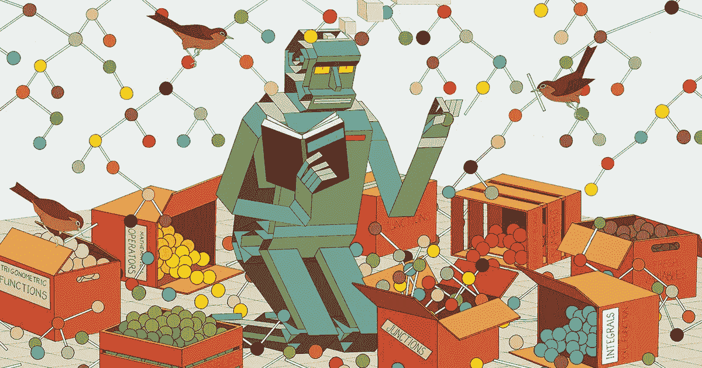
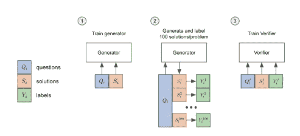
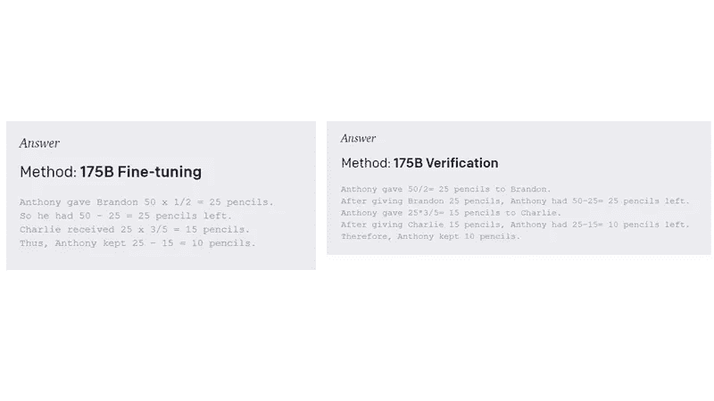
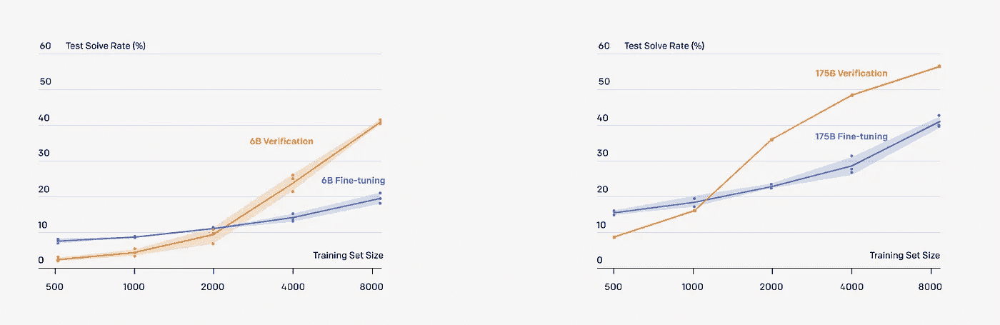

# OpenAI 解决数学应用题的方法

> 原文：<https://pub.towardsai.net/openais-approach-to-solve-math-word-problems-b69ed6cc90de?source=collection_archive---------3----------------------->

## [数学](https://towardsai.net/p/category/mathematics)

## 一项新的研究论文和数据集试图在深度学习的最艰难领域之一取得进展。

来源:[https://www . quanta magazine . org/symbolic-mathematics-finally-yields-to-neural-networks-2020 05 20/](https://www.quantamagazine.org/symbolic-mathematics-finally-yields-to-neural-networks-20200520/)

[昨日版的序列重点介绍了 OpenAI 解决数学应用题的最新研究](https://thesequence.substack.com/p/-openai-new-nlp-challenge-mathematical)。今天，我想更深入地探讨一下这项新研究背后的想法。

数学推理一直被认为是人类认知的基石之一，也是衡量语言模型“智能”的主要标尺之一。以下面这个问题为例:

“安东尼有 50 支铅笔。他把 1/2 的铅笔给了布兰登，把剩下的 3/5 给了查理。他保留了剩余的铅笔。安东尼保留了多少支铅笔？”

是的，答案是 10 支铅笔，但这不是重点😉。解决这个问题不仅需要通过文本进行推理，还需要精心安排一系列步骤来达成解决方案。这种对语言可解释性的依赖以及对步骤序列中的错误的脆弱性代表了在构建能够解决数学应用题的 ML 模型时的两个主要挑战。最近，OpenAI 发表了一项新的研究，提出了一种有趣的方法来解决这种类型的问题。

到现在为止，你一定认为 OpenAI 方法依赖于 GPT-3，因为预训练模型一直是他们在自然语言处理的不同领域取得进展的核心。这个假设在方向上是正确的。OpenAI 模型基于用于语言理解的 GPT-3，并使用两种基本方法来优化其数学问题的能力。

1) **微调:**针对数学应用题优化 GPT-3 最明显的方法是使用微调方法。本质上，微调方法对一个解决方案进行自回归采样，并检查该解决方案是否正确。

2) **验证:**这种方法使用经过训练的验证器，这些验证器可以对多个解决方案进行采样，并为每个解决方案分配一个概率得分，最终输出得分最高的解决方案。对于一个给定的问题，验证管道可以采样多达 100 个候选解决方案。

图片来源:OpenAI

如果我们用这两种方法来处理原来的数学问题，我们可以看到不同的推理步骤。

图片来源:OpenAI

OpenAI 的研究表明，验证方法为解决数学应用题提供了强大的性能提升，而且数据集足够大。除其他外，这是因为验证是一个更具可扩展性和可并行性的过程。

图片来源:OpenAI

# GSM8K 数据集

为了推进解决数学应用题的研究，OpenAI 开源了 GSM8K 数据集。数据集由 8.5K 高质量的小学数学应用题组成，需要 2 到 8 个步骤才能解决。所有的解决方案都是用自然语言写的，这有助于解释。