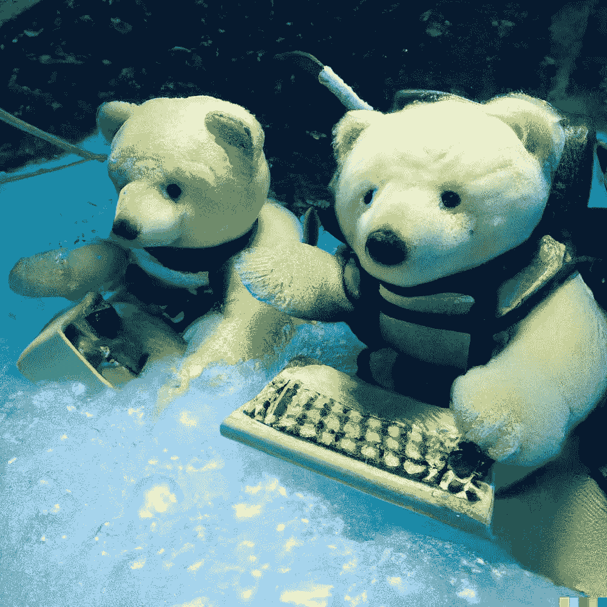
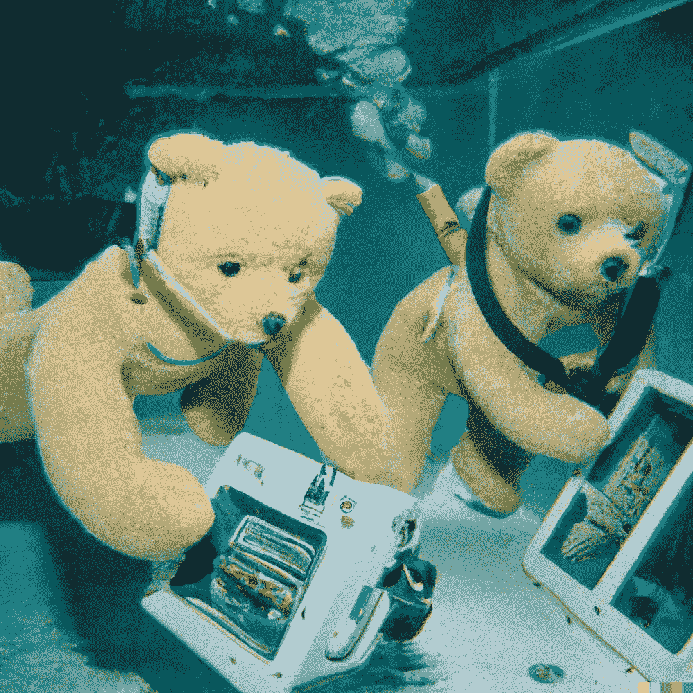
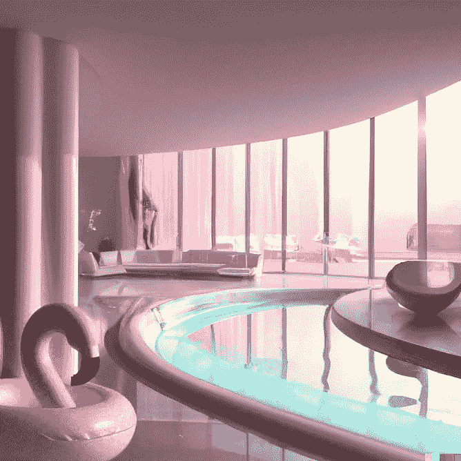
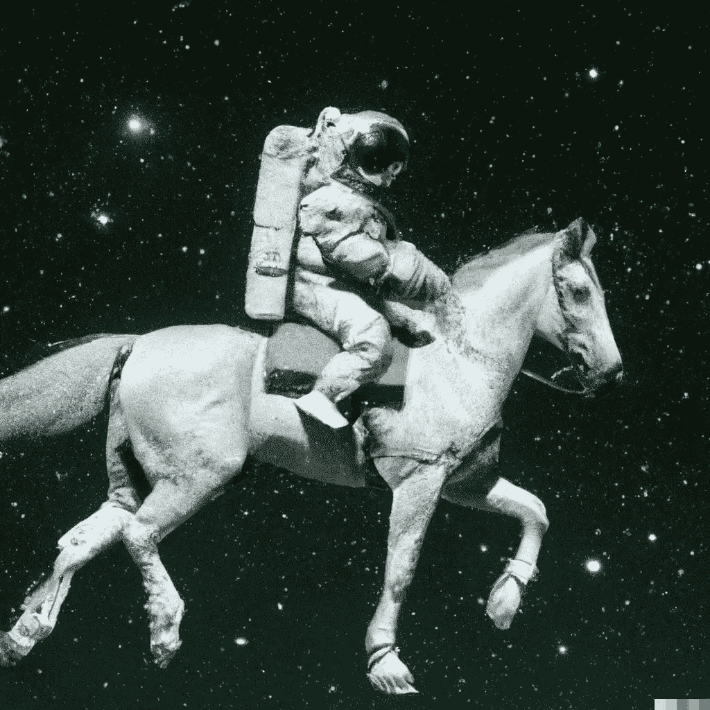
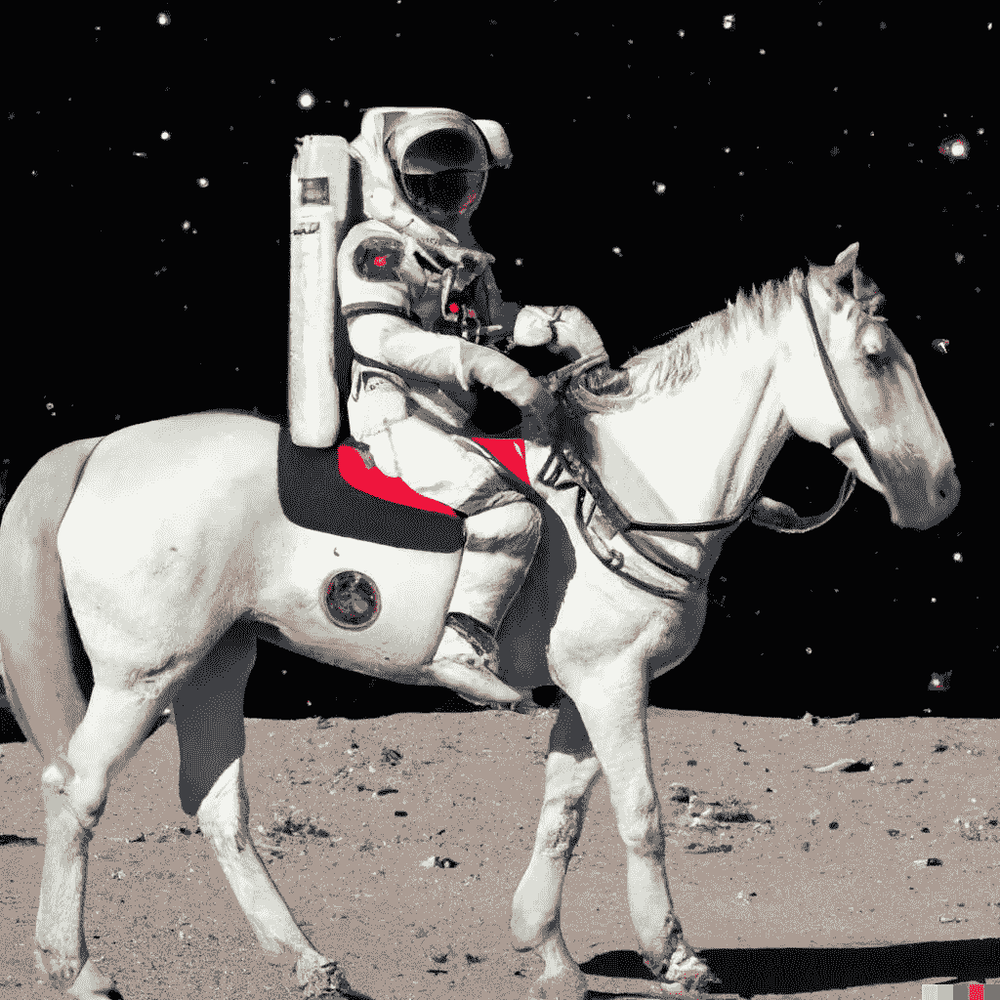
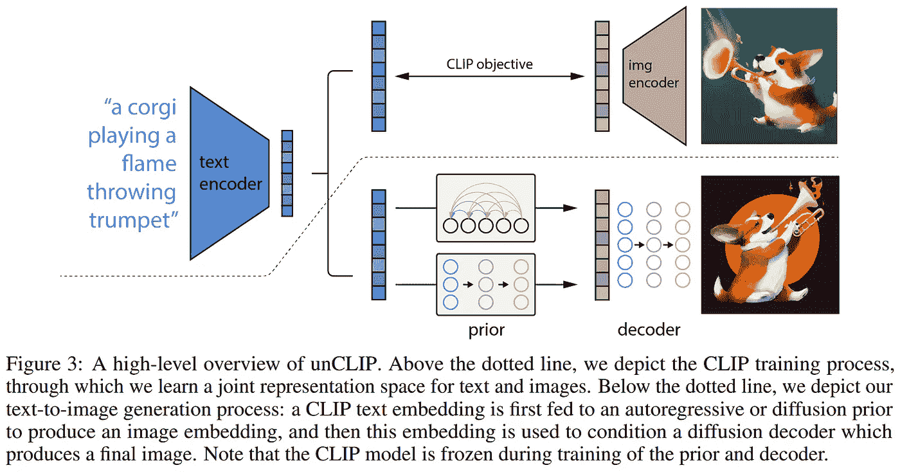
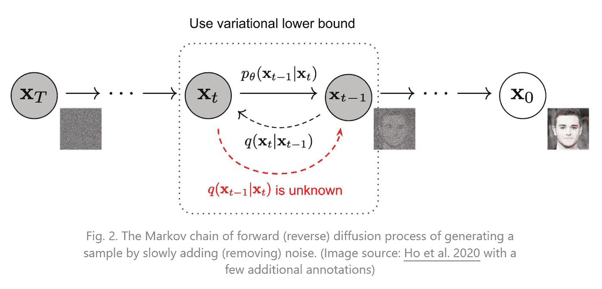
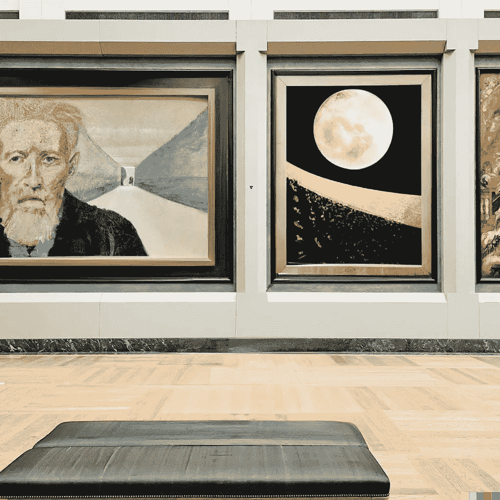
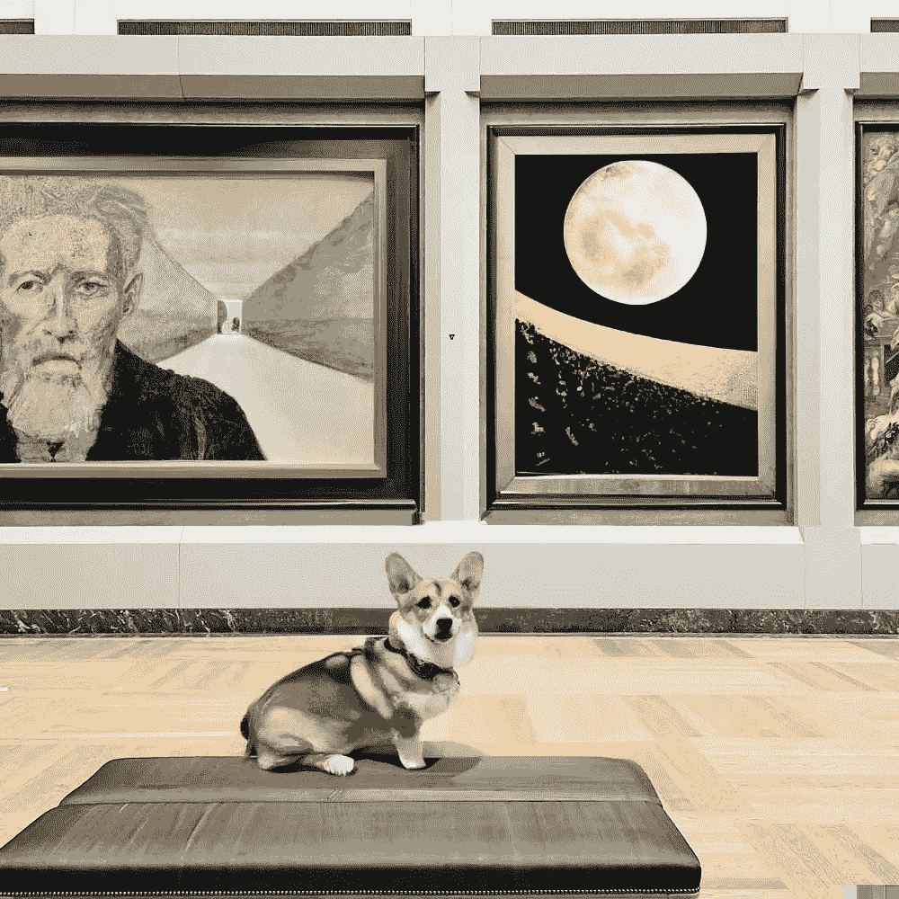

# OpenAI 的 DALL E 2！解释了文本到图像的生成

> 原文：<https://pub.towardsai.net/openais-dall-e-2-text-to-image-generation-explained-5617fb9c475c?source=collection_archive---------0----------------------->

## OpenAI 的一个惊人的模型能够从文本输入生成图像，结果令人难以置信！

> 最初发表于 [louisbouchard.ai](https://www.louisbouchard.ai/openais-new-model-dall-e-2-is-amazing/) ，前两天在[我的博客](https://www.louisbouchard.ai/openais-new-model-dall-e-2-is-amazing/)上读到的！

## 观看视频

去年我分享了 [DALL E](https://youtu.be/DJToDLBPovg) ，这是 OpenAI 的一个令人惊叹的模型，能够从文本输入中生成图像，效果令人难以置信。现在是他的大哥 DALL E 2 的时候了。你不会相信一年内的进步！DALL E 2 不仅更擅长从文本中生成照片般逼真的图像。结果是分辨率的四倍！

DALL-E 2 生成的图片标题为:泰迪熊在水下用 90 年代的技术进行新的人工智能研究。

好像这还不够令人印象深刻，最近的模型学会了一项新技能；[图像修复](https://youtu.be/Ia79AvGzveQ)。

DALL E 可以从文本输入中生成图像。

DALL E 2 可以做得更好，但不止于此。它还可以编辑这些图像，使它们看起来更好！或者简单地添加一个你想要的功能，比如背景中的一些火烈鸟。

这就是[图像修复](https://youtu.be/Ia79AvGzveQ)的作用。我们把图像的一部分替换成其他的东西，保持图像的真实性。当然，它不只是随机替换图像的一部分，这对 OpenAI 来说太容易了。这个修复过程是文本引导的，这意味着你可以告诉它在这里或那里添加一只火烈鸟。

[DALL-E 2](https://openai.com/dall-e-2) 生成的图片，标题为:添加一只火烈鸟(指定地点)。

让我们深入了解 DALL E 2 不仅能够从文本中生成图像，还能够编辑它们。事实上，该网络所学到的这种新的修复技能是由于它对概念和图像本身的更好理解，无论是在本地还是全球。

我所说的局部和全局是指 DALL E 2 在理解场景中的对象及其相互关系时，对为什么相邻的像素会有这些颜色有了更深入的理解。这样，它将能够理解这水有反射，并且右边的物体也应该在那里被反射。

[DALL-E 2](https://openai.com/dall-e-2) 生成的图片，标题为:添加一只火烈鸟(指定地点)。看火烈鸟下面水中的倒影。

它也了解全球情况；发生了什么，就像你要描述当这个人拍照时发生了什么。

[DALL-E 2](https://openai.com/dall-e-2) 生成的图片带有说明:一名宇航员骑马。

这里你会说这张照片不存在。很明显，否则我肯定会去尝试。如果我们忘记了这是不可能的，你会说宇航员在太空中骑马。所以，如果我让你画同样的场景，但是是在一个星球上，而不是在自由空间，你就能画出类似的东西，因为你知道马和宇航员是照片中感兴趣的对象。

[DALL-E 2](https://openai.com/dall-e-2) 生成了图片，标题为:一名骑着马的宇航员。

这似乎是显而易见的，但对于一台只看到颜色像素的机器来说，这是极其复杂的，这也是 DALL E 2 让我印象如此深刻的原因。

但是模型到底是如何理解我们发送给它的文本并从中生成图像的呢？嗯，它与我在频道上介绍的第一个模型非常相似。

它首先使用 OpenAI 的剪辑模型将文本和图像编码到同一个域中；一种称为潜在代码的压缩表示。然后，它将采用这种编码，并使用一个生成器，也称为解码器，来生成一个新的图像，该图像与文本具有相同的含义，因为它来自相同的潜在代码。所以 DALL E 2 有两步；CLIP 对信息和新的解码器模型进行编码，获取编码信息并从中生成图像。这两个独立的步骤也是为什么我们可以生成不同的图像。我们可以简单地随机改变编码信息一点点，让它在潜在空间移动一点点，它仍然代表同一个句子，同时让所有不同的值创建一个代表相同文本的不同图像。

模型概述。图片来自报纸。

正如我们在这里看到的，它最初接受一个文本输入并对其进行编码。
我们在上面看到的是训练过程的第一步，我们也给它输入一个图像，并使用 CLIP 对其进行编码，以便图像和文本按照 CLIP 目标进行类似的编码。然后，为了生成新的图像，我们切换到下面的部分，在这里我们使用 CLIP 引导的文本编码将其转换为图像就绪编码。这种转换是使用扩散先验完成的，我们将很快介绍它，因为它与最后一步使用的扩散模型非常相似。最后，我们使用我们新创建的图像编码和解码成一个新的图像使用扩散解码器！

扩散模型。图片来自[李连文](https://lilianweng.github.io/posts/2021-07-11-diffusion-models/)。

扩散模型是一种从随机噪声开始并学习如何迭代地改变该噪声以回到图像的模型。它通过反其道而行之来学习。在训练期间，我们将向它提供图像，并在图像上迭代应用随机高斯噪声，直到我们看不到除噪声之外的任何东西。然后，我们简单地反转模型，从噪声中生成图像。
如果你想了解更多关于这种网络的细节，它们真的很酷，我邀请你观看[我制作的关于它们的视频](https://youtu.be/xoEkSWJSm1k)。

瞧！这就是 DALL E 2 如何跟随文本生成如此高质量的图像！这是超级令人印象深刻的，并告诉我们，模型确实理解文本。

但它深刻理解自己创造了什么吗？嗯，看起来确实是这样。正是修复图像的能力让我们相信它确实很好地理解了图片。但为什么会这样，它如何将文本输入链接到图像，并充分理解图像，以便在不影响真实性的情况下只替换其中的一些部分？这都是因为 CLIP 将文本输入链接到图像。如果我们对我们新生成的图像进行编码，并使用不同的文本输入来指导另一个生成，我们可以生成图像的第二个版本，该版本将仅替换我们第一个生成中想要的区域。最后你会看到这张照片:

不幸的是，DALL E 2 的代码还没有公开，也不在他们的 API 中。按照 OpenAI 的说法，这样做的原因是为了研究这种强大模型的风险和局限性。他们实际上在他们的论文中讨论了这些潜在的风险和这种隐私的原因，如果你感兴趣，我在下面的参考资料中链接了一个很好的知识库。他们还开设了一个 Instagram 账户来分享更多的结果，如果你想看的话，下面也有链接。

我喜欢 DALL E，这个更酷。当然，这只是 DALL E 2 如何工作的概述，我强烈邀请阅读他们的伟大论文，链接如下，以获得关于他们模型实现的更多细节。

我希望你像我喜欢写这篇文章一样喜欢它，如果你喜欢，请考虑通过订阅[频道](https://youtu.be/UHQZBQOVAIU)来支持我在 YouTube 上的工作，并评论你对这篇摘要的看法。我很想看看你的想法！

## 参考

阅读全文:[https://www.louisbouchard.ai/dalle-2/](https://www.louisbouchard.ai/dalle-2/)
A .拉梅什等人，2022，DALL-E 2 论文:[https://cdn.openai.com/papers/dall-e-2.pdf](https://cdn.openai.com/papers/dall-e-2.pdf)open AI 的博文:[https://openai.com/dall-e-2](https://openai.com/dall-e-2)
风险与局限:[https://github . com/open AI/Dalle-2-preview/blob/main/system-card . MD](https://github.com/openai/dalle-2-preview/blob/main/system-card.md)
open AI Dalle 的 Instagram 页面:[https://www.instagram.com/openaidalle/](https://www.instagram.com/openaidalle/)):[https://www.louisbouchard.ai/newsletter/](https://www.louisbouchard.ai/newsletter/)