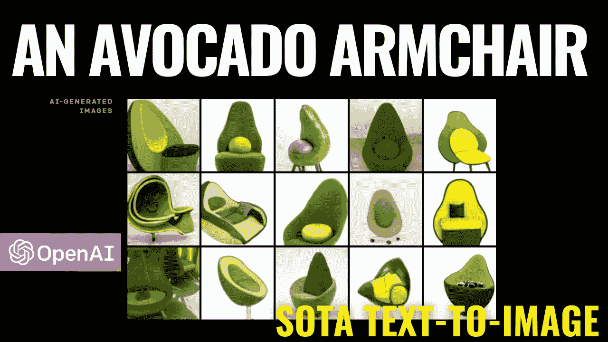
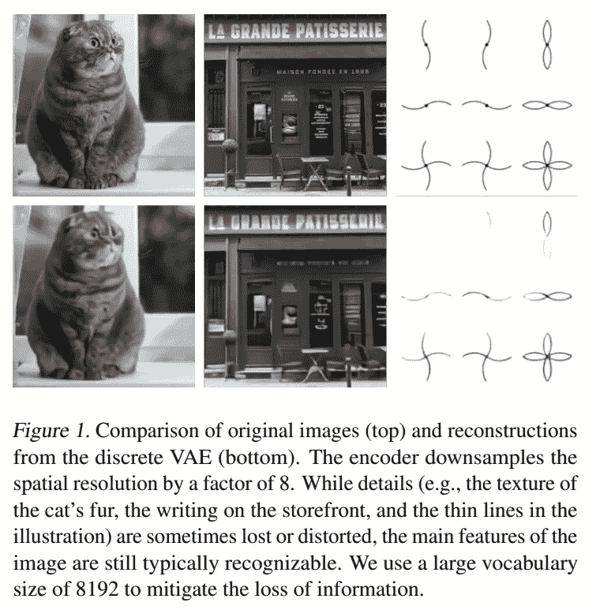
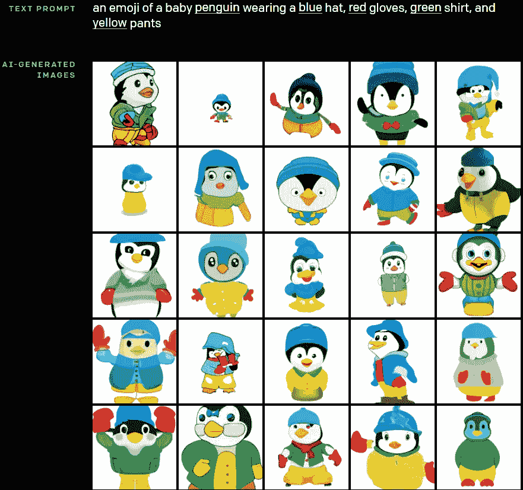
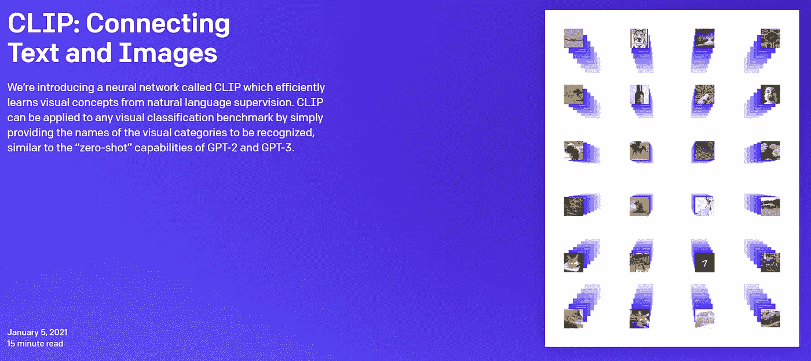
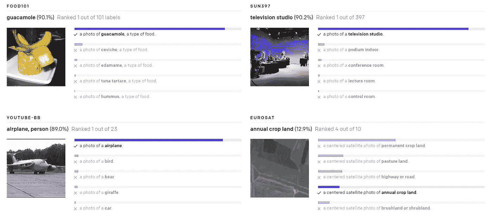
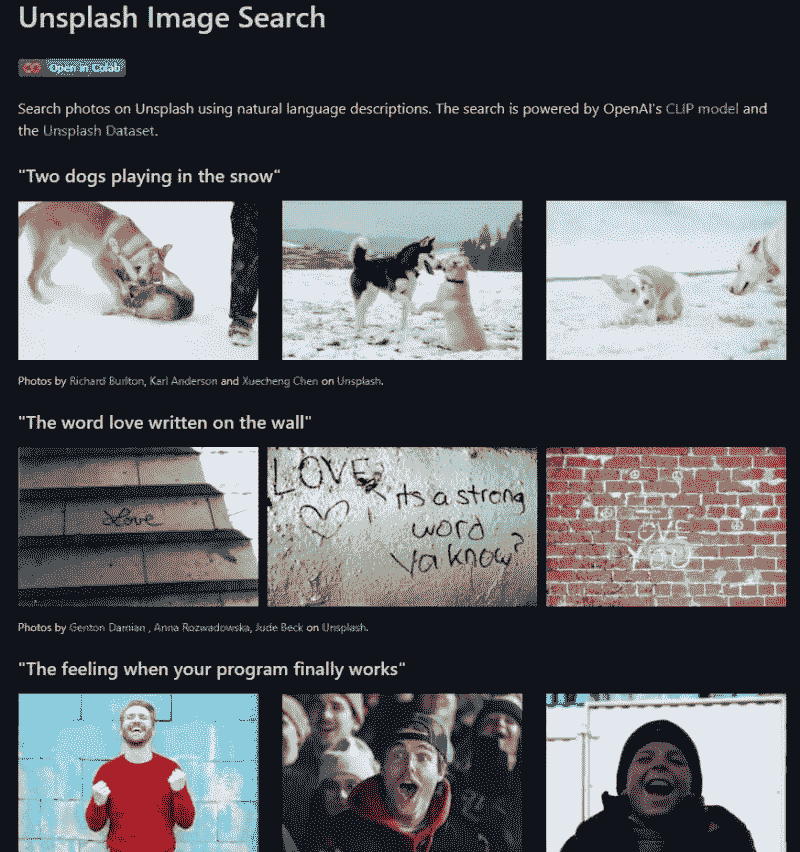
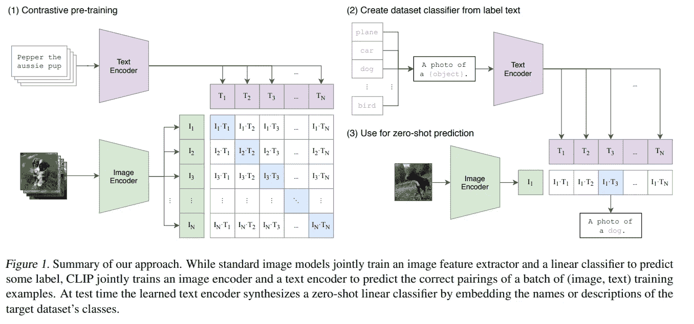
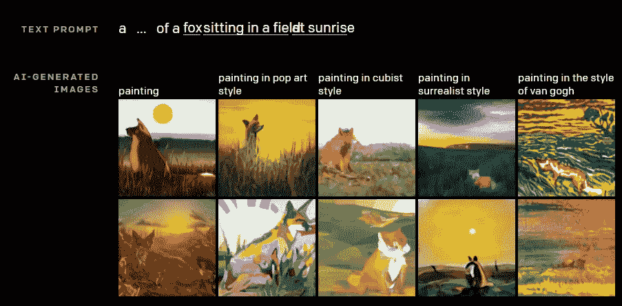

# OpenAI 的 DALL E:解释文本到图像的生成

> 原文：<https://pub.towardsai.net/openais-dall-e-text-to-image-generation-explained-1f6fb4bb5a0a?source=collection_archive---------2----------------------->

## [计算机视觉](https://towardsai.net/p/category/computer-vision)

## OpenAI 刚刚发布了解释 DALL-E 如何工作的论文！它被称为“零镜头文本到图像的生成”。

> 原载于 [louisbouchard.ai](https://www.louisbouchard.ai/openais-dall-e-text-to-image-generation-explained/) ，前两天在[我的博客](https://www.louisbouchard.ai/tag/artificial-intelligence/)上看到的！

它使用转换器架构从作为输入发送到网络的文本和基本图像生成图像。但它并不是简单地获取图像和文本，并将其发送到网络。首先，为了被 transformer 架构“理解”,信息需要被建模成一个单独的数据流。这是因为直接使用图像的像素对于高分辨率图像来说需要太多的内存。

A.Ramesh 等人，[零镜头文本到图像生成](https://arxiv.org/pdf/2102.12092.pdf)，2021。arXiv:2102.12092 [cs。简历]

相反，他们使用一种称为 dVAE 的离散变分自动编码器，它将输入图像转换为 32 x 32 的网格，结果产生 1024 个图像标记，而不是高分辨率图像的数百万个标记。事实上，这个 dVAE 网络的唯一任务是通过生成新版本的图像来减少转换器的内存占用。当然，这也有一些缺点，虽然它保存了最重要的特征，但有时也会丢失精细的细节，使得它无法用于基于非常精确的图像特征的精细应用。你可以把它看作是一种图像压缩步骤。dVAE 中的编码器和解码器由具有跳跃连接的经典卷积和 ResNet 架构组成。

如果你以前从未听说过可变自动编码器，我强烈推荐你看我制作的解释它们的视频。

而且这个 dVAE 网络也在 [OpenAI 的 GitHub](https://github.com/openai/DALL-E) 里分享过，带着笔记本自己试一下，实现细节在论文里，链接在下面的参考文献里！

A.Ramesh 等人，[零镜头文本到图像生成](https://arxiv.org/pdf/2102.12092.pdf)，2021。arXiv:2102.12092 [cs。简历]

由离散 VAE 模型产生的这些图像标记随后与文本一起作为输入被发送到变换器模型。再次，正如我在之前关于 Dall-E 的视频中所描述的，这个变压器是一个 120 亿参数的稀疏变压器模型。

我在之前的视频中已经介绍过，变压器的架构并不复杂，它是一种序列到序列模型，通常使用编码器和解码器。

在这种情况下，它仅使用解码器，因为它将 dVAE 生成的图像和文本作为输入。由离散 VAE 生成的 1024 个图像标记中的每一个都可以访问所有文本标记，并且使用自我注意，它可以预测最佳的图像-文本配对。

OpenAI 回形针&代码:[https://openai.com/blog/clip/](https://openai.com/blog/clip/)

OpenAI 回形针&代码:【https://openai.com/blog/clip/ 

然后，它最终被输入到一个预先训练的对比模型中。这实际上是 OpenAI 在一月初发布的预训练剪辑模型。它用于优化图像和特定文本之间的关系。给定由转换器生成的图像和初始字幕，CLIP 会根据图像与字幕的匹配程度来分配分数。CLIP 模型甚至被用在 Unsplash 图像上，以帮助您找到您正在寻找的图像，以及从文本输入中找到视频中的特定帧。

[用于不平滑图像搜索的剪辑](https://github.com/haltakov/natural-language-image-search)

OpenAI 回形针&代码:[https://openai.com/blog/clip/](https://openai.com/blog/clip/)

当然，在我们的例子中，我们已经生成了一个图像，我们只是希望它匹配文本输入。嗯，CLIP 仍然为我们提供了一个完美的衡量标准，可以用作惩罚函数，在训练期间迭代地改善变压器解码器的结果。CLIP 的能力非常类似于 GPT-2 和 GPT-3 的“零射击”能力。类似地，CLIP 也在 4 亿个文本-图像对的巨大数据集上进行训练。这种零拍摄能力意味着它对在训练数据集中找不到的图像和文本样本起作用，这些样本也被称为看不见的对象类别。

A.Ramesh 等人，[零镜头文本到图像生成](https://arxiv.org/pdf/2102.12092.pdf)，2021。arXiv:2102.12092 [cs。简历]

最后，使用从互联网上获取的 2.5 亿个文本-图像对来训练整体架构，其中大部分来自维基百科，它基本上学习基于给定的令牌作为输入来生成新的图像，就像我们在文章前面描述的那样。这是可能的，因为变形金刚在训练期间可以使用更多的并行化，使其速度更快，同时产生更准确的结果，当与适当的编码系统一起使用时，它是强大的自然语言工具和强大的计算机视觉工具。

当然，这只是 OpenAI 这篇新论文的概述。我强烈建议阅读这篇文章和回形针，以便更好地理解这种方法。

## 观看更多的例子和完整的解释

如果你喜欢我的工作，并想了解最新的人工智能技术，你绝对应该在我的社交媒体频道上关注我。

*   订阅我的 [**YouTube 频道**](https://www.youtube.com/channel/UCUzGQrN-lyyc0BWTYoJM_Sg) 。
*   关注我的项目上 [**LinkedIn**](https://www.linkedin.com/in/whats-ai/) 和这里上[**中**](https://whats-ai.medium.com/) **。**
*   一起学习 AI，加入我们的 [**不和谐社区**](https://discord.gg/learnaitogether) ，*分享你的项目、论文、最佳课程，寻找 Kaggle 队友，等等！*

# 参考

*   A.Ramesh 等人，零拍摄文本到图像的生成，2021 年。arXiv:2102.12092 [cs。简历]
*   用于 DALL E 的离散 VAE 的代码和更多信息:[https://github.com/openai/DALL-E](https://github.com/openai/DALL-E)
*   达尔福尔论文:[https://arxiv.org/pdf/2102.12092.pdf](https://arxiv.org/pdf/2102.12092.pdf)
*   OpenAI 回形针&代码:[https://openai.com/blog/clip/](https://openai.com/blog/clip/)
*   用在无刷图像搜索上的剪辑:[https://github.com/haltakov/natural-language-image-search](https://github.com/haltakov/natural-language-image-search)