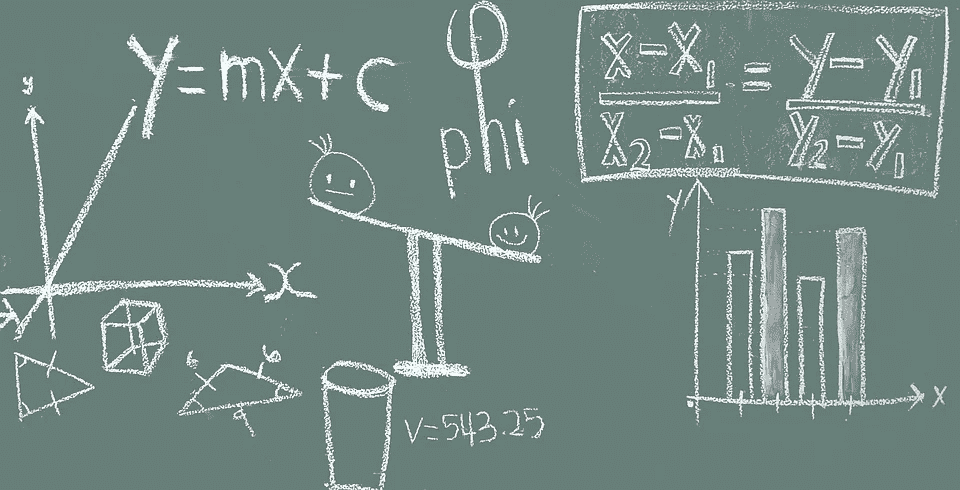
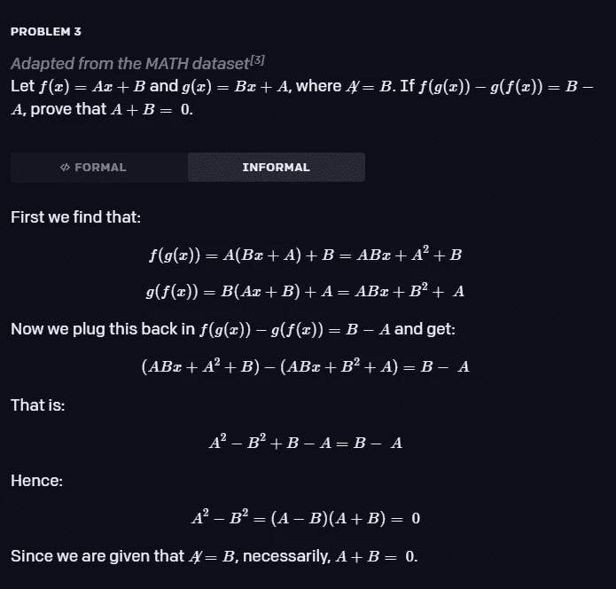

# OpenAI 的 GPT 3 启发模型可以解决数学奥林匹克的问题

> 原文：<https://pub.towardsai.net/openais-gpt-3-inspired-model-can-solve-problems-from-the-math-olympiads-d46611972420?source=collection_archive---------1----------------------->

## [人工智能](https://towardsai.net/p/category/artificial-intelligence)

## 长期以来，形式数学一直被认为是深度学习最艰难的挑战之一。OpenAI 表明我们离解决方案更近了一步。

来源:[https://synced review . com/2022/02/07/deep mind-pod racer-TPU-based-rl-frameworks-deliver-excellent-performance-at-low-cost-68/](https://syncedreview.com/2022/02/07/deepmind-podracer-tpu-based-rl-frameworks-deliver-exceptional-performance-at-low-cost-68/)

形式数学和定理证明是人工智能(AI)自早期以来最令人垂涎的目标之一。尽管在自然语言理解(NLU)或计算机视觉等领域取得了巨大进步，但数学定理证明经常被认为是通往 AGI 的道路上需要清除的障碍之一。最近，OpenAI 推出了一个受 GPT 3 启发的模型，它能够解决非常复杂的数学问题，包括高中数学奥林匹克中出现的问题。

高中数学奥林匹克竞赛，如 [IMO](https://www.imo-official.org/) 、 [AMC12](https://www.maa.org/math-competitions/amc-1012) 和 [AIME](https://www.maa.org/math-competitions/invitational-competitions) 竞赛，将世界各地最聪明的数学学生聚集在一起，竞争解决非常复杂的定理证明问题。这些竞赛代表了高中数学的巅峰，问题通常结合了不同的数学领域。高中数学奥林匹克中出现的问题比普通的高中数学课程复杂几个数量级。作为人工智能定理证明的基准，没有比这更难的了。

# 形式数学对人工智能的挑战

德国天才数学家卡尔·弗里德里希·高斯称数学为“科学女王”，指的是它对其他学科的影响。形式数学是一种通用语言，用来表达许多科学发现的基础。从这个角度来看，人工智能社区长期以来一直看好人工智能的潜力，特别是深度学习，它可以掌握形式数学。然而，这一目标被证明是相当难以实现的。有两个基本挑战使形式数学成为当前一代深度学习模型的艰难环境。

一、**无限行动空间:**深度神经网络在围棋或多人游戏等搜索空间较大的问题上取得了巨大进展。然而，形式数学定理经常处理无限搜索空间。在数学定理证明中，我们看到的不是一组有限的、很好理解的动作，而是需要创建无限组数学结构才能得到最终证明。

二。**缺乏自我游戏:**强化学习模型形式的自我游戏已经成为在具有大搜索空间的环境中取得显著进展的技术之一。然而，这种技术在数学定理证明中是不切实际的。给定一个数学陈述，并不总是有一个显而易见的方法来将其重构为更简单的中间步骤，这些步骤可用于构建正式的策略。

# 倾斜

2013 年，微软研究院孵化了一个名为精益的项目，以弥合交互式和自动化定理证明之间的差距。精益可以被看作是一种函数式编程语言，专门用于数学问题和一般复杂系统的公式化推理。Lean 包括一个 JavaScript 接口和一个定义定理的标准库。OpenAI 决定依赖并扩展 Lean-来实现他们新的定理证明模型。

# OpenAI 模型

为了解决数学定理证明的挑战，OpenAI 依赖于一个类似于 GPT-3 的纯解码器转换器。新模型的架构包括模型 36 层和 7.74 亿个可训练参数。使用 [**CommonCrawl**](https://commoncrawl.org/) **(用于 300B 令牌)和**[**web math**](https://www.webmath.com/)**数据集**对模型进行预训练。每个问题都是用精益语言建模的一系列目标来训练的。预训练后，使用精益定理证明器的 [**Mathlib**](https://github.com/leanprover-community/mathlib) 库对模型进行微调。在每一步，OpenAI 模型都有一组语句，并执行证明搜索以确定每次迭代中的最佳状态。为了进行评估，OpenAI 使用了 [**MiniF2F 数据集**](https://arxiv.org/abs/2109.00110) ，其中包括一组高中数学题。

OpenAI 工作的一个主要贡献就是用于训练模型的**语句课程学习**的思想。本质上，这种方法包括手工收集不同难度的语句。课程中最难的语句更接近目标基准。最初，该模型只能证明几个陈述，但是在几次再训练运行之后，该模型变得难以置信地精通于证明新的定理。

精益的使用简化了数学问题的结构和评估，但也引入了新的问题。主要的挑战是，精益不是为需要并行化的计算密集型任务而设计的，而这正是证据搜索机制的情况。为了解决这个限制，OpenAI 构建了**精益健身房**，这是精益的一个扩展，支持任务并行化。

# 结果呢

OpenAI 模型在 MiniF2F 基准测试中取得了令人瞩目的 41.2%的成绩。这足以在数学奥林匹克中获得一枚奖牌。为了说明模型的复杂性，请看下面的问题:

这个问题不仅需要复杂的语言解释，还需要复杂的符号操作和多步数学证明。真了不起。

图片来源:OpenAI

随着深度学习模型在定理证明方面变得更加熟练，它们不仅可以成为其他科学模型的基础，还可以帮助推进数学发现。人工智能距离掌握复杂的数学还有很长的路要走，但 OpenAI 的想法为未来的步骤提供了坚实的基础。