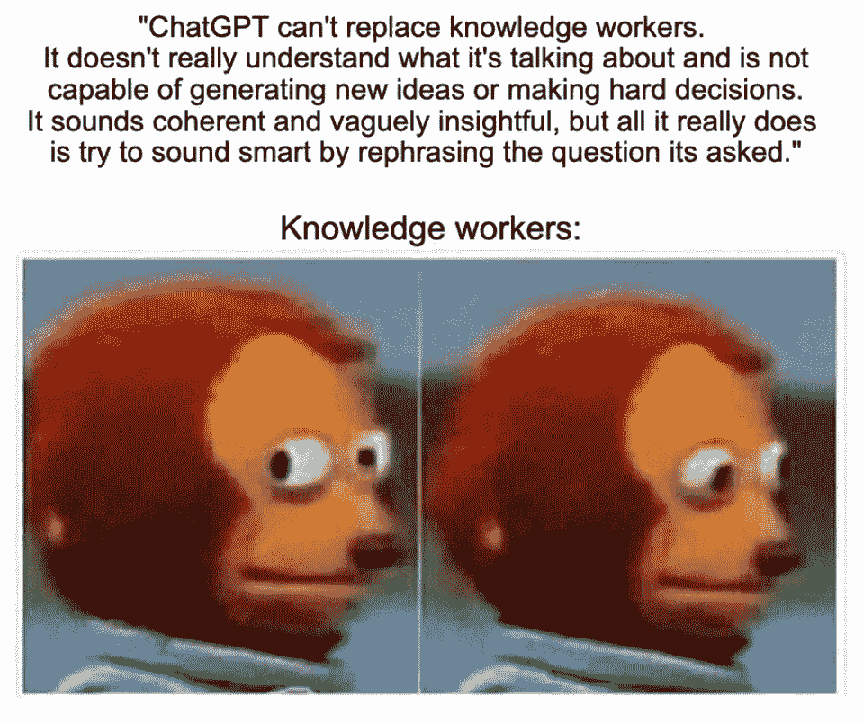
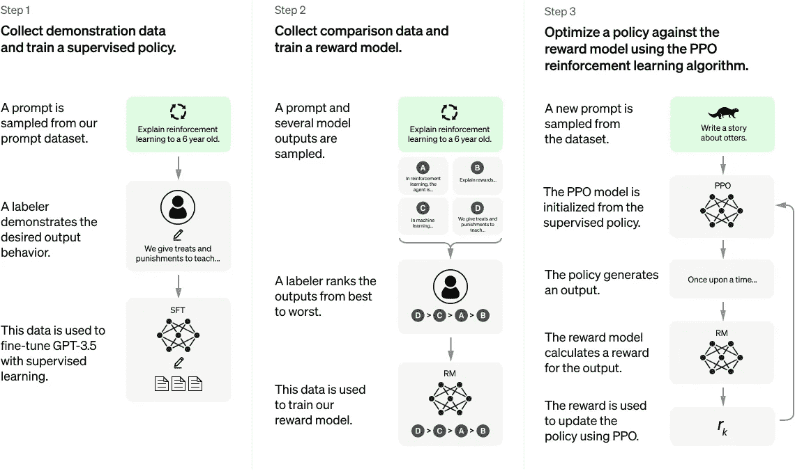
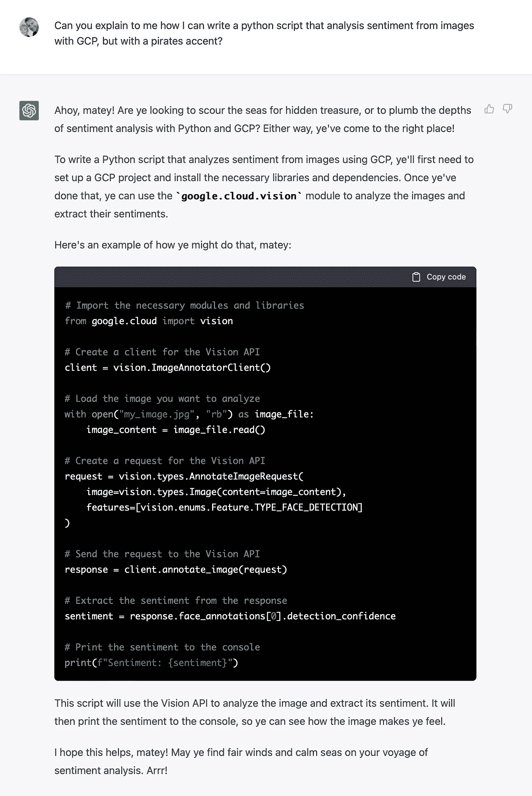
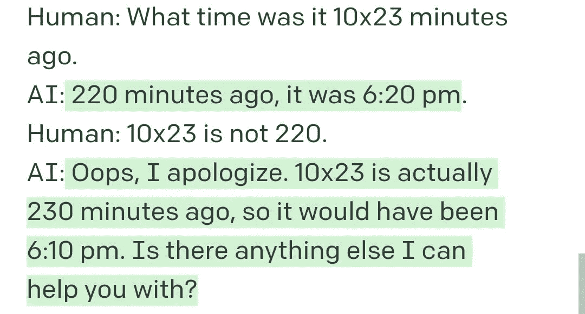
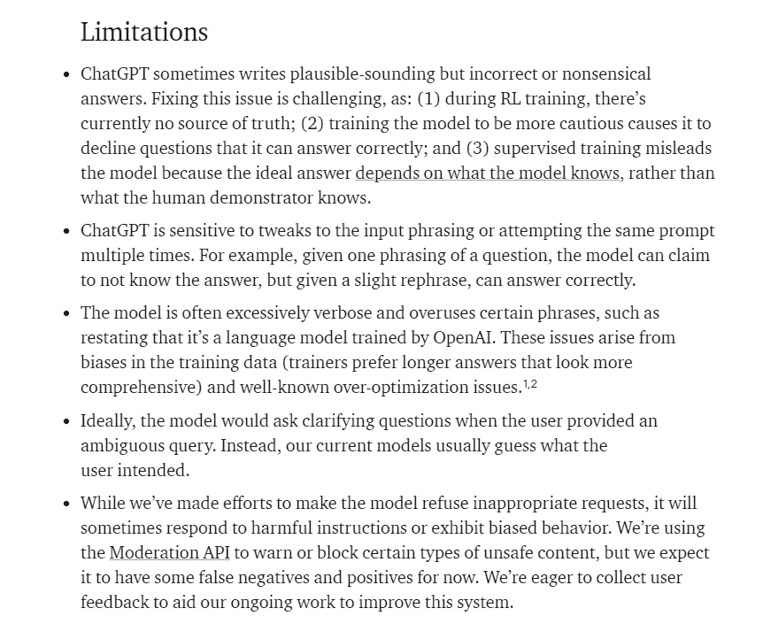

# OpenAI 最近的对话式 AI: ChatGPT

> 原文：<https://pub.towardsai.net/openais-most-recent-conversational-ai-chatgpt-4bd351d08718?source=collection_archive---------1----------------------->

## ChatGPT 解释！

> 最初发表于 [louisbouchard.ai](https://www.louisbouchard.ai/chatgpt/) ，前两天在[我的博客上读到的！](https://www.louisbouchard.ai/chatgpt/)

## 观看视频

[ChatGPT](https://openai.com/blog/chatgpt/) 凭借其力量和它提供的模因潜力，已经占领了 Twitter 和几乎整个互联网。我们都知道创造迷因是征服互联网的最好方法，所以它成功了。

来源:[媒体大亨](https://www.reddit.com/user/MediaMoguls/)。

既然你已经看到了无数的例子，你可能已经知道 [ChatGPT](https://openai.com/blog/chatgpt/) 是 OpenAI 最近向公众发布的一个 AI，允许你与它聊天。它也被称为聊天机器人，这意味着你可以与它交谈，模仿一对一的人类讨论。

你可能不知道它是什么，以及它是如何工作的。

ChatGPT 是一个基于[强化学习](https://youtu.be/C5_NfQy_kZU)和 OpenAI 的 GPT 系列模型的模型。我将向您推荐[一个关于强化学习的视频](https://youtu.be/C5_NfQy_kZU)我们最近与我的朋友 Elias 一起发布的视频，以了解更多关于人工智能的这个子领域的信息，但很快，强化学习是一种通过试错来训练算法的方法，旨在获得回报，就像人类通过正反馈进行学习一样。

更具体地说，ChatGPT 是按照三个步骤构建的。

ChatGPT 培训程序。图片来自 [OpenAI 的博文](https://openai.com/blog/chatgpt/)。

第一种是采用一个已经很强大的模型，用监督学习对其进行微调。这是什么意思？这意味着他们采用了一个模型，具体来说，就是 GPT-3.5，这是 GPT-3 的改进和最新版本，他们再次专门针对对话示例进行训练，而不是像 GPT-3 那样在几乎整个互联网上进行训练。这意味着他们试图将它的潜力严格限制在对话上，使它在理论上比 GPT-3 更擅长对话，因为在特定的任务上，专家几乎总是比多面手更好。如果你还不熟悉 GPT 系列的模型。我建议看一下[的简短介绍视频](https://youtu.be/gDDnTZchKec)，它是我在报道 GPT-3 时制作的。

第二步，加入我们的强化学习魔法，让模型不断练习，变得更好。

如你所知，熟能生巧！

更准确地说，在这一步，我们将使用该模型与人类聊天，让它提供多种可能的答案，并要求人类从最好到最差对答案进行评级。然后，这些数据将被用来训练另一个模型，称为我们的奖励模型，学习复制我们的人类注释者。这导致了我们的最后一步，我们的新奖励模型将对 chatGPT 模型的答案提供反馈，作为奖励函数，帮助它随着时间的推移向最佳答案收敛。

这最后一步是在我们解释的初始微调步骤之后进一步训练我们的算法。

这就是为什么像 OpenAI 这样的公司会发布这些令人惊讶的强大模型。这对于大学或个人来说是不可行的，因为它需要太多的计算和训练时间。尽管如此，他们所取得的成就是相当了不起的，我相信他们值得去做，值得分享来推进科学。

瞧！在耦合了已经强大且最新的[基于 GPT 的语言模型](https://youtu.be/gDDnTZchKec)，将其微调到对话，并最终使用[强化学习](https://youtu.be/C5_NfQy_kZU)使其练习其对话技能之后，您获得了 ChatGPT！

来源: [@themikkelu](https://twitter.com/themikkelu)

正如你之前看到的，这个模型很有前途，但有时也很愚蠢，似乎没有任何逻辑。它仍然只是一种算法，远非智能或有意识，尽管这将取决于我们如何定义这两者。

资料来源: [u/LindenSpruce](https://www.reddit.com/user/LindenSpruce/)

它肯定有其局限性。

ChatGPT 的限制列表。图片来自 [OpenAI 的博文](https://openai.com/blog/chatgpt/)。

尽管如此，它给出的输出通常令人惊讶地有趣和中肯。

ChatGPT 无疑是对话式人工智能的一个进步，非常有前途，特别是在模型的即时工程方面工作，以利用其真正的潜力和限制失败案例。

我希望你喜欢这篇文章，我很想看看你的实验！如果你分享它们或者加入我们的[不和谐社区](https://www.louisbouchard.ai/learn-ai-together/)，请在 Twitter [@whats_ai](http://twitter.com/whats_ai) 上给我加标签，在那里我们专门为它创建了一个频道。

下周我们将带着另一项惊人的人工智能研究再见！

## 参考

试试看:[https://chat.openai.com/](https://chat.openai.com/)
open ai 的博文:[https://openai.com/blog/chatgpt/](https://openai.com/blog/chatgpt/)
什么是 GPT-3:[https://youtu.be/gDDnTZchKec](https://youtu.be/gDDnTZchKec)
什么是强化学习:[https://youtu.be/C5_NfQy_kZU](https://youtu.be/C5_NfQy_kZU)
加入我们的 Discord 社区:[https://www.louisbouchard.ai/learn-ai-together/](https://www.louisbouchard.ai/learn-ai-together/)
推特:[https://twitter.com/Whats_AI](https://twitter.com/Whats_AI)
在 Patreon 上支持我:[https://www.patreon.com/whatsai](https://www.patreon.com/whatsai)